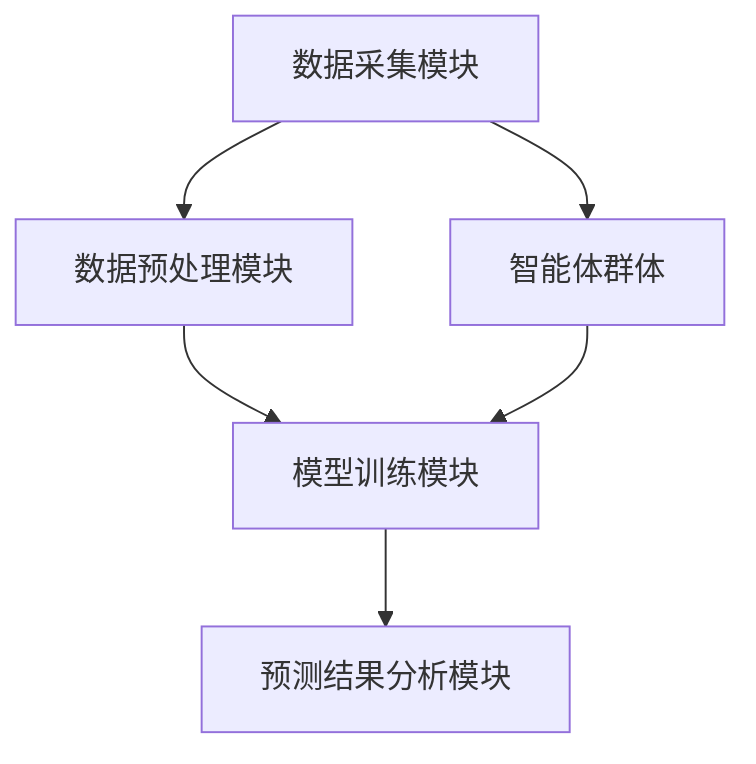

                 


# 智能体群体在预测公司盈利质量中的应用

> 关键词：智能体群体，盈利质量预测，分布式计算，多智能体协作，机器学习，企业价值评估

> 摘要：本文探讨了智能体群体在公司盈利质量预测中的应用，分析了其核心概念、算法原理和系统架构，结合实际案例展示了智能体群体如何通过分布式计算和协作学习提升预测的准确性和效率。本文还总结了智能体群体在盈利质量预测中的优势和挑战，并提出了未来的研究方向。

---

## 第一部分: 智能体群体与公司盈利质量预测的背景

### 第1章: 智能体群体的基本概念

#### 1.1 智能体的基本概念
智能体（Agent）是指具有感知环境、做出决策、执行行动并能与环境或其他智能体进行交互的实体。智能体可以是软件程序、机器人或其他智能系统，其核心特征包括自主性、反应性、目标导向性和社会性。

#### 1.2 智能体群体的特征
智能体群体是由多个智能体组成的集合，具有以下特征：
- **分布式计算**：智能体之间通过分布式计算完成任务，避免单点故障。
- **协作性**：智能体之间通过通信和协作完成共同目标。
- **自适应性**：智能体能够根据环境变化动态调整行为。
- **高效性**：通过并行计算和分工合作提高任务效率。

#### 1.3 智能体群体与传统预测方法的区别
传统预测方法通常依赖中心化的计算和单一模型，而智能体群体通过分布式计算和多智能体协作，能够更好地处理复杂问题。

### 第2章: 公司盈利质量预测的定义与方法

#### 2.1 盈利质量的定义
盈利质量是指公司在一定时期内实现的净利润的质量，包括盈利能力、盈利可持续性和盈利结构等方面。常用的指标包括净利润率、毛利率、净利率等。

#### 2.2 盈利质量预测的核心指标
- 净利润
- 毛利率
- 资产周转率
- 净资产收益率（ROE）
- 盈利增长性

#### 2.3 传统盈利质量预测方法
- **财务指标分析法**：通过分析财务报表中的指标进行预测。
- **统计模型预测法**：如线性回归、时间序列分析等。
- **机器学习预测法**：如支持向量机（SVM）、随机森林等。

### 第3章: 智能体群体在盈利质量预测中的优势

#### 3.1 智能体群体的优势
- **高效性**：通过分布式计算和并行处理提高预测速度。
- **准确性**：多个智能体协作能够捕捉更多数据特征，提高预测精度。
- **鲁棒性**：智能体群体能够通过分工合作降低单点故障风险。

#### 3.2 智能体群体的应用场景
- **实时监控**：通过实时数据处理和预测，帮助公司及时调整经营策略。
- **跨机构协作**：不同机构之间的数据协同分析，提升预测的全面性。
- **大数据处理**：智能体群体能够高效处理海量数据，提高预测的准确性。

---

## 第二部分: 智能体群体与盈利质量预测的核心概念

### 第4章: 智能体群体的核心原理

#### 4.1 智能体的基本原理
- **感知与决策**：智能体通过感知环境数据，利用算法做出决策。
- **协作与通信**：智能体之间通过通信机制共享信息，协同完成任务。
- **自适应与学习**：智能体通过机器学习算法不断优化自身模型。

#### 4.2 智能体群体的协作模型
- **分布式计算模型**：任务被分解为多个子任务，由不同智能体分别处理。
- **多智能体协作模型**：智能体之间通过协作完成复杂任务。
- **基于图的协作模型**：通过图结构描述智能体之间的协作关系。

#### 4.3 智能体群体的通信机制
- **消息传递**：智能体之间通过消息传递共享数据。
- **共识机制**：通过共识算法（如拜占庭共识）达成一致。
- **事件驱动**：基于事件驱动的通信机制。

### 第5章: 盈利质量预测的核心概念

#### 5.1 盈利质量预测的数学模型
- **线性回归模型**：用于预测连续型变量，如净利润率。
- **时间序列模型**：如ARIMA，用于预测时序数据。
- **非线性模型**：如随机森林，用于复杂数据特征的提取。

#### 5.2 智能体群体的预测模型
- **分布式预测模型**：将数据分布到多个智能体，分别进行预测，最后汇总结果。
- **多智能体协同预测模型**：通过多智能体协作，整合不同模型的优势，提高预测精度。
- **基于强化学习的预测模型**：通过强化学习算法优化预测策略。

---

## 第三部分: 智能体群体在盈利质量预测中的算法原理

### 第6章: 智能体群体的算法原理

#### 6.1 分布式计算算法
- **分布式数据处理算法**：如MapReduce，用于分布式数据处理。
- **分布式协同学习算法**：如分布式随机梯度下降（SGD）。
- **分布式优化算法**：如分布式Adam优化器。

#### 6.2 多智能体协作算法
- **多智能体协作网络**：通过神经网络实现智能体之间的协作。
- **分布式强化学习**：如分布式DQN算法，用于多智能体协作决策。
- **联邦学习**：通过联邦学习实现数据隐私保护下的协作学习。

#### 6.3 智能体群体的通信协议
- **基于gRPC的通信协议**：用于智能体之间的高效通信。
- **基于WebSocket的通信协议**：用于实时数据传输。
- **基于HTTP的通信协议**：用于非实时数据传输。

### 第7章: 盈利质量预测的算法实现

#### 7.1 分布式预测算法实现
- **分布式线性回归**：将数据分片，分别训练模型，最后汇总参数。
- **分布式随机森林**：将数据分片，分别训练决策树，最后汇总结果。
- **分布式时间序列预测**：通过分布式计算处理时序数据。

#### 7.2 多智能体协作算法实现
- **多智能体DQN算法**：通过分布式智能体协作实现复杂预测任务。
- **多智能体联邦学习**：通过联邦学习实现多机构之间的协作预测。
- **多智能体强化学习**：通过强化学习优化预测策略。

---

## 第四部分: 智能体群体在盈利质量预测中的系统架构

### 第8章: 系统架构设计

#### 8.1 系统功能设计
- **数据采集模块**：从数据库中采集公司财务数据。
- **数据预处理模块**：对数据进行清洗、特征提取和标准化处理。
- **模型训练模块**：利用智能体群体进行模型训练和优化。
- **预测结果分析模块**：对预测结果进行分析和可视化展示。

#### 8.2 系统架构图


#### 8.3 系统交互流程
- 数据采集模块将数据传输到数据预处理模块。
- 数据预处理模块对数据进行清洗和特征提取后，传输到模型训练模块。
- 模型训练模块利用智能体群体进行分布式训练，得到预测模型。
- 预测结果分析模块对预测结果进行分析和可视化展示。

---

## 第五部分: 智能体群体在盈利质量预测中的项目实战

### 第9章: 项目实战

#### 9.1 环境安装
- **Python环境**：安装Python 3.8及以上版本。
- **依赖库安装**：安装TensorFlow、Keras、Distributed-Deep-Learning-Toolkit等库。
- **数据集准备**：获取公司财务数据，如收入、成本、利润等。

#### 9.2 系统核心实现

##### 9.2.1 数据采集模块
```python
import pandas as pd

def data_collection():
    # 从数据库中读取数据
    df = pd.read_sql("SELECT * FROM company_financial_data", con=connection)
    return df
```

##### 9.2.2 数据预处理模块
```python
def data_preprocessing(df):
    # 数据清洗
    df.dropna(inplace=True)
    # 特征提取
    df['profit_margin'] = df['net_profit'] / df['revenue']
    # 标准化处理
    df = df.drop(['id'], axis=1)
    return df
```

##### 9.2.3 模型训练模块
```python
from distributed_deep_learning_toolkit import DistributedModel

def model_training(df):
    # 初始化分布式模型
    model = DistributedModel()
    # 分布式训练
    model.fit(df)
    return model
```

##### 9.2.4 预测结果分析模块
```python
def result_analysis(model, test_data):
    # 进行预测
    predictions = model.predict(test_data)
    # 计算准确率
    accuracy = accuracy_score(test_data['actual_profit'], predictions)
    return accuracy
```

#### 9.3 实际案例分析
以某公司为例，通过上述模块进行盈利质量预测，最终得到预测结果和准确率。

---

## 第六部分: 最佳实践与总结

### 第10章: 最佳实践

#### 10.1 小结
智能体群体通过分布式计算和多智能体协作，能够有效提升公司盈利质量预测的准确性和效率。

#### 10.2 注意事项
- 数据隐私保护
- 智能体之间的通信效率
- 模型的可解释性

#### 10.3 拓展阅读
- 《分布式系统：概念与设计》
- 《多智能体系统的理论与应用》

---

## 作者信息

作者：AI天才研究院/AI Genius Institute & 禅与计算机程序设计艺术 /Zen And The Art of Computer Programming

