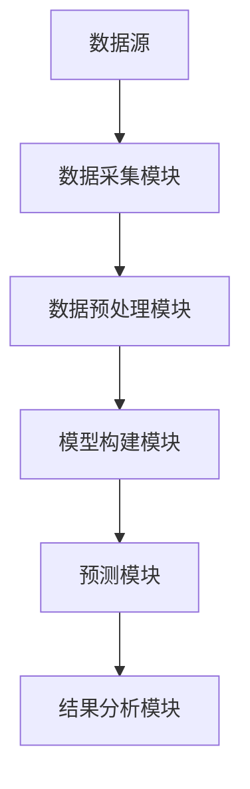

                 


# 智能体群体如何模拟并预测市场周期

> 关键词：智能体群体，市场周期，预测模型，群体智能，复杂系统

> 摘要：智能体群体模拟市场周期的方法利用了群体智能和复杂系统理论，通过建模个体行为和群体互动来预测市场变化。本文详细探讨了智能体建模、算法原理、系统架构以及实际案例，为读者提供全面的视角。

---

# 第一部分：智能体群体与市场周期概述

## 第1章：智能体群体与市场周期的基本概念

### 1.1 智能体的定义与特征

- **智能体的定义**：智能体是能够感知环境并采取行动的实体，具备自主性、反应性、目标导向和社交能力。
- **特征**：
  - 自主性：独立决策
  - 反应性：实时响应环境变化
  - 目标导向：追求特定目标
  - 社交能力：与其它智能体互动

### 1.2 市场周期的基本概念

- **市场周期的定义**：经济活动的波动周期，包括增长、顶峰、衰退和复苏阶段。
- **周期特征**：
  - 不同阶段的市场行为差异
  - 市场参与者的互动影响周期变化
  - 周期性波动的规律性与不可预测性

### 1.3 智能体群体与市场周期的关系

- **关系**：智能体群体通过模拟个体行为和互动，揭示市场周期的形成机制。
- **影响**：智能体群体的决策和互动影响市场周期的波动。

---

## 第2章：问题背景与研究意义

### 2.1 市场周期预测的重要性

- **重要性**：
  - 帮助投资者做出决策
  - 为企业制定战略提供依据
  - 为政策制定者提供参考

### 2.2 智能体群体模拟的优势

- **优势**：
  - 模拟个体行为，捕捉群体动态
  - 处理复杂系统的非线性关系
  - 发现市场中的涌现现象

### 2.3 研究目标与挑战

- **目标**：
  - 建立智能体模型，模拟市场行为
  - 发现市场周期的规律
  - 开发预测方法，实现市场周期预测

- **挑战**：
  - 数据获取与处理难度
  - 模型复杂性与计算资源需求
  - 模拟结果的验证与评估

---

## 第3章：智能体群体模拟的理论基础

### 3.1 群体智能与复杂系统

- **群体智能**：通过个体互动产生集体智慧。
- **复杂系统**：多个相互作用的个体构成的系统，表现出非线性特征。

### 3.2 市场周期理论

- **经济周期理论**：市场波动的周期性规律。
- **市场行为理论**：个体行为对市场的影响。

### 3.3 智能体群体模拟的数学模型

- **模型框架**：
  - 个体行为模型
  - 群体互动规则
  - 市场信息传播机制

---

## 第4章：智能体群体模拟的算法实现

### 4.1 个体行为模型的设计

- **理性预期模型**：基于完全理性假设的决策模型。
- **行为决策模型**：考虑有限理性与情感因素。

### 4.2 群体互动规则的建立

- **互动规则**：定义智能体之间的交互方式，如信息共享、交易行为。

### 4.3 市场信息传播与处理

- **信息传播机制**：模拟信息在市场中的传播过程。
- **信息处理方法**：利用算法处理市场数据，提取有用信息。

---

## 第5章：基于智能体的市场周期预测

### 5.1 数据采集与预处理

- **数据来源**：历史市场数据、实时数据。
- **数据清洗**：处理缺失值、异常值。

### 5.2 模型训练与优化

- **训练方法**：使用历史数据训练智能体模型。
- **优化策略**：调整模型参数，提升预测精度。

### 5.3 预测结果的评估

- **评估指标**：准确率、召回率、F1分数。
- **结果分析**：对比预测结果与实际市场周期。

---

## 第6章：智能体群体模拟的系统架构

### 6.1 系统功能设计

- **功能模块**：
  - 数据采集模块
  - 模型构建模块
  - 预测模块
  - 结果分析模块

### 6.2 系统架构图



### 6.3 接口设计

- **API设计**：定义数据输入输出接口。
- **模块交互**：明确各模块之间的数据流。

---

## 第7章：项目实战与案例分析

### 7.1 环境配置

- **工具安装**：安装必要的编程环境和库。
- **数据获取**：获取市场数据，如股票价格。

### 7.2 核心功能实现

- **代码实现**：
  ```python
  import numpy as np
  import pandas as pd

  # 数据预处理
  data = pd.read_csv('market_data.csv')
  data_cleaned = data.dropna()

  # 模型构建
  class Agent:
      def __init__(self, strategy):
          self.strategy = strategy

      def decide(self, market_info):
          return self.strategy.predict(market_info)

  # 预测与评估
  from sklearn.metrics import accuracy_score

  predictions = model.predict(test_data)
  accuracy = accuracy_score(true_labels, predictions)
  ```

### 7.3 案例分析

- **案例选择**：选择典型市场周期进行分析。
- **结果解读**：解释预测结果，分析模型的有效性。

---

## 第8章：总结与展望

### 8.1 研究总结

- **主要结论**：智能体群体模拟在市场周期预测中的有效性。
- **方法优势**：捕捉群体行为，揭示市场规律。

### 8.2 未来展望

- **研究方向**：更复杂模型、多智能体协同优化。
- **应用扩展**：应用于其他领域，如社交网络、交通系统。

---

## 参考文献

- [1] 群体智能与复杂系统的相关研究。
- [2] 市场周期预测的经典文献。
- [3] 相关算法与数学模型的参考文献。

---

# 作者

作者：AI天才研究院 & 禅与计算机程序设计艺术

---

通过以上详细的大纲，文章内容将从理论到实践，系统地探讨智能体群体如何模拟并预测市场周期，涵盖背景介绍、核心概念、算法实现、系统架构以及实际案例分析，为读者提供全面且深入的视角。

