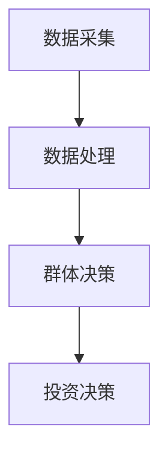

                 


# 智能体群体智慧在识别价值投资机会中的应用：群体 vs 个体

## 关键词：智能体、群体智慧、价值投资、分布式决策、多智能体协作

## 摘要：  
本文探讨智能体群体智慧在价值投资机会识别中的应用，分析群体决策与个体决策的差异。通过数学建模和算法实现，展示智能体如何通过群体智慧提升投资决策的准确性和鲁棒性。

---

# 第1章: 智能体与群体智慧的背景介绍

## 1.1 智能体的定义与特点

### 1.1.1 智能体的基本概念  
智能体（Agent）是具有自主性、反应性和社会性的实体，能够感知环境、做出决策并采取行动。智能体可以是软件程序或物理设备，具备以下核心特点：

1. **自主性**：智能体无需外部干预，自主决策。
2. **反应性**：能实时感知环境变化并做出响应。
3. **社会性**：能与其他智能体或人类进行交互协作。

### 1.1.2 智能体的核心属性  
智能体的核心属性包括：

- **目标导向**：追求特定目标，如最大化收益。
- **学习能力**：通过经验优化决策。
- **适应性**：能根据环境变化调整策略。

### 1.1.3 智能体的分类与应用场景  
智能体可划分为简单反射型、基于模型的反应型、目标驱动型和实用驱动型。在投资领域，智能体常用于算法交易、风险控制和投资组合优化。

## 1.2 群体智慧的定义与特点

### 1.2.1 群体智慧的基本概念  
群体智慧是多个个体通过协作产生的集体智慧，个体间通过信息交换形成共识。群体智慧的核心在于个体多样性与信息整合。

### 1.2.2 群体智慧的核心属性  
群体智慧具备以下特点：

- **涌现性**：群体表现超越个体。
- **鲁棒性**：个体失效不影响整体。
- **多样性**：个体差异增强决策质量。

### 1.2.3 群体智慧与个体智慧的对比  
下表对比了群体智慧与个体智慧的差异：

| 属性       | 群体智慧               | 个体智慧               |
|------------|-----------------------|-----------------------|
| 决策方式    | 分布式协作             | 中心化决策             |
| 稳定性      | 高                    | 低                    |
| 抗干扰性    | 强                    | 弱                    |

## 1.3 智能体群体智慧的背景与应用

### 1.3.1 智能体群体智慧的背景  
随着分布式系统的发展，智能体群体智慧在分布式决策中的应用日益广泛。投资领域对高精度决策的需求推动了智能体群体智慧的研究。

### 1.3.2 智能体群体智慧在投资领域的应用  
智能体群体智慧在投资中的应用包括：

- **分布式决策**：多个智能体协同决策，降低单点故障风险。
- **多智能体协作**：通过协作优化投资组合。

### 1.3.3 智能体群体智慧的核心要素  
核心要素包括：

- **个体智能体**：具备独立决策能力。
- **群体共识算法**：确保个体间达成一致。
- **信息交互机制**：个体间高效信息共享。

## 1.4 本章小结  
本章介绍了智能体和群体智慧的基本概念及其在投资中的应用，为后续分析奠定基础。

---

# 第2章: 智能体群体智慧的核心概念

## 2.1 智能体与群体智慧的关系

### 2.1.1 智能体与群体智慧的联系  
智能体是群体智慧的基础单元，通过协作形成群体智慧。群体智慧提升个体决策的准确性和鲁棒性。

### 2.1.2 智能体与群体智慧的差异  
下表展示了二者的差异：

| 属性       | 智能体                  | 群体智慧              |
|------------|------------------------|----------------------|
| 决策主体    | 单个实体                | 多个实体协作          |
| 决策方式    | 独立决策                | 协作决策              |

### 2.1.3 智能体与群体智慧的协同关系  
智能体通过信息交互形成群体智慧，群体智慧反过来增强个体智能。

## 2.2 智能体群体智慧的核心原理

### 2.2.1 智能体的自主性与协作性  
智能体的自主性确保个体独立决策，协作性促进个体间信息共享和协作。

### 2.2.2 群体智慧的涌现性与多样性  
群体智慧的涌现性来源于个体协作，多样性增强问题解决能力。

## 2.3 智能体群体智慧的数学模型

### 2.3.1 智能体的个体决策模型  
个体决策模型表示为：$$ d_i = f(x_i, w_i) $$，其中$x_i$为输入，$w_i$为权重，$d_i$为决策。

### 2.3.2 群体决策的共识算法  
一致性算法用于群体决策：$$ c = \sum_{i=1}^{n} \lambda_i d_i $$，其中$\lambda_i$为权重系数。

## 2.4 本章小结  
本章分析了智能体群体智慧的核心概念和数学模型，为后续算法实现奠定基础。

---

# 第3章: 智能体群体智慧的算法原理

## 3.1 群体决策算法概述

### 3.1.1 群体决策算法的基本原理  
群体决策算法通过个体决策的加权和形成共识。常用算法包括一致性算法和投票算法。

### 3.1.2 常见的群体决策算法  
一致性算法、投票算法和加权平均算法。

## 3.2 一致性算法

### 3.2.1 一致性算法的定义  
一致性算法确保个体决策趋于一致。

### 3.2.2 一致性算法的实现步骤  
1. 初始化个体决策。
2. 迭代更新决策，直至收敛。

### 3.2.3 一致性算法的数学模型  
一致性函数：$$ c = \frac{\sum_{i=1}^{n} w_i d_i}{\sum_{i=1}^{n} w_i} $$，其中$w_i$为权重。

## 3.3 群体决策算法的实现

### 3.3.1 算法实现的步骤  
编写一致性算法的Python代码：

```python
def consensus_algorithm(decisions, weights):
    weighted_sum = sum(w * d for w, d in zip(weights, decisions))
    total_weight = sum(weights)
    return weighted_sum / total_weight
```

### 3.3.2 算法实现的代码示例  
示例代码如下：

```python
decisions = [0.5, 0.6, 0.4]
weights = [1, 1, 1]
print(consensus_algorithm(decisions, weights))  # 输出：0.466666...
```

## 3.4 本章小结  
本章详细讲解了群体决策算法的原理和实现，展示了算法在投资中的应用潜力。

---

# 第4章: 价值投资机会识别的系统架构

## 4.1 系统架构设计

### 4.1.1 系统功能模块划分  
系统包括数据采集、处理、决策模块。

### 4.1.2 系统架构的层次结构  
系统分为数据层、计算层和应用层。

### 4.1.3 系统架构的实现方式  
采用分布式架构，支持多智能体协作。

## 4.2 系统功能设计

### 4.2.1 数据采集模块  
采集市场数据，如股票价格和财务指标。

### 4.2.2 数据处理模块  
清洗和转换数据，提取特征。

### 4.2.3 群体决策模块  
应用一致性算法形成投资决策。

## 4.3 系统架构图  
系统架构的Mermaid图：



---

# 作者  
作者：AI天才研究院 & 禅与计算机程序设计艺术

