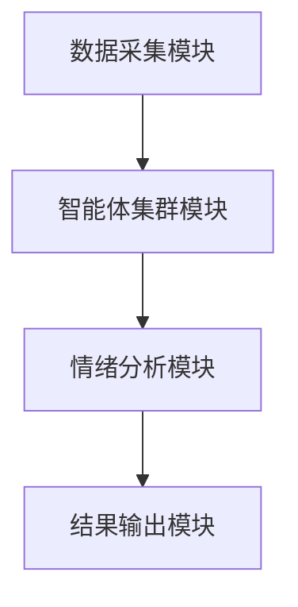

                 


# 智能体群体智慧在识别市场情绪拐点中的应用

## 关键词：
智能体, 群体智慧, 市场情绪, 情绪拐点, 金融分析, 人工智能

## 摘要：
智能体群体智慧是一种通过分布式智能体协同工作来解决复杂问题的方法。在金融市场中，市场情绪的变化往往会影响资产价格的波动，而情绪拐点的识别则对投资者的决策具有重要意义。本文将深入探讨如何利用智能体群体智慧来识别市场情绪拐点，从理论基础到算法实现，再到实际应用，系统地分析其在金融市场的应用价值。

---

## 第一部分: 智能体群体智慧与市场情绪拐点识别基础

### 第1章: 智能体群体智慧概述

#### 1.1 智能体的基本概念
##### 1.1.1 智能体的定义与特点
智能体（Agent）是指在环境中能够感知并自主行动以实现目标的实体。智能体具有以下特点：
- **自主性**：能够自主决策，无需外部干预。
- **反应性**：能够实时感知环境并做出反应。
- **目标导向性**：通过行动实现预定目标。
- **社交能力**：能够与其他智能体或人类进行交互。

##### 1.1.2 群体智能与个体智能的区别
| 属性         | 个体智能                   | 群体智能                   |
|--------------|---------------------------|---------------------------|
| 行为模式     | 基于单一目标的决策         | 基于群体目标的协同决策     |
| 信息处理     | 依赖个体信息               | 依赖群体信息共享           |
| 决策效率     | 高                        | 中等                       |
| 应用场景     | 单点问题                   | 复杂系统问题               |

##### 1.1.3 智能体在复杂系统中的作用
智能体在复杂系统中通过协同工作，能够实现个体无法完成的任务。例如，在金融市场中，多个智能体可以通过协同学习和信息共享，捕捉市场情绪的变化。

#### 1.2 市场情绪拐点的概念
##### 1.2.1 市场情绪的定义与分类
市场情绪是指投资者在市场中的整体心理状态，通常分为乐观、悲观、中性等类别。情绪拐点是指市场情绪从一个状态转向另一个状态的关键点。

##### 1.2.2 情绪拐点的特征与重要性
- **特征**：情绪拐点通常伴随着市场行为的变化，例如成交量的骤增或骤减。
- **重要性**：情绪拐点是投资者调整策略的重要参考，能够帮助投资者在市场趋势变化前做出决策。

##### 1.2.3 情绪拐点对投资决策的影响
情绪拐点的识别可以帮助投资者预测市场趋势，从而优化投资组合，降低风险。

---

### 第2章: 智能体群体智慧在金融市场的应用背景

#### 2.1 金融市场中的情绪分析现状
##### 2.1.1 传统情绪分析方法的局限性
传统情绪分析方法通常基于统计分析和规则引擎，存在以下问题：
- **数据维度有限**：难以捕捉市场的复杂动态。
- **计算效率低**：难以实时处理海量数据。
- **模型静态**：难以适应市场的快速变化。

##### 2.1.2 智能体群体智慧的优势
智能体群体智慧通过分布式计算和协同学习，能够有效克服传统方法的局限性。其优势包括：
- **高计算效率**：通过并行计算提高处理速度。
- **自适应能力**：能够根据市场变化动态调整策略。
- **信息共享**：通过群体协作提高信息利用率。

##### 2.1.3 金融市场数据的复杂性与挑战
金融市场数据具有以下特点：
- **高频性**：数据生成速度快。
- **非线性**：价格变化通常呈现非线性特征。
- **不确定性**：市场情绪受多种因素影响，具有高度不确定性。

---

### 第3章: 智能体群体智慧与市场情绪分析的结合

#### 3.1 情绪传播模型
##### 3.1.1 信息传播的基本原理
信息在市场中的传播遵循一定的动力学规律。例如，情绪可以从一个投资者传播到另一个投资者，形成情绪的扩散网络。

##### 3.1.2 情绪传播的网络结构
市场情绪的传播可以通过图论中的网络模型进行描述。例如，投资者之间的互动关系可以用无向图或有向图表示。

##### 3.1.3 情绪传播的动力学特征
情绪传播的动力学特征包括：
- **传播速度**：情绪在市场中的传播速度受投资者的社交网络结构影响。
- **传播强度**：情绪强度的变化取决于投资者的互动频率。

#### 3.2 智能体的协同学习机制
##### 3.2.1 分布式学习的基本概念
分布式学习是指多个智能体通过局部信息交换实现全局目标的优化。

##### 3.2.2 协同学习的实现方式
协同学习可以通过以下方式实现：
- **信息共享**：智能体之间共享局部信息。
- **行为协调**：智能体通过协调行为实现共同目标。
- **反馈机制**：智能体根据反馈调整行为策略。

##### 3.2.3 协同学习的效果评估
协同学习的效果可以通过以下指标进行评估：
- **收敛速度**：智能体群体达到共识的速度。
- **准确性**：群体决策的准确程度。

---

### 第4章: 基于智能体群体智慧的情绪拐点识别算法

#### 4.1 算法原理
##### 4.1.1 智能体的行为规则设计
智能体的行为规则需要考虑以下因素：
- **情绪传播规则**：定义情绪在智能体之间的传播方式。
- **决策规则**：定义智能体在不同情绪状态下的决策策略。

##### 4.1.2 情绪传播的数学模型
情绪传播的数学模型可以用以下公式表示：
$$
\frac{dS_i}{dt} = \alpha \cdot (N - S_i) - \beta \cdot S_i
$$
其中，$S_i$表示智能体$i$的情绪状态，$\alpha$和$\beta$是传播系数。

##### 4.1.3 情绪拐点的判定标准
情绪拐点的判定可以通过以下方法实现：
- **阈值法**：当情绪强度超过预设阈值时，触发拐点判定。
- **变化率法**：当情绪强度的变化率超过预设阈值时，触发拐点判定。

#### 4.2 算法实现
##### 4.2.1 智能体的初始化与配置
智能体的初始化需要考虑以下因素：
- **初始情绪状态**：设定初始情绪状态。
- **智能体数量**：根据市场规模确定智能体数量。

##### 4.2.2 情绪传播的模拟过程
情绪传播的模拟过程可以分为以下几个步骤：
1. **初始化智能体状态**：设置每个智能体的初始情绪。
2. **计算情绪传播**：根据传播规则更新每个智能体的情绪。
3. **检测拐点**：根据判定标准检测情绪拐点。

##### 4.2.3 情绪拐点的检测与反馈
情绪拐点的检测需要结合历史数据和实时数据进行综合判断。检测结果可以通过反馈机制优化智能体的行为策略。

---

### 第5章: 系统架构与实现方案

#### 5.1 系统整体架构
##### 5.1.1 系统模块划分
系统主要由以下几个模块组成：
- **数据采集模块**：负责采集市场数据。
- **智能体集群模块**：负责智能体的协同计算。
- **情绪分析模块**：负责情绪拐点的识别。
- **结果输出模块**：负责输出分析结果。

##### 5.1.2 各模块之间的关系
模块之间的关系可以通过以下流程图表示：



##### 5.1.3 系统的可扩展性设计
系统设计时需要考虑以下可扩展性问题：
- **模块化设计**：每个模块独立设计，便于扩展。
- **分布式架构**：支持多节点扩展。

#### 5.2 系统功能设计
##### 5.2.1 数据采集与预处理
数据采集模块需要能够实时采集市场数据，并进行预处理。

##### 5.2.2 智能体集群的构建
智能体集群的构建需要考虑以下因素：
- **智能体数量**：根据市场规模确定。
- **通信机制**：定义智能体之间的通信方式。

##### 5.2.3 情绪拐点的实时监测
情绪拐点的实时监测需要结合历史数据和实时数据进行综合判断。

---

### 第6章: 项目实战与案例分析

#### 6.1 项目背景与目标
##### 6.1.1 项目需求分析
本项目的目标是利用智能体群体智慧识别市场情绪拐点，为投资者提供决策支持。

##### 6.1.2 项目目标
- **实现智能体集群**：构建智能体集群进行协同计算。
- **情绪拐点识别**：实现情绪拐点的实时监测。
- **结果输出**：输出分析结果并进行可视化展示。

#### 6.2 核心代码实现
##### 6.2.1 数据采集模块
```python
import requests

def fetch_data():
    url = "https://api.example.com/market_data"
    response = requests.get(url)
    return response.json()
```

##### 6.2.2 智能体集群模块
```python
class Agent:
    def __init__(self, id):
        self.id = id
        self情绪状态 = 0
    def update_emotion(self, neighbors):
        # 根据邻居的情绪状态更新自己的情绪状态
        pass
```

##### 6.2.3 情绪分析模块
```python
def detect_emotion_ramp():
    data = fetch_data()
    agents.update(data)
    for agent in agents:
        agent.update_emotion(neighbors)
    return detect_ramp_point()
```

---

### 第7章: 总结与展望

#### 7.1 小结
智能体群体智慧在识别市场情绪拐点中具有重要的应用价值。通过协同学习和分布式计算，智能体能够有效捕捉市场情绪的变化，为投资者提供决策支持。

#### 7.2 最佳实践 tips
- **数据质量**：确保数据来源可靠，数据清洗到位。
- **模型优化**：根据实际情况调整传播规则和判定标准。
- **系统维护**：定期更新模型参数，确保系统稳定运行。

#### 7.3 注意事项
- **数据隐私**：注意保护投资者的隐私数据。
- **系统稳定性**：确保系统在高负载下稳定运行。
- **模型可解释性**：确保模型结果具有可解释性。

#### 7.4 拓展阅读
- 《群体智慧：分布式计算与复杂系统》
- 《智能体与分布式人工智能》
- 《金融市场情绪分析的最新进展》

---

## 作者：AI天才研究院 & 禅与计算机程序设计艺术

