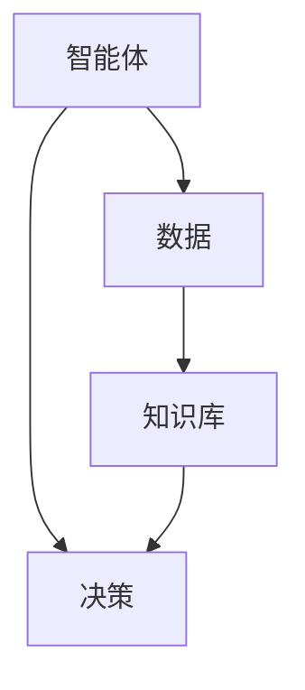
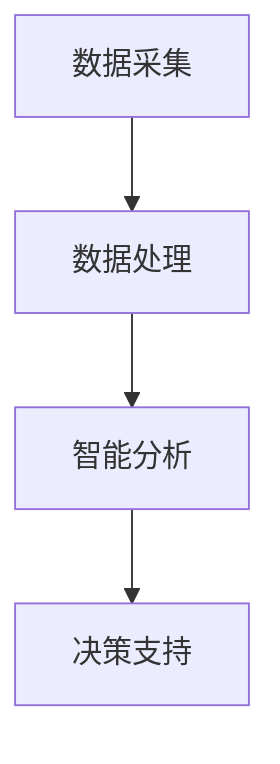
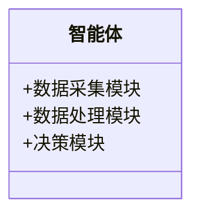
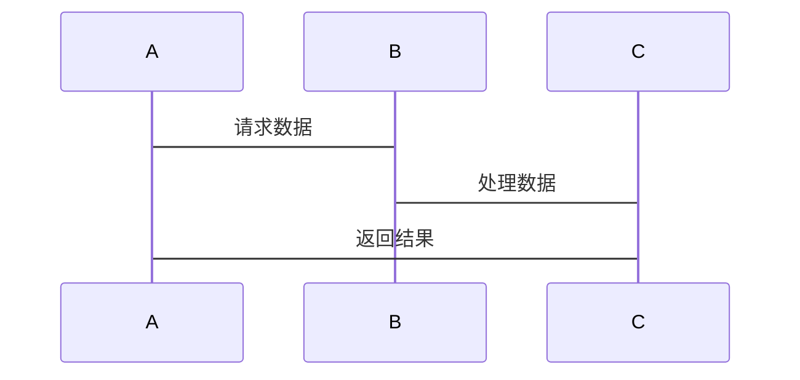

                 


# 智能体群体智慧在识别新兴产业机会中的应用

> 关键词：智能体群体智慧，新兴产业机会识别，协同决策，群体智能，算法原理，系统架构设计

> 摘要：本文深入探讨了智能体群体智慧在识别新兴产业机会中的应用。通过分析智能体的基本概念、群体智慧的核心原理、相关算法的实现以及系统架构设计，结合实际案例，详细阐述了智能体群体智慧在新兴产业机会识别中的优势与挑战，并提出了可行的解决方案和实践建议。

---

# 第一部分: 智能体群体智慧与新兴产业机会识别概述

# 第1章: 智能体群体智慧的基本概念

## 1.1 智能体的基本定义

### 1.1.1 智能体的定义与特征
智能体（Agent）是指能够感知环境、自主决策并采取行动的实体。智能体具备以下特征：
- **自主性**：无需外部干预，自主完成任务。
- **反应性**：能够感知环境并实时调整行为。
- **社会性**：能够与其他智能体或人类进行交互和协作。
- **学习性**：能够通过经验改进自身行为。

### 1.1.2 群体智能的形成机制
群体智能（Swarm Intelligence）是指通过多个智能体的协同行为，实现超越个体智能的集体智慧。其形成机制包括：
- **分布式计算**：任务分解为多个子任务，由多个智能体分别处理。
- **协同决策**：通过信息共享和交互，形成集体决策。
- **自适应性**：能够根据环境变化动态调整行为。

### 1.1.3 智能体与人类决策的关系
智能体与人类决策的关系是互补的。智能体通过数据处理和模式识别提供决策支持，而人类则通过主观判断和创造性思维补充智能体的不足。

## 1.2 新兴产业机会识别的核心要素

### 1.2.1 什么是新兴产业机会
新兴产业机会是指在当前市场中尚未被充分开发，但具备潜在增长空间的新兴领域。识别新兴产业机会的关键在于发现市场空白、技术突破和用户需求变化。

### 1.2.2 机会识别的关键维度
- **市场需求**：分析用户需求的变化趋势。
- **技术进步**：关注技术突破对产业的影响。
- **政策支持**：评估政策对产业发展的推动作用。

### 1.2.3 智能体群体智慧的应用场景
智能体群体智慧在新兴产业机会识别中的应用场景包括：
- **市场数据挖掘**：通过智能体协同分析大量市场数据。
- **竞争分析**：识别市场中的竞争对手和潜在机会。
- **趋势预测**：利用智能体的协同学习能力预测未来趋势。

## 1.3 智能体群体智慧与新兴产业机会识别的关系

### 1.3.1 智能体群体智慧的潜力
智能体群体智慧能够通过分布式计算和协同学习，快速分析大量数据，发现潜在的市场机会。

### 1.3.2 机会识别中的协同效应
智能体群体智慧通过协同效应，能够弥补单个智能体能力的不足，实现更高效的市场分析。

### 1.3.3 智能体群体智慧的优势与局限性
- **优势**：高效性、分布式计算、自我优化。
- **局限性**：依赖数据质量、算法复杂性、系统维护成本。

## 1.4 本章小结
本章介绍了智能体的基本概念、群体智慧的形成机制，以及智能体群体智慧在新兴产业机会识别中的应用场景和潜力。通过对比分析，揭示了智能体群体智慧的优势与局限性。

---

# 第2章: 智能体群体智慧的核心概念与联系

## 2.1 智能体群体智慧的核心原理

### 2.1.1 分布式计算与协同决策
分布式计算是智能体群体智慧的核心原理之一。通过分布式计算，多个智能体可以协同完成复杂任务。

### 2.1.2 自适应学习与进化算法
自适应学习和进化算法是智能体群体智慧的重要组成部分。通过自适应学习，智能体能够不断优化自身的决策策略。

### 2.1.3 群体记忆与知识共享
群体记忆是指智能体在协同过程中积累的知识和经验。知识共享是智能体群体智慧的重要机制。

## 2.2 智能体与人类决策者的对比分析

### 2.2.1 智能体的优势
- **高效性**：能够快速处理大量数据。
- **准确性**：通过算法优化，提高决策的准确性。

### 2.2.2 人类决策者的局限性
- **主观性**：受到个人经验和偏见的影响。
- **有限性**：处理复杂问题的能力有限。

### 2.2.3 两者的协同优化
通过智能体与人类的协同合作，可以实现优势互补，提高决策的效率和质量。

## 2.3 智能体群体智慧的ER实体关系图



## 2.4 本章小结
本章详细阐述了智能体群体智慧的核心原理，分析了智能体与人类决策者的优缺点，并通过ER实体关系图展示了智能体群体智慧的架构。

---

# 第3章: 智能体群体智慧的算法原理

## 3.1 协同过滤算法

### 3.1.1 算法原理
协同过滤算法是一种基于用户行为数据的推荐算法。通过分析用户的相似性，推荐相似用户的喜好。

### 3.1.2 算法实现
协同过滤算法的实现步骤如下：
1. **数据预处理**：收集用户行为数据。
2. **相似性计算**：计算用户之间的相似性。
3. **推荐生成**：根据相似用户的偏好生成推荐。

### 3.1.3 算法优缺点
- **优点**：简单易实现，推荐结果准确。
- **缺点**：计算复杂度高，难以处理大规模数据。

## 3.2 聚类分析算法

### 3.2.1 算法原理
聚类分析算法是一种通过划分用户或物品的相似性，将用户分为不同的群体。

### 3.2.2 算法实现
聚类分析算法的实现步骤如下：
1. **数据预处理**：收集用户行为数据。
2. **特征提取**：提取用户特征。
3. **聚类计算**：将用户划分为不同的群体。

### 3.2.3 算法优缺点
- **优点**：能够发现数据中的潜在结构。
- **缺点**：需要选择合适的聚类算法和参数。

## 3.3 智能体协同决策的数学模型

### 3.3.1 数学模型概述
智能体协同决策的数学模型可以通过公式表示为：
$$ f(x) = \sum_{i=1}^{n} w_i x_i $$

### 3.3.2 模型公式
$$ f(x) = \sum_{i=1}^{n} w_i x_i $$

### 3.3.3 模型解释
通过权重系数 $w_i$ 对输入变量 $x_i$ 进行加权求和，得到最终的决策结果。

## 3.4 本章小结
本章详细介绍了协同过滤算法和聚类分析算法的原理和实现方法，并通过数学公式解释了智能体协同决策的数学模型。

---

# 第4章: 智能体群体智慧的系统分析与架构设计

## 4.1 系统整体架构

### 4.1.1 系统功能模块
智能体群体智慧系统的功能模块包括：
- **数据采集模块**：负责收集市场数据。
- **数据处理模块**：对数据进行清洗和预处理。
- **智能分析模块**：利用算法进行数据分析。
- **决策支持模块**：生成决策建议。

### 4.1.2 系统架构图



## 4.2 系统功能设计

### 4.2.1 领域模型设计



### 4.2.2 系统接口设计
系统接口设计包括数据接口、算法接口和用户接口。

### 4.2.3 系统交互流程



## 4.3 本章小结
本章详细描述了智能体群体智慧系统的整体架构，功能模块和交互流程，并通过类图和序列图展示了系统的架构设计。

---

# 第5章: 智能体群体智慧的项目实战

## 5.1 项目背景与目标

### 5.1.1 项目背景
本项目旨在利用智能体群体智慧识别新兴产业机会。

### 5.1.2 项目目标
- **数据采集**：收集市场数据。
- **数据分析**：利用算法分析数据。
- **决策支持**：生成决策建议。

## 5.2 项目实施步骤

### 5.2.1 环境安装
安装必要的开发环境和工具，包括Python、Jupyter Notebook等。

### 5.2.2 核心代码实现
以下是协同过滤算法的Python实现代码：

```python
import numpy as np
from sklearn.metrics.pairwise import cosine_similarity

# 示例数据
X = np.array([[1, 2, 3],
              [4, 5, 6],
              [7, 8, 9]])

# 计算余弦相似度
similarity_matrix = cosine_similarity(X)

print(similarity_matrix)
```

### 5.2.3 代码应用解读与分析
通过上述代码，我们可以计算出用户之间的相似性，从而实现协同过滤推荐。

## 5.3 实际案例分析

### 5.3.1 案例背景
假设我们想识别新兴的人工智能产业机会。

### 5.3.2 数据分析
通过数据分析，我们发现人工智能领域的投资热度持续上升。

### 5.3.3 决策支持
基于数据分析结果，我们建议投资人工智能领域的相关企业。

## 5.4 项目小结
本章通过实际案例分析，展示了智能体群体智慧在新兴产业机会识别中的应用。

---

# 第6章: 智能体群体智慧的最佳实践与总结

## 6.1 最佳实践 tips

### 6.1.1 数据质量的重要性
数据质量是智能体群体智慧的核心，确保数据的准确性和完整性。

### 6.1.2 算法选择的策略
根据具体问题选择合适的算法，避免盲目追求复杂算法。

### 6.1.3 系统维护的注意事项
定期更新系统和算法，确保系统的稳定性和高效性。

## 6.2 本章小结
本章总结了智能体群体智慧在新兴产业机会识别中的最佳实践，并提出了系统的维护建议。

---

# 结语

智能体群体智慧在识别新兴产业机会中的应用前景广阔。通过智能体的协同决策和群体智慧，我们能够更高效地发现市场机会，推动产业的发展。

---

# 作者：AI天才研究院/AI Genius Institute & 禅与计算机程序设计艺术 /Zen And The Art of Computer Programming

