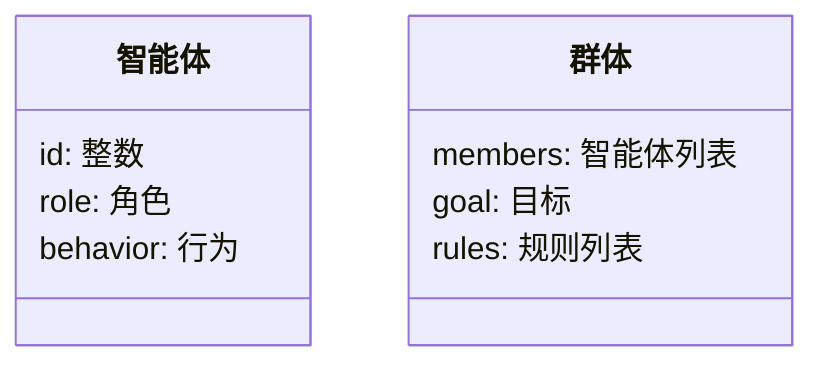
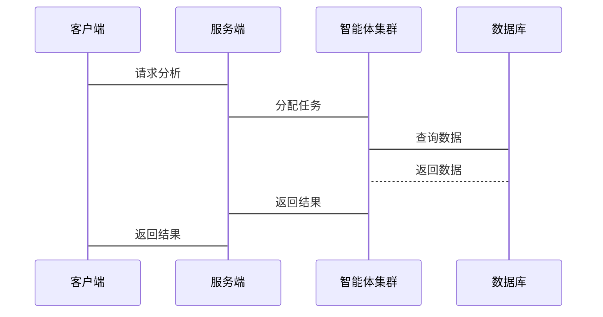

                 


# 智能体群体智慧在识别新兴产业机会中的应用：布局未来

## 关键词：智能体，群体智慧，新兴产业，机会识别，算法原理，系统架构，项目实战

## 摘要：  
智能体群体智慧是一种通过多个智能体协同工作，利用群体智慧来解决复杂问题的新技术。本文将从智能体群体智慧的基本概念、算法原理、系统架构设计、项目实战等多个方面展开，深入分析智能体群体智慧在识别新兴产业机会中的应用。通过本文的阅读，读者可以全面理解智能体群体智慧的核心原理，掌握其在实际应用中的技术细节，并能够将其应用于新兴产业机会识别的相关场景中。

---

# 第一部分: 智能体群体智慧的背景与核心概念

## 第1章: 智能体群体智慧概述

### 1.1 智能体群体智慧的定义与起源
智能体（Agent）是指能够感知环境并采取行动以实现目标的实体。群体智慧（Collective Intelligence）则是指通过多个个体或系统协同工作，共同完成复杂任务的能力。智能体群体智慧（Agent Collective Intelligence）结合了智能体的自主性和群体的协作性，是一种通过多个智能体协同工作，利用群体智慧解决复杂问题的技术。

智能体群体智慧的起源可以追溯到人工智能和分布式计算的早期研究。随着计算能力的提升和大数据技术的发展，智能体群体智慧逐渐从理论研究走向实际应用，尤其是在新兴产业机会识别领域。

### 1.2 智能体群体智慧的应用场景
新兴产业机会识别是一个复杂的问题，涉及市场分析、技术趋势、用户需求等多个维度。传统的单一智能体方法难以应对这种复杂性，而智能体群体智慧通过多个智能体的协同工作，能够更高效地识别潜在的新兴产业机会。

### 1.3 智能体群体智慧与新兴产业的关系
智能体群体智慧通过分布式计算和协作学习，能够从海量数据中提取有价值的信息，帮助企业在复杂的市场环境中快速发现新兴机会。这种技术不仅提高了新兴产业机会识别的效率，还能够为企业制定更具前瞻性的战略提供支持。

---

## 第2章: 智能体群体智慧的核心概念与联系

### 2.1 智能体与群体智慧的核心原理
智能体的核心原理是通过感知和行动实现目标，而群体智慧的核心原理是通过多个个体的协作完成复杂任务。智能体群体智慧的综合原理是将两者结合起来，利用多个智能体的协同工作实现更高的目标。

### 2.2 智能体群体智慧的核心概念对比
以下是智能体与传统AI、群体智慧与个体智慧的对比：

| **对比内容** | **智能体与传统AI** | **群体智慧与个体智慧** |
|----------------|-------------------|------------------------|
| **目标**       | 单一智能体目标    | 群体共同目标           |
| **协作性**     | 弱               | 强                     |
| **计算能力**   | 高               | 分布式                 |

### 2.3 智能体群体智慧的ER实体关系图
```mermaid
er
actor: 智能体
role: 参与者
action: 行为
goal: 目标
```

---

# 第二部分: 智能体群体智慧的算法原理

## 第3章: 智能体群体智慧的基础算法

### 3.1 基础算法概述
智能体群体智慧的基础算法包括群体智能算法、协同过滤算法和分布式计算算法。

### 3.2 算法原理的数学模型
协同过滤算法的数学模型如下：
$$
sim(i,j) = \frac{\sum_{k} (r_{i,k} - \bar{r_i})(r_{j,k} - \bar{r_j})}{\sqrt{\sum_{k} (r_{i,k} - \bar{r_i})^2} \cdot \sqrt{\sum_{k} (r_{j,k} - \bar{r_j})^2}}
$$  
其中，$sim(i,j)$ 表示用户 $i$ 和用户 $j$ 的相似度，$r_{i,k}$ 表示用户 $i$ 对物品 $k$ 的评分，$\bar{r_i}$ 表示用户 $i$ 的平均评分。

---

## 第4章: 智能体群体智慧的高级算法

### 4.1 高级算法概述
智能体群体智慧的高级算法包括协同过滤算法、遗传算法和粒子群优化算法。

### 4.2 高级算法的数学模型
粒子群优化算法的数学模型如下：
$$
v_i(t+1) = v_i(t) + \alpha (p_i(t) - x_i(t)) + \beta (p_g(t) - x_i(t))
$$  
其中，$v_i(t)$ 表示第 $i$ 个粒子在第 $t$ 时刻的速度，$p_i(t)$ 表示第 $i$ 个粒子的全局最优位置，$x_i(t)$ 表示第 $i$ 个粒子的当前位置，$\alpha$ 和 $\beta$ 是学习因子。

---

# 第三部分: 智能体群体智慧的系统分析与架构设计

## 第5章: 智能体群体智慧的系统分析

### 5.1 系统应用场景
智能体群体智慧可以应用于新兴产业机会识别、市场趋势分析等领域。

### 5.2 系统功能设计
以下是系统功能设计的类图：


### 5.3 系统架构设计
以下是系统架构设计的架构图：


---

## 第6章: 智能体群体智慧的接口设计与交互流程

### 6.1 接口设计
以下是接口设计的序列图：


---

# 第四部分: 智能体群体智慧的项目实战

## 第7章: 智能体群体智慧的项目实战

### 7.1 项目环境安装
以下是项目环境安装说明：
1. 安装Python 3.8及以上版本。
2. 安装必要的库：`numpy`、`scipy`、`scikit-learn`。

### 7.2 核心代码实现
以下是协同过滤算法的Python代码：
```python
import numpy as np
from sklearn.metrics.pairwise import pairwise_distances

# 示例数据
X = np.array([[1, 2], [2, 3], [3, 4]])

# 计算余弦相似度矩阵
similarity_matrix = pairwise_distances(X, metric='cosine')

print(similarity_matrix)
```

### 7.3 项目实战案例分析
以下是智能体群体智慧在互联网行业中的应用案例分析：
1. 数据收集：收集用户的搜索行为数据。
2. 数据分析：利用协同过滤算法分析用户行为，识别潜在的新兴需求。
3. 结果输出：输出分析结果，帮助企业制定市场策略。

---

# 第五部分: 智能体群体智慧的最佳实践

## 第8章: 智能体群体智慧的最佳实践

### 8.1 小结
智能体群体智慧是一种 powerful 的技术，能够帮助企业在新兴产业中快速识别机会。

### 8.2 注意事项
1. 数据质量是关键。
2. 算法选择需要根据具体场景。
3. 系统设计需要考虑可扩展性。

### 8.3 拓展阅读
1. 《群体智慧：算法与应用》
2. 《智能体与分布式计算》

---

# 小结

智能体群体智慧是一种结合了智能体和群体智慧的技术，能够通过多个智能体的协同工作，帮助企业在复杂的市场环境中识别新兴产业机会。通过本文的阅读，读者可以全面理解智能体群体智慧的核心原理，并掌握其在实际应用中的技术细节。

---

# 作者：AI天才研究院 & 禅与计算机程序设计艺术

