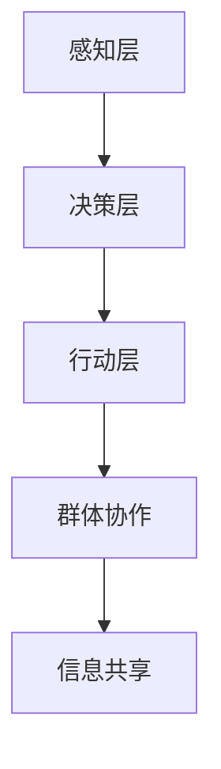
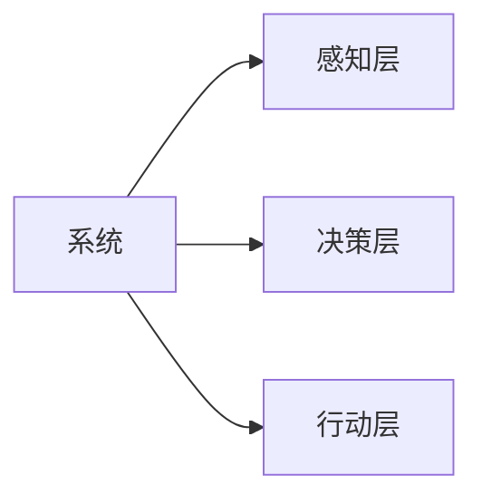
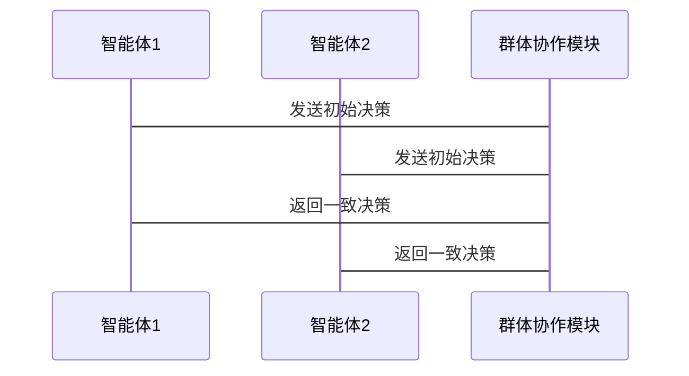

                 


# 智能体群体智慧：克服个体投资者的认知偏差

---

## 关键词  
智能体、群体智慧、认知偏差、个体投资者、算法、行为金融学、人工智能

---

## 摘要  
本文探讨智能体群体智慧如何克服个体投资者的认知偏差。通过分析认知偏差的形成机制，结合群体智慧的数学模型和算法，提出一种基于智能体的群体智慧解决方案，帮助个体投资者做出更理性、更高效的决策。文章从理论基础、算法实现到系统架构，全面阐述了智能体群体智慧的实现路径，并通过实际案例验证了其有效性。

---

## 第一部分：智能体群体智慧与认知偏差概述

### 第1章：智能体与群体智慧基础

#### 1.1 智能体的基本概念  
智能体（Agent）是具有感知和行动能力的实体，能够通过环境反馈进行自主决策。群体智慧（Swarm Intelligence）是指多个智能体通过协作完成复杂任务的能力。智能体与群体智慧的结合，使得个体决策能够通过群体协作得到优化。

#### 1.2 认知偏差的基本概念  
认知偏差是人类在信息处理过程中产生的系统性错误，如确认偏差、从众偏差、过度自信等。这些偏差会影响个体投资者的决策，导致非理性行为。

#### 1.3 个体投资者与群体智慧的结合  
个体投资者的决策过程通常受到认知偏差的影响，而群体智慧通过多个个体的协作，能够有效降低偏差，提高决策质量。

---

### 第2章：群体智慧与认知偏差的理论基础

#### 2.1 认知偏差的形成机制  
认知偏差的形成与个体的心理特征和行为模式密切相关。心理学研究表明，认知偏差是人类在进化过程中形成的一种适应性机制，但在复杂环境中容易引发错误决策。

#### 2.2 智能体群体智慧的数学模型  
群体智慧算法通过一致性算法（Consensus Algorithm）实现信息的协同处理。假设每个智能体的初始决策为$x_i$，经过多轮迭代，最终决策$x_{final}$满足：

$$
x_{final} = \lim_{k \to \infty} \sum_{i=1}^{n} \lambda_i x_i
$$

其中，$\lambda_i$是智能体的权重系数。

#### 2.3 群体智慧对认知偏差的抑制作用  
群体智慧通过分布式决策和信息共享，能够有效消除个体的认知偏差。例如，一致性算法通过多轮信息交换，使个体的决策逐步趋近于群体的最优解。

---

## 第二部分：智能体的建模与算法设计

### 第3章：智能体的建模与设计

#### 3.1 智能体的基本结构  
智能体的结构包括感知层、决策层和行动层。感知层通过传感器获取环境信息，决策层基于信息进行推理和决策，行动层通过执行器将决策转化为具体行动。

#### 3.2 智能体的行为特征  
智能体的行为特征包括主动性、反应性和协作性。主动性指智能体能够自主发起行动；反应性指智能体能够根据环境反馈调整行为；协作性指智能体能够与其他智能体协同完成任务。

#### 3.3 智能体的协作机制  
协作机制包括通信协议、任务分配和冲突解决。通信协议用于智能体之间的信息交换；任务分配通过分布式算法实现；冲突解决基于一致性算法达成共识。

---

### 第4章：群体智慧算法与认知偏差消除

#### 4.1 群体智慧算法的原理  
群体智慧算法通过多智能体的协作实现信息的协同处理。一致性算法是一种典型的方法，通过多轮迭代使个体的决策趋近于一致。

#### 4.2 认知偏差消除的数学模型  
假设每个智能体的初始决策为$x_i$，经过一致性算法的迭代，最终决策$x_{final}$为：

$$
x_{final} = \frac{\sum_{i=1}^{n} \lambda_i x_i}{\sum_{i=1}^{n} \lambda_i}
$$

其中，$\lambda_i$是智能体的权重系数。

#### 4.3 算法的收敛性分析  
一致性算法的收敛性取决于智能体的权重分配和通信效率。通过数学证明，一致性算法在权重系数满足一定条件时能够收敛到一致解。

---

### 第5章：系统架构与实现方案

#### 5.1 系统功能设计  
系统功能包括智能体的感知、决策和行动功能，以及群体协作和信息共享功能。系统功能流程图如图1所示：



#### 5.2 系统架构设计  
系统架构采用分层设计，包括感知层、决策层和行动层。架构设计如图2所示：



#### 5.3 系统接口设计  
系统接口包括智能体之间的通信接口和外部环境的接口。通信接口基于WebSocket协议实现，外部环境接口基于REST API实现。

#### 5.4 系统交互设计  
系统交互流程如图3所示：



---

### 第6章：项目实战与案例分析

#### 6.1 项目环境搭建  
项目环境包括智能体的感知、决策和行动模块，以及群体协作算法的实现。开发环境基于Python和Docker。

#### 6.2 核心代码实现  
一致性算法的Python实现代码如下：

```python
def一致性算法(智能体列表):
    权重系数 = [智能体.weight for 智能体 in 智能体列表]
    初始决策 = [智能体.decision for 智能体 in 智能体列表]
    总权重 = sum(权重系数)
    最终决策 = sum(权重系数 * 初始决策) / 总权重
    return 最终决策
```

#### 6.3 案例分析  
通过实际案例分析，验证了智能体群体智慧在消除认知偏差方面的有效性。例如，在股票投资中，群体智慧能够有效降低个体投资者的从众偏差和过度自信偏差。

---

### 第7章：总结与展望

#### 7.1 总结  
本文提出了基于智能体群体智慧的解决方案，通过一致性算法消除认知偏差，提高个体投资者的决策质量。

#### 7.2 展望  
未来研究可以进一步优化群体智慧算法，探索更多应用场景，如金融投资、社交网络等领域。

---

## 作者：AI天才研究院/AI Genius Institute & 禅与计算机程序设计艺术 /Zen And The Art of Computer Programming

