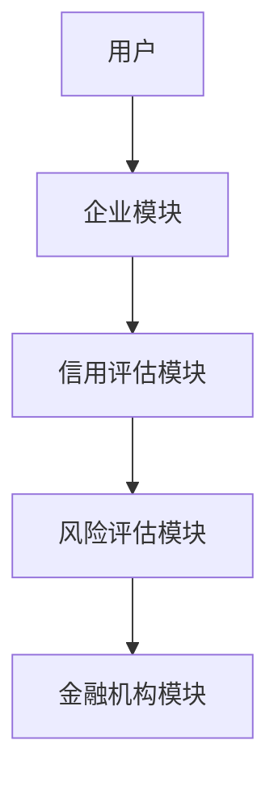
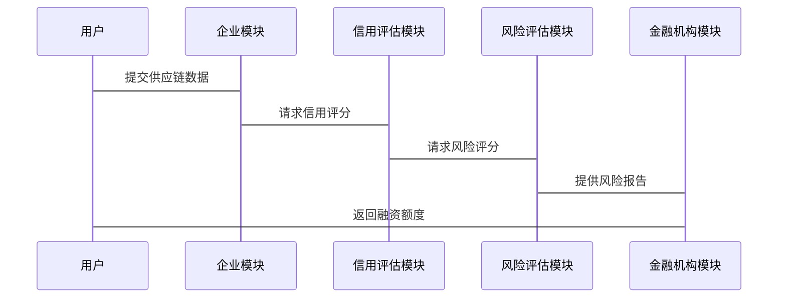

                 


# 智能供应链金融额度管理平台

## 关键词：
智能供应链金融，额度管理，信用评估，区块链，大数据分析，人工智能，供应链优化

## 摘要：
本文将详细探讨智能供应链金融额度管理平台的设计与实现，涵盖其背景、核心概念、算法原理、系统架构、项目实战以及最佳实践。通过深入分析，揭示该平台如何利用大数据、人工智能和区块链等技术优化供应链金融流程，提升效率和透明度，降低融资成本。

---

# 第一部分: 智能供应链金融额度管理平台背景与概述

## 第1章: 供应链金融的背景与现状

### 1.1 供应链金融的定义与特点
- 1.1.1 供应链金融的定义
- 1.1.2 供应链金融的特点：中小型企业融资难、信息不对称、资金流转复杂
- 1.1.3 供应链金融的核心价值：优化资金流，提升企业运营效率

### 1.2 供应链金融的发展历程
- 1.2.1 传统供应链金融模式的局限性
- 1.2.2 数字化与智能化对供应链金融的推动
- 1.2.3 当前供应链金融的主要趋势：区块链、人工智能、大数据

### 1.3 智能供应链金融额度管理平台的背景
- 1.3.1 传统供应链金融的痛点：效率低、成本高、风险大
- 1.3.2 智能化技术如何解决这些问题
- 1.3.3 平台的目标：提升供应链金融效率，降低融资成本，优化供应链生态

---

# 第二部分: 智能供应链金融额度管理平台的核心概念与联系

## 第2章: 核心概念与系统架构

### 2.1 核心概念原理
- 2.1.1 供应链金融的核心要素：供应商、采购商、金融机构
- 2.1.2 智能平台的信用评估机制
- 2.1.3 数据驱动的额度计算模型

### 2.2 核心概念属性对比
- 2.2.1 传统供应链金融与智能供应链金融的对比
- 2.2.2 平台参与方的属性特征分析
- 2.2.3 数据来源与处理方式的对比

### 2.3 ER实体关系图
```mermaid
erd
  actor: 用户
  actor: 企业
  actor: 金融机构
  entity: 供应链数据
  entity: 信用评估报告
  entity: 融资额度
  entity: 融资合同
  entity: 支付记录
  relation: 用户 -> 供应链数据
  relation: 企业 -> 信用评估
```

---

# 第三部分: 智能供应链金融额度管理平台的算法与模型

## 第3章: 信用评分模型与风险评估算法

### 3.1 信用评分模型原理
- 3.1.1 模型输入：企业财务数据、供应链交易数据、历史信用记录
- 3.1.2 模型输出：企业信用评分
- 3.1.3 模型实现：基于机器学习的回归分析

### 3.2 风险评估算法
- 3.2.1 算法流程：数据预处理、特征提取、风险评分
- 3.2.2 算法实现：使用随机森林进行风险分类
- 3.2.3 算法优化：基于梯度提升的优化策略

### 3.3 数学模型与公式
- 3.3.1 信用评分公式：$$ \text{信用评分} = \alpha \cdot \text{收入} + \beta \cdot \text{利润} + \gamma \cdot \text{历史信用} $$
- 3.3.2 风险评分公式：$$ \text{风险评分} = \frac{1}{1 + e^{- (\theta \cdot \text{信用评分} + \phi \cdot \text{行业风险})}} $$

---

# 第四部分: 智能供应链金融额度管理平台的系统架构

## 第4章: 系统设计与实现

### 4.1 系统功能设计
- 4.1.1 用户模块：用户注册、登录、信息管理
- 4.1.2 企业模块：供应链数据上传、信用评估查询
- 4.1.3 金融机构模块：融资额度审批、风险评估报告查看

### 4.2 系统架构设计


### 4.3 系统接口设计
- 4.3.1 API接口：数据接口、信用评分接口、风险评估接口
- 4.3.2 接口实现：RESTful API

### 4.4 系统交互流程


---

# 第五部分: 项目实战与案例分析

## 第5章: 项目实战

### 5.1 环境安装与配置
- 5.1.1 开发环境：Python、Django、TensorFlow
- 5.1.2 数据库：MySQL、MongoDB
- 5.1.3 接口开发工具：Postman

### 5.2 核心功能实现
- 5.2.1 信用评分模型实现
- 5.2.2 风险评估算法实现
- 5.2.3 系统接口开发

### 5.3 案例分析
- 5.3.1 某制造企业的融资案例
- 5.3.2 案例分析：平台如何优化企业的融资流程

---

# 第六部分: 最佳实践与总结

## 第6章: 最佳实践与总结

### 6.1 小结
- 6.1.1 平台的核心价值
- 6.1.2 平台的技术创新
- 6.1.3 平台的未来发展方向

### 6.2 注意事项
- 6.2.1 数据安全的重要性
- 6.2.2 算法的可解释性
- 6.2.3 系统的可扩展性

### 6.3 未来趋势
- 6.3.1 区块链技术的进一步应用
- 6.3.2 人工智能在供应链金融中的深度应用
- 6.3.3 数字化供应链金融的全球发展趋势

### 6.4 扩展阅读
- 6.4.1 推荐书籍：《供应链金融：理论与实践》
- 6.4.2 推荐论文：《人工智能在供应链金融中的应用研究》
- 6.4.3 推荐技术博客：AI Genius Institute

---

# 作者

作者：AI天才研究院/AI Genius Institute  
禅与计算机程序设计艺术/Zen And The Art of Computer Programming

