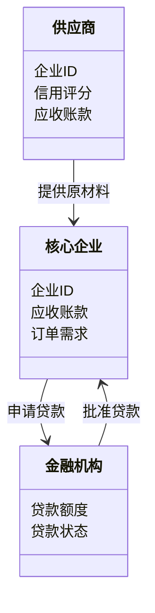
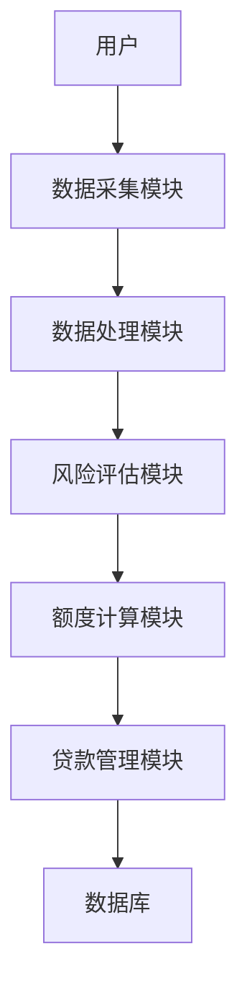

                 


# 智能供应链金融额度管理系统

> 关键词：智能供应链金融，额度管理，机器学习，风险评估，系统架构

> 摘要：本文系统地介绍智能供应链金融额度管理系统的背景、核心概念、算法原理、系统架构和实现方案。通过分析供应链金融的现状与问题，提出智能供应链金融的概念与优势，并详细阐述额度管理系统的算法与数学模型，结合实际案例进行系统设计与实现，最后总结系统的应用前景和实施要点。

---

# 第1章: 供应链金融的现状与问题

## 1.1 供应链金融的定义与特点

供应链金融是指通过整合供应链上下游企业之间的资金流、信息流和物流，为供应链上的企业提供融资支持的一种金融模式。其特点包括：

- **融资便捷性**：通过供应链上的交易数据，企业可以更便捷地获得融资。
- **风险可控性**：金融机构可以通过对供应链的整体风险评估，降低融资风险。
- **数据驱动性**：依赖于供应链上产生的大量数据，进行融资决策。

## 1.2 供应链金融中的问题与挑战

### 1.2.1 传统供应链金融的痛点
- **信息孤岛**：供应链上下游企业之间信息不透明，导致金融机构难以全面评估风险。
- **融资效率低**：传统供应链金融流程复杂，审批周期长，难以满足企业的快速融资需求。
- **风险控制难**：缺乏实时数据支持，金融机构难以准确评估供应链的整体风险。

### 1.2.2 信息不对称的问题
- 供应链上下游企业之间的信息不透明，导致金融机构难以全面掌握企业的经营状况。
- 信息不对称增加了金融机构的融资风险，同时也降低了企业的融资效率。

### 1.2.3 资金流动性不足的挑战
- 传统供应链金融模式下，中小企业的融资渠道有限，难以获得足够的资金支持。
- 资金流动性不足限制了供应链的整体运作效率，影响了企业的生产和运营。

## 1.3 智能供应链金融的概念与优势

### 1.3.1 智能供应链金融的定义
智能供应链金融是通过大数据、人工智能等技术手段，整合供应链上下游企业的数据，为供应链上的企业提供智能化的融资支持。

### 1.3.2 智能供应链金融的核心优势
- **数据驱动**：利用大数据和人工智能技术，实现对供应链上企业的精准评估和风险控制。
- **实时监控**：通过实时数据采集和分析，金融机构可以实时掌握供应链的整体运行状况。
- **自动化决策**：智能系统可以根据实时数据和预设的规则，自动完成融资决策，提高融资效率。

### 1.3.3 智能供应链金融的应用场景
- **应收账款融资**：基于供应链上的应收账款数据，为供应商提供融资支持。
- **订单融资**：基于客户的订单数据，为核心企业提供融资支持。
- **库存融资**：基于企业的库存数据，提供库存质押融资。

## 1.4 本章小结

本章介绍了供应链金融的定义和特点，分析了传统供应链金融中存在的痛点和挑战，并提出了智能供应链金融的概念和优势，为后续章节的展开奠定了基础。

---

# 第2章: 智能供应链金融额度管理系统的概念与核心要素

## 2.1 智能供应链金融额度管理系统的定义

智能供应链金融额度管理系统是一种基于大数据和人工智能技术，通过整合供应链上下游企业的数据，实现对企业融资额度的智能化计算和管理的系统。

## 2.2 核心概念与联系

### 2.2.1 供应链参与方的实体关系
- 供应商：提供原材料或服务的企业。
- 核心企业：供应链的核心企业，通常为核心企业的上游供应商和下游客户提供融资支持。
- 金融机构：为供应链上的企业提供融资支持的金融机构。
- 客户：供应链的核心企业的下游客户。

### 2.2.2 核心概念属性对比
| 概念 | 属性 | 描述 |
|------|------|------|
| 供应商 | 信用评级 | 供应商的信用评分，影响融资额度 |
| 核心企业 | 应收账款 | 核心企业与供应商之间的应收账款 |
| 金融机构 | 贷款额度 | 根据应收账款和供应商的信用评级确定的贷款额度 |
| 客户 | 订单需求 | 客户的需求订单，影响核心企业的融资需求 |

## 2.3 系统的核心要素组成

### 2.3.1 数据流
- 数据来源：供应链上的企业交易数据、物流数据、库存数据等。
- 数据处理：对数据进行清洗、整合和分析，为融资额度计算提供支持。

### 2.3.2 业务流
- 业务流程：从订单生成、应收账款确认到融资额度计算，再到贷款发放的完整流程。

### 2.3.3 资金流
- 资金流动：从金融机构到核心企业，再到供应商的资金流动。

## 2.4 本章小结

本章详细介绍了智能供应链金融额度管理系统的定义和核心要素，分析了系统中的数据流、业务流和资金流，为后续章节的系统设计和实现奠定了基础。

---

# 第3章: 智能供应链金融额度管理系统的核心算法与数学模型

## 3.1 风险评估算法

### 3.1.1 风险评估模型的构建
- 风险评估模型基于企业的信用评分、历史违约率、应收账款等数据，利用机器学习算法进行风险评估。

### 3.1.2 基于机器学习的风险评估
- 使用逻辑回归（Logistic Regression）或支持向量机（SVM）等算法，对企业的信用风险进行评估。

## 3.2 额度计算算法

### 3.2.1 基于历史数据的额度计算
- 根据企业的历史交易数据和信用评分，计算企业的初始融资额度。

### 3.2.2 基于实时数据的动态调整
- 根据实时的交易数据和市场变化，动态调整企业的融资额度。

### 3.2.3 额度计算的数学模型
$$ 额度 = \alpha \times 营收 + \beta \times 信用评分 + \gamma \times 历史违约率 $$

## 3.3 算法实现与优化

### 3.3.1 算法实现步骤
1. 数据预处理：清洗和整合供应链上的数据。
2. 特征提取：提取影响融资额度的关键特征。
3. 模型训练：使用机器学习算法训练融资额度计算模型。
4. 模型优化：通过交叉验证和参数调优，优化模型的性能。

### 3.3.2 算法优化策略
- 使用网格搜索（Grid Search）优化模型参数。
- 采用集成学习（Ensemble Learning）提高模型的准确性和稳定性。

## 3.4 本章小结

本章详细介绍了智能供应链金融额度管理系统中的核心算法，包括风险评估和额度计算的算法原理和数学模型，并给出了算法的实现步骤和优化策略。

---

# 第4章: 智能供应链金融额度管理系统的架构设计

## 4.1 系统功能设计

### 4.1.1 领域模型图


### 4.1.2 系统功能模块
- 数据采集模块：采集供应链上的企业数据。
- 数据处理模块：对数据进行清洗和整合。
- 风险评估模块：基于机器学习算法进行风险评估。
- 额度计算模块：根据风险评估结果计算融资额度。
- 贷款管理模块：管理贷款的发放和还款。

## 4.2 系统架构设计

### 4.2.1 整体架构图


### 4.2.2 数据库设计
- 表结构：供应商表、核心企业表、金融机构表、订单需求表、应收账款表。
- 关系设计：供应商与核心企业之间存在一对一的关系，核心企业与金融机构之间存在多对一的关系。

## 4.3 系统接口设计

### 4.3.1 API接口
- 数据接口：提供数据采集和处理的API。
- 风险评估接口：提供风险评估的API。
- 额度计算接口：提供额度计算的API。

## 4.4 本章小结

本章详细介绍了智能供应链金融额度管理系统的架构设计，包括系统功能模块、整体架构图和数据库设计，为后续章节的系统实现奠定了基础。

---

# 第5章: 智能供应链金融额度管理系统的实现

## 5.1 环境搭建

### 5.1.1 开发环境
- 操作系统：Windows 10 或 Linux
- 开发工具：Python 3.8 以上版本，Jupyter Notebook
- 数据库：MySQL 8.0 以上版本

## 5.2 核心代码实现

### 5.2.1 数据预处理代码
```python
import pandas as pd
import numpy as np

# 读取数据
data = pd.read_csv('supply_chain_data.csv')

# 数据清洗
data.dropna(inplace=True)
data.drop_duplicates(inplace=True)

# 数据转换
data['日期'] = pd.to_datetime(data['日期'])
```

### 5.2.2 风险评估代码
```python
from sklearn.linear_model import LogisticRegression

# 特征提取
X = data[['营收', '信用评分', '历史违约率']]
y = data['风险评分']

# 模型训练
model = LogisticRegression()
model.fit(X, y)

# 模型预测
predicted_risk = model.predict(X)
```

### 5.2.3 额度计算代码
```python
def calculate_credit_limit(revenue, credit_score, default_rate):
    alpha = 0.5
    beta = 0.3
    gamma = 0.2
    limit = alpha * revenue + beta * credit_score + gamma * default_rate
    return limit

credit_limit = calculate_credit_limit(data['营收'], data['信用评分'], data['历史违约率'])
```

## 5.3 案例分析

### 5.3.1 实际案例
- 某供应商的营收为1000万元，信用评分为80分，历史违约率为5%。
- 计算融资额度：1000 * 0.5 + 80 * 0.3 + 5 * 0.2 = 500 + 24 + 1 = 525万元。

## 5.4 本章小结

本章详细介绍了智能供应链金融额度管理系统的实现，包括环境搭建、核心代码实现和实际案例分析，展示了系统在实际应用中的效果。

---

# 第6章: 智能供应链金融额度管理系统的应用与优化

## 6.1 系统应用前景

### 6.1.1 供应链金融的数字化转型
- 智能供应链金融额度管理系统为供应链金融的数字化转型提供了技术支持。

### 6.1.2 提高融资效率
- 通过自动化决策，提高融资效率，降低企业的融资成本。

## 6.2 系统优化建议

### 6.2.1 数据质量优化
- 提高数据采集的准确性和及时性。

### 6.2.2 模型优化
- 使用更复杂的机器学习算法，如随机森林（Random Forest）和梯度提升树（Gradient Boosting Tree），提高模型的准确性。

## 6.3 本章小结

本章分析了智能供应链金融额度管理系统的应用前景，并提出了系统的优化建议，为系统的进一步发展提供了方向。

---

# 作者：AI天才研究院/AI Genius Institute & 禅与计算机程序设计艺术 /Zen And The Art of Computer Programming

