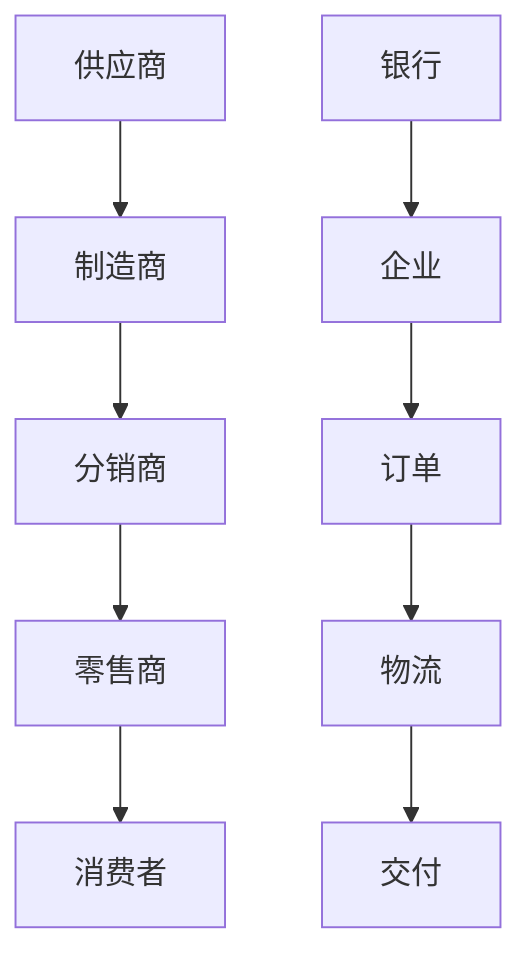
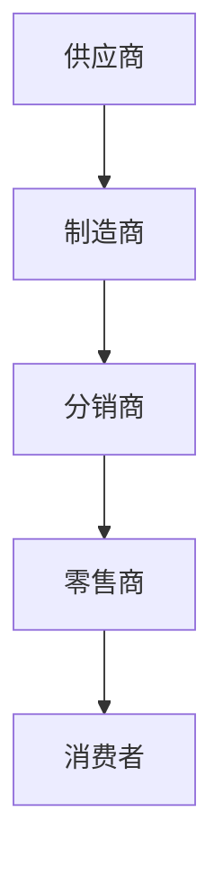
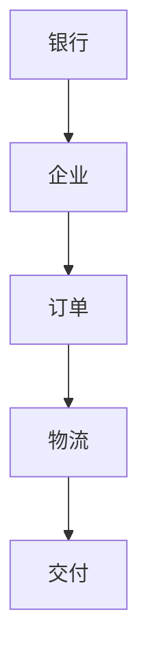
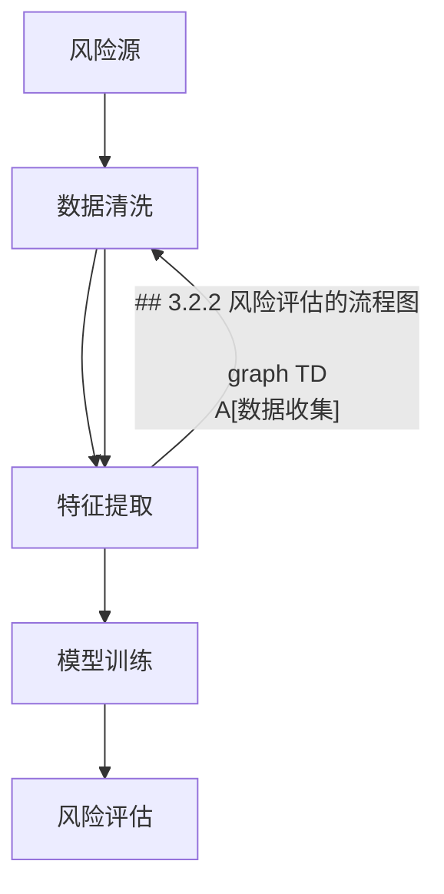
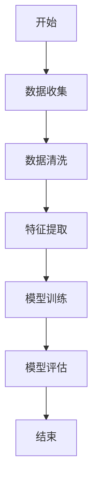
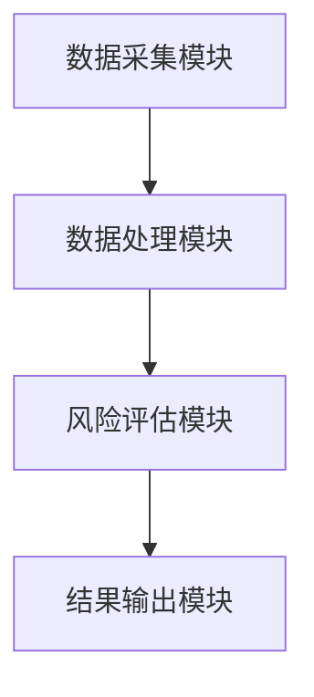

                 


# 智能供应链金融风险评估

> 关键词：供应链金融，智能供应链，风险评估，人工智能，区块链，大数据，金融风险

> 摘要：智能供应链金融风险评估是利用先进的智能技术，如人工智能、大数据和区块链，来优化供应链金融中的风险识别、评估和管理。本文将详细探讨智能供应链金融的核心概念、算法原理、系统架构设计以及实际应用案例，旨在为读者提供全面的理论和实践指导。

---

# 第一部分: 智能供应链金融风险评估的背景与概念

# 第1章: 智能供应链金融风险评估的背景与概念

## 1.1 供应链金融的定义与特点
### 1.1.1 供应链金融的定义
供应链金融是指通过整合供应链上的信息流、资金流和物流，为供应链上的企业提供融资支持的金融服务。传统的供应链金融通常依赖于核心企业的信用，融资效率较低且风险分散不均。

### 1.1.2 智能供应链的定义
智能供应链是指利用人工智能、大数据、物联网和区块链等技术，实现供应链各环节的智能化管理和优化。智能供应链能够实时监控供应链的动态，提高透明度和效率。

### 1.1.3 智能供应链金融的核心优势
- 数据驱动的决策：通过实时数据分析，快速识别潜在风险。
- 智能化风险评估：利用机器学习模型精准评估供应链中的信用风险。
- 区块链技术的透明性：确保供应链上的信息不可篡改，增强信任。

## 1.2 智能供应链金融的现状与发展趋势
### 1.2.1 传统供应链金融的局限性
- 信息不对称：难以全面了解供应链上下游企业的信用状况。
- 融资效率低：传统模式依赖核心企业，中小企业融资难。
- 风险分散不足：难以快速响应和处理突发事件。

### 1.2.2 智能技术在供应链金融中的应用现状
- 数据分析：通过大数据技术实时监控供应链的动态。
- 人工智能：利用机器学习模型预测风险。
- 区块链：确保供应链信息的透明和不可篡改。

### 1.2.3 智能供应链金融的未来发展趋势
- 技术融合：进一步整合人工智能、大数据和区块链技术。
- 数字化转型：推动供应链金融的全数字化运营。
- 生态化发展：构建开放的供应链金融生态系统。

## 1.3 智能供应链金融风险评估的必要性
### 1.3.1 供应链金融中的主要风险类型
- 信用风险：供应商或客户因信用问题导致的违约风险。
- 操作风险：供应链操作中的失误或欺诈行为。
- 市场风险：市场波动对供应链金融的影响。

### 1.3.2 智能技术如何降低供应链金融风险
- 数据分析：通过实时数据监控，快速识别异常情况。
- 人工智能：利用机器学习模型预测风险。
- 区块链：确保数据的真实性和不可篡改性。

### 1.3.3 风险评估在供应链金融中的重要性
- 提高融资效率：通过精准的风险评估，快速审批融资需求。
- 降低风险敞口：通过识别高风险企业，减少潜在损失。
- 优化资源配置：通过风险评估，合理分配资源，提高整体效率。

## 1.4 本章小结
本章主要介绍了智能供应链金融的背景、定义和核心优势，探讨了传统供应链金融的局限性和智能供应链金融的发展趋势。同时，分析了智能供应链金融风险评估的必要性及其在降低风险方面的作用。

---

# 第2章: 供应链金融风险评估的核心概念

## 2.1 供应链金融的核心要素与关系
### 2.1.1 供应链参与方的角色分析
供应链参与方包括供应商、制造商、分销商、零售商和消费者。每个角色在供应链金融中扮演不同的角色，承担不同的责任。

### 2.1.2 供应链金融的主要业务流程
1. 供应商提供原材料。
2. 制造商生产产品。
3. 分销商进行分销。
4. 零售商向消费者销售产品。
5. 银行或其他金融机构提供融资支持。

### 2.1.3 供应链金融的核心要素与关系图


## 2.2 智能供应链金融中的风险类型
### 2.2.1 信用风险
信用风险是指供应链参与方因信用问题导致的违约风险。例如，供应商因资金链断裂无法按时交付原材料。

### 2.2.2 操作风险
操作风险是指供应链操作中的失误或欺诈行为导致的风险。例如，物流环节中的货物丢失或损坏。

### 2.2.3 市场风险
市场风险是指市场波动对供应链金融的影响。例如，原材料价格波动导致供应商成本增加。

## 2.3 风险评估的核心原理
### 2.3.1 风险评估的基本原理
风险评估是通过分析供应链各环节的数据，识别潜在风险，并评估其对整体供应链的影响。

### 2.3.2 智能供应链金融中的风险评估模型
风险评估模型通常包括数据收集、数据清洗、特征提取、模型训练和模型评估几个步骤。

### 2.3.3 风险评估的数学模型与公式
常用的风险评估模型包括线性回归、逻辑回归和随机森林等。例如，线性回归模型可以表示为：
$$ y = \beta_0 + \beta_1 x_1 + \beta_2 x_2 + \dots + \beta_n x_n + \epsilon $$
其中，\( y \) 是目标变量（风险值），\( x_i \) 是特征变量，\( \beta_i \) 是回归系数，\( \epsilon \) 是误差项。

---

# 第3章: 核心概念与联系的实体关系图

## 3.1 供应链金融的核心实体关系
### 3.1.1 供应链参与方的关系


### 3.1.2 供应链金融中的资金流动


## 3.2 智能供应链金融中的风险评估关系
### 3.2.1 风险源与风险事件的关系


---

# 第4章: 智能供应链金融风险评估的算法原理

## 4.1 常用算法原理
### 4.1.1 机器学习算法
- 线性回归
- 逻辑回归
- 支持向量机（SVM）
- 随机森林

### 4.1.2 图论算法
- 最短路径算法
- 最小生成树算法

## 4.2 算法流程图
### 4.2.1 线性回归算法流程图


### 4.2.2 逻辑回归算法流程图


---

# 第5章: 智能供应链金融风险评估的系统架构设计

## 5.1 系统功能设计
### 5.1.1 数据采集模块
- 从供应链各环节收集数据，包括订单、物流、库存等。

### 5.1.2 数据处理模块
- 对数据进行清洗和预处理，提取有用的特征。

### 5.1.3 风险评估模块
- 使用机器学习模型对供应链中的风险进行评估。

## 5.2 系统架构图


---

# 第6章: 项目实战与案例分析

## 6.1 项目背景
某汽车制造企业面临供应链金融中的信用风险和操作风险，希望通过智能技术优化风险评估流程。

## 6.2 系统实现
### 6.2.1 环境安装
- 安装Python、Jupyter Notebook、Scikit-learn等工具。

### 6.2.2 核心代码实现
```python
from sklearn.linear_model import LogisticRegression
from sklearn.model_selection import train_test_split
import pandas as pd

# 数据加载
data = pd.read_csv('supply_chain_data.csv')

# 数据预处理
X = data.drop('risk', axis=1)
y = data['risk']

# 划分训练集和测试集
X_train, X_test, y_train, y_test = train_test_split(X, y, test_size=0.2, random_state=42)

# 模型训练
model = LogisticRegression()
model.fit(X_train, y_train)

# 模型评估
print(model.score(X_test, y_test))
```

---

# 第7章: 最佳实践与未来展望

## 7.1 最佳实践
- 数据质量管理：确保数据的准确性和完整性。
- 模型优化：根据实际需求调整模型参数，提高评估精度。
- 技术融合：结合多种智能技术，如人工智能和区块链，提升整体效率。

## 7.2 小结
智能供应链金融风险评估是供应链金融未来发展的重要方向，通过智能技术的应用，能够显著降低供应链金融中的风险，提高融资效率和企业竞争力。

## 7.3 注意事项
- 数据隐私保护：在数据采集和处理过程中，需注意保护企业隐私。
- 技术可行性：根据企业实际情况选择合适的技术方案，避免过度追求技术复杂性。

## 7.4 拓展阅读
- 《区块链技术在供应链金融中的应用》
- 《人工智能在风险管理中的应用》

---

作者：AI天才研究院/AI Genius Institute & 禅与计算机程序设计艺术 /Zen And The Art of Computer Programming

