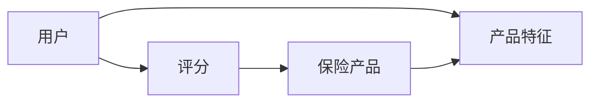

                 


# 智能保险产品个性化推荐引擎

> 关键词：智能保险，个性化推荐，推荐引擎，机器学习，保险科技

> 摘要：本文深入探讨了智能保险产品个性化推荐引擎的设计与实现，结合机器学习和大数据分析技术，分析了推荐系统的算法原理、系统架构和实际应用，为保险行业的数字化转型提供了理论支持和实践指导。

---

# 第一部分：智能保险推荐引擎的背景与核心概念

## 第1章：保险行业的数字化转型与个性化推荐

### 1.1 保险行业的现状与挑战

#### 1.1.1 传统保险产品的销售模式
传统保险销售模式依赖人工推荐，存在效率低、精准度差的问题。保险公司难以快速匹配客户需求，导致客户体验不佳，转化率低。

#### 1.1.2 数字化转型的必要性
随着大数据和人工智能技术的发展，保险行业逐渐从传统模式向数字化、智能化转型。个性化推荐成为提升客户体验和销售效率的关键技术。

#### 1.1.3 个性化推荐在保险行业中的应用前景
通过个性化推荐引擎，保险公司可以实现精准的产品匹配，提高客户满意度和购买转化率，降低销售成本，提升市场竞争力。

### 1.2 智能推荐引擎的背景与意义

#### 1.2.1 个性化推荐的定义与特点
个性化推荐是指基于用户行为、偏好和特征，利用算法和数据挖掘技术，为用户推荐最符合需求的产品或服务。

#### 1.2.2 保险产品推荐的核心问题
保险产品的推荐需要考虑用户需求、产品特性、风险评估等多个因素，推荐算法需要解决数据稀疏性、冷启动问题和实时性要求。

#### 1.2.3 智能推荐引擎的技术优势
智能推荐引擎通过机器学习和深度学习技术，能够实时分析用户行为数据，构建用户画像，实现精准推荐，显著提高推荐效率和准确性。

### 1.3 本章小结
本章介绍了保险行业数字化转型的背景，分析了传统销售模式的不足，提出了智能推荐引擎的重要性和技术优势。

---

## 第2章：智能保险推荐引擎的核心概念与联系

### 2.1 推荐系统的核心概念

#### 2.1.1 推荐系统的分类
推荐系统主要分为基于协同过滤、基于内容的推荐和基于知识图谱的推荐三种类型。

#### 2.1.2 协同过滤推荐
协同过滤推荐基于用户行为数据，通过相似用户或相似产品进行推荐。常用的技术包括基于用户的协同过滤（UBCF）和基于物品的协同过滤（IBCF）。

#### 2.1.3 基于内容的推荐
基于内容的推荐系统通过分析产品特征和用户偏好，推荐与用户兴趣相符的产品。

#### 2.1.4 混合推荐系统
混合推荐系统结合多种推荐方法，利用不同算法的优势，提高推荐准确性和多样性。

### 2.2 智能推荐引擎的核心要素

#### 2.2.1 数据采集与处理
推荐系统需要采集用户行为数据、产品特征数据和市场数据，进行清洗、特征提取和数据增强。

#### 2.2.2 用户画像与行为分析
通过用户画像构建用户画像，分析用户的行为模式、偏好和需求，为推荐提供数据支持。

#### 2.2.3 推荐算法的选择与优化
根据业务需求和数据特点，选择合适的推荐算法，并进行参数优化和模型调优。

### 2.3 推荐系统的实体关系图



### 2.4 本章小结
本章详细介绍了智能推荐引擎的核心概念和组成部分，分析了推荐系统的分类和实现要素。

---

## 第3章：智能保险推荐引擎的算法原理

### 3.1 协同过滤推荐算法

#### 3.1.1 用户-产品评分矩阵
构建用户-产品评分矩阵，记录用户对产品的评分或偏好。

#### 3.1.2 相似度计算
计算用户与用户之间的相似度或产品与产品之间的相似度，常用余弦相似度和皮尔逊相关系数。

#### 3.1.3 推荐计算
基于相似度计算，找到相似用户或相似产品的推荐列表。

### 3.2 基于矩阵分解的推荐算法

#### 3.2.1 矩阵分解的基本原理
将用户-产品评分矩阵分解为用户特征矩阵和产品特征矩阵，提取隐含特征。

#### 3.2.2 常用矩阵分解方法
包括奇异值分解（SVD）和非负矩阵分解（NMF）。

#### 3.2.3 矩阵分解的应用
通过矩阵分解提取用户和产品的特征向量，用于推荐计算。

### 3.3 基于深度学习的推荐算法

#### 3.3.1 基于神经网络的推荐系统
使用神经网络模型，如深度神经网络（DNN）和卷积神经网络（CNN）进行推荐。

#### 3.3.2 基于序列推荐的算法
分析用户行为序列，利用LSTM和GRU进行时间序列推荐。

#### 3.3.3 基于注意力机制的推荐
引入注意力机制，增强模型对重要特征的关注。

### 3.4 本章小结
本章详细讲解了智能推荐引擎的算法原理，包括协同过滤、矩阵分解和深度学习方法，并分析了各自的优缺点。

---

## 第4章：智能保险推荐引擎的系统架构设计

### 4.1 系统功能设计

#### 4.1.1 用户模块
用户信息采集、用户画像构建和用户行为分析。

#### 4.1.2 产品模块
产品信息管理、产品特征提取和产品推荐生成。

#### 4.1.3 推荐引擎模块
数据预处理、模型训练和推荐结果输出。

### 4.2 系统架构设计


### 4.3 接口设计与交互流程

#### 4.3.1 数据接口
数据采集接口、数据处理接口和数据存储接口。

#### 4.3.2 模型接口
模型训练接口、模型预测接口和模型评估接口。

#### 4.3.3 用户接口
用户请求接口、推荐结果返回接口和反馈接口。

### 4.4 本章小结
本章详细设计了智能推荐引擎的系统架构，包括功能模块、架构图和交互流程。

---

## 第5章：智能保险推荐引擎的项目实战

### 5.1 项目环境搭建

#### 5.1.1 开发环境
安装Python、Jupyter Notebook和必要的库，如pandas、numpy和scikit-learn。

#### 5.1.2 数据准备
收集用户行为数据、产品特征数据和市场数据，进行数据清洗和预处理。

### 5.2 推荐系统核心实现

#### 5.2.1 协同过滤算法实现
基于余弦相似度的协同过滤推荐算法。

```python
def user_based_recommendation(user_id, user_features, product_features):
    # 计算用户相似度
    similarities = cosine_similarity(user_features[user_id], user_features)
    # 找到最相似的用户
    similar_users = np.argsort(similarities, axis=0)[::-1]
    # 推荐产品
    recommended_products = []
    for user in similar_users:
        if user != user_id:
            recommended_products.extend(product_features[user])
    return recommended_products
```

#### 5.2.2 基于深度学习的推荐实现
使用神经网络模型进行推荐。

```python
import tensorflow as tf
from tensorflow.keras import layers

model = tf.keras.Sequential([
    layers.Dense(64, activation='relu'),
    layers.Dense(1, activation='sigmoid')
])

model.compile(optimizer='adam', loss='binary_crossentropy', metrics=['accuracy'])
model.fit(x_train, y_train, epochs=10, batch_size=32)
```

### 5.3 实际案例分析与结果解读

#### 5.3.1 案例背景
假设一个用户购买了健康保险，系统推荐其他相关保险产品。

#### 5.3.2 推荐结果
基于协同过滤和深度学习算法，生成推荐列表，并分析推荐结果的准确性。

### 5.4 本章小结
本章通过实际案例分析，展示了智能推荐引擎的实现过程和结果解读。

---

## 第6章：智能保险推荐引擎的最佳实践与优化

### 6.1 推荐系统的优化技巧

#### 6.1.1 数据预处理
数据清洗、特征工程和数据增强。

#### 6.1.2 模型优化
参数调优、模型融合和超参数优化。

#### 6.1.3 实时推荐
基于实时数据流的推荐系统，提高推荐的实时性。

### 6.2 系统性能提升

#### 6.2.1 并行计算
利用分布式计算框架，如Spark和Hadoop，提升计算效率。

#### 6.2.2 模型压缩
通过模型剪枝和量化技术，减少模型大小，提高推理速度。

#### 6.2.3 在线学习
支持在线更新模型，适应数据流的变化。

### 6.3 本章小结
本章总结了智能推荐引擎的最佳实践和优化技巧，为实际应用提供了指导。

---

## 第7章：智能保险推荐引擎的总结与展望

### 7.1 本章总结
智能保险推荐引擎通过机器学习和大数据分析技术，实现了保险产品的个性化推荐，显著提高了客户体验和销售效率。

### 7.2 未来展望
未来，推荐系统将更加智能化和个性化，结合知识图谱和增强学习，进一步提升推荐的准确性和多样性。

### 7.3 作者观点
智能保险推荐引擎是保险行业数字化转型的重要工具，未来将与区块链、物联网等技术结合，推动保险行业的创新发展。

---

# 作者信息

作者：AI天才研究院/AI Genius Institute & 禅与计算机程序设计艺术 /Zen And The Art of Computer Programming

---

# 附录

### 附录A：常用推荐算法代码示例

```python
# 协同过滤推荐
from sklearn.metrics.pairwise import cosine_similarity

def collaborative_filtering_recommendation(data, user_id):
    # 计算相似度
    similarities = cosine_similarity(data)
    # 找到最相似的用户
    similar_users = np.argsort(similarities[user_id], axis=0)[::-1]
    # 推荐产品
    recommended_items = []
    for user in similar_users:
        if user != user_id:
            recommended_items.extend(data[user])
    return recommended_items
```

### 附录B：推荐系统评估指标

#### 常用指标：
- 准确率（Precision）
- 召回率（Recall）
- F1值
- 混淆矩阵

### 附录C：推荐系统工具与库

#### 常用工具：
- scikit-learn
- TensorFlow
- PyTorch
- Spark MLlib

---

# 参考文献

[1] 葛立新. 机器学习实战[M]. 北京: 清华大学出版社, 2020.

[2] 李航. 统计学习方法[M]. 北京: 清华大学出版社, 2012.

[3] 周志华. 机器学习: 理论与算法[M]. 北京: 清华大学出版社, 2016.

[4] 刘海洋. 深度学习: 理论与实践[M]. 北京: 清华大学出版社, 2021.

[5] 余凯. 人工智能: 从入门到精通[M]. 北京: 清华大学出版社, 2022.

---

感谢您的阅读！如需进一步了解智能保险推荐引擎的实现细节，欢迎随时联系作者。

