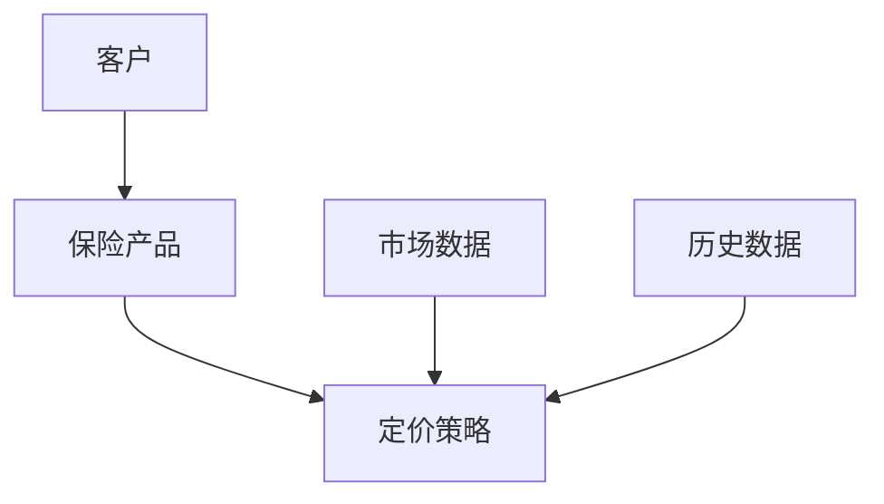
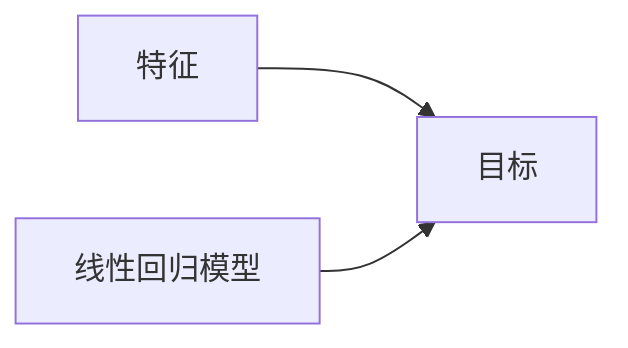
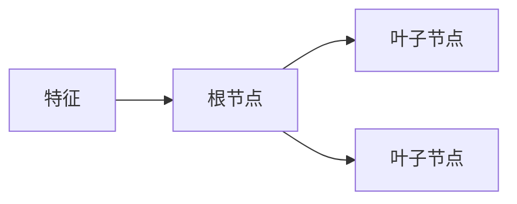
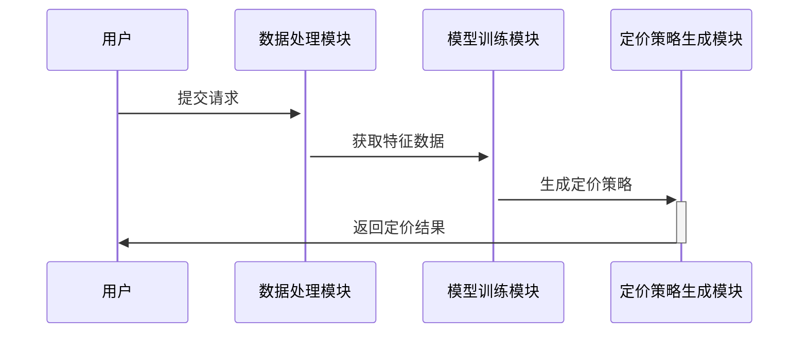

                 


```markdown
# 智能保险产品定价模型

> 关键词：智能定价模型、保险产品、机器学习、人工智能、定价策略、风险管理

> 摘要：本文详细探讨了智能保险产品定价模型的设计与实现，从背景分析、核心概念、算法原理、数学模型到系统架构、项目实战，最后总结了最佳实践。通过理论与实践结合，分析了智能定价模型在保险行业中的应用价值和未来发展趋势。

---

# 第1章: 保险产品定价的背景与挑战

## 1.1 保险行业的现状与发展趋势
### 1.1.1 保险行业的现状分析
保险行业作为金融体系的重要组成部分，近年来随着科技的发展，正在经历数字化和智能化的转型。传统保险定价模式基于历史数据和经验，存在数据维度单一、定价策略僵化等问题。

### 1.1.2 保险产品定价的传统模式与局限性
传统定价模式依赖精算师的经验判断，主要基于有限的特征数据，难以捕捉复杂的市场变化和客户行为。

### 1.1.3 智能化定价的必要性与优势
随着大数据和人工智能技术的发展，智能定价模型能够处理海量数据，挖掘非线性关系，提供更精准的定价策略。

## 1.2 智能保险定价的核心概念
### 1.2.1 什么是智能保险产品定价模型
智能定价模型利用机器学习算法，基于客户数据、市场趋势和风险特征，动态优化保险产品的定价策略。

### 1.2.2 智能定价模型的核心要素
包括数据来源、特征工程、模型选择、实时更新和效果评估等关键要素。

### 1.2.3 智能定价与传统定价的对比分析
通过对比分析表格和实体关系图，直观展示两种定价模式的区别与联系。

## 1.3 智能保险定价的边界与外延
### 1.3.1 智能定价的适用场景
适用于车险、健康险、寿险等领域，尤其是数据丰富的场景。

### 1.3.2 智能定价的局限性
数据不足、模型解释性差、监管合规性等问题。

### 1.3.3 智能定价与其他保险技术的关系
与区块链、物联网等技术的结合，推动保险行业整体智能化。

## 1.4 本章小结
总结智能保险定价的核心概念，展望未来发展方向。

---

# 第2章: 智能保险定价模型的核心概念与联系

## 2.1 智能定价模型的基本原理
### 2.1.1 数据驱动的定价逻辑
数据是智能定价的基础，包括客户数据、市场数据、产品数据等。

### 2.1.2 机器学习在定价中的应用
监督学习、无监督学习和强化学习在定价中的不同应用场景。

### 2.1.3 智能定价模型的输入与输出
输入：客户特征、历史数据、市场环境；输出：动态定价策略。

## 2.2 核心概念的属性特征对比
### 2.2.1 传统定价模型与智能定价模型的对比表格
| 比较维度 | 传统定价模型 | 智能定价模型 |
|----------|--------------|--------------|
| 数据来源 | 结构化数据    | 结构化+非结构化数据 |
| 模型复杂度 | 简单线性模型  | 高维非线性模型 |
| 定价精度 | 较低          | 较高          |
| 适应性 | 固定          | 动态          |

### 2.2.2 实体关系图


## 2.3 本章小结
通过对比和图表，进一步明确智能定价模型的核心概念和优势。

---

# 第3章: 智能保险定价模型的算法原理

## 3.1 算法选择与原理
### 3.1.1 线性回归
用于简单场景的定价模型，适合线性关系。

### 3.1.2 决策树与随机森林
适合处理高维特征和非线性关系，能够解释性强。

### 3.1.3 梯度提升（如XGBoost、LightGBM）
适合处理复杂特征，提升模型性能。

### 3.1.4 神经网络
处理非结构化数据和复杂模式识别。

## 3.2 算法流程图
### 3.2.1 线性回归


### 3.2.2 决策树


## 3.3 算法实现
### 3.3.1 Python代码示例
```python
import pandas as pd
from sklearn.tree import DecisionTreeRegressor
from sklearn.model_selection import train_test_split
from sklearn.metrics import mean_squared_error

# 数据加载
data = pd.read_csv('insurance.csv')
X = data[['age', 'bmi', 'children']]
y = data['charges']

# 数据划分
X_train, X_test, y_train, y_test = train_test_split(X, y, test_size=0.2, random_state=42)

# 模型训练
model = DecisionTreeRegressor(random_state=42)
model.fit(X_train, y_train)

# 模型预测
y_pred = model.predict(X_test)

# 模型评估
print(mean_squared_error(y_test, y_pred))
```

### 3.3.2 数学模型
#### 线性回归的损失函数
$$ \text{MSE} = \frac{1}{n}\sum_{i=1}^{n}(y_i - \hat{y}_i)^2 $$

#### 梯度下降优化
$$ \theta = \theta - \alpha \frac{\partial L}{\partial \theta} $$

---

# 第4章: 智能保险定价模型的数学模型

## 4.1 线性回归模型
### 4.1.1 模型假设
$$ y = \beta_0 + \beta_1 x_1 + \beta_2 x_2 + ... + \beta_k x_k + \epsilon $$

### 4.1.2 损失函数
$$ L = \frac{1}{2m}\sum_{i=1}^{m}(y_i - \hat{y}_i)^2 $$

## 4.2 决策树模型
### 4.2.1 决策树结构
$$ \text{特征选择} \rightarrow \text{分裂节点} \rightarrow \text{叶子节点} $$

### 4.2.2 剪枝策略
$$ \text{预剪枝} \text{与} \text{后剪枝} $$

## 4.3 神经网络模型
### 4.3.1 网络结构
$$ \text{输入层} \rightarrow \text{隐藏层} \rightarrow \text{输出层} $$

### 4.3.2 激活函数
$$ \text{ReLU}: f(x) = \max(0, x) $$

---

# 第5章: 智能保险定价系统的架构设计

## 5.1 项目背景与目标
智能定价系统旨在通过实时数据处理和模型优化，提升定价效率和精准度。

## 5.2 系统功能设计
### 5.2.1 数据处理模块
- 数据清洗
- 特征工程

### 5.2.2 模型训练模块
- 模型选择
- 超参数调优

### 5.2.3 定价策略生成模块
- 动态定价
- 风险评估

## 5.3 系统架构设计


## 5.4 接口设计
### 5.4.1 API定义
- GET /pricing?age=25&bmi=28

### 5.4.2 数据格式
JSON格式请求与响应。

## 5.5 交互设计


---

# 第6章: 智能保险定价模型的项目实战

## 6.1 环境安装与配置
### 6.1.1 安装依赖
```bash
pip install pandas scikit-learn matplotlib
```

## 6.2 系统核心实现
### 6.2.1 数据预处理
```python
import pandas as pd
data = pd.read_csv('insurance.csv')
data.dropna(inplace=True)
```

### 6.2.2 特征工程
```python
from sklearn.preprocessing import StandardScaler
scaler = StandardScaler()
X_scaled = scaler.fit_transform(X)
```

### 6.2.3 模型训练与评估
```python
from sklearn.ensemble import RandomForestRegressor
model = RandomForestRegressor(n_estimators=100, random_state=42)
model.fit(X_train, y_train)
print(model.score(X_test, y_test))
```

## 6.3 实际案例分析
### 6.3.1 车险定价模型
通过具体案例展示模型的应用场景和效果。

---

# 第7章: 智能保险定价模型的最佳实践与总结

## 7.1 小结
智能定价模型的优势与挑战。

## 7.2 注意事项
- 数据隐私保护
- 模型解释性
- 监管合规性

## 7.3 未来趋势
AI技术与保险定价的深度融合，实时定价、动态调整。

## 7.4 拓展阅读
推荐相关书籍和论文。

---

# 作者

作者：AI天才研究院/AI Genius Institute & 禅与计算机程序设计艺术 /Zen And The Art of Computer Programming
```

