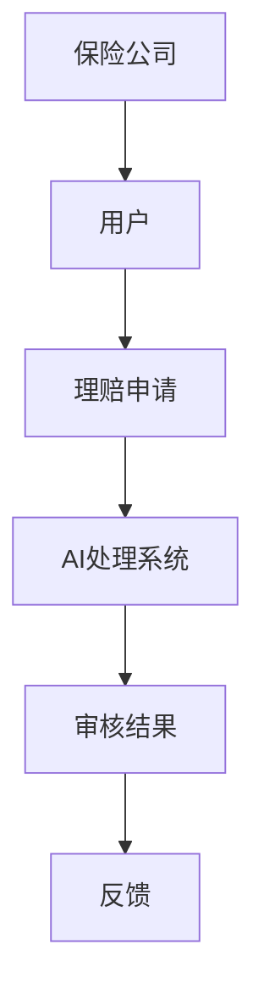
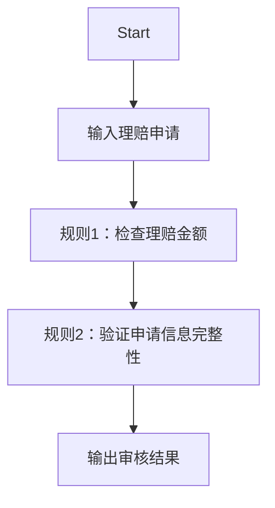
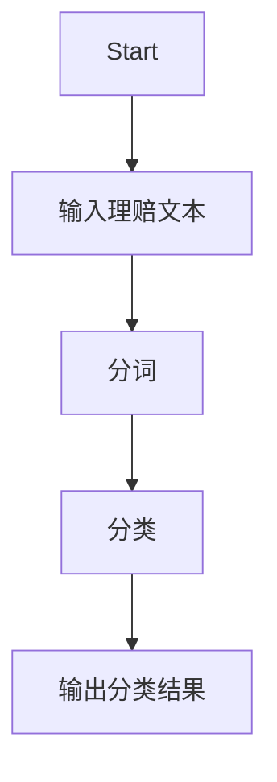
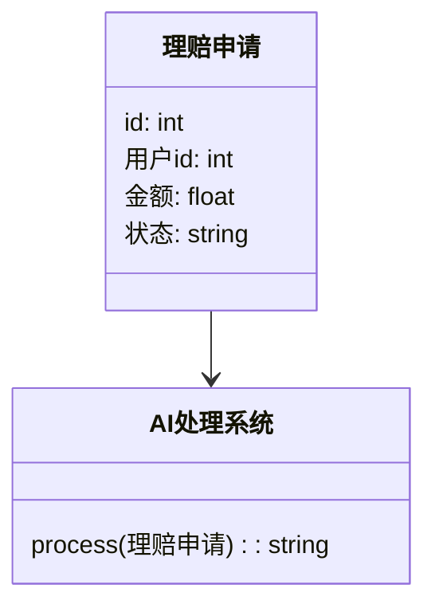

                 


# 《智能保险理赔处理系统》

## 关键词：智能保险、理赔处理系统、AI技术、机器学习、自然语言处理、系统架构

## 摘要：
智能保险理赔处理系统是一种结合人工智能技术来优化保险理赔流程的创新解决方案。本文将从背景、核心概念、算法原理、系统架构、项目实战等多方面详细阐述智能保险理赔处理系统的构建与实现，帮助读者全面理解该系统的原理与应用。

---

# 第一部分：背景与核心概念

## 第1章：智能保险理赔处理系统的背景介绍

### 1.1 问题背景
#### 1.1.1 传统保险理赔流程的痛点
- 理赔流程复杂，人工审核效率低。
- 数据分散，信息整合困难。
- 用户体验差，理赔周期长。

#### 1.1.2 智能化理赔的需求驱动
- 保险行业的数字化转型趋势。
- 用户对高效、透明理赔服务的需求增加。
- 企业降低运营成本的压力。

#### 1.1.3 问题解决思路
- 引入人工智能技术优化理赔流程。
- 通过自动化处理提高效率。
- 建立统一的保险理赔数据平台。

### 1.2 系统的边界与外延
#### 1.2.1 系统的功能边界
- 理赔申请的自动处理。
- 数据的整合与分析。
- 用户交互界面的优化。

#### 1.2.2 与外部系统的交互
- 与保险公司现有系统的集成。
- 第三方数据源的接入。
- 用户端的接口设计。

#### 1.2.3 系统的扩展性与灵活性
- 支持多种保险类型。
- 灵活调整算法模型。
- 易维护性和可扩展性设计。

---

## 第2章：智能保险理赔处理系统的核心概念

### 2.1 核心概念与原理
#### 2.1.1 AI技术在保险理赔中的应用
- 机器学习用于风险评估。
- 自然语言处理用于合同解析。
- 规则引擎用于自动化审核。

#### 2.1.2 理赔流程的优化
- 自动化审核流程的设计。
- 异常检测与风险预警。
- 用户反馈的实时处理。

#### 2.1.3 系统架构的核心要素
- 分层架构设计。
- 数据存储与处理模块。
- 用户交互界面设计。

### 2.2 核心概念对比表
| 对比项 | 传统理赔 | AI智能理赔 |
|--------|----------|------------|
| 处理时间 | 长 | 短 |
| 人工干预 | 多 | 少 |
| 准确率 | 低 | 高 |

### 2.3 实体关系图


---

# 第二部分：算法原理与实现

## 第3章：关键算法与实现

### 3.1 规则引擎
#### 3.1.1 规则引擎的原理


#### 3.1.2 规则引擎的实现代码
```python
def process_claims(claim):
    # 规则1：检查理赔金额是否合理
    if claim['amount'] > 10000:
        return '拒绝'
    # 规则2：验证申请信息完整性
    if 'proof' not in claim:
        return '补充资料'
    # 其他规则
    return '通过'
```

### 3.2 自然语言处理算法
#### 3.2.1 文本分类算法


#### 3.2.2 分词算法的实现
```python
import jieba

text = "保险理赔流程优化"
words = jieba.lcut(text)
print(words)  # 输出: ['保险', '理赔', '流程', '优化']
```

### 3.3 机器学习模型
#### 3.3.1 算法原理
- 使用贝叶斯定理进行分类：
  $$ P(y|x) = \frac{P(x|y)P(y)}{P(x)} $$
  
#### 3.3.2 决策树模型的实现
```python
from sklearn.tree import DecisionTreeClassifier

# 训练数据
X = [[...], [...]]
y = ['通过', '拒绝']

clf = DecisionTreeClassifier()
clf.fit(X, y)
```

---

# 第三部分：系统架构与设计

## 第4章：系统分析与架构设计

### 4.1 问题场景介绍
- 理赔申请的自动化处理。
- 数据的高效整合与分析。
- 用户交互的便捷性。

### 4.2 系统功能设计
#### 4.2.1 领域模型类图


#### 4.2.2 系统架构图
```mermaid
graph TD
    FrontEnd --> API Gateway
    API Gateway --> Backend
    Backend --> Database
    Database --> AI Engine
    AI Engine --> Result
    Result --> FrontEnd
```

---

## 第5章：项目实战

### 5.1 环境安装
- 安装Python、TensorFlow、Flask等依赖库。

### 5.2 核心功能实现
#### 5.2.1 理赔申请处理
```python
@app.route('/process_claim', methods=['POST'])
def process_claim():
    claim = request.json
    result = process_claims(claim)
    return jsonify({'result': result})
```

#### 5.2.2 算法实现
```python
def process_claims(claim):
    # 使用规则引擎进行初步审核
    if claim['amount'] > 10000:
        return '拒绝'
    # 使用自然语言处理分析合同文本
    text = claim['contract_text']
    words = jieba.lcut(text)
    # 使用机器学习模型进行分类
    prediction = model.predict([words])
    return '通过' if prediction[0] else '拒绝'
```

### 5.3 实际案例分析
- 案例一：小额理赔的快速处理。
- 案例二：复杂理赔的流程优化。

### 5.4 项目小结
- 系统实现的关键点。
- 实践中的经验与教训。

---

# 第四部分：最佳实践与总结

## 第6章：最佳实践

### 6.1 小结
- 系统设计的核心思想。
- 技术实现的关键点。

### 6.2 注意事项
- 数据安全与隐私保护。
- 系统的可扩展性和维护性。
- 用户体验的持续优化。

### 6.3 拓展阅读
- 推荐相关书籍和论文。
- 提供进一步学习的资源。

---

# 作者：AI天才研究院/AI Genius Institute & 禅与计算机程序设计艺术 /Zen And The Art of Computer Programming

