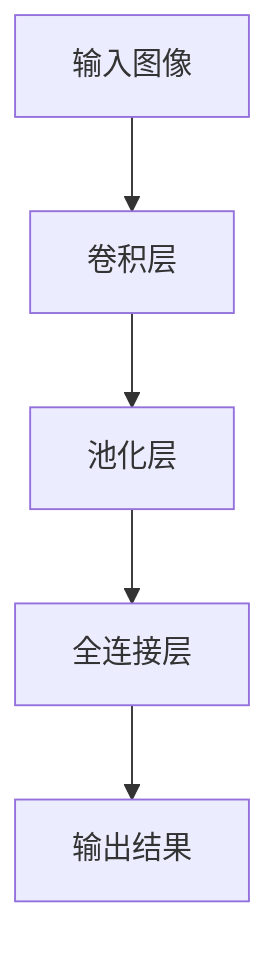
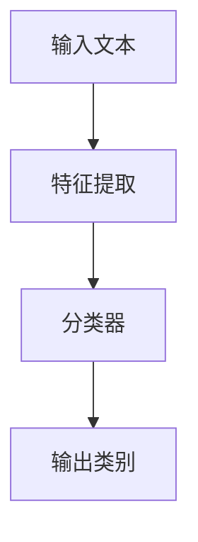
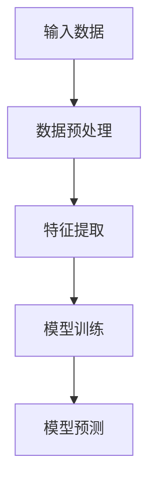
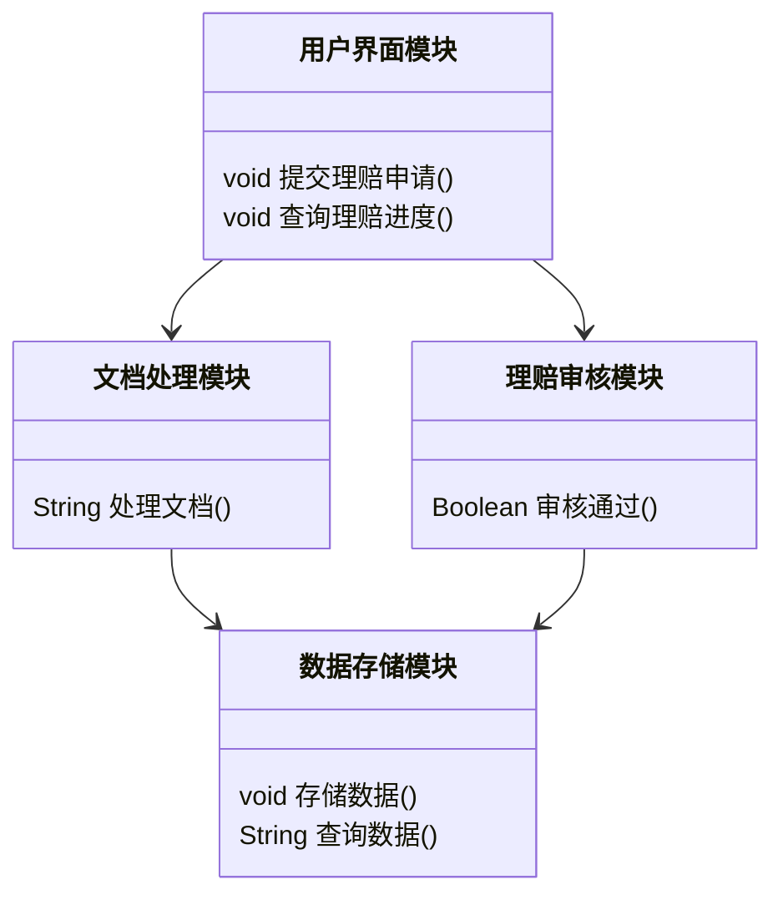
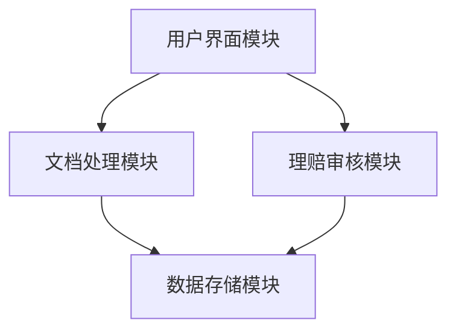

                 


# 智能保险理赔快速处理系统

> 关键词：智能保险、理赔处理系统、图像识别、自然语言处理、机器学习、风险管理

> 摘要：本文详细探讨了智能保险理赔快速处理系统的构建与实现，涵盖了从系统背景到核心技术，再到项目实战的全过程。通过介绍图像识别、自然语言处理和机器学习等技术在保险理赔中的应用，结合实际案例分析，展示了如何利用这些技术提高理赔效率、降低人工成本，并提升客户体验。本文还提供了系统的架构设计、接口设计和交互流程，以及项目实现的详细代码示例。

---

# 第一部分: 智能保险理赔快速处理系统概述

## 第1章: 智能保险理赔快速处理系统背景与意义

### 1.1 保险理赔的传统流程与问题

#### 1.1.1 传统保险理赔流程的痛点

传统保险理赔流程通常包括以下几个步骤：用户提交理赔申请、保险公司接收并审核资料、人工核对和验证信息、计算理赔金额并完成赔付。然而，这一流程存在以下问题：

- **效率低**：人工审核需要大量时间，尤其是在理赔高峰期，用户等待时间长。
- **错误率高**：人工操作容易出现疏忽或错误，导致理赔延迟或金额计算错误。
- **成本高**：需要大量的人力资源，增加了保险公司的运营成本。

#### 1.1.2 传统理赔效率低的原因

传统理赔效率低的原因主要体现在以下几个方面：

- **人工审核**：依赖人工对大量文档进行核对，效率低下。
- **信息孤岛**：不同部门之间的信息难以共享，导致重复劳动。
- **技术落后**：缺乏先进的技术手段来辅助审核和计算。

#### 1.1.3 传统理赔模式的改进需求

为了提高理赔效率和准确性，保险公司需要引入智能化技术，如图像识别、自然语言处理和机器学习等，来优化理赔流程。

---

### 1.2 智能保险理赔快速处理系统的定义与特点

#### 1.2.1 智能保险理赔的定义

智能保险理赔是指利用人工智能技术，如图像识别、自然语言处理和机器学习，来自动处理和审核保险理赔请求，从而提高理赔效率和准确性。

#### 1.2.2 智能理赔的核心特征

智能理赔的核心特征包括：

- **自动化**：系统能够自动处理理赔申请，减少人工干预。
- **高效性**：通过技术手段快速审核和计算，缩短理赔时间。
- **准确性**：利用智能技术提高审核的准确性，减少错误。

#### 1.2.3 智能理赔与传统理赔的对比

| 对比维度 | 传统理赔 | 智能理赔 |
|----------|----------|----------|
| 效率     | 低       | 高       |
| 成本     | 高       | 低       |
| 准确性   | 低       | 高       |

---

### 1.3 智能保险理赔快速处理系统的意义

#### 1.3.1 提高理赔效率

通过自动化处理，智能理赔系统能够快速审核和计算理赔金额，显著缩短理赔时间。

#### 1.3.2 降低人工成本

减少对人工审核的依赖，降低了保险公司的运营成本。

#### 1.3.3 提升客户体验

客户可以通过在线平台快速提交理赔申请，实时查看理赔进度，提升了客户满意度。

---

## 1.4 本章小结

本章介绍了传统保险理赔流程的痛点，定义了智能保险理赔快速处理系统，并分析了其在提高效率、降低成本和提升客户体验方面的优势。

---

# 第二部分: 智能保险理赔快速处理系统的核心技术

## 第2章: 图像识别与文档处理技术

### 2.1 图像识别技术在保险理赔中的应用

#### 2.1.1 OCR技术的原理与实现

OCR（光学字符识别）技术用于将图像中的文字提取出来，常用于保险理赔中的单据识别。以下是OCR技术的实现流程：

1. **图像采集**：通过扫描仪或手机拍照获取图像。
2. **图像预处理**：包括去噪、二值化和纠斜等步骤。
3. **字符识别**：使用OCR算法（如Tesseract）识别字符并生成文本。

**代码示例**（使用Python和Tesseract）：

```python
from tesserocr import *

image = Image.open('invoice.jpg')
text = image_to_string(image)
print(text)
```

#### 2.1.2 基于深度学习的图像识别

基于深度学习的图像识别技术，如卷积神经网络（CNN），能够更准确地识别复杂场景下的文字和图像。

**CNN实现流程图**：



#### 2.1.3 图像识别在单据处理中的应用

图像识别技术可以用于识别和分类保险单据，如保单、理赔单等。

---

### 2.2 文档处理技术

#### 2.2.1 PDF与图像的转换

将PDF文件转换为图像格式，以便于后续的OCR处理。

**Python代码示例**（使用PyPDF2）：

```python
import PyPDF2

with open('document.pdf', 'rb') as f:
    reader = PyPDF2.PdfReader(f)
    page = reader.pages[0]
    text = page.extract_text()
print(text)
```

#### 2.2.2 文档自动分类与归档

基于文档内容的相似性，使用聚类算法对文档进行分类和归档。

---

## 第3章: 自然语言处理技术

### 3.1 自然语言处理在保险理赔中的应用

#### 3.1.1 文本分类与主题识别

文本分类可以用于识别理赔申请的主题，如“交通事故”、“疾病理赔”等。

**文本分类流程图**：



#### 3.1.2 基于NLP的意图识别

意图识别可以帮助系统理解用户的意图，例如“查询理赔进度”或“提交理赔申请”。

**Python代码示例**（使用spaCy）：

```python
import spacy

nlp = spacy.load("en_core_web_sm")
doc = nlp("I want to check my claim status.")
for token in doc:
    print(token.text, token.pos_)
```

#### 3.1.3 保险条款的理解与解析

自然语言处理技术可以用于解析复杂的保险条款，帮助用户理解理赔条件和流程。

---

## 第4章: 机器学习与风险评估

### 4.1 机器学习在保险理赔中的应用

#### 4.1.1 基于机器学习的理赔风险评估

使用机器学习模型预测理赔风险，帮助保险公司制定合理的保费策略。

**机器学习模型训练流程图**：



#### 4.1.2 基于机器学习的理赔金额预测

通过历史数据训练模型，预测理赔金额，减少人工计算的工作量。

**Python代码示例**（使用Scikit-learn）：

```python
from sklearn.linear_model import LinearRegression
import pandas as pd

data = pd.read_csv('claims.csv')
X = data[['claim_number', 'coverage']]
y = data['amount']
model = LinearRegression()
model.fit(X, y)
print(model.predict([[100, 5000]]))
```

#### 4.1.3 机器学习在理赔欺诈检测中的应用

通过异常检测技术识别潜在的欺诈行为，降低保险公司的损失。

---

## 1.4 本章小结

本章详细介绍了智能保险理赔快速处理系统的核心技术，包括图像识别、自然语言处理和机器学习在保险理赔中的应用。

---

# 第三部分: 系统架构设计与实现

## 第5章: 系统架构设计

### 5.1 系统功能模块设计

系统功能模块包括：

- 用户界面模块
- 文档处理模块
- 理赔审核模块
- 数据存储模块

**系统功能模块类图**：



### 5.2 系统架构设计

系统采用微服务架构，各模块独立运行，便于扩展和维护。

**系统架构设计图**：



### 5.3 系统接口设计

系统接口设计包括：

- 提交理赔申请接口
- 查询理赔进度接口
- 获取理赔结果接口

---

## 第6章: 系统实现

### 6.1 环境搭建

需要安装以下工具和库：

- Python
- Flask（Web框架）
- Tesseract（OCR工具）
- spaCy（NLP库）
- Scikit-learn（机器学习库）

### 6.2 核心功能实现

#### 6.2.1 文档处理功能

**Python代码示例**（使用Flask搭建API）：

```python
from flask import Flask, upload_file

app = Flask(__name__)

@app.route('/process_document', methods=['POST'])
def process_document():
    file = request.files['file']
    filename = secure_filename(file.filename)
    file.save(filename)
    # 调用OCR处理
    text = extract_text(filename)
    return jsonify({'status': 'success', 'text': text})
```

#### 6.2.2 理赔审核功能

**Python代码示例**（使用机器学习模型）：

```python
from sklearn.externals import joblib

model = joblib.load('claim_approval.pkl')
def predict_approval(claim_data):
    return model.predict(claim_data)
```

### 6.3 系统测试与优化

通过测试用例验证系统功能，并根据测试结果进行优化。

---

## 第7章: 优化与展望

### 7.1 系统优化

- **性能优化**：优化OCR和NLP模块的处理速度。
- **模型优化**：改进机器学习模型的准确性和预测能力。

### 7.2 技术展望

- **边缘计算**：将智能理赔系统部署在边缘设备上，减少数据传输延迟。
- **区块链技术**：利用区块链技术提高理赔过程的透明度和安全性。

---

## 第8章: 附录

### 8.1 工具安装指南

- **Python安装**：访问[Python官网](https://www.python.org/)下载并安装。
- **Flask安装**：使用`pip install flask`安装。

### 8.2 数据集信息

提供用于训练和测试的理赔数据集信息。

### 8.3 API接口文档

详细描述系统提供的API接口及其使用方法。

### 8.4 参考文献

列出本文中引用的相关文献和技术资料。

---

## 作者：AI天才研究院/AI Genius Institute & 禅与计算机程序设计艺术 /Zen And The Art of Computer Programming

---

以上是《智能保险理赔快速处理系统》的技术博客文章的大纲和部分章节内容。通过逐步分析和详细讲解，本文为读者提供了一个全面的视角，从系统背景到核心技术，再到项目实现，帮助读者深入了解智能保险理赔快速处理系统的构建与应用。

