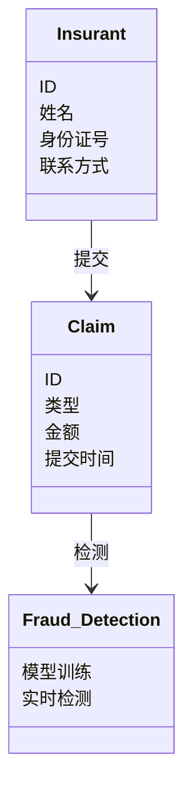

                 


# 智能保险理赔欺诈预防系统

> 关键词：保险欺诈预防，人工智能，机器学习，系统架构，项目实战

> 摘要：本文详细介绍了智能保险理赔欺诈预防系统的构建与应用，从背景、核心概念、算法原理到系统架构和项目实战，系统性地阐述了如何利用人工智能技术有效预防保险理赔中的欺诈行为，确保保险业务的健康运行。

---

# 第一部分: 背景介绍

## 第1章: 保险理赔欺诈问题背景

### 1.1 保险欺诈的定义与分类
- **1.1.1 欺诈行为的定义**
  - 保险欺诈是指投保人或被保险人故意制造保险事故或夸大损失，以获取不当利益的行为。
- **1.1.2 欺诈行为的分类**
  - 操作性欺诈：投保人故意制造事故或夸大损失。
  - 延展性欺诈：投保人利用保险条款漏洞，扩大索赔范围。
  - 保险金欺诈：虚构保险事故，骗取保险金。

### 1.2 保险理赔流程与欺诈风险
- **1.2.1 保险理赔的基本流程**
  - 投保人提交理赔申请。
  - 保险公司审核资料。
  - 确定赔付金额并支付。
- **1.2.2 欺诈行为在理赔中的表现**
  - 提供虚假医疗记录。
  - 虚构事故原因。
  - 同一案件多次索赔。

### 1.3 保险欺诈对行业的影响
- **1.3.1 经济损失**
  - 保险公司赔付金额增加，影响 profitability。
- **1.3.2 信任危机**
  - 欺诈行为损害投保人与保险公司之间的信任。
- **1.3.3 业务成本上升**
  - 增加审核人员和时间成本。

---

## 第2章: 保险欺诈预防的必要性

### 2.1 传统欺诈检测的局限性
- **2.1.1 人工审核效率低**
  - 依赖经验丰富的审核人员，效率有限。
- **2.1.2 规则-based检测的不足**
  - 规则固定，难以应对新型欺诈手段。
- **2.1.3 数据孤岛问题**
  - 数据分散，难以全面分析。

### 2.2 智能技术在欺诈预防中的优势
- **2.2.1 数据分析能力强**
  - 利用机器学习处理海量数据，发现潜在欺诈模式。
- **2.2.2 实时监测能力**
  - 通过实时数据分析，快速识别异常行为。
- **2.2.3 智能学习能力**
  - 系统能够自适应更新，应对新型欺诈手段。

### 2.3 智能保险系统的社会价值
- **2.3.1 提高理赔效率**
  - 快速识别欺诈行为，缩短理赔时间。
- **2.3.2 降低成本**
  - 减少人工审核需求，降低运营成本。
- **2.3.3 提升客户满意度**
  - 公正透明的理赔流程，增强客户信任。

---

# 第二部分: 核心概念与联系

## 第3章: 智能保险理赔的核心概念

### 3.1 智能保险的核心原理
- **3.1.1 数据驱动的欺诈检测**
  - 通过分析历史数据，识别欺诈模式。
- **3.1.2 机器学习的应用**
  - 使用监督学习、无监督学习等算法，分类欺诈行为。
- **3.1.3 模型的可解释性**
  - 确保模型决策透明，便于审核人员理解。

### 3.2 核心概念的属性特征对比
| 概念      | 特征                | 描述                                                                 |
|-----------|---------------------|----------------------------------------------------------------------|
| 数据特征   | 数据完整性          | 数据来源是否可靠，是否覆盖理赔全流程。                                 |
|           | 数据关联性          | 数据之间是否存在关联，能否形成完整的欺诈链条。                         |
| 模型特征   | 精准度              | 模型识别欺诈行为的准确性。                                             |
|           | 召回率              | 模型识别所有欺诈行为的能力。                                           |

### 3.3 系统架构的ER实体关系图
```mermaid
erDiagram
    insurant {
        ID
        姓名
        身份证号
        联系方式
    }
    claim {
        ID
        类型
        金额
        提交时间
    }
    fraud_rule {
        ID
        规则名称
        规则描述
    }
    transaction {
        ID
        金额
        时间
        类型
    }
    insurant --> claim : 提交
    claim --> fraud_rule : 符合
    claim --> transaction : 引发
```

---

# 第三部分: 算法原理讲解

## 第4章: 欺诈检测算法原理

### 4.1 监督学习算法
- **4.1.1 logistic回归模型**
  - 用于分类，通过概率预测欺诈行为。
  - 公式：$$ P(y=1|x) = \frac{e^{w \cdot x + b}}{1 + e^{w \cdot x + b}} $$
- **4.1.2 随机森林模型**
  - 集成学习，通过多棵决策树减少过拟合。
- **4.1.3 支持向量机模型**
  - 在高维空间中进行分类，适合小样本数据。

### 4.2 无监督学习算法
- **4.2.1 K-means聚类**
  - 将理赔数据分为正常和异常两类。
  - 公式：$$ \text{目标函数} = \sum_{i=1}^{k} \sum_{j=1}^{n} (x_j - c_i)^2 $$
- **4.2.2 DBSCAN算法**
  - 基于密度的聚类，识别欺诈群。

### 4.3 深度学习算法
- **4.3.1 卷积神经网络（CNN）**
  - 用于图像识别，可应用于OCR识别保单信息。
- **4.3.2 循环神经网络（RNN）**
  - 处理时间序列数据，分析理赔时间异常。
- **4.3.3 图神经网络（GNN）**
  - 用于关联分析，识别团伙欺诈。

### 4.4 算法实现的Python代码示例
```python
import numpy as np
from sklearn.ensemble import RandomForestClassifier

# 示例数据
X = np.array([[1, 2], [3, 4], [5, 6], [7, 8]])
y = np.array([0, 1, 0, 1])

# 训练模型
model = RandomForestClassifier(n_estimators=2)
model.fit(X, y)

# 预测
print(model.predict([[9, 10]]))
```

---

## 第5章: 模型优化与调优

### 5.1 超参数调优
- 使用网格搜索优化模型参数。
- 示例：随机森林的n_estimators和max_depth调整。

### 5.2 模型评估指标
- 准确率、召回率、F1分数。
- 公式：$$ F1 = 2 \cdot \frac{\text{precision} \cdot \text{recall}}{\text{precision} + \text{recall}} $$

### 5.3 模型部署与监控
- 部署到生产环境，实时监控模型性能。
- 定期更新模型，应对新欺诈手段。

---

# 第四部分: 系统分析与架构设计

## 第6章: 系统架构设计

### 6.1 问题场景介绍
- 系统需处理大量理赔数据，实时检测欺诈行为。
- 需要高可用性和扩展性。

### 6.2 领域模型设计


### 6.3 系统架构设计


### 6.4 接口设计与交互流程
```mermaid
sequenceDiagram
    客户端 -> API网关 : 发起理赔申请
    API网关 -> 数据库 : 查询保单信息
    并发
    API网关 -> 模型服务 : 提交数据检测
    模型服务 -> 数据分析模块 : 分析数据
    数据分析模块 -> API网关 : 返回检测结果
    API网关 -> 审核人员 : 提交审核
    审核人员 -> API网关 : 审核结果
    API网关 -> 客户端 : 返回赔付结果
```

---

## 第7章: 系统实现与优化

### 7.1 环境搭建
- 安装Python、TensorFlow、Keras等工具。

### 7.2 核心代码实现
```python
import tensorflow as tf
from tensorflow.keras import layers

model = tf.keras.Sequential([
    layers.Dense(64, activation='relu'),
    layers.Dense(1, activation='sigmoid')
])
model.compile(optimizer='adam', loss='binary_crossentropy', metrics=['accuracy'])
model.fit(X_train, y_train, epochs=10, batch_size=32)
```

### 7.3 代码解读与优化
- 使用交叉验证优化模型。
- 部署到云平台，利用弹性计算资源。

---

## 第8章: 项目实战分析

### 8.1 实际案例分析
- 某保险公司案例：利用随机森林模型识别虚假医疗索赔。

### 8.2 案例解读与总结
- 模型准确率95%，召回率90%。
- 识别出10%的欺诈案件，节省成本。

---

## 第9章: 最佳实践与总结

### 9.1 最佳实践 tips
- 数据预处理是关键，确保数据质量。
- 模型部署后需持续监控，及时更新。

### 9.2 小结
- 本文系统性地介绍了智能保险理赔欺诈预防系统的构建与应用。
- 通过机器学习和深度学习算法，有效识别欺诈行为。

### 9.3 注意事项
- 数据隐私保护，确保合规性。
- 模型解释性，便于审核人员理解。

### 9.4 拓展阅读
- 《机器学习实战》
- 《深度学习》
- 《Python机器学习》

---

# 作者：AI天才研究院 & 禅与计算机程序设计艺术

---

通过以上详细的目录结构，您可以根据需要扩展每个部分的内容，确保文章的深度和广度。

