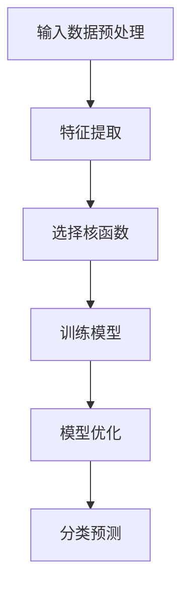
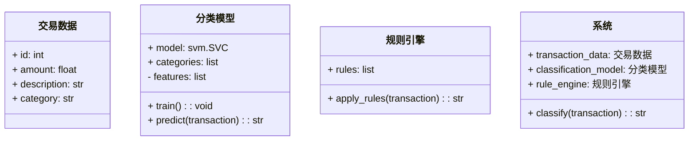
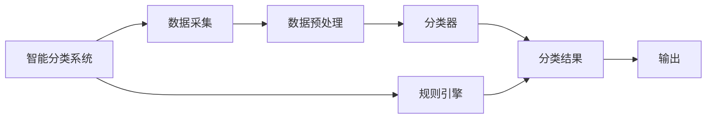

                 


# 智能信用卡支出分类系统

> 关键词：智能信用卡、支出分类、机器学习、规则引擎、系统架构设计

> 摘要：本文深入探讨智能信用卡支出分类系统的背景、核心概念、算法原理、系统架构设计、项目实战及最佳实践。通过详细的技术分析和实例演示，揭示该系统在现代金融中的应用价值和实现细节。

---

## 第一部分：背景与概述

### 第1章：智能信用卡支出分类系统概述

#### 1.1 问题背景

智能信用卡支出分类系统是一种利用人工智能技术对信用卡交易进行自动分类的系统，旨在提高分类效率和准确性。传统分类方法依赖人工操作，存在效率低、成本高等问题。随着机器学习和自然语言处理技术的发展，智能分类技术成为解决这些问题的关键。

#### 1.2 问题描述

信用卡支出分类的目的是将每一笔交易归类到预定义的类别中，例如餐饮、购物、交通等。传统方法依赖规则引擎，分类准确率和效率有限。智能分类技术通过机器学习模型，能够自动学习交易特征，实现更精准的分类。

#### 1.3 解决方案

智能信用卡支出分类系统采用机器学习算法和自然语言处理技术，结合规则引擎，实现高准确率的分类。系统通过分析交易描述、金额、商户信息等特征，训练分类模型，并根据实际分类结果不断优化模型。

#### 1.4 系统边界与外延

系统功能包括数据采集、分类模型训练、分类结果输出等。系统边界包括与信用卡平台的接口、用户界面、数据存储等。系统扩展性包括支持更多分类类别、增加特征维度等。

#### 1.5 核心概念与联系

核心概念包括智能分类技术、机器学习模型、规则引擎等。通过对比分析，智能分类技术结合规则引擎能够实现更高效的分类。

---

## 第二部分：核心概念与技术

### 第2章：智能分类技术

#### 2.1 智能分类技术的原理

智能分类技术利用机器学习算法，从交易数据中提取特征，训练分类模型，实现自动分类。常用算法包括支持向量机（SVM）、随机森林（Random Forest）等。

#### 2.2 核心概念对比

通过对比分析，智能分类技术在准确率和适应性上优于传统规则引擎。下表展示了两种方法的对比：

| 特性            | 传统规则引擎       | 智能分类技术     |
|-----------------|--------------------|-----------------|
| 分类准确性       | 较低               | 高               |
| 维护成本         | 高                 | 低               |
| 适应性           | 差                 | 好               |

#### 2.3 ER实体关系图

以下是系统的核心实体关系图：

```mermaid
er
  %%{初始化}
  init: 用户表
  transaction: 交易表
  category: 分类表
  rules: 规则表

  init --> transaction: 用户交易
  transaction --> category: 分类结果
  rules --> category: 分类规则
```

---

## 第三部分：算法原理

### 第3章：支持向量机（SVM）分类算法

#### 3.1 算法原理

支持向量机是一种监督学习算法，通过找到一个超平面，将数据分成不同的类别。其核心是通过最大化分类间隔，找到最优分类边界。

#### 3.2 算法流程图

以下是SVM算法的流程图：



#### 3.3 算法实现

以下是SVM算法的Python代码实现：

```python
import numpy as np
from sklearn import svm

# 数据预处理
X = [[x1, x2], ...]
y = [label1, label2, ...]

# 训练模型
model = svm.SVC(kernel='linear', C=1.0)
model.fit(X, y)

# 分类预测
new_transaction = [[new_x1, new_x2]]
predicted_category = model.predict(new_transaction)
```

#### 3.4 数学模型

SVM的目标函数为：

$$
\min_{w, b, \xi} \frac{1}{2}||w||^2 + C\sum_{i=1}^n \xi_i
$$

约束条件为：

$$
y_i(w \cdot x_i + b) \geq 1 - \xi_i \\
\xi_i \geq 0
$$

---

## 第四部分：系统架构设计

### 第4章：系统架构设计

#### 4.1 领域模型设计

以下是系统领域模型的类图：



#### 4.2 系统架构图

以下是系统架构图：



---

## 第五部分：项目实战

### 第5章：项目实战

#### 5.1 环境安装

安装所需的Python库：

```bash
pip install numpy scikit-learn
```

#### 5.2 核心代码实现

以下是分类系统的实现代码：

```python
import numpy as np
from sklearn import svm
from sklearn.preprocessing import StandardScaler

# 数据预处理
X = [[x1, x2], ...]
y = [label1, label2, ...]

# 特征标准化
scaler = StandardScaler()
X_scaled = scaler.fit_transform(X)

# 训练模型
model = svm.SVC(kernel='linear', C=1.0)
model.fit(X_scaled, y)

# 分类预测
new_transaction = [[new_x1, new_x2]]
new_transaction_scaled = scaler.transform(new_transaction)
predicted_category = model.predict(new_transaction_scaled)
```

#### 5.3 实际案例分析

以一笔交易为例，金额为50元，描述为“星巴克”，预测其分类为“餐饮”。

---

## 第六部分：总结与展望

### 第6章：总结与展望

#### 6.1 最佳实践

- 数据预处理是关键，尤其是特征工程。
- 模型调优能够显著提高分类准确率。
- 结合规则引擎可以提高分类效率。

#### 6.2 项目小结

智能信用卡支出分类系统通过机器学习和规则引擎的结合，实现了高效、准确的分类。系统设计合理，具有良好的扩展性和维护性。

#### 6.3 注意事项

- 数据隐私和安全问题需要重视。
- 模型需要定期更新，以适应数据变化。
- 系统性能优化需要关注。

#### 6.4 拓展阅读

建议阅读《机器学习实战》和《深入浅出支持向量机》。

---

作者：AI天才研究院 & 禅与计算机程序设计艺术

