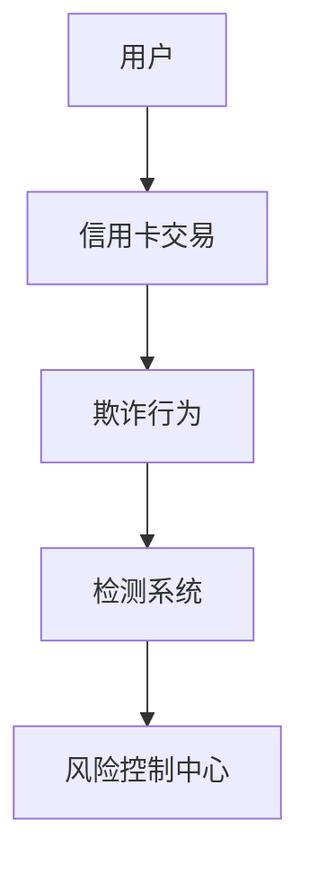
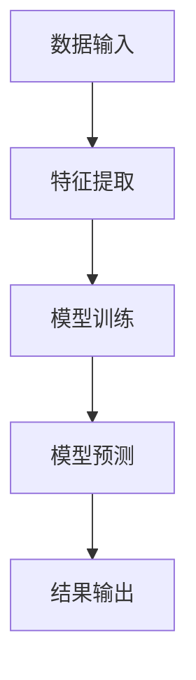
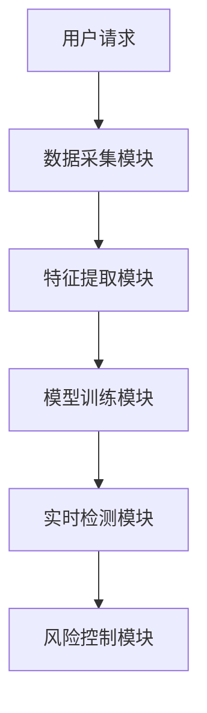
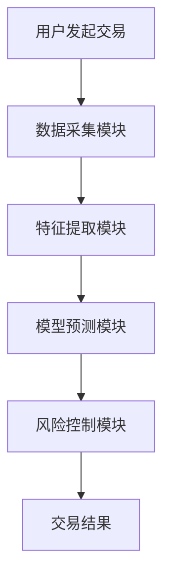

                 


# 《智能信用卡欺诈检测系统》

> **关键词**：信用卡欺诈检测、机器学习、人工智能、深度学习、系统架构设计

> **摘要**：智能信用卡欺诈检测系统是一种基于先进的人工智能和机器学习技术，用于实时检测和预防信用卡欺诈行为的系统。本文将详细介绍该系统的背景、核心原理、算法实现、系统架构设计以及实际项目中的应用案例。通过分析欺诈检测的核心概念、算法流程、系统模块和实际案例，我们将深入理解智能信用卡欺诈检测系统的实现细节和实际应用价值。

---

# 第一章：背景介绍

## 1.1 问题背景

### 1.1.1 信用卡欺诈的现状与挑战

随着信用卡的普及，欺诈行为日益猖獗。传统的欺诈检测方法依赖于规则和经验，但在面对复杂多变的欺诈模式时显得力不从心。智能信用卡欺诈检测系统利用机器学习和深度学习技术，能够实时分析交易数据，有效识别潜在的欺诈行为。

### 1.1.2 传统欺诈检测方法的局限性

传统欺诈检测方法主要依赖于规则和经验，例如基于交易金额、时间、地点的简单规则。然而，这种方法容易被高级欺诈手段绕过，且难以应对复杂的欺诈模式。

### 1.1.3 智能化欺诈检测的需求

随着数据量的激增和欺诈手段的不断进化，传统的检测方法已经无法满足需求。智能信用卡欺诈检测系统通过分析海量数据，利用机器学习和深度学习技术，能够更准确地识别欺诈行为。

## 1.2 问题描述

### 1.2.1 信用卡欺诈的定义与分类

信用卡欺诈是指未经授权的个人或组织利用信用卡进行非法交易的行为。常见的欺诈类型包括盗用身份、虚假交易、薅羊毛等。

### 1.2.2 欺诈交易的特征与模式

欺诈交易通常表现出一些特定的特征，例如短时间内多次小额交易、交易地点异常分散、交易时间集中在非工作时间等。这些特征可以通过数据分析和模式识别来检测。

### 1.2.3 智能检测的核心目标

智能信用卡欺诈检测系统的核心目标是通过实时分析交易数据，识别潜在的欺诈行为，并及时采取措施进行预防和拦截。

## 1.3 问题解决思路

### 1.3.1 数据驱动的欺诈检测方法

通过收集和分析大量的交易数据，利用数据挖掘和机器学习技术，提取欺诈交易的特征，构建分类模型。

### 1.3.2 机器学习与深度学习的应用

利用监督学习、无监督学习和深度学习等技术，构建高效的欺诈检测模型。

### 1.3.3 多维度特征分析与实时检测

从交易金额、时间、地点、用户行为等多个维度提取特征，结合实时数据分析，提高欺诈检测的准确率。

## 1.4 系统边界与外延

### 1.4.1 系统的功能边界

智能信用卡欺诈检测系统的主要功能包括数据采集、特征提取、模型训练、实时检测和结果输出。

### 1.4.2 与相关系统的交互

系统需要与信用卡发行机构、交易系统、风险控制系统等进行交互，确保数据的实时性和准确性。

### 1.4.3 检测范围与精度的平衡

在检测范围和精度之间找到平衡点，既要覆盖所有可能的欺诈行为，又要避免误报和漏报。

## 1.5 核心概念与组成

### 1.5.1 数据源与特征提取

数据源包括交易记录、用户行为数据、地理位置信息等。特征提取是将这些数据转化为能够反映欺诈行为的特征向量。

### 1.5.2 模型训练与部署

通过机器学习算法训练欺诈检测模型，并将其部署到实时检测系统中。

### 1.5.3 系统监控与反馈

通过监控系统的运行状态，及时发现和解决问题，并根据反馈不断优化模型。

---

# 第二章：核心概念与联系

## 2.1 欺诈检测的核心原理

### 2.1.1 基于规则的传统检测方法

通过预定义的规则进行欺诈检测，例如设定单笔交易的金额上限。

### 2.1.2 基于机器学习的模式识别

利用监督学习算法，如随机森林、支持向量机等，训练分类模型进行欺诈检测。

### 2.1.3 深度学习在复杂特征提取中的应用

利用深度学习模型，如卷积神经网络和循环神经网络，提取复杂的特征进行欺诈检测。

## 2.2 核心概念对比分析

### 2.2.1 传统方法与现代AI方法的对比

| 对比维度 | 传统方法 | 现代AI方法 |
|----------|----------|------------|
| 检测精度 | 较低 | 较高 |
| 模型更新 | 手动调整 | 自动优化 |
| 处理复杂性 | 简单 | 复杂 |

### 2.2.2 各种算法的优缺点分析

| 算法名称 | 优点 | 缺点 |
|----------|------|------|
| 支持向量机 | 高精度 | 不适合高维数据 |
| 随机森林 | 鲁棒性强 | 计算资源消耗大 |
| 神经网络 | 特征提取能力强 | 需要大量数据 |

### 2.2.3 系统性能与检测准确率的关系

系统性能的提升可以提高检测准确率，但需要在计算资源和时间复杂度之间进行权衡。

## 2.3 实体关系与架构图



---

# 第三章：算法原理讲解

## 3.1 算法流程图



## 3.2 算法实现代码

### 3.2.1 数据预处理

```python
import pandas as pd

data = pd.read_csv('transaction_data.csv')
data = data.dropna()
```

### 3.2.2 特征提取

```python
from sklearn.preprocessing import StandardScaler

scaler = StandardScaler()
X_scaled = scaler.fit_transform(data.drop('label', axis=1))
```

### 3.2.3 模型训练

```python
from sklearn.ensemble import RandomForestClassifier

model = RandomForestClassifier(n_estimators=100)
model.fit(X_scaled, data['label'])
```

### 3.2.4 模型预测

```python
import joblib

# 保存模型
joblib.dump(model, 'fraud_detection.pkl')

# 加载模型
model = joblib.load('fraud_detection.pkl')

# 预测
predictions = model.predict(X_test_scaled)
```

## 3.3 算法数学模型

### 3.3.1 随机森林分类器

随机森林是一种基于决策树的集成学习方法，通过组合多个决策树的预测结果，提高分类的准确率。

$$ P(y|x) = \sum_{i=1}^{n} w_i \cdot I(f_i(x) = y) $$

其中，$w_i$ 是决策树的重要性权重，$f_i(x)$ 是第 $i$ 棵树的预测结果。

### 3.3.2 支持向量机

支持向量机通过在特征空间中找到一个超平面，将数据点分为两类。

$$ \text{最大化} \quad \frac{1}{2} \|\mathbf{w}\|^2 $$
$$ \text{约束} \quad y_i (\mathbf{w} \cdot \mathbf{x}_i + b) \geq 1, \quad i = 1, \dots, n $$

---

# 第四章：系统分析与架构设计方案

## 4.1 问题场景介绍

智能信用卡欺诈检测系统的应用场景包括实时交易监控、批量数据分析和风险控制。

## 4.2 系统功能设计

### 4.2.1 数据采集模块

负责收集交易数据，包括交易金额、时间、地点、用户信息等。

### 4.2.2 特征提取模块

将原始数据转化为特征向量，用于模型训练和预测。

### 4.2.3 模型训练模块

利用机器学习算法训练欺诈检测模型，并保存模型参数。

### 4.2.4 实时检测模块

将实时交易数据输入模型，进行欺诈检测并输出结果。

### 4.2.5 风险控制模块

根据检测结果，采取相应的风险控制措施，如拦截交易、通知用户等。

## 4.3 系统架构设计

### 4.3.1 分层架构图



### 4.3.2 接口设计

系统需要提供以下接口：

1. 数据接口：用于数据采集模块与交易系统的交互。
2. 模型接口：用于模型训练模块与实时检测模块的交互。
3. 风险控制接口：用于风险控制模块与用户或其他系统的交互。

## 4.4 系统交互流程图



---

# 第五章：项目实战

## 5.1 环境安装

### 5.1.1 安装Python

```bash
python --version
```

### 5.1.2 安装机器学习库

```bash
pip install scikit-learn joblib
```

## 5.2 核心代码实现

### 5.2.1 数据预处理

```python
import pandas as pd

data = pd.read_csv('transaction_data.csv')
data = data.dropna()
```

### 5.2.2 特征提取与模型训练

```python
from sklearn.preprocessing import StandardScaler
from sklearn.ensemble import RandomForestClassifier

X = data.drop('label', axis=1)
y = data['label']

scaler = StandardScaler()
X_scaled = scaler.fit_transform(X)

model = RandomForestClassifier(n_estimators=100)
model.fit(X_scaled, y)
```

### 5.2.3 模型预测与结果输出

```python
import joblib

# 保存模型
joblib.dump(model, 'fraud_detection.pkl')

# 加载模型
model = joblib.load('fraud_detection.pkl')

# 预测
predictions = model.predict(X_test_scaled)
```

## 5.3 实际案例分析

### 5.3.1 数据分析

分析真实数据集中的欺诈交易特征，例如交易金额、时间、地点等。

### 5.3.2 模型优化

根据实际数据对模型进行调优，例如调整随机森林的参数，优化模型的准确率和召回率。

### 5.3.3 系统部署

将模型部署到生产环境，实现实时欺诈检测。

## 5.4 项目小结

通过本项目，我们了解了智能信用卡欺诈检测系统的实现流程，从数据预处理到模型训练，再到系统部署，掌握了机器学习技术在实际应用中的具体操作。

---

# 第六章：最佳实践

## 6.1 最佳实践 Tips

1. 数据预处理是关键，确保数据的完整性和准确性。
2. 特征提取要结合业务背景，选择有意义的特征。
3. 模型调优要根据实际数据进行，避免过拟合和欠拟合。
4. 系统部署要考虑实时性和可扩展性。

## 6.2 小结

智能信用卡欺诈检测系统通过机器学习和深度学习技术，能够高效地检测和预防欺诈行为，为金融机构和用户提供更高的安全保障。

## 6.3 注意事项

1. 确保系统的实时性和稳定性。
2. 定期更新模型，应对新的欺诈手段。
3. 保护用户隐私，遵守相关法律法规。

## 6.4 拓展阅读

1. 《机器学习实战》
2. 《深度学习》
3. 《Python机器学习》

---

**作者：AI天才研究院/AI Genius Institute & 禅与计算机程序设计艺术 /Zen And The Art of Computer Programming**

