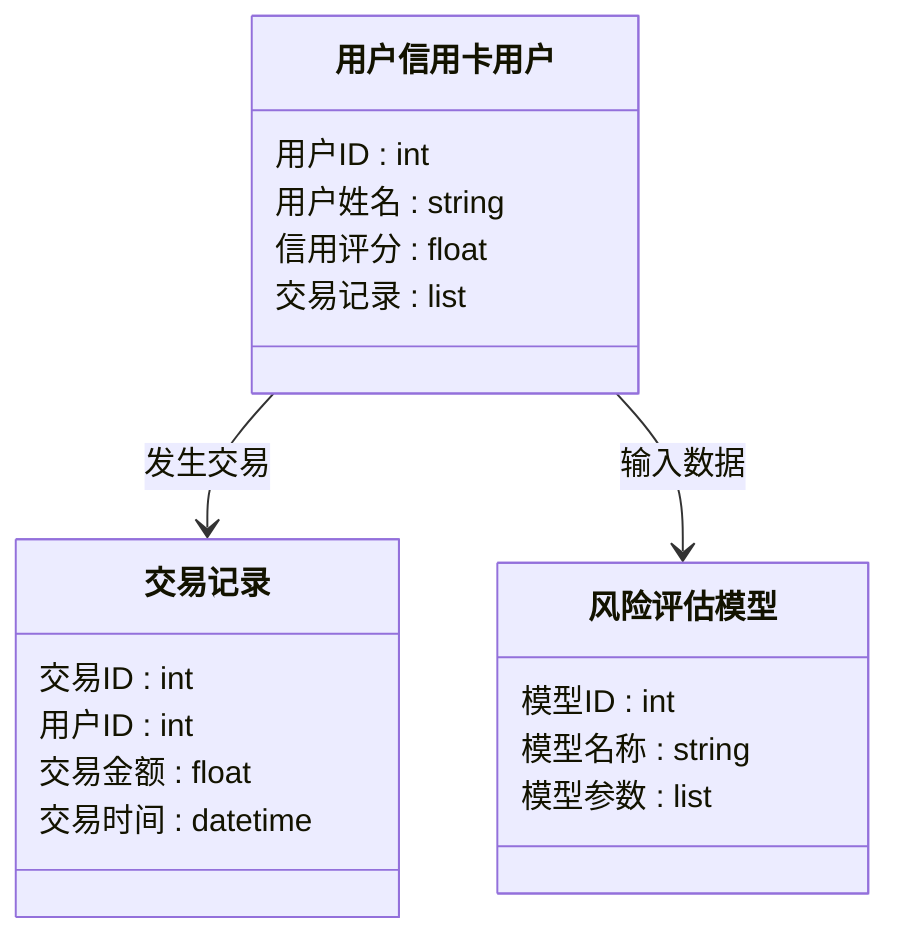
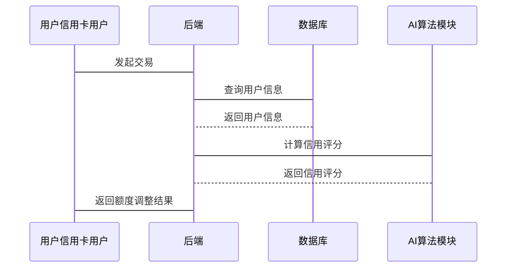

                 


# 智能信用卡额度优化管理系统

## 关键词：智能信用卡、额度优化、风险管理、机器学习、系统架构

## 摘要：智能信用卡额度优化管理系统是一种结合人工智能和金融系统的创新解决方案，旨在通过智能算法和数据分析优化信用卡额度管理，降低风险，提高用户体验。本文详细探讨了系统的背景、核心概念、算法原理、系统架构及项目实现，为读者提供全面的技术解读。

---

# 第1章: 智能信用卡额度优化管理系统的背景介绍

## 1.1 信用卡额度管理的重要性

### 1.1.1 信用卡额度管理的现状

信用卡额度管理是金融机构日常运营中的重要环节。传统的额度管理依赖于人工审核和简单的规则引擎，存在效率低、精度差、难以实时调整等问题。

### 1.1.2 传统信用卡额度管理的局限性

1. **人工审核效率低**：传统额度管理需要大量人工干预，审核周期长，难以满足用户需求。
2. **规则引擎简单**：基于简单的信用评分和历史交易数据分析，无法捕捉复杂的风险因素。
3. **缺乏实时性**：额度调整通常基于滞后数据，无法实时反映用户的信用状况变化。

### 1.1.3 智能化额度管理的必要性

随着人工智能和大数据技术的发展，智能化额度管理成为提升信用卡业务竞争力的关键。通过实时数据分析和智能算法，金融机构可以更精准地评估用户信用风险，动态调整额度，提升用户体验。

## 1.2 智能信用卡额度优化管理系统的定义与目标

### 1.2.1 系统的定义

智能信用卡额度优化管理系统是一种基于人工智能技术的金融系统，通过实时数据分析、机器学习算法和自动化决策引擎，实现信用卡额度的智能化优化管理。

### 1.2.2 系统的目标

1. **提升额度管理效率**：通过自动化流程减少人工干预，提高额度调整的效率。
2. **降低信用风险**：利用智能算法精准评估用户信用风险，降低不良率。
3. **优化用户体验**：根据用户的信用状况和消费行为动态调整额度，提升用户满意度。

### 1.2.3 系统的核心功能

1. 用户画像构建
2. 风险评估与预测
3. 额度动态调整
4. 实时监控与预警

## 1.3 系统的背景与应用场景

### 1.3.1 信用卡行业的发展趋势

随着金融科技的快速发展，信用卡行业正向智能化、数字化方向转型，智能化额度管理成为行业趋势。

### 1.3.2 智能化在金融领域的应用

人工智能技术在金融领域的应用日益广泛，包括智能投顾、风险管理、信用评估等场景。

### 1.3.3 系统的实际应用场景

1. **实时额度调整**：根据用户的交易行为和信用状况实时调整额度。
2. **风险预警**：通过智能算法预测潜在风险，提前采取措施。
3. **用户行为分析**：通过数据分析用户行为，优化服务策略。

## 1.4 本章小结

本章介绍了智能信用卡额度优化管理系统的背景，强调了智能化额度管理的必要性，并详细阐述了系统的定义、目标和核心功能。通过实际应用场景的分析，读者可以更好地理解该系统的价值和意义。

---

# 第2章: 智能信用卡额度优化管理系统的核心概念与联系

## 2.1 核心概念原理

### 2.1.1 用户画像与信用评估

用户画像是基于用户行为数据和交易数据构建的用户特征描述。通过分析用户的消费习惯、信用记录、收入水平等信息，构建精准的用户画像，为信用评估提供基础数据支持。

### 2.1.2 风险评估模型

风险评估模型是基于机器学习算法构建的，用于预测用户违约风险的模型。常用的模型包括逻辑回归、决策树、随机森林等。

### 2.1.3 额度计算公式

额度计算公式是根据用户的信用评分、收入水平、消费习惯等因素，通过数学模型计算得出的信用卡额度。

## 2.2 核心概念属性特征对比表

| 核心概念 | 属性 | 特征 |
|----------|------|------|
| 用户画像 | 数据来源 | 信用卡交易数据、用户行为数据 |
|          | 数据处理 | 数据清洗、特征提取 |
| 风险评估模型 | 模型类型 | 逻辑回归、决策树、神经网络 |
| 额度计算公式 | 公式类型 | 线性回归、非线性回归 |

## 2.3 ER实体关系图

```mermaid
erDiagram
    user信用卡用户 {
        用户ID : int
        用户姓名 : string
        信用评分 : float
        交易记录 : list
    }
    交易记录 {
        交易ID : int
        用户ID : int
        交易金额 : float
        交易时间 : datetime
    }
    风险评估模型 {
        模型ID : int
        模型名称 : string
        模型参数 : list
    }
    用户信用卡用户 --> 交易记录 : 发生交易
    用户信用卡用户 --> 风险评估模型 : 输入数据
```

## 2.4 本章小结

本章详细阐述了智能信用卡额度优化管理系统的核心概念，包括用户画像、风险评估模型和额度计算公式，并通过对比表和实体关系图展示了这些概念之间的联系。读者可以通过本章理解系统的核心逻辑和数据流。

---

# 第3章: 智能信用卡额度优化管理系统的算法原理讲解

## 3.1 算法原理概述

### 3.1.1 算法选择与优化

选择合适的算法是系统设计的关键。常用的算法包括逻辑回归、随机森林、梯度提升树等。通过对比不同算法的性能和适用场景，选择最适合的算法。

### 3.1.2 算法的数学模型

以逻辑回归为例，其数学模型如下：

$$ P(y=1) = \frac{e^{\beta_0 + \beta_1x_1 + \cdots + \beta_nx_n}}{1 + e^{\beta_0 + \beta_1x_1 + \cdots + \beta_nx_n}} $$

其中，$x_i$ 是特征变量，$\beta_i$ 是模型参数。

### 3.1.3 算法的实现步骤

1. 数据预处理：清洗数据，提取特征。
2. 模型训练：使用训练数据训练模型。
3. 模型评估：通过测试数据评估模型性能。
4. 模型部署：将模型部署到生产环境，实时预测。

## 3.2 算法实现细节

### 3.2.1 数据预处理

数据预处理是模型训练的基础。常见的数据预处理步骤包括：

1. 数据清洗：处理缺失值、异常值。
2. 特征提取：从原始数据中提取有用的特征。
3. 数据标准化：对数据进行标准化或归一化处理。

### 3.2.2 模型训练

以逻辑回归为例，模型训练的步骤如下：

1. 初始化参数 $\beta_0, \beta_1, \cdots, \beta_n$。
2. 计算损失函数：$$ L = -\frac{1}{m}\sum_{i=1}^{m} [y_i\log(p_i) + (1-y_i)\log(1-p_i)] $$
3. 梯度下降：更新参数，最小化损失函数。

### 3.2.3 模型评估

模型评估是衡量模型性能的重要步骤。常用的评估指标包括准确率、召回率、F1分数等。

## 3.3 本章小结

本章详细讲解了智能信用卡额度优化管理系统中使用的算法原理，包括算法选择、数学模型和实现步骤。通过逻辑回归的实例分析，读者可以理解算法的核心思想和实现细节。

---

# 第4章: 智能信用卡额度优化管理系统的系统分析与架构设计方案

## 4.1 系统分析

### 4.1.1 问题场景介绍

系统需要解决的问题包括：实时额度调整、风险预警、用户行为分析等。

### 4.1.2 项目介绍

智能信用卡额度优化管理系统是一个基于人工智能的金融系统，旨在通过智能算法优化信用卡额度管理。

## 4.2 系统功能设计

### 4.2.1 领域模型类图



### 4.2.2 系统架构设计


### 4.2.3 系统接口设计

系统接口设计包括API接口定义、数据格式等。

### 4.2.4 系统交互序列图



## 4.3 本章小结

本章详细分析了智能信用卡额度优化管理系统的架构设计，包括领域模型类图、系统架构图和交互序列图。通过这些设计，读者可以理解系统的整体结构和各模块之间的关系。

---

# 第5章: 智能信用卡额度优化管理系统的项目实战

## 5.1 环境安装

### 5.1.1 安装Python环境

使用Anaconda或虚拟环境安装Python 3.8及以上版本。

### 5.1.2 安装相关库

安装numpy、pandas、scikit-learn等库。

## 5.2 系统核心实现源代码

### 5.2.1 数据预处理代码

```python
import pandas as pd
from sklearn.preprocessing import StandardScaler

# 加载数据
data = pd.read_csv('credit_card_data.csv')

# 删除缺失值
data = data.dropna()

# 提取特征
X = data[['income', 'transaction_amount', 'credit_score']]
y = data['default']

# 标准化数据
scaler = StandardScaler()
X_scaled = scaler.fit_transform(X)
```

### 5.2.2 模型训练代码

```python
from sklearn.linear_model import LogisticRegression

# 初始化模型
model = LogisticRegression()

# 训练模型
model.fit(X_scaled, y)

# 预测结果
y_pred = model.predict(X_scaled)
```

### 5.2.3 模型评估代码

```python
from sklearn.metrics import accuracy_score, recall_score, f1_score

# 计算准确率
accuracy = accuracy_score(y, y_pred)
# 计算召回率
recall = recall_score(y, y_pred)
# 计算F1分数
f1 = f1_score(y, y_pred)

print(f"Accuracy: {accuracy}")
print(f"Recall: {recall}")
print(f"F1 Score: {f1}")
```

## 5.3 代码应用解读与分析

### 5.3.1 数据预处理

数据预处理是模型训练的基础，包括数据清洗和特征提取。

### 5.3.2 模型训练

使用逻辑回归模型进行训练，通过梯度下降优化模型参数。

### 5.3.3 模型评估

通过准确率、召回率和F1分数评估模型性能。

## 5.4 实际案例分析

### 5.4.1 案例背景

分析一个用户的交易记录和信用评分，预测其违约风险。

### 5.4.2 案例分析

1. 数据提取：提取用户的收入、交易金额和信用评分。
2. 数据标准化：对特征进行标准化处理。
3. 模型预测：使用训练好的模型预测用户违约概率。
4. 结果解读：根据预测结果调整信用卡额度。

## 5.5 本章小结

本章通过实际案例分析，展示了智能信用卡额度优化管理系统的实现过程，包括数据预处理、模型训练和模型评估。通过代码实现，读者可以更好地理解系统的具体操作。

---

# 第6章: 总结与展望

## 6.1 系统的应用价值

智能信用卡额度优化管理系统通过智能化的额度管理，提升了金融机构的风险控制能力，优化了用户体验。

## 6.2 未来的发展方向

1. **模型优化**：进一步优化算法，提高模型的准确性和实时性。
2. **数据隐私保护**：加强数据隐私保护，确保用户信息的安全。
3. **多场景应用**：拓展系统的应用场景，实现更多功能。

## 6.3 小结

智能信用卡额度优化管理系统是一种基于人工智能的创新解决方案，通过智能化的额度管理，提升了金融机构的风险控制能力，优化了用户体验。未来，随着技术的不断发展，系统将具备更大的潜力和更广阔的应用前景。

---

# 作者

作者：AI天才研究院/AI Genius Institute & 禅与计算机程序设计艺术 /Zen And The Art of Computer Programming

---

通过本文，读者可以全面了解智能信用卡额度优化管理系统的背景、核心概念、算法原理、系统架构及项目实现。希望本文能为读者提供有价值的技术见解和实践指导。

