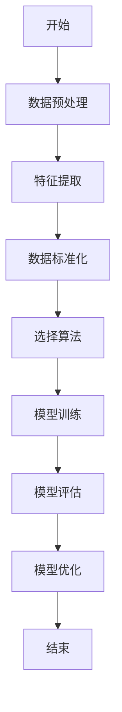
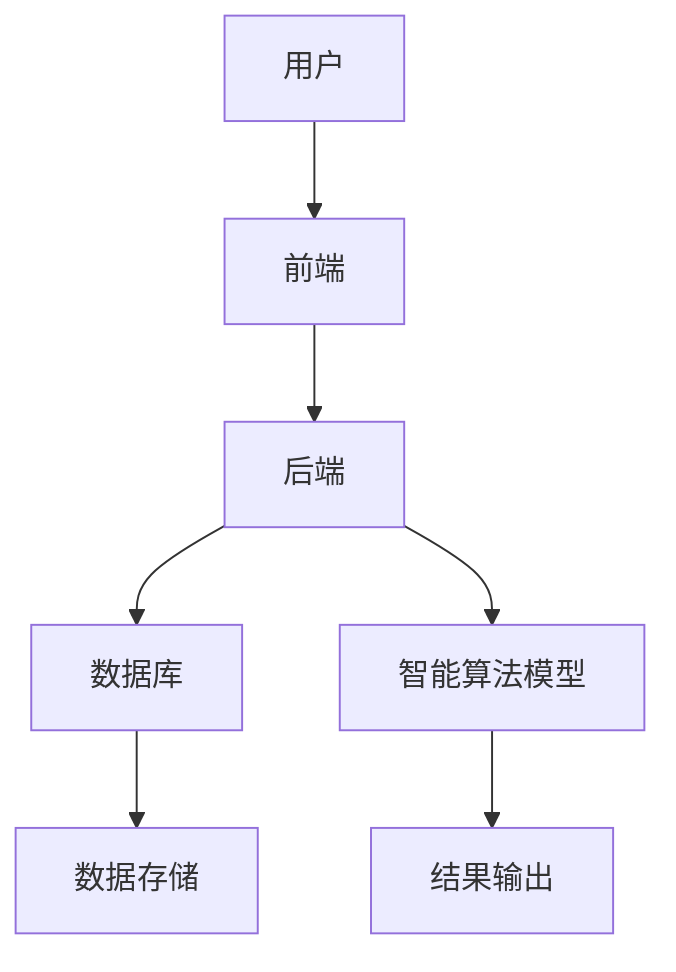

                 


# 智能信用卡额度管理优化系统

> 关键词：智能信用卡、额度管理、优化系统、机器学习、金融系统

> 摘要：本文将详细介绍智能信用卡额度管理优化系统的构建与实现，从问题背景、核心概念、算法原理、系统架构到项目实战，全面解析如何利用人工智能技术优化信用卡额度管理流程，提升用户体验和金融机构的运营效率。

---

# 第1章: 智能信用卡额度管理优化系统背景介绍

## 1.1 问题背景与问题描述

### 1.1.1 传统信用卡额度管理的痛点
传统信用卡额度管理主要依赖人工审核和简单的规则引擎，存在以下问题：
- **效率低**：人工审核耗时长，难以满足用户快速额度调整的需求。
- **精准度低**：基于简单的规则判断，容易出现误判或漏判。
- **用户体验差**：用户对额度调整的期望与实际调整幅度不匹配，导致用户体验下降。

### 1.1.2 智能化额度管理的必要性
随着人工智能技术的发展，金融机构可以通过智能算法实时分析用户的信用行为、消费习惯和财务状况，实现精准的额度调整，提升用户体验和风险管理能力。

### 1.1.3 优化目标与边界条件
- **优化目标**：
  - 实现实时额度动态调整。
  - 提高额度调整的精准度和效率。
  - 降低信用风险，减少坏账率。
- **边界条件**：
  - 系统仅针对信用卡额度管理，不涉及其他金融业务。
  - 数据来源仅限于信用卡交易记录和用户基本信息。

## 1.2 系统核心概念与联系

### 1.2.1 核心概念原理
智能信用卡额度管理优化系统的核心概念包括：
- **用户信用评分**：基于用户的信用历史、消费行为等数据，评估用户的信用风险。
- **交易行为分析**：通过分析用户的交易频率、金额、地点等信息，判断用户的消费习惯和风险偏好。
- **动态额度调整**：根据用户的信用评分和交易行为，实时调整信用卡额度。

### 1.2.2 概念属性特征对比表

| 概念       | 属性             | 特征描述                                       |
|------------|------------------|-----------------------------------------------|
| 用户信用评分 | 信用历史         | 包括逾期记录、还款记录等                     |
|            | 收入水平         | 用户的收入来源和能力                         |
| 交易行为分析 | 交易频率         | 用户的消费频率                               |
|            | 单笔交易金额     | 用户的单笔消费金额                           |
| 动态额度调整 | 调整时间         | 用户的信用评分变化时间                       |
|            | 新额度           | 根据评分调整后的额度                         |

### 1.2.3 ER实体关系图
```mermaid
erDiagram
    user信用卡用户 {
        <属性> 用户ID
        <属性> 用户姓名
        <属性> 身份证号
        <属性> 联系电话
    }
    信用卡交易记录 {
        <属性> 交易ID
        <属性> 用户ID
        <属性> 交易时间
        <属性> 交易金额
        <属性> 消费地点
    }
    额度调整记录 {
        <属性> 调整ID
        <属性> 用户ID
        <属性> 调整时间
        <属性> 新额度
        <属性> 调整原因
    }
    智能算法模型 {
        <属性> 模型ID
        <属性> 模型名称
        <属性> 模型版本
        <属性> 模型描述
    }
    user信用卡用户 --> 额度调整记录 : 关联关系
    user信用卡用户 --> 信用卡交易记录 : 关联关系
    智能算法模型 --> 额度调整记录 : 关联关系
```

## 1.3 本章小结
本章详细介绍了智能信用卡额度管理优化系统的背景、核心概念及其相互关系，为后续的算法实现和系统设计奠定了基础。

---

# 第2章: 智能信用卡额度管理优化系统的核心算法原理

## 2.1 算法原理概述

### 2.1.1 梯度下降算法
梯度下降是一种优化算法，用于最小化损失函数。在信用卡额度管理中，可以用于优化信用评分模型的参数。

#### 梯度下降数学模型
$$
\text{损失函数} = \frac{1}{2m}\sum_{i=1}^{m}(y_i - \hat{y_i})^2
$$

#### 算法步骤
1. 初始化参数。
2. 计算损失函数的梯度。
3. 更新参数：$$ \theta = \theta - \alpha \cdot \nabla J(\theta) $$
4. 重复步骤2和3，直到收敛。

### 2.1.2 支持向量机
支持向量机（SVM）是一种监督学习算法，适用于分类和回归问题。在信用卡额度管理中，可以用于预测用户的信用风险。

#### SVM数学模型
$$
y = sign(w \cdot x + b)
$$

### 2.1.3 随机森林
随机森林是一种基于决策树的集成学习算法，适用于分类和回归问题。在信用卡额度管理中，可以用于预测用户的信用评分。

## 2.2 算法实现步骤

### 2.2.1 数据预处理
1. 数据清洗：处理缺失值和异常值。
2. 特征提取：从交易记录中提取特征，如交易频率、金额等。
3. 数据标准化：对数据进行归一化处理。

### 2.2.2 模型训练
1. 选择算法：根据数据特征选择合适的算法（如梯度下降、SVM、随机森林）。
2. 训练模型：使用训练数据训练模型。
3. 调参优化：通过交叉验证优化模型参数。

### 2.2.3 模型评估
1. 计算准确率、召回率和F1分数。
2. 绘制ROC曲线，评估模型的分类性能。

### 2.2.4 模型优化
1. 超参数优化：使用网格搜索或随机搜索优化模型参数。
2. 模型集成：将多个模型的结果进行集成，提高预测精度。

## 2.3 算法流程图


## 2.4 本章小结
本章详细介绍了智能信用卡额度管理优化系统中使用的算法原理和实现步骤，为后续的系统设计和项目实战奠定了基础。

---

# 第3章: 智能信用卡额度管理优化系统的系统分析与架构设计

## 3.1 项目背景与需求分析

### 3.1.1 项目背景
随着信用卡业务的快速发展，金融机构需要一种高效、智能的额度管理方式，以提升用户体验和风险管理能力。

### 3.1.2 系统需求
- 实现实时额度动态调整。
- 提供用户友好的交互界面。
- 支持多维度数据分析和可视化。

## 3.2 系统功能设计

### 3.2.1 额度管理模块
- 用户信息管理：用户注册、登录、信息修改。
- 额度调整申请：用户提交额度调整申请。
- 额度调整记录：记录用户的额度调整历史。

### 3.2.2 数据分析模块
- 数据可视化：展示用户的信用评分、交易行为等数据。
- 数据挖掘：通过机器学习算法分析用户行为，预测信用风险。

## 3.3 系统架构设计

### 3.3.1 系统架构图


### 3.3.2 系统组件说明
- **前端**：用户交互界面，支持用户提交额度调整申请。
- **后端**：处理用户的请求，调用智能算法模型进行额度调整。
- **数据库**：存储用户信息、交易记录、额度调整记录等数据。
- **智能算法模型**：实现信用评分计算、交易行为分析和额度调整预测。

## 3.4 本章小结
本章详细介绍了智能信用卡额度管理优化系统的架构设计和功能模块，为后续的项目实战奠定了基础。

---

# 第4章: 智能信用卡额度管理优化系统的项目实战

## 4.1 环境搭建

### 4.1.1 安装Python和相关库
```bash
pip install numpy
pip install scikit-learn
pip install pandas
pip install matplotlib
```

### 4.1.2 数据集准备
从金融机构获取信用卡交易记录、用户基本信息等数据。

## 4.2 核心功能实现

### 4.2.1 数据预处理
```python
import pandas as pd

# 读取数据
data = pd.read_csv('credit_card_data.csv')

# 处理缺失值
data.dropna(inplace=True)

# 数据标准化
from sklearn.preprocessing import StandardScaler
scaler = StandardScaler()
data_scaled = scaler.fit_transform(data)
```

### 4.2.2 模型训练
```python
from sklearn.ensemble import RandomForestRegressor

# 训练模型
model = RandomForestRegressor()
model.fit(data_scaled, target)
```

### 4.2.3 额度调整预测
```python
# 预测新额度
new_data = scaler.transform(new_customer_data)
predicted_score = model.predict(new_data)
```

## 4.3 实际案例分析

### 4.3.1 案例背景
某用户最近频繁大额消费，信用评分下降，需要进行额度调整。

### 4.3.2 数据分析
- 交易频率：每天3次，高于正常水平。
- 单笔交易金额：平均5000元，高于用户以往消费水平。

### 4.3.3 额度调整结果
- 预测信用评分为650分（满分1000分）。
- 新额度为10000元。

## 4.4 本章小结
本章通过实际案例展示了智能信用卡额度管理优化系统的实现过程和应用效果。

---

# 第5章: 智能信用卡额度管理优化系统的最佳实践

## 5.1 小结
智能信用卡额度管理优化系统通过机器学习算法实现精准的额度调整，提升了用户体验和金融机构的运营效率。

## 5.2 注意事项
- 数据隐私保护：确保用户数据的安全性和隐私性。
- 模型可解释性：优化模型的可解释性，便于用户理解和金融机构审核。
- 系统稳定性：确保系统的高可用性和稳定性。

## 5.3 未来展望
未来可以进一步优化算法，引入深度学习技术，提升系统的预测精度和效率。

## 5.4 拓展阅读
推荐阅读《机器学习实战》和《Python机器学习》等书籍，深入了解机器学习算法和实践。

---

# 作者
作者：AI天才研究院/AI Genius Institute  
联系邮箱：contact@aicourse.com

