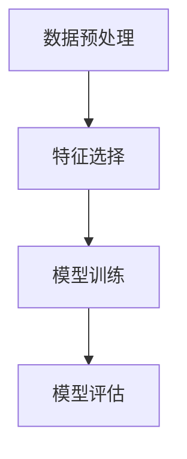
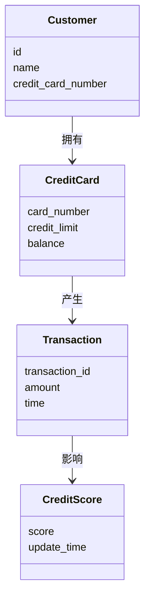
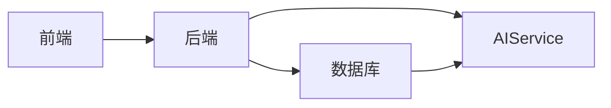
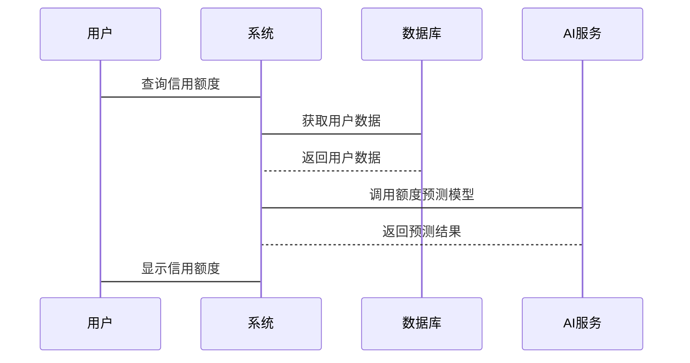

                 


# 智能信用卡额度管理系统

> 关键词：智能信用卡、额度管理、机器学习、大数据分析、风险管理

> 摘要：本文探讨智能信用卡额度管理系统的构建与应用，从背景、核心概念、算法原理到系统架构和项目实战，详细解析如何利用人工智能技术优化信用卡额度管理，提升用户体验和风险控制能力。

---

# 第一部分: 智能信用卡额度管理系统的背景与核心概念

## 第1章: 智能信用卡额度管理系统的背景介绍

### 1.1 信用卡额度管理的背景与现状

#### 1.1.1 传统信用卡额度管理的痛点
传统信用卡额度管理依赖人工审核，存在效率低、主观性强、难以实时调整等问题。银行通常每季度或半年调整一次额度，导致用户额度无法及时反映其信用状况变化，影响用户体验。

#### 1.1.2 智能化额度管理的必要性
随着大数据和人工智能技术的发展，智能信用卡额度管理成为可能。通过实时数据分析和机器学习模型，银行可以实现动态、精准的额度调整，提升用户体验和风险控制能力。

#### 1.1.3 智能信用卡额度管理系统的边界与外延
智能信用卡额度管理系统的核心功能包括数据采集、特征工程、模型训练、额度预测和调整优化。系统边界包括前端用户交互、后端数据处理和AI服务接口。外延则涉及与第三方数据源（如信用评分机构）的集成。

#### 1.1.4 系统的核心要素组成
智能信用卡额度管理系统由以下几个核心要素组成：
1. **用户数据**：包括消费记录、信用报告、收入信息等。
2. **机器学习模型**：用于预测用户的信用额度。
3. **规则引擎**：根据模型预测结果和业务规则调整额度。
4. **实时数据流处理**：支持实时数据的采集和处理。

---

## 第2章: 智能信用卡额度管理的核心概念与联系

### 2.1 核心概念原理

#### 2.1.1 数据采集与特征工程
数据采集是智能信用卡额度管理的第一步，主要包括以下几种数据源：
- **交易数据**：用户的消费记录，包括时间、金额、商家类型等。
- **信用报告**：用户的信用评分、历史违约记录等。
- **用户行为数据**：用户的登录行为、浏览记录等。

特征工程是对数据进行处理，提取对额度预测有影响的关键特征。例如：
- **消费频率**：用户在一定时间内的消费次数。
- **平均消费金额**：用户的平均消费金额。
- **信用评分**：用户的信用评分。

#### 2.1.2 模型训练与预测
通过机器学习模型对用户的信用额度进行预测。常用算法包括线性回归、随机森林、梯度提升树等。

#### 2.1.3 额度调整与优化
根据模型预测结果和业务规则，动态调整用户的信用额度。例如：
- 根据用户的信用评分和消费行为，实时调整额度。
- 设置额度调整的上下限，避免过度授信。

### 2.2 核心概念属性特征对比表格

| 特征 | 描述 |
|------|------|
| 数据来源 | 用户消费记录、信用报告等 |
| 数据类型 | 结构化数据、非结构化数据 |
| 数据特征 | 时间序列特征、用户行为特征等 |

### 2.3 ER实体关系图

```mermaid
er
    Customer (客户)
    CreditCard (信用卡)
    Transaction (交易记录)
    CreditScore (信用评分)
    model
        Customer --|> CreditCard: 拥有
        CreditCard --|> Transaction: 产生
        Transaction --> CreditScore: 影响
```

---

# 第二部分: 智能信用卡额度管理系统的算法原理

## 第3章: 基于机器学习的额度预测算法

### 3.1 算法原理

#### 3.1.1 数据预处理
数据预处理是机器学习模型训练的重要步骤，主要包括：
- **数据清洗**：处理缺失值、重复值和异常值。
- **数据标准化**：对特征进行标准化或归一化处理。
- **数据分割**：将数据集分为训练集、验证集和测试集。

#### 3.1.2 特征选择
特征选择是通过选择对目标变量影响较大的特征，提高模型的准确性和训练效率。常用方法包括：
- **单变量分析**：通过卡方检验或皮尔逊相关系数，选择与目标变量相关性较高的特征。
- **Lasso回归**：通过L1正则化，自动选择重要特征。

#### 3.1.3 模型训练与优化
模型训练是通过机器学习算法对特征进行训练，得到一个能够预测信用额度的模型。常用算法包括：
- **线性回归**：适用于线性关系较强的场景。
- **随机森林**：适用于特征较多、关系复杂的场景。
- **梯度提升树**：适用于高精度预测的场景。

#### 3.1.4 模型评估
模型评估是通过测试集对模型的性能进行评估，常用指标包括：
- **均方误差（MSE）**：衡量预测值与真实值的差异。
- **平均绝对误差（MAE）**：衡量预测值与真实值的绝对差异。
- **R平方值（R²）**：衡量模型的拟合优度。

### 3.2 算法流程图



### 3.3 算法实现代码

```python
import pandas as pd
from sklearn.ensemble import RandomForestRegressor
from sklearn.metrics import mean_absolute_error

# 数据加载
data = pd.read_csv('credit_card_data.csv')

# 特征工程
features = ['消费频率', '平均消费金额', '信用评分']
target = '信用额度'

# 数据分割
X = data[features]
y = data[target]

# 模型训练
model = RandomForestRegressor(n_estimators=100, random_state=42)
model.fit(X, y)

# 模型评估
y_pred = model.predict(X)
mae = mean_absolute_error(y, y_pred)
print(f"平均绝对误差: {mae}")
```

### 3.4 数学模型和公式

随机森林的数学模型如下：

$$
\text{预测信用额度} = \sum_{i=1}^{n} \text{特征权重}_i \times \text{特征值}_i
$$

特征权重由随机森林模型计算得出，特征值是用户的具体特征值。

---

# 第三部分: 智能信用卡额度管理系统的系统分析与架构设计

## 第4章: 系统分析与架构设计方案

### 4.1 问题场景介绍

智能信用卡额度管理系统需要解决以下问题：
- 实时监控用户的信用状况。
- 动态调整用户的信用额度。
- 提供个性化的额度调整建议。

### 4.2 项目介绍

本项目旨在构建一个智能信用卡额度管理系统，通过机器学习算法对用户的信用额度进行预测和调整，提升用户体验和风险控制能力。

### 4.3 系统功能设计

#### 4.3.1 领域模型



### 4.4 系统架构设计

#### 4.4.1 系统架构图



#### 4.4.2 系统接口设计

- **用户登录接口**：用户通过用户名和密码登录系统。
- **额度查询接口**：用户可以查询自己的信用额度。
- **额度调整接口**：系统根据模型预测结果调整用户的信用额度。

#### 4.4.3 系统交互流程图



---

# 第四部分: 智能信用卡额度管理系统的项目实战

## 第5章: 项目实战

### 5.1 环境搭建

#### 5.1.1 安装必要的库

```bash
pip install pandas scikit-learn matplotlib
```

### 5.2 系统核心实现

#### 5.2.1 数据预处理

```python
import pandas as pd
from sklearn.impute import SimpleImputer
from sklearn.preprocessing import StandardScaler

# 数据加载
data = pd.read_csv('credit_card_data.csv')

# 处理缺失值
imputer = SimpleImputer(strategy='mean')
data_imputed = imputer.fit_transform(data)

# 标准化处理
scaler = StandardScaler()
data_scaled = scaler.fit_transform(data_imputed)
```

#### 5.2.2 模型训练

```python
from sklearn.ensemble import RandomForestRegressor
from sklearn.metrics import mean_absolute_error

# 数据分割
X = data_scaled[:-100]
y = data['信用额度'][:-100]

# 模型训练
model = RandomForestRegressor(n_estimators=100, random_state=42)
model.fit(X, y)

# 模型评估
y_pred = model.predict(data_scaled[-100:])
mae = mean_absolute_error(y[-100:], y_pred)
print(f"平均绝对误差: {mae}")
```

#### 5.2.3 接口开发

```python
from flask import Flask, request, jsonify

app = Flask(__name__)
model = RandomForestRegressor(n_estimators=100, random_state=42)
model.load_weights('model.pkl')

@app.route('/predict_credit_limit', methods=['POST'])
def predict_credit_limit():
    data = request.json
    features = data['features']
    prediction = model.predict([features])
    return jsonify({'credit_limit': prediction[0].tolist()})

if __name__ == '__main__':
    app.run(debug=True)
```

---

# 第五部分: 智能信用卡额度管理系统的最佳实践

## 第6章: 最佳实践

### 6.1 小结

智能信用卡额度管理系统通过机器学习算法实现了信用额度的动态调整，提升了用户体验和风险控制能力。

### 6.2 注意事项

- 数据隐私和安全保护是系统设计的重要部分。
- 模型的可解释性和透明度是用户信任的重要因素。
- 系统的实时性和稳定性是保证用户体验的关键。

### 6.3 拓展阅读

- 《机器学习实战》
- 《Python机器学习》
- 《大数据分析与挖掘》

---

# 作者

作者：AI天才研究院/AI Genius Institute & 禅与计算机程序设计艺术 /Zen And The Art of Computer Programming

