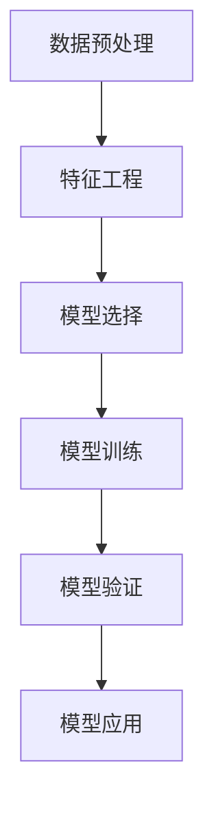
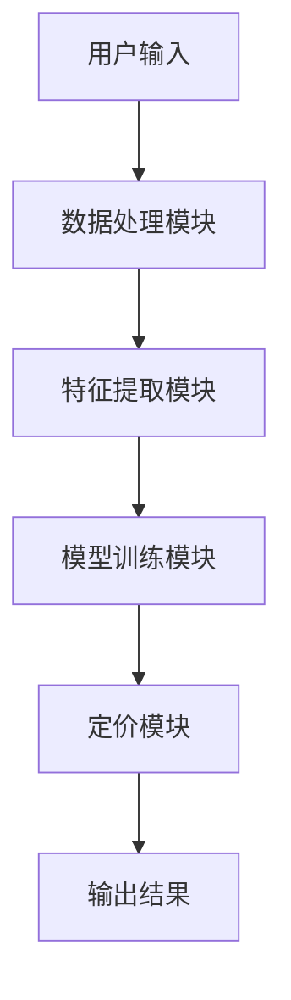

                 


# 智能信用违约互换定价模型

> 关键词：智能信用违约互换、信用风险定价、机器学习、金融模型、风险管理

> 摘要：本文详细探讨智能信用违约互换定价模型的构建与应用，从背景、核心概念、算法原理到系统设计和项目实战，全面解析其在现代金融市场中的重要作用。

---

# 第1章: 智能信用违约互换定价模型的背景与概念

## 1.1 信用违约互换的基本概念
### 1.1.1 信用违约互换的定义
信用违约互换（Credit Default Swap，CDS）是一种金融衍生工具，允许交易双方在约定时间内，将信用风险从一方转移给另一方。其核心在于将债务人违约的风险从一方转移到另一方。

### 1.1.2 信用违约互换的核心要素
- **债务人**：CDS的标的资产，即可能违约的债务人。
- **信用事件**：指债务人发生违约或其他导致CDS触发的事件。
- **保护买方**：购买信用保护的一方，支付定期费，以获得在信用事件发生时的赔偿。
- **保护卖方**：出售信用保护的一方，收取定期费，承担信用事件发生时的赔偿责任。

### 1.1.3 信用违约互换的市场现状
近年来，CDS市场迅速发展，成为全球金融市场的重要组成部分。然而，传统CDS定价模型的局限性日益显现，尤其是在处理复杂信用风险和市场波动时。

## 1.2 智能信用违约互换定价的必要性
### 1.2.1 传统信用违约互换定价的局限性
- **假设条件的不合理性**：传统模型通常基于静态假设，忽略了市场的动态变化。
- **数据依赖性过强**：传统模型依赖于历史数据，难以捕捉实时市场波动。
- **对复杂市场的适应性不足**：传统模型难以处理多变量、非线性关系。

### 1.2.2 智能化定价的优势
- **数据驱动的灵活性**：智能模型能够利用大数据和机器学习算法，捕捉复杂市场中的细微变化。
- **高维特征的处理能力**：智能模型可以处理多维特征，提高定价的准确性。
- **对复杂市场的适应性**：智能模型能够动态调整模型参数，适应市场变化。

## 1.3 本章小结
本章介绍了信用违约互换的基本概念和传统定价模型的局限性，强调了智能信用违约互换定价的必要性和优势。通过智能模型的应用，可以更准确地反映市场风险，提高定价的效率和准确性。

---

# 第2章: 信用违约互换定价模型的核心概念

## 2.1 信用风险的定义与度量
### 2.1.1 信用风险的定义
信用风险是指债务人或交易对手未能履行其合同义务，导致债权人遭受损失的风险。

### 2.1.2 信用风险的度量方法
- **违约概率（PD）**：债务人在一定时间内的违约可能性。
- **违约损失率（LGD）**：债务人违约时，债权人可能遭受的损失比例。
- **信用利差**：债务人与无风险债券之间的收益率差异，反映信用风险的定价。

### 2.1.3 信用风险与信用违约互换的关系
CDS的定价与信用风险密切相关，通过CDS可以将信用风险从保护买方转移到保护卖方。

## 2.2 信用违约互换定价模型的核心要素
### 2.2.1 债务人信用状况
债务人的信用状况是影响CDS定价的核心因素，包括财务状况、行业风险、管理团队等。

### 2.2.2 违约概率
违约概率是CDS定价的重要输入，通常通过历史数据和统计模型进行估计。

### 2.2.3 违约损失率
违约损失率是CDS定价的另一个关键因素，反映了违约事件发生时的平均损失比例。

### 2.2.4 信用利差
信用利差是CDS定价的最终结果，反映了债务人信用风险与无风险利率之间的差异。

## 2.3 传统信用违约互换定价模型的局限性
### 2.3.1 假设条件的不合理性
传统模型通常假设信用风险是独立的，忽略了市场波动和相关性的影响。

### 2.3.2 数据依赖性过强
传统模型依赖于历史数据，难以捕捉实时市场信息和新兴风险因素。

### 2.3.3 对复杂市场的适应性不足
传统模型难以处理多变量、非线性关系和复杂的市场结构。

## 2.4 智能信用违约互换定价模型的优势
### 2.4.1 数据驱动的灵活性
智能模型能够利用大数据和机器学习算法，捕捉复杂市场中的细微变化。

### 2.4.2 高维特征的处理能力
智能模型可以处理多维特征，提高定价的准确性。

### 2.4.3 对复杂市场的适应性
智能模型能够动态调整模型参数，适应市场变化。

## 2.5 本章小结
本章详细介绍了信用风险的定义与度量，分析了传统信用违约互换定价模型的局限性，并探讨了智能模型的优势。智能模型通过数据驱动和高维特征处理，能够更准确地反映市场风险，提高定价的效率和准确性。

---

# 第3章: 智能信用违约互换定价模型的核心概念与联系

## 3.1 智能信用违约互换定价模型的原理
### 3.1.1 数据输入
智能模型通常需要大量的市场数据，包括债务人信用数据、市场波动数据、宏观经济指标等。

### 3.1.2 特征提取
通过对输入数据进行特征提取，提取影响信用风险的关键因素，如财务指标、市场指标、宏观经济指标等。

### 3.1.3 模型训练
利用机器学习算法对提取的特征进行训练，建立信用风险预测模型。

### 3.1.4 定价输出
通过模型预测信用风险，计算CDS的信用利差，实现智能定价。

## 3.2 智能信用违约互换定价模型的核心概念与联系
### 3.2.1 核心概念原理
智能模型通过大数据和机器学习算法，捕捉信用风险的关键因素，建立非线性关系模型，实现更精准的定价。

### 3.2.2 核心概念属性特征对比
| 特征 | 传统模型 | 智能模型 |
|------|-----------|-----------|
| 数据依赖性 | 高 | 较低 |
| 复杂性处理 | 低 | 高 |
| 动态调整能力 | 无 | 有 |

### 3.2.3 ER实体关系图
```mermaid
erDiagram
    DEBTOR(has) CREDIT_EVENT
    CREDIT_EVENT(involves) PROTECTION_BUYER
    CREDIT_EVENT(involves) PROTECTION_Seller
    CREDIT_SWAP(involves) PROTECTION_Buyer
    CREDIT_SWAP(involves) PROTECTION_Seller
```

## 3.3 本章小结
本章通过分析智能信用违约互换定价模型的核心概念与联系，展示了智能模型在处理复杂信用风险方面的优势。通过大数据和机器学习算法，智能模型能够更精准地捕捉市场变化，提高定价的准确性。

---

# 第4章: 智能信用违约互换定价模型的算法原理

## 4.1 算法流程
### 4.1.1 数据预处理
- 数据清洗：去除异常值、填充缺失值。
- 特征工程：提取关键特征，如财务指标、市场指标等。

### 4.1.2 模型选择
- 选择合适的机器学习算法，如随机森林、支持向量机（SVM）、神经网络等。

### 4.1.3 模型训练
- 使用训练数据对模型进行训练，调整模型参数，优化模型性能。

### 4.1.4 模型验证
- 使用验证数据对模型进行测试，评估模型的准确性和稳定性。

### 4.1.5 模型应用
- 使用训练好的模型对新数据进行预测，计算CDS的信用利差。

## 4.2 算法流程图


## 4.3 算法实现
### 4.3.1 Python代码示例
```python
import pandas as pd
import numpy as np
from sklearn.ensemble import RandomForestClassifier
from sklearn.metrics import accuracy_score

# 数据加载
data = pd.read_csv('credit_data.csv')

# 特征与目标分离
X = data.drop('default', axis=1)
y = data['default']

# 特征工程
# 假设我们已经进行了特征提取和处理

# 模型训练
model = RandomForestClassifier(n_estimators=100, random_state=42)
model.fit(X, y)

# 模型验证
y_pred = model.predict(X)
print("准确率:", accuracy_score(y, y_pred))
```

### 4.3.2 数学模型与公式
- **违约概率（PD）**：可以通过历史数据和统计模型进行估计，常用公式为：
  $$ PD = \frac{\text{违约次数}}{\text{样本总数}} $$
- **违约损失率（LGD）**：通常通过历史数据和回归模型进行估计，常用公式为：
  $$ LGD = \alpha + \beta \times \text{经济周期} + \epsilon $$
- **信用利差（Spread）**：智能模型通过机器学习算法预测，常用公式为：
  $$ Spread = f(X) $$
  其中，$f$ 是机器学习模型，$X$ 是输入特征。

## 4.4 本章小结
本章详细介绍了智能信用违约互换定价模型的算法原理，包括数据预处理、特征工程、模型选择和模型训练等步骤。通过Python代码和数学公式的结合，展示了智能模型在信用风险定价中的应用。

---

# 第5章: 智能信用违约互换定价模型的系统设计与实现

## 5.1 系统分析与架构设计
### 5.1.1 问题场景介绍
智能信用违约互换定价系统的应用场景包括金融机构的风险管理、投资者的资产配置等。

### 5.1.2 系统功能设计
- **数据输入与处理**：加载市场数据，进行数据清洗和特征提取。
- **模型训练与部署**：训练机器学习模型，部署到生产环境。
- **定价与输出**：根据模型预测结果，计算CDS的信用利差，输出定价结果。

### 5.1.3 系统架构设计


## 5.2 系统实现
### 5.2.1 环境安装
- **Python**：安装Python 3.8及以上版本。
- **依赖库**：安装pandas、numpy、scikit-learn等库。

### 5.2.2 核心代码实现
```python
import pandas as pd
import numpy as np
from sklearn.ensemble import RandomForestRegressor

# 数据加载
data = pd.read_csv(' cds_data.csv ')

# 特征与目标分离
X = data.drop('credit_spread', axis=1)
y = data['credit_spread']

# 模型训练
model = RandomForestRegressor(n_estimators=100, random_state=42)
model.fit(X, y)

# 模型预测
new_data = pd.read_csv('new_cds_data.csv')
y_pred = model.predict(new_data)
print("预测信用利差:", y_pred)
```

### 5.2.3 案例分析
假设我们有以下数据：
```python
data = {
    'debt_rating': [AAA, AA, A, BBB, BB],
    'market_volatility': [2, 3, 2, 3, 4],
    'GDP_growth': [2.5, 2.2, 2.8, 2.1, 2.6]
}
```
通过模型训练，我们可以预测不同债务评级、市场波动和GDP增长下的信用利差。

## 5.3 本章小结
本章详细介绍了智能信用违约互换定价系统的系统设计与实现，包括环境安装、核心代码实现和案例分析。通过实际操作，读者可以理解智能模型在实际应用中的流程和方法。

---

# 第6章: 智能信用违约互换定价模型的最佳实践与小结

## 6.1 最佳实践
### 6.1.1 数据质量的重要性
确保数据的准确性和完整性，避免数据偏差对模型的影响。

### 6.1.2 模型选择与调优
选择合适的算法，并通过交叉验证和网格搜索优化模型参数。

### 6.1.3 实时监控与更新
定期监控模型性能，及时更新模型，确保定价的准确性。

## 6.2 小结
智能信用违约互换定价模型通过大数据和机器学习算法，能够更精准地反映市场风险，提高定价的效率和准确性。在实际应用中，需要注意数据质量和模型调优，确保系统的稳定性和可靠性。

## 6.3 注意事项
- **数据隐私**：确保数据的隐私和安全，遵守相关法律法规。
- **模型解释性**：选择可解释性较强的模型，便于分析和决策。
- **实时性要求**：根据业务需求，选择合适的实时更新频率。

## 6.4 拓展阅读
- **参考文献**：建议阅读《信用衍生产品定价与风险度量》、《机器学习在金融中的应用》等书籍。
- **推荐阅读**：推荐学习Python的机器学习库（如scikit-learn、XGBoost）和大数据处理工具（如Pandas、Spark）。

## 6.5 本章小结
本章总结了智能信用违约互换定价模型的最佳实践，并提出了注意事项和拓展阅读方向。通过不断优化和创新，智能模型将在金融领域发挥更大的作用。

---

# 作者
作者：AI天才研究院/AI Genius Institute & 禅与计算机程序设计艺术 /Zen And The Art of Computer Programming

---

以上是《智能信用违约互换定价模型》的完整目录和部分章节内容，希望对您有所帮助！

