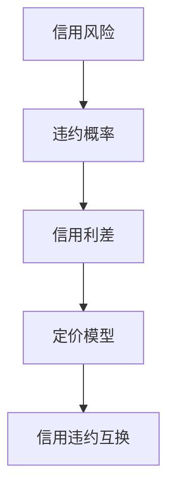
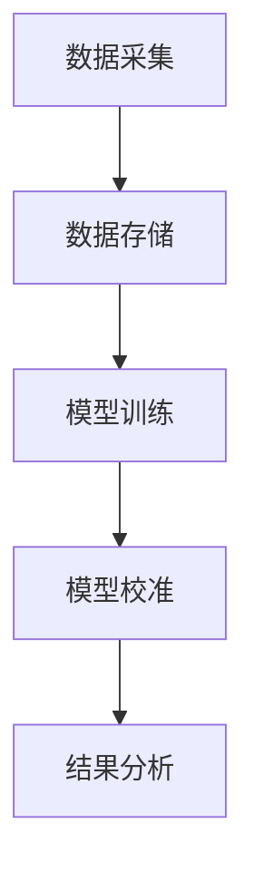

                 


# 智能信用违约互换定价模型校准

> 关键词：信用违约互换、定价模型、智能校准、蒙特卡罗模拟、机器学习、深度学习、金融衍生工具

> 摘要：本文系统地探讨了智能信用违约互换定价模型校准的核心概念、算法原理、系统架构及实际应用。通过结合金融理论与人工智能技术，本文深入分析了信用违约互换的定价机制，并提出了基于智能算法的校准方法，为金融衍生品的定价与风险管理提供了新的思路与解决方案。

---

## 第一部分: 信用违约互换定价模型的背景与核心概念

### 第1章: 信用违约互换的基本概念与定价模型

#### 1.1 信用违约互换的定义与特点
- 1.1.1 信用违约互换（CDS）的定义
  - CDS是信用衍生工具的一种，用于对冲债券违约风险。
  - 核心机制：买方支付保费，卖方承担债券违约风险。
- 1.1.2 CDS的核心特点
  - 非线性风险敞口：仅在债券违约时承担损失。
  - 标准化与流动性：CDS市场的标准化交易推动了其广泛使用。
  - 风险转移工具：买方通过支付保费将违约风险转移给卖方。
- 1.1.3 CDS的市场作用
  - 提供信用风险对冲手段。
  - 优化资本配置。
  - 增强市场流动性。

#### 1.2 定价模型的基本原理
- 1.2.1 定价模型的定义
  - 定价模型是根据市场数据和理论模型计算CDS价格的工具。
  - 核心目标：将信用风险量化为可交易的价格。
- 1.2.2 定价模型的核心原理
  - 基于信用风险模型计算违约概率。
  - 利用无套利原理确定模型参数。
  - 结合市场数据校准模型。
- 1.2.3 定价模型的应用场景
  - 风险管理：帮助机构对冲信用风险。
  - 投资决策：为投资者提供定价参考。
  - 产品设计：为CDS产品定价提供依据。

#### 1.3 智能校准的必要性与挑战
- 1.3.1 智能校准的必要性
  - 传统校准方法依赖人工经验，效率低下。
  - 市场波动与数据复杂性要求更高的自动化方法。
  - 智能算法能够处理非线性关系，提升校准精度。
- 1.3.2 校准过程中的主要挑战
  - 数据噪声与缺失：市场数据可能存在波动性和不完整性。
  - 模型复杂性：复杂模型可能导致过拟合或欠拟合。
  - 计算资源限制：大规模数据处理需要高性能计算支持。
- 1.3.3 智能校准的优势与前景
  - 提高校准效率：智能算法能够快速处理大量数据。
  - 提升准确性：通过机器学习优化模型参数。
  - 适应性更强：智能校准能够动态调整模型以适应市场变化。

---

## 第二部分: 智能信用违约互换定价模型的核心概念与联系

### 第2章: 核心概念的定义与属性

#### 2.1 信用风险的定义与属性
- 2.1.1 信用风险的定义
  - 信用风险是指债务人或交易对手无法履行其合同义务的风险。
  - 在CDS中，信用风险集中体现在债券发行人违约的可能性。
- 2.1.2 信用风险的核心属性
  - 时间依赖性：违约概率随时间变化。
  - 非对称信息：市场参与者对信用风险的认知可能存在不对称。
  - 系统性风险：信用风险可能通过关联影响整个金融市场。

#### 2.2 违约概率的定义与属性
- 2.2.1 违约概率的定义
  - 违约概率是指债券发行人违约的可能性。
  - 通常基于历史数据和市场信息进行估算。
- 2.2.2 违约概率的核心属性
  - 数值范围：0 ≤ PD ≤ 1。
  - 时间依赖性：PD随债券期限变化。
  - 风险因素敏感性：PD受宏观经济、行业状况等因素影响。

#### 2.3 信用利差的定义与属性
- 2.3.1 信用利差的定义
  - 信用利差是指相同期限下，信用债券与无风险债券的收益率差。
  - 反映市场对信用风险的定价。
- 2.3.2 信用利差的核心属性
  - 期限结构：利差随期限变化而变化。
  - 风险溢价：反映市场对信用风险的补偿。
  - 市场流动性：流动性影响利差的波动性。

---

### 第3章: 核心概念之间的关系

#### 3.1 信用风险与违约概率的关系
- 信用风险是违约概率的核心决定因素。
- 违约概率随信用风险的增加而上升。
- 不同评级的债券违约概率不同，体现了信用风险的差异性。

#### 3.2 违约概率与信用利差的关系
- 违约概率高，信用利差也较高。
- 利差反映了市场对违约概率的定价。
- 违约概率的变化会影响利差的变化。

#### 3.3 信用利差与定价模型的关系
- 定价模型通过违约概率和利差计算CDS价格。
- 模型参数影响利差与违约概率的关系。
- 校准过程确保模型能够准确反映利差与违约概率的联系。

---

### 第4章: 核心概念的ER实体关系图



---

## 第三部分: 智能校准算法的原理与实现

### 第4章: 智能校准算法的原理与实现

#### 4.1 蒙特卡罗模拟算法
- 4.1.1 蒙特卡罗模拟的基本原理
  - 通过随机采样方法模拟市场情景。
  - 计算模型在不同情景下的表现。
- 4.1.2 蒙特卡罗模拟在CDS定价中的应用
  - 用于估计CDS的期望损失。
  - 模拟债券违约时间分布。
- 4.1.3 蒙特卡罗模拟的实现步骤
  1. 确定模型参数：包括违约概率、回收率等。
  2. 生成随机数：模拟债券违约情景。
  3. 计算期望损失：根据模拟结果估计CDS价格。

#### 4.2 机器学习算法
- 4.2.1 机器学习算法的基本原理
  - 通过训练数据学习特征与目标变量之间的关系。
  - 常见算法包括线性回归、支持向量机、随机森林等。
- 4.2.2 机器学习算法在CDS定价中的应用
  - 用于预测违约概率。
  - 用于估计信用利差。
- 4.2.3 机器学习算法的实现步骤
  1. 数据准备：收集历史市场数据和相关特征。
  2. 特征选择：筛选对违约概率影响较大的特征。
  3. 模型训练：使用训练数据训练机器学习模型。
  4. 模型验证：通过测试数据评估模型性能。
  5. 模型校准：调整模型参数以优化预测精度。

#### 4.3 深度学习算法
- 4.3.1 深度学习算法的基本原理
  - 通过多层神经网络学习数据的非线性关系。
  - 常见模型包括神经网络、LSTM、卷积神经网络等。
- 4.3.2 深度学习算法在CDS定价中的应用
  - 用于长期依赖关系的建模。
  - 用于复杂市场动态的捕捉。
- 4.3.3 深度学习算法的实现步骤
  1. 数据准备：收集时间序列数据。
  2. 模型构建：设计适合的深度学习模型结构。
  3. 模型训练：使用训练数据进行端到端训练。
  4. 模型验证：评估模型在测试数据上的表现。
  5. 模型部署：将模型应用于实际的CDS定价。

---

## 第四部分: 数学模型与公式

### 第5章: 数学模型与公式

#### 5.1 信用风险模型
- 5.1.1 Merton模型
  - Merton模型假设债券违约是基于其资产价值的马尔可夫过程。
  - 计算公式：$$P(\text{违约}) = P(V_t < L)$$，其中$V_t$是债券资产价值，$L$是负债。
- 5.1.2 CreditMetrics模型
  - CreditMetrics模型基于信用组合分析，计算资产组合的信用风险。
  - 计算公式：$$VaR = \sqrt{\sum_{i=1}^n w_i^2 \sigma_i^2 + 2 \sum_{i=1}^n \sum_{j=i+1}^n w_i w_j \rho_{ij} \sigma_i \sigma_j}$$
- 5.1.3 CreditRisk+模型
  - CreditRisk+模型基于泊松过程，模拟违约事件的发生。
  - 计算公式：$$\lambda = \frac{1}{1 + e^{-\beta}}$$，其中$\beta$是模型参数。

---

## 第五部分: 系统分析与架构设计

### 第6章: 系统分析与架构设计

#### 6.1 问题场景介绍
- 信用违约互换定价模型需要校准以反映市场实际情况。
- 校准过程涉及复杂的数学模型和大量数据处理。
- 系统需要支持高效的数据处理和模型计算。

#### 6.2 系统功能设计
- 数据采集模块：收集市场数据和相关特征。
- 模型训练模块：使用机器学习或深度学习算法训练定价模型。
- 模型校准模块：通过数据校准模型参数。
- 结果分析模块：输出校准后的模型参数和定价结果。

#### 6.3 系统架构设计



---

## 第六部分: 项目实战与最佳实践

### 第7章: 项目实战

#### 7.1 环境安装
- 安装Python编程环境。
- 安装必要的库：如NumPy、Pandas、Scikit-learn、TensorFlow等。

#### 7.2 核心实现
- 数据预处理：清洗和特征工程。
- 模型选择：选择适合的机器学习或深度学习算法。
- 模型训练：使用训练数据训练模型。
- 模型校准：调整模型参数优化校准结果。

#### 7.3 代码实现

```python
import numpy as np
from sklearn.linear_model import LinearRegression
from sklearn.metrics import mean_squared_error

# 示例数据
X = np.random.rand(100, 5)  # 特征矩阵
y = np.random.rand(100, 1)   # 校准目标

# 模型训练
model = LinearRegression()
model.fit(X, y)

# 模型校准
y_pred = model.predict(X)
mse = mean_squared_error(y, y_pred)
print("均方误差:", mse)
```

#### 7.4 案例分析
- 使用真实市场数据进行校准。
- 对比不同算法的校准效果。
- 分析校准结果对CDS定价的影响。

---

## 第七部分: 最佳实践与小结

### 第8章: 最佳实践

#### 8.1 小结
- 智能校准算法能够显著提高CDS定价模型的准确性。
- 机器学习和深度学习算法在处理复杂数据时表现优异。
- 系统化的方法能够提升校准过程的效率和可靠性。

#### 8.2 注意事项
- 数据质量对校准结果影响重大。
- 模型选择需要结合实际应用场景。
- 校准过程需要考虑计算资源限制。

#### 8.3 拓展阅读
- 进一步了解其他信用风险模型。
- 研究最新的智能校准算法。
- 探索CDS定价模型的实际应用案例。

---

## 作者：AI天才研究院/AI Genius Institute & 禅与计算机程序设计艺术/Zen And The Art of Computer Programming

