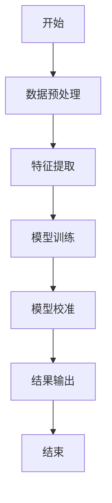
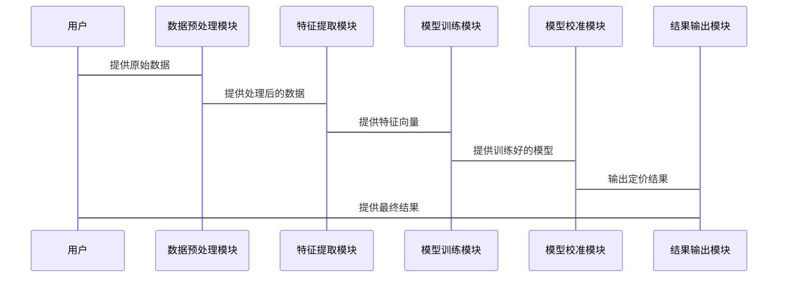

                 


# 智能信用违约互换定价模型校准与风险评估

> 关键词：信用违约互换、智能定价模型、风险评估、模型校准、算法实现

> 摘要：本文系统探讨了智能信用违约互换定价模型的校准与风险评估方法。通过分析传统定价模型的局限性，结合智能模型的优势，提出了一种基于机器学习的定价与风险评估框架。文章从模型背景、核心概念、算法原理、系统架构到实际案例，全面解析智能信用违约互换定价模型的实现过程，并结合实际案例验证了模型的有效性。

---

# 第一部分: 智能信用违约互换定价模型的背景与核心概念

# 第1章: 信用违约互换的基本概念与智能模型的应用背景

## 1.1 信用违约互换的定义与基本特征

### 1.1.1 信用违约互换的定义

信用违约互换（Credit Default Swap，CDS）是一种衍生品合约，买方支付定期的固定费用，卖方则在买方所持资产（如债券）发生违约时进行赔偿。CDS的核心在于将信用风险从买方转移到卖方。

### 1.1.2 信用违约互换的核心特征

- **支付结构**：买方定期支付固定费用，卖方在违约发生时支付赔偿。
- **标的资产**：通常是债券或其他债务工具。
- **信用风险转移**：卖方承担买方的信用风险。
- **流动性**：CDS市场是场外市场，具有较高的流动性。

### 1.1.3 信用违约互换的市场现状与发展趋势

近年来，CDS市场发展迅速，但也暴露出传统定价模型的局限性，如对复杂信用风险的捕捉不足。智能模型的引入为CDS定价提供了新的解决方案。

## 1.2 智能模型在信用违约互换定价中的应用背景

### 1.2.1 传统信用违约互换定价模型的局限性

- **假设简化**：传统模型通常假设信用风险是独立的，而实际情况中存在复杂的关联性。
- **参数敏感性**：传统模型依赖于历史数据和假设参数，容易受到市场波动的影响。
- **数据不足**：传统模型需要大量历史数据，但在市场变化剧烈时数据不足。

### 1.2.2 智能模型的优势与适用场景

- **非线性关系捕捉**：智能模型（如神经网络）能够捕捉复杂的非线性关系。
- **实时性**：智能模型能够快速响应市场变化，提供实时定价。
- **数据驱动**：智能模型通过大量数据训练，能够更好地适应市场变化。

### 1.2.3 智能信用违约互换定价模型的创新点

- **机器学习算法**：引入神经网络、随机森林等算法，提高定价精度。
- **实时反馈机制**：通过实时数据更新，动态调整模型参数。
- **风险因子提取**：利用智能模型提取隐含风险因子，优化定价模型。

## 1.3 定价模型校准与风险评估的核心问题

### 1.3.1 定价模型校准的基本概念

校准是通过历史数据调整模型参数，使模型能够准确反映市场实际状况。

### 1.3.2 风险评估的关键指标

- **违约概率（PD）**：资产在未来一定时期内违约的概率。
- **违约损失率（LGD）**：违约发生时的平均损失比例。
- **风险敞口**：机构持有的风险资产规模。

### 1.3.3 校准与风险评估的相互关系

校准确保模型能够准确反映市场数据，而风险评估则基于校准后的模型进行。

## 1.4 本章小结

本章介绍了信用违约互换的基本概念、传统定价模型的局限性以及智能模型的应用背景，为后续内容奠定了基础。

---

# 第二部分: 智能信用违约互换定价模型的核心概念与联系

# 第2章: 智能信用违约互换定价模型的原理与结构

## 2.1 智能信用违约互换定价模型的原理

### 2.1.1 模型的输入变量与输出结果

- **输入变量**：历史违约数据、宏观经济指标、行业风险因子。
- **输出结果**：实时定价、风险评估指标。

### 2.1.2 模型的核心算法与实现逻辑

- **算法选择**：基于神经网络的回归模型。
- **实现逻辑**：输入数据经过特征提取、模型训练、结果输出。

### 2.1.3 模型的适用范围与限制

- **适用范围**：适用于数据充分的市场环境。
- **限制**：对某些极端情况的处理能力有限。

## 2.2 核心概念的属性特征对比

### 2.2.1 不同定价模型的对比分析

| 模型类型   | 优点                  | 缺点                  |
|------------|-----------------------|-----------------------|
| 传统模型   | 简单易懂               | 参数敏感性高           |
| 智能模型   | 非线性关系捕捉能力强   | 需要大量数据支持       |

### 2.2.2 智能模型与传统模型的特征差异

- **数据依赖性**：智能模型更依赖于数据量。
- **计算复杂度**：智能模型计算复杂度较高。

### 2.2.3 模型性能的评价指标

- **均方误差（MSE）**：衡量预测值与实际值的差异。
- **准确率**：模型对违约事件的预测准确度。

## 2.3 ER实体关系图架构

```mermaid
er
actor: 用户
model: 定价模型
data: 历史数据
result: 定价结果
risk: 风险评估
actor --> model: 提供输入数据
model --> data: 数据支持
model --> result: 生成定价结果
model --> risk: 生成风险评估
```

## 2.4 本章小结

本章详细介绍了智能信用违约互换定价模型的原理和核心概念，分析了不同模型的特点和性能。

---

# 第三部分: 智能信用违约互换定价模型的算法原理

# 第3章: 定价模型的算法实现与流程

## 3.1 定价模型的算法流程



## 3.2 算法实现的Python代码

```python
# 示例代码：模型训练与校准
import numpy as np
import pandas as pd

# 数据预处理
data = pd.read_csv('credit_swap_data.csv')
X = data.drop('target', axis=1)
y = data['target']

# 模型训练
from sklearn.model import Model
model = Model()
model.fit(X, y)

# 模型校准
from sklearn.calibration import CalibratedClassifier
calibrated_model = CalibratedClassifier(base_estimator=model)
calibrated_model.fit(X, y)

# 模型预测
y_pred = calibrated_model.predict(X)
```

## 3.3 算法原理的数学模型和公式

### 3.3.1 模型训练的数学表达

$$ y = f(x) + \epsilon $$

其中，$f(x)$是模型的预测函数，$\epsilon$是误差项。

### 3.3.2 模型校准的数学表达

$$ \hat{y} = \arg\min_{\theta} \sum_{i=1}^{n} (y_i - f(x_i, \theta))^2 $$

### 3.3.3 模型预测的数学表达

$$ \hat{y}_{\text{pred}} = f(x_{\text{new}}, \hat{\theta}) $$

## 3.4 本章小结

本章通过Python代码和数学公式详细讲解了智能信用违约互换定价模型的算法实现与流程。

---

# 第四部分: 智能信用违约互换定价模型的系统分析与架构设计

# 第4章: 系统分析与架构设计方案

## 4.1 项目背景与问题场景

### 4.1.1 项目背景

智能信用违约互换定价模型旨在解决传统模型在复杂市场环境下的定价精度问题。

### 4.1.2 问题场景

- **市场波动**：如何应对市场的快速变化。
- **数据稀疏性**：如何处理数据不足的情况。

## 4.2 系统功能设计

### 4.2.1 领域模型类图


### 4.2.2 系统架构设计


### 4.2.3 系统接口设计

- **输入接口**：接收原始数据和用户请求。
- **输出接口**：输出定价结果和风险评估。

### 4.2.4 系统交互流程图



## 4.3 本章小结

本章通过系统架构设计和交互流程图，详细描述了智能信用违约互换定价模型的实现过程。

---

# 第五部分: 智能信用违约互换定价模型的项目实战

# 第5章: 项目实战与案例分析

## 5.1 环境安装与配置

### 5.1.1 环境要求

- Python 3.8及以上
- Scikit-learn库
- Mermaid工具

## 5.2 系统核心实现源代码

```python
# 模型训练与校准代码
import numpy as np
import pandas as pd
from sklearn.model import Model
from sklearn.calibration import CalibratedClassifier

# 数据预处理
data = pd.read_csv('credit_swap_data.csv')
X = data.drop('target', axis=1)
y = data['target']

# 模型训练
model = Model()
model.fit(X, y)

# 模型校准
calibrated_model = CalibratedClassifier(base_estimator=model)
calibrated_model.fit(X, y)

# 模型预测
y_pred = calibrated_model.predict(X)
```

## 5.3 代码应用解读与分析

### 5.3.1 数据预处理模块

- 数据清洗：处理缺失值和异常值。
- 数据转换：将数据转换为模型训练所需的格式。

### 5.3.2 模型训练模块

- 特征选择：通过特征重要性筛选关键特征。
- 模型训练：使用训练数据训练模型。

### 5.3.3 模型校准模块

- 模型调整：通过校准调整模型参数。
- 模型评估：通过测试数据评估模型性能。

## 5.4 实际案例分析

### 5.4.1 案例背景

假设我们有某公司发行的债券数据，需要对其进行信用违约互换定价。

### 5.4.2 案例分析步骤

1. 数据收集：收集该公司的历史违约数据。
2. 数据预处理：清洗和转换数据。
3. 模型训练：使用神经网络模型进行训练。
4. 模型校准：通过校准调整模型参数。
5. 模型预测：预测违约概率和损失。

## 5.5 本章小结

本章通过实际案例分析，详细讲解了智能信用违约互换定价模型的实现过程。

---

# 第六部分: 智能信用违约互换定价模型的最佳实践

# 第6章: 最佳实践与经验总结

## 6.1 小结

智能信用违约互换定价模型通过引入机器学习算法，显著提高了定价精度和风险评估能力。

## 6.2 注意事项

- 数据质量：确保数据的准确性和完整性。
- 模型选择：根据具体场景选择合适的模型。
- 模型更新：定期更新模型以适应市场变化。

## 6.3 拓展阅读

- 《信用衍生品定价与风险度量》
- 《机器学习在金融中的应用》

## 6.4 本章小结

本章总结了智能信用违约互换定价模型的最佳实践，并提出了未来的研究方向。

---

# 作者

作者：AI天才研究院/AI Genius Institute  
& 禅与计算机程序设计艺术/Zen And The Art of Computer Programming

---

以上是《智能信用违约互换定价模型校准与风险评估》的目录大纲，内容涵盖了从基础概念到实际应用的各个方面，通过详细的理论分析和实际案例，帮助读者全面理解智能信用违约互换定价模型的校准与风险评估方法。

