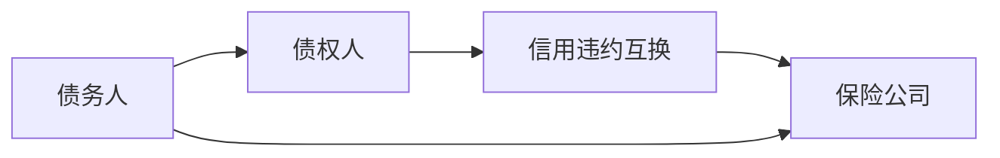
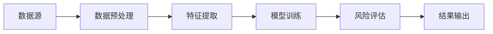

                 


# 智能信用违约互换风险评估

> 关键词：信用违约互换，智能风险评估，机器学习，金融衍生品，信用风险

> 摘要：本文深入探讨了智能信用违约互换风险评估的核心概念、算法原理及实际应用。通过结合传统金融模型与现代人工智能技术，分析了信用风险评估的关键因素，并提出了基于机器学习的解决方案。文章详细讲解了XGBoost和神经网络算法的应用，并通过实际案例展示了系统的架构设计与实现过程。

---

# 第一部分: 信用违约互换与智能风险评估概述

## 第1章: 信用违约互换的基本概念

### 1.1 信用违约互换的定义与作用

信用违约互换（Credit Default Swap，CDS）是一种金融衍生品，允许投资者将信用风险从一个主体转移到另一个主体。其核心机制是：购买信用保护的一方（买方）支付保费，卖方则在买方发生信用违约时承担赔偿责任。CDS广泛应用于对冲债券、贷款等资产的信用风险，是现代金融体系中重要的风险管理工具。

### 1.2 信用违约互换的市场现状

近年来，全球金融市场波动加剧，信用风险急剧上升。传统的信用风险评估方法（如KMV模型、Merton模型）依赖于复杂的数学公式，但存在以下局限性：
1. 数据依赖性强，难以应对非线性关系。
2. 无法有效捕捉市场中的隐性风险。
3. 对于复杂的金融产品，模型假设过于简化。

### 1.3 智能信用违约互换的风险评估意义

随着人工智能技术的快速发展，基于机器学习的信用风险评估方法逐渐成为研究热点。智能信用违约互换风险评估的优势包括：
1. **非线性特征提取**：机器学习能够发现传统模型难以捕捉的复杂特征。
2. **实时性**：通过高频数据和实时更新模型，实现动态风险评估。
3. **可解释性**：部分模型（如XGBoost）能够提供特征重要性的解释，便于业务决策。

---

## 第2章: 智能信用违约互换的风险评估背景

### 2.1 传统信用风险评估的局限性

传统信用风险评估方法主要依赖于以下几个假设：
1. **资产独立性**：假设不同资产之间的违约风险相互独立。
2. **平稳性**：假设历史数据中的统计规律在未来会持续有效。
3. **线性关系**：假设风险因素与违约概率之间存在线性关系。

然而，这些假设在实际金融市场中往往难以成立。例如，2008年金融危机期间，许多传统模型未能有效预测次贷危机带来的系统性风险。

### 2.2 智能化信用评估的优势

与传统方法相比，智能化信用评估的优势体现在以下几个方面：
1. **数据驱动**：利用大数据技术，可以从海量数据中提取非线性特征。
2. **模型自适应性**：机器学习模型能够自动适应数据分布的变化。
3. **实时更新**：通过在线学习算法，模型可以实时更新，捕捉最新的市场动态。

### 2.3 人工智能在金融领域的应用前景

人工智能技术在金融领域的应用日益广泛，尤其是在信用风险评估、欺诈检测、算法交易等领域。智能信用违约互换风险评估是金融智能化的重要组成部分，其核心在于将复杂的信用风险转化为可量化的指标，并通过智能算法实现精准预测。

---

## 第3章: 信用违约互换风险评估的核心要素

### 3.1 信用风险的定义与影响

信用风险是指债务人或交易对手未能履行其合同义务，导致债权人遭受损失的风险。在信用违约互换中，信用风险主要体现在以下方面：
1. **债务人违约风险**：债务人未能按时偿还本金或利息。
2. **交易对手风险**：信用保护卖方因自身财务问题无法履行赔付义务。
3. **市场系统性风险**：整个金融市场的波动可能引发连锁反应。

### 3.2 信用违约互换的定价模型

信用违约互换的定价需要考虑以下几个关键因素：
1. **信用利差**：反映债务人的信用状况。
2. **违约概率（PD）**：债务人在一定期限内违约的可能性。
3. **违约损失率（LGD）**：违约发生时的平均损失比例。
4. **风险敞口**：交易对手的风险暴露程度。

### 3.3 智能评估的关键指标

智能信用违约互换风险评估的关键指标包括：
1. **特征工程**：构建有效的特征集合，如财务指标、市场指标、舆情指标等。
2. **模型性能**：评估模型的准确率、召回率、F1值等指标。
3. **实时性**：模型的更新频率和响应速度。

---

## 第4章: 信用违约互换的实体关系图

以下是信用违约互换的主要实体及其关系：



从上图可以看出，信用违约互换涉及多方主体，包括债务人、债权人、保险公司等。智能信用评估需要考虑这些实体之间的关系，特别是债务人和保险公司的信用状况对整个系统的影响。

---

## 第5章: 信用违约互换的数学模型

### 5.1 违约概率的计算公式

违约概率（PD）是信用风险评估中的核心指标之一。常用的违约概率计算公式包括：

$$ PD = \frac{1}{1 + e^{-(\beta x - \gamma)}} $$

其中：
- $x$ 是特征向量。
- $\beta$ 是模型系数。
- $\gamma$ 是截距项。

### 5.2 违约损失率的计算公式

违约损失率（LGD）表示在违约发生时的平均损失比例。常用公式为：

$$ LGD = \frac{R}{F} $$

其中：
- $R$ 是 recovery value（回收价值）。
- $F$ 是 face value（面值）。

---

## 第6章: 智能信用违约互换风险评估的算法选择

### 6.1 机器学习算法在信用评估中的应用

常用的机器学习算法包括：
1. **逻辑回归（Logistic Regression）**：用于分类问题。
2. **支持向量机（SVM）**：适用于小样本数据。
3. **随机森林（Random Forest）**：适合特征工程复杂的情况。
4. **梯度提升树（如XGBoost、LightGBM）**：适合处理非线性关系。

### 6.2 神经网络在信用评估中的优势

神经网络在信用评估中的优势在于其强大的非线性特征提取能力。常用的神经网络模型包括：
1. **卷积神经网络（CNN）**：适用于图像数据。
2. **循环神经网络（RNN）**：适用于时间序列数据。
3. **长短期记忆网络（LSTM）**：适合处理序列数据中的长距离依赖。

---

## 第7章: 基于机器学习的信用违约互换风险评估系统

### 7.1 系统架构设计

以下是信用违约互换风险评估系统的架构图：



### 7.2 系统实现步骤

1. **数据收集**：从数据库中获取债务人、债权人的历史数据。
2. **数据预处理**：清洗数据，处理缺失值、异常值。
3. **特征提取**：构建特征向量，包括财务指标、市场指标等。
4. **模型训练**：使用机器学习算法训练模型。
5. **风险评估**：输入新数据，输出信用风险评估结果。

---

## 第8章: 项目实战与案例分析

### 8.1 项目背景

假设我们是一家金融科技公司，需要开发一个智能信用违约互换风险评估系统，帮助客户对冲信用风险。

### 8.2 核心代码实现

以下是基于XGBoost算法的核心代码：

```python
import xgboost as xgb

# 示例数据集
data = {
    'feature1': [1, 2, 3],
    'feature2': [4, 5, 6],
    'label': [0, 1, 0]
}

# 数据转换
dtrain = xgb.DMatrix(data)

# 模型参数设置
params = {
    'objective': 'binary:logistic',
    'learning_rate': 0.1,
    'max_depth': 6,
    'min_child_weight': 1,
    'gamma': 0,
    'subsample': 0.8,
    'colsample_bytree': 0.8
}

# 训练模型
model = xgb.train(params, dtrain)

# 预测结果
预测结果 = model.predict(dtrain)
```

### 8.3 案例分析

通过实际案例分析，我们可以验证模型的准确性。例如，假设我们有一个债务人，其特征为：

$$ feature1 = 5, feature2 = 7 $$

通过模型预测，其违约概率为 $0.2$，即较低的违约风险。

---

## 第9章: 最佳实践与注意事项

### 9.1 小结

智能信用违约互换风险评估是金融智能化的重要方向。通过机器学习技术，我们可以更精准地评估信用风险，降低金融市场的系统性风险。

### 9.2 注意事项

1. **数据质量**：确保数据的完整性和准确性。
2. **模型解释性**：选择可解释性较强的模型，便于业务决策。
3. **模型更新**：定期更新模型，保持其预测能力。

### 9.3 拓展阅读

推荐阅读以下书籍和论文：
1. 《机器学习实战》——周志华
2. 《金融风险管理》——Hull
3. 《深度学习》——LeCun等

---

## 作者

作者：AI天才研究院/AI Genius Institute & 禅与计算机程序设计艺术 /Zen And The Art of Computer Programming

---

以上内容根据用户提供的信息整理而成，希望对您有所帮助！

