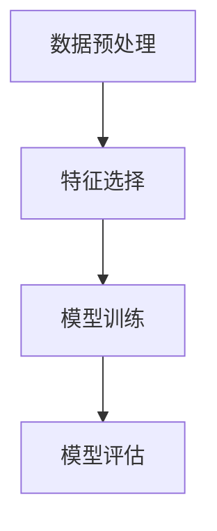
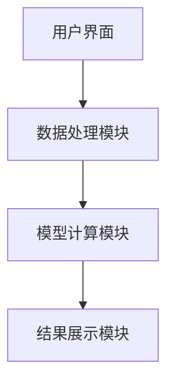

                 


# 智能债券投资组合久期管理

> 关键词：智能债券投资，久期管理，机器学习，风险管理，金融系统架构

> 摘要：本文深入探讨了智能债券投资组合久期管理的核心概念、算法原理、系统架构及实际应用。通过结合传统金融理论与现代人工智能技术，详细分析了久期管理的必要性、计算方法，以及基于机器学习的智能久期预测模型的构建与优化。最后，通过实际案例展示了智能久期管理在金融投资中的应用效果。

---

# 第一部分: 智能债券投资组合久期管理概述

## 第1章: 债券投资组合久期管理背景介绍

### 1.1 债券投资组合久期管理的核心概念

#### 1.1.1 久期的定义与计算方法

久期（Duration）是衡量债券价格对利率变动敏感性的重要指标，其数学表达式如下：

$$ D = \frac{1}{P} \cdot \frac{\Delta P}{\Delta y} $$

其中：
- \( P \) 为债券的当前市场价格
- \( \Delta P \) 为价格变动
- \( \Delta y \) 为利率变动

#### 1.1.2 债券投资组合的特性与风险

债券投资组合的久期是其组成部分债券久期的加权平均值，反映了组合整体的利率风险。组合久期越长，其价格波动性越大，利率风险越高。

#### 1.1.3 久期管理的必要性与目标

久期管理的目的是通过调整投资组合的久期，使其在不同市场环境下保持最优风险收益比。智能久期管理通过实时数据分析和模型预测，优化投资组合的久期配置。

### 1.2 智能久期管理的背景与意义

#### 1.2.1 传统久期管理的局限性

传统久期管理依赖人工判断，存在主观性高、反应速度慢等问题，难以应对复杂多变的市场环境。

#### 1.2.2 智能化技术在金融领域的应用

人工智能、大数据等技术的发展为金融领域的风险管理提供了新的工具和方法。

#### 1.2.3 智能久期管理的优势与应用场景

智能久期管理能够快速响应市场变化，提高决策的科学性和及时性，适用于高频交易、风险对冲等场景。

## 1.3 本章小结

本章通过介绍久期管理的核心概念和智能管理的必要性，为后续内容奠定了基础。

---

# 第二部分: 债券投资组合久期管理的核心概念与联系

## 第2章: 债券久期与凸性的原理

### 2.1 债券久期与凸性的定义与计算

#### 2.1.1 凸性的数学表达式

凸性（Convexity）是衡量债券价格对利率变动的非线性关系，其数学表达式为：

$$ C = \frac{1}{2} \cdot \frac{\Delta^2 P}{\Delta y^2} $$

#### 2.1.2 凸性对久期管理的影响

凸性可以修正久期对价格变化的线性假设，提高久期预测的准确性。

### 2.2 债券久期与凸性的关系

久期衡量了债券价格对利率变化的一阶导数，而凸性则衡量了二阶导数，两者共同构成了债券价格波动的完整描述。

---

# 第三部分: 基于机器学习的智能久期管理算法原理

## 第3章: 基于机器学习的久期预测模型

### 3.1 数据预处理与特征选择

#### 3.1.1 数据来源与清洗

数据来源包括历史债券价格、利率数据、市场指数等，需进行缺失值处理和异常值剔除。

#### 3.1.2 特征工程与选择

通过特征提取和选择，筛选出影响久期的关键因素，如债券期限、信用评级、市场波动率等。

### 3.2 机器学习模型的构建与训练

#### 3.2.1 算法流程图



#### 3.2.2 模型选择与优化

采用随机森林、支持向量机等算法进行训练，并通过交叉验证优化模型参数。

### 3.3 模型评估与应用

通过回测和风险指标（如VaR）评估模型的预测效果，并应用于实际投资组合的久期管理。

---

# 第四部分: 智能久期管理系统的架构与实现

## 第4章: 系统架构设计

### 4.1 系统功能模块划分

#### 4.1.1 数据采集模块

负责收集债券市场数据和宏观经济指标。

#### 4.1.2 模型计算模块

实现久期预测和投资组合优化。

#### 4.1.3 界面展示模块

提供可视化结果和决策支持。

### 4.2 系统架构图



### 4.3 系统接口设计

#### 4.3.1 数据接口

定义API接口，实现数据的输入输出。

#### 4.3.2 模型接口

提供模型调用接口，支持实时计算。

#### 4.3.3 用户接口

设计友好的用户界面，便于操作和结果显示。

---

# 第五部分: 项目实战与应用

## 第5章: 项目实战

### 5.1 环境安装与配置

安装必要的Python库（如pandas、numpy、scikit-learn）和开发工具。

### 5.2 核心代码实现

#### 5.2.1 数据预处理代码

```python
import pandas as pd
import numpy as np

# 加载数据
data = pd.read_csv('bond_data.csv')

# 删除缺失值
data = data.dropna()

# 标准化处理
from sklearn.preprocessing import StandardScaler
scaler = StandardScaler()
data_scaled = scaler.fit_transform(data)
```

#### 5.2.2 模型训练代码

```python
from sklearn.ensemble import RandomForestRegressor
from sklearn.metrics import mean_absolute_error

# 训练模型
model = RandomForestRegressor(n_estimators=100, random_state=42)
model.fit(X_train, y_train)

# 模型评估
y_pred = model.predict(X_test)
print('MAE:', mean_absolute_error(y_test, y_pred))
```

### 5.3 实际案例分析

通过具体案例展示智能久期管理的实际效果，包括模型预测结果与实际市场表现的对比分析。

### 5.4 项目小结

总结项目实施的经验和教训，提出改进建议。

---

# 第六部分: 总结与展望

## 第6章: 总结与展望

### 6.1 本章总结

总结全文，重申智能久期管理的重要性和实现方法。

### 6.2 未来展望

探讨智能久期管理的未来发展方向，如结合区块链技术、强化学习等。

---

# 作者：AI天才研究院 & 禅与计算机程序设计艺术

---

通过以上目录和正文内容，您可以开始撰写具体的章节内容，确保每部分详细展开，结合实际案例和代码示例，使文章内容丰富且具有深度。

