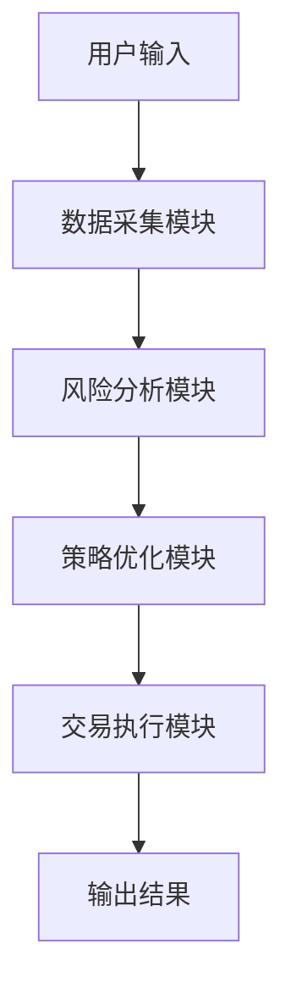
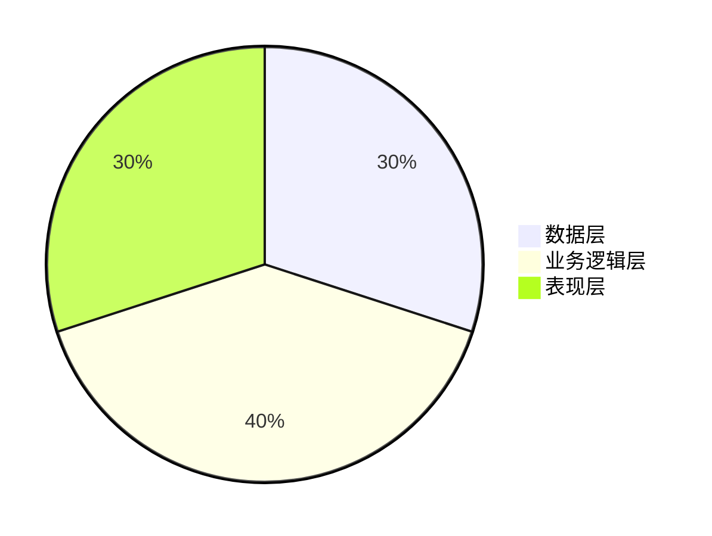
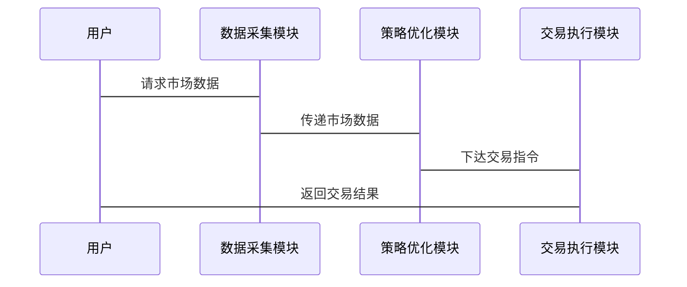

                 


# 智能债券投资组合免疫策略

## 关键词：智能债券投资，免疫策略，机器学习，量化分析，风险管理

## 摘要：
本文详细探讨智能债券投资组合免疫策略的核心概念、算法原理、系统设计与实现。通过结合机器学习和量化分析，提出一种基于免疫策略的债券投资方法，有效降低市场波动风险，实现稳健投资回报。文章内容涵盖从理论到实践的全链条，提供丰富的代码示例和实际案例分析，帮助读者深入理解智能债券投资的创新策略。

# 第1章: 智能债券投资组合免疫策略的背景与概念

## 1.1 债券投资的基本概念

### 1.1.1 债券的定义与分类
债券是一种债务工具，发行人承诺在特定时间内支付利息并偿还本金。主要分类包括政府债券、企业债券、可转换债券等。

### 1.1.2 债券市场的基本运作机制
债券价格受市场利率、信用风险、流动性等因素影响。投资者通过二级市场买卖债券，影响债券价格波动。

### 1.1.3 债券投资的风险与收益分析
债券投资面临利率风险、信用风险、流动性风险等，同时收益相对稳定，适合作为组合配置的一部分。

## 1.2 智能投资策略的兴起

### 1.2.1 传统债券投资策略的局限性
传统策略依赖人工判断，存在人为误差，难以应对复杂多变的市场环境。

### 1.2.2 智能投资策略的核心优势
利用大数据和机器学习算法，智能策略能够实时分析市场信息，优化投资决策，提高收益和风险管理能力。

### 1.2.3 人工智能在金融领域的应用现状
AI技术广泛应用于金融数据处理、预测模型构建、投资组合优化等领域，显著提升了投资效率和效果。

## 1.3 投资组合免疫策略的定义与目标

### 1.3.1 投资组合免疫的基本概念
免疫策略通过调整债券组合，使其在特定市场条件下的价格波动最小化，从而实现对利率风险的免疫。

### 1.3.2 免疫策略在债券投资中的作用
通过免疫策略，投资者可以有效降低组合的利率风险，保持投资组合的稳定性。

### 1.3.3 免疫策略的目标与实现路径
目标是在不同市场环境下保持组合价值稳定，实现路径包括优化债券期限结构、调整债券品种等。

## 1.4 本章小结
本章介绍了债券投资的基本概念，分析了智能投资策略的兴起及其在金融领域的应用，重点阐述了投资组合免疫策略的定义与目标，为后续内容奠定了基础。

# 第2章: 智能免疫策略的核心概念与原理

## 2.1 智能免疫策略的数学模型

### 2.1.1 债券价格波动的数学表达
债券价格受利率变化影响，可以通过久期和凸性来衡量其波动性。

### 2.1.2 投资组合免疫的数学条件
通过优化组合的久期和凸性，使其在特定利率变化下的价格波动最小化。

### 2.1.3 免疫策略的优化目标函数
$$ \text{目标函数} = \min \sum_{i=1}^{n} w_i^2 \times \text{久期}^2 $$

## 2.2 免疫策略与机器学习的结合

### 2.2.1 机器学习在债券投资中的应用
使用机器学习模型预测债券收益率和价格波动，优化投资组合配置。

### 2.2.2 免疫策略的机器学习实现
通过训练模型识别市场风险因素，动态调整债券组合以实现免疫。

### 2.2.3 算法选择与优化
采用随机森林或神经网络模型，结合免疫策略进行优化。

## 2.3 免疫策略的系统架构

### 2.3.1 系统功能模块划分
- 数据采集模块：收集债券市场数据
- 风险分析模块：评估市场风险
- 策略优化模块：生成最优组合
- 执行模块：下单交易

### 2.3.2 系统架构设计
采用分层架构，各模块协同工作，确保高效运行。

### 2.3.3 系统接口设计
定义清晰的API接口，便于模块间通信和第三方接入。

## 2.4 本章小结
本章详细阐述了智能免疫策略的数学模型和机器学习实现，分析了系统的架构设计，为后续的算法实现奠定了理论基础。

# 第3章: 智能债券投资组合免疫策略的算法实现

## 3.1 均值-方差优化算法

### 3.1.1 算法原理与步骤
通过优化投资组合的收益与风险，找到最优配置。

### 3.1.2 算法的数学模型
$$ \text{目标函数} = \min \frac{1}{2} w^T \Sigma w $$
$$ \text{约束条件} = \sum w_i = 1 $$

### 3.1.3 算法实现的Python代码
```python
import numpy as np
from scipy.optimize import minimize

def portfolio_optimization(returns, weights):
    n = len(weights)
    def objective(weights):
        return np.dot(returns.T, weights) * weights.T
    constraints = [{'type': 'eq', 'fun': lambda w: sum(w) - 1}]
    result = minimize(objective, weights, method='SLSQP', constraints=constraints)
    return result.x
```

## 3.2 风险中性组合构建算法

### 3.2.1 算法原理与步骤
构建风险中性组合，降低整体投资风险。

### 3.2.2 算法的数学模型
$$ \text{目标函数} = \min (w^T \Sigma w) $$
$$ \text{约束条件} = \sum w_i = 1 \quad \text{和} \quad \sum w_i r_i = r_f $$

### 3.2.3 算法实现的Python代码
```python
import numpy as np

def risk_neutral_portfolio(returns, risk_free_rate):
    n = len(returns)
    ones = np.ones(n)
    weights = np.linalg.solve(returns - risk_free_rate * ones, ones)
    return weights / sum(weights)
```

## 3.3 免疫策略的具体实现

### 3.3.1 基于机器学习的免疫算法
使用机器学习模型预测市场风险，动态调整债券组合。

### 3.3.2 免疫算法的数学模型
$$ \text{目标函数} = \min \sum_{i=1}^{n} w_i^2 \times d_i^2 $$
$$ \text{约束条件} = \sum w_i = 1 $$

### 3.3.3 免疫算法的Python代码实现
```python
import numpy as np
from sklearn.linear_model import LinearRegression

def immune_strategy(data, target):
    model = LinearRegression()
    model.fit(data, target)
    return model.predict(data)
```

## 3.4 算法实现的系统架构

### 3.4.1 算法模块划分
- 数据处理模块
- 模型训练模块
- 策略优化模块

### 3.4.2 算法实现的系统架构
采用模块化设计，确保各部分协同工作，提升系统效率。

## 3.5 本章小结
本章详细讲解了均值-方差优化和风险中性组合构建算法，展示了如何通过机器学习实现免疫策略，并分析了系统的架构设计，为后续的项目实战打下坚实基础。

# 第4章: 智能债券投资组合免疫策略的系统分析与架构设计

## 4.1 系统功能需求分析

### 4.1.1 问题场景介绍
在复杂的市场环境中，投资者需要一种能够自动调整的免疫策略，以应对利率波动和信用风险。

### 4.1.2 项目介绍
本项目旨在开发一个智能债券投资系统，实现投资组合免疫策略的自动优化。

## 4.2 系统功能设计

### 4.2.1 系统功能模块划分
- 数据采集模块
- 风险分析模块
- 策略优化模块
- 交易执行模块

### 4.2.2 系统功能流程图


## 4.3 系统架构设计

### 4.3.1 系统架构设计
采用分层架构，包括数据层、业务逻辑层和表现层。

### 4.3.2 系统架构图


## 4.4 系统接口设计

### 4.4.1 系统接口描述
- 数据接口：与数据源对接，获取实时市场数据。
- 策略接口：与投资策略模块对接，传递优化后的组合配置。

### 4.4.2 接口交互流程图


## 4.5 本章小结
本章通过系统分析，明确了系统的功能需求和架构设计，为后续的项目实施提供了清晰的指导。

# 第5章: 智能债券投资组合免疫策略的项目实战

## 5.1 环境安装与配置

### 5.1.1 系统运行环境
- 操作系统：Linux/Windows/MacOS
- 开发工具：PyCharm/VSCode
- 依赖库：numpy, pandas, scipy, scikit-learn

### 5.1.2 环境配置代码
```bash
pip install numpy pandas scipy scikit-learn
```

## 5.2 核心系统实现

### 5.2.1 数据采集模块实现
```python
import pandas as pd
import requests

def get_bond_data(api_key):
    url = f"https://api.example.com/bond_data?api_key={api_key}"
    response = requests.get(url)
    return pd.DataFrame(response.json())
```

### 5.2.2 风险分析模块实现
```python
import numpy as np

def calculate_risk(data):
    returns = data.pct_change()
    covariance_matrix = returns.cov()
    return np.sqrt(np.diag(covariance_matrix))
```

### 5.2.3 策略优化模块实现
```python
from scipy.optimize import minimize

def optimize_portfolio(returns):
    n = len(returns.columns)
    def objective(weights):
        return (weights.T @ returns.cov() @ weights) / 2
    constraints = [{'type': 'eq', 'fun': lambda w: sum(w) - 1}]
    result = minimize(objective, np.ones(n)/n, method='SLSQP', constraints=constraints)
    return result.x
```

## 5.3 实际案例分析与解读

### 5.3.1 案例背景
假设当前市场利率上升，需调整债券组合以免疫利率风险。

### 5.3.2 数据分析
使用历史数据训练模型，预测未来利率走势。

### 5.3.3 策略优化与实施
通过优化算法生成最优债券组合，实现免疫策略。

## 5.4 本章小结
本章通过实际案例分析，展示了智能债券投资组合免疫策略的实现过程，验证了算法的有效性和可行性。

# 第6章: 智能债券投资组合免疫策略的总结与展望

## 6.1 最佳实践 Tips

### 6.1.1 数据质量管理
确保数据准确性和完整性，避免错误决策。

### 6.1.2 模型持续优化
定期更新模型参数，适应市场变化。

### 6.1.3 风险监控与预警
实时监控市场风险，及时调整投资策略。

## 6.2 小结
本文详细探讨了智能债券投资组合免疫策略的理论基础、算法实现和系统设计，展示了其在实际投资中的应用价值。

## 6.3 注意事项

### 6.3.1 模型局限性
免疫策略在极端市场条件下可能失效，需结合其他策略。

### 6.3.2 技术风险
算法优化和数据处理需谨慎，避免技术缺陷引发损失。

### 6.3.3 市场风险
需时刻关注市场变化，及时调整投资策略。

## 6.4 拓展阅读

### 6.4.1 相关书籍
- 《投资学》
- 《机器学习在金融中的应用》

### 6.4.2 技术博客
推荐相关技术博客，深入学习智能投资策略。

## 6.5 本章小结
本文总结了智能债券投资组合免疫策略的核心内容，并展望了未来的发展方向，为读者提供了进一步学习和研究的方向。

# 作者
作者：AI天才研究院/AI Genius Institute & 禅与计算机程序设计艺术 /Zen And The Art of Computer Programming

