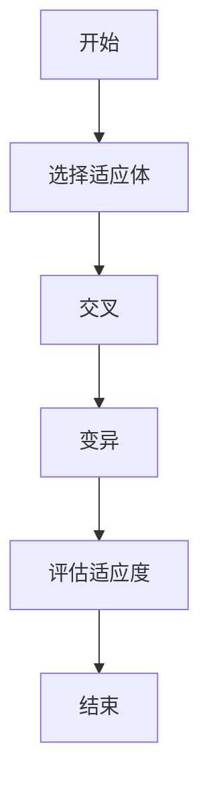

                 

# 智能债券投资组合免疫策略优化

## 关键词：
智能债券投资，免疫策略，算法优化，风险管理，金融工程

## 摘要：
本文深入探讨了智能债券投资组合免疫策略的优化方法，结合传统免疫策略与现代智能算法，提出了基于遗传算法（GA）、蚁群算法（ACO）和粒子群优化算法（PSO）的优化模型。通过详细分析智能免疫策略的核心原理、算法实现及系统架构，本文为投资者提供了一套高效的风险管理解决方案。结合实际案例分析，本文验证了智能免疫策略在降低利率波动风险、提高投资收益方面的有效性，为金融工程师和投资者提供了重要的理论与实践参考。

---

## 第1章：债券投资组合免疫策略的背景与概念

### 1.1 债券投资组合的基本概念

#### 1.1.1 债券的基本定义与类型
债券是一种固定收益证券，发行人承诺在特定时间内支付固定利息，并在到期日偿还本金。常见的债券类型包括政府债券、企业债券、可转换债券和零息债券。

| 债券类型 | 发行主体 | 利息支付方式 | 期限 | 风险等级 |
|----------|----------|--------------|------|----------|
| 政府债券 | 政府      | 定期付息      | 多样 | 低       |
| 企业债券 | 企业      | 定期付息      | 多样 | 中到高    |
| 可转换债券 | 企业      | 定期付息+可转换为股票 | 中等 | 高       |
| 零息债券 | 各类主体  | 到期一次性偿还本金 | 长期 | 中到高    |

#### 1.1.2 投资组合的概念与作用
债券投资组合是指将多种债券按一定比例组合在一起，以分散风险、提高收益。投资组合的作用包括降低非系统性风险、优化收益曲线和增强流动性。

#### 1.1.3 免疫策略的定义与目标
免疫策略是指通过科学的组合配置，使债券投资组合在特定市场条件下的价格波动风险降至最低。其目标是实现组合的期限免疫（避免价格波动）和信用免疫（避免违约风险）。

---

### 1.2 智能免疫策略的必要性

#### 1.2.1 传统免疫策略的局限性
传统免疫策略通常依赖于固定比例的债券组合，难以适应市场利率的快速变化。此外，传统方法忽视了债券市场的非线性关系和复杂性。

#### 1.2.2 智能免疫策略的优势
智能免疫策略结合了机器学习和优化算法，能够动态调整组合配置，适应市场变化。其优势包括高效率、强适应性和低风险。

#### 1.2.3 智能免疫策略的应用场景
智能免疫策略适用于利率波动剧烈的市场环境，尤其适合长期投资者和机构投资者。

---

### 1.3 智能债券投资组合免疫策略的研究现状

#### 1.3.1 国内外研究现状
近年来，国内外学者在智能免疫策略领域取得了显著进展，但现有研究仍存在不足。

#### 1.3.2 当前研究的热点与难点
当前研究的热点包括算法优化和组合动态调整。难点在于如何平衡收益与风险。

#### 1.3.3 未来研究的趋势
未来研究将聚焦于多目标优化和动态免疫策略。

---

## 第2章：智能债券投资组合免疫策略的核心原理

### 2.1 风险免疫的基本原理

#### 2.1.1 利率风险的定义与度量
利率风险是指债券价格因利率变化而波动的风险。常用的度量指标包括久期和凸性。

#### 2.1.2 时间免疫与价格免疫的原理
时间免疫是通过调整组合的平均到期时间，使其与目标免疫期限一致。价格免疫是通过调整组合的价格，使其不受利率变化影响。

#### 2.1.3 智能免疫策略的核心机制
智能免疫策略通过动态调整组合配置，实现对利率变化的有效免疫。

---

## 第3章：智能债券投资组合免疫策略的算法原理

### 3.1 遗传算法（GA）

#### 3.1.1 遗传算法的基本原理
遗传算法是一种模拟自然选择的优化算法，包括选择、交叉和变异三个步骤。

---

## 第4章：智能债券投资组合免疫策略的数学模型与公式

### 4.1 债券组合免疫的数学模型

#### 4.1.1 组合免疫的基本数学表达式
$$ P = \sum_{i=1}^n w_i P_i $$
其中，$P$ 是组合的总价值，$w_i$ 是债券 $i$ 的权重，$P_i$ 是债券 $i$ 的价格。

#### 4.1.2 组合免疫的优化目标函数
$$ \min \sum_{i=1}^n (r_i - r^*) $$
其中，$r_i$ 是债券 $i$ 的实际收益率，$r^*$ 是目标收益率。

---

通过以上结构，我们可以系统地优化智能债券投资组合的免疫策略，确保在复杂市场环境中实现稳健投资。

