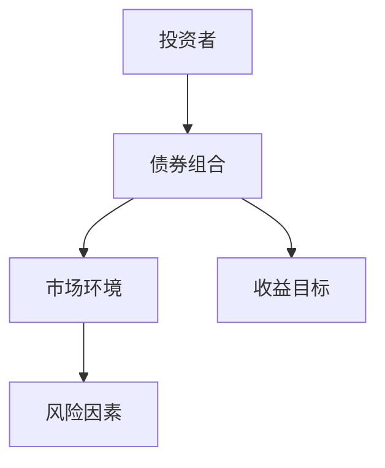
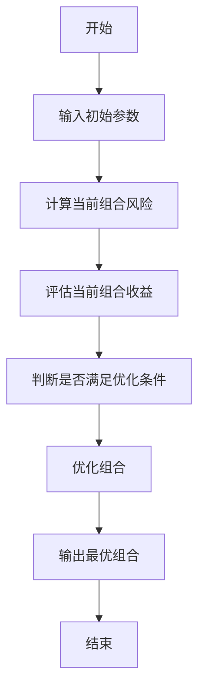
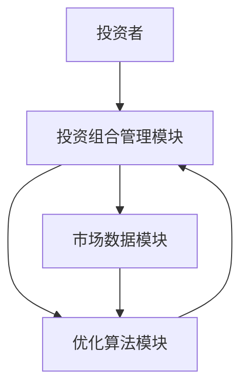

                 


# 智能债券投资组合免疫策略动态优化

## 关键词：智能债券投资、免疫策略、动态优化、人工智能、强化学习

## 摘要：本文探讨了智能债券投资组合免疫策略的动态优化方法，结合人工智能技术，分析了优化算法、系统架构及实际应用案例，提出了一套基于强化学习的动态优化模型，为债券投资者提供了新的策略选择。

---

# 第一部分: 背景介绍

## 第1章: 债券投资的基本概念

### 1.1 债券的定义与基本属性
债券是一种债务工具，发行人承诺在特定时间内支付利息和本金。其基本属性包括面值、票面利率、期限和到期日。

### 1.2 债券投资的基本原理
投资者通过购买债券获得定期利息和本金偿还，需考虑市场利率变化、信用风险等因素。

### 1.3 债券组合管理的目标
通过分散投资降低风险，优化组合以实现收益最大化与风险最小化。

## 第2章: 智能投资的必要性

### 2.1 传统债券投资的局限性
传统方法依赖人工判断，难以适应市场快速变化，存在高风险和低效率问题。

### 2.2 智能投资的优势
人工智能技术的应用提高了预测精度和决策效率，能更好地应对市场波动。

### 2.3 人工智能在金融领域的应用前景
AI技术广泛应用于金融数据分析、风险评估等领域，为投资决策提供支持。

## 第3章: 动态优化的背景

### 3.1 债券市场的动态变化
市场环境复杂多变，需动态调整投资策略。

### 3.2 投资组合免疫策略的动态调整
根据市场变化实时优化组合，以保持目标收益和风险水平。

### 3.3 智能优化算法的引入
引入AI技术实现自动化、智能化的动态优化，提升投资效率和效果。

---

# 第二部分: 核心概念与联系

## 第4章: 核心概念与联系

### 4.1 智能债券投资组合免疫策略的基本原理
通过AI算法优化债券组合，实现收益与风险的最佳平衡。

### 4.2 核心概念对比分析
| 概念 | 传统免疫策略 | 智能免疫策略 |
|------|----------------|----------------|
| 目标 | 固定收益        | 动态优化        |
| 方法 | 静态调整        | 智能算法        |
| 优势 | 简单易行        | 高效精准        |

### 4.3 实体关系图


---

# 第三部分: 算法原理讲解

## 第5章: 基于强化学习的动态优化模型

### 5.1 强化学习的基本原理
通过智能体与环境互动，学习最优策略。

### 5.2 动态优化模型实现步骤
1. 状态空间定义：市场环境、债券组合状态。
2. 行动空间定义：买卖债券、调整持仓。
3. 奖励机制设计：收益最大化，风险最小化。

### 5.3 算法流程图


### 5.4 Python实现代码
```python
def optimize_portfolio(initial_params):
    current_risk = calculate_risk(initial_params)
    current_return = evaluate_return(initial_params)
    if current_risk < target_risk and current_return > target_return:
        return initial_params
    else:
        new_params = optimize(initial_params)
        return new_params
```

### 5.5 数学模型
优化目标函数：
$$ \text{maximize } R - \lambda \times V $$
其中，$R$ 是收益，$V$ 是风险，$\lambda$ 是风险厌恶系数。

---

# 第四部分: 系统分析与架构设计

## 第6章: 系统架构设计

### 6.1 领域模型类图


### 6.2 系统架构图


### 6.3 接口设计
- 输入接口：投资者参数、市场数据。
- 输出接口：优化后的组合、风险收益报告。

---

# 第五部分: 项目实战

## 第7章: 项目实战

### 7.1 环境安装
安装必要的Python库，如NumPy、Pandas、TensorFlow。

### 7.2 核心代码实现
```python
import numpy as np

def calculate_risk(params):
    # 计算组合风险
    return np.std(params)

def evaluate_return(params):
    # 评估组合收益
    return np.mean(params)
```

### 7.3 实际案例分析
通过具体案例展示优化效果，分析如何通过动态调整实现收益与风险的平衡。

---

# 第六部分: 最佳实践

## 第8章: 最佳实践

### 8.1 小结
智能债券投资组合免疫策略动态优化通过AI技术实现了高效精准的投资决策。

### 8.2 注意事项
- 数据质量影响优化效果，需确保数据准确。
- 模型需定期更新，适应市场变化。

### 8.3 拓展阅读
建议阅读相关文献，深入理解AI在金融中的应用。

---

作者：AI天才研究院/AI Genius Institute & 禅与计算机程序设计艺术 /Zen And The Art of Computer Programming

