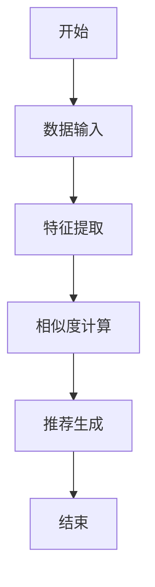

                 


# 智能债务合并建议生成器

## 关键词
智能债务合并，生成器，算法，推荐系统，系统架构，项目实战，案例分析

## 摘要
智能债务合并建议生成器是一种基于人工智能技术的债务管理工具，旨在帮助个人和企业优化债务结构，降低债务风险。本文将从背景介绍、核心概念、算法原理、系统架构、项目实战、案例分析和总结与展望等方面详细探讨智能债务合并建议生成器的设计与实现。通过理论与实践相结合的方式，本文将揭示智能债务合并生成器的内在逻辑和实际应用价值，为读者提供一份全面的技术指南。

---

## 第一部分: 智能债务合并建议生成器的背景与核心概念

### 第1章: 智能债务合并问题背景

#### 1.1 债务合并问题的背景
- **1.1.1 个人与企业债务管理的现状**  
  当前，个人和企业在债务管理方面面临诸多挑战，包括债务分散、还款压力大、利率不一致等问题。智能债务合并生成器通过优化债务结构，帮助用户降低还款压力和财务风险。

- **1.1.2 债务合并的必要性与目标**  
  债务合并的目的是通过整合多个债务来源，制定最优还款计划，降低整体还款成本和时间。智能生成器的目标是提供个性化的债务管理方案，帮助用户实现财务自由。

- **1.1.3 智能化债务管理的优势**  
  与传统债务管理方式相比，智能化债务管理能够快速处理大量数据，提供实时建议，并根据市场变化动态调整方案。

#### 1.2 智能债务合并生成器的核心概念
- **1.2.1 智能债务合并生成器的定义**  
  智能债务合并生成器是一种基于人工智能技术的债务管理工具，能够根据用户的债务情况、财务状况和市场环境，自动生成最优的债务合并建议。

- **1.2.2 核心概念的属性与特征对比**  
  通过对比分析，智能债务合并生成器的核心概念包括数据输入与处理、算法与模型、用户交互与输出。

- **1.2.3 智能债务合并生成器的边界与外延**  
  智能债务合并生成器的边界在于其输入数据的范围和输出建议的适用场景，外延则包括与其他财务管理系统（如银行系统、信用评估系统）的集成。

### 第2章: 智能债务合并生成器的核心概念与联系

#### 2.1 核心概念的原理与联系
- **2.1.1 数据输入与处理流程**  
  数据输入包括用户的基本信息、债务明细、收入支出情况等，处理流程涉及数据清洗、特征提取和标准化。

- **2.1.2 算法与模型的交互关系**  
  算法与模型的交互关系体现在推荐算法的选择和优化上，不同算法的组合能够提升生成器的推荐准确性和效率。

- **2.1.3 用户交互与输出的实现方式**  
  用户交互通过图形化界面实现，输出包括最优还款计划、债务优化建议和风险预警。

#### 2.2 核心概念的属性特征对比
- **2.2.1 数据输入的多样性与标准化**  
  数据输入来源多样，包括用户输入、第三方数据接口等，需要进行标准化处理以确保模型的准确性。

- **2.2.2 算法的可解释性与准确性**  
  算法的可解释性影响用户的信任度，准确性则决定了建议的实用性。通过对比不同算法的性能，选择最优方案。

- **2.2.3 用户交互的便捷性与反馈机制**  
  用户交互设计需要注重便捷性，同时建立有效的反馈机制以优化生成器的性能。

#### 2.3 ER实体关系图架构
```mermaid
er
  actor: 用户
  debt: 债务信息
  recommendation: 建议
  actor --> debt: 提供
  debt --> recommendation: 生成
  actor --> recommendation: 获取
```

---

## 第二部分: 智能债务合并生成器的算法原理

### 第3章: 推荐算法原理

#### 3.1 推荐算法概述
- **3.1.1 协同过滤算法**  
  协同过滤算法通过分析用户的相似性，推荐相似用户的债务合并方案。

- **3.1.2 基于内容的推荐算法**  
  基于债务特征的分析，推荐最优的合并策略。

- **3.1.3 混合推荐算法**  
  结合协同过滤和基于内容的推荐算法，提升推荐的准确性和多样性。

#### 3.2 基于协同过滤的推荐算法
- **3.2.1 用户-物品矩阵**  
  用户-物品矩阵是协同过滤的基础，通过记录用户对物品的偏好，计算相似度。

- **3.2.2 相似度计算**  
  使用余弦相似度或杰卡德相似度计算用户或物品的相似度。

- **3.2.3 推荐结果生成**  
  根据相似度排序，推荐最相关的债务合并方案。

#### 3.3 基于内容的推荐算法
- **3.3.1 特征提取**  
  从债务信息中提取关键特征，如利率、期限、债务类型等。

- **3.3.2 特征权重计算**  
  使用TF-IDF等方法计算特征的权重，提升重要特征的影响力。

- **3.3.3 推荐生成**  
  根据特征权重和相似度计算，生成个性化推荐。

#### 3.4 推荐算法的数学模型
- **协同过滤的数学模型**  
  $$\text{相似度}(u, v) = \frac{\sum_{i=1}^{n} (r_{u,i} - \bar{r}_u)(r_{v,i} - \bar{r}_v)}{\sqrt{\sum_{i=1}^{n} (r_{u,i} - \bar{r}_u)^2} \sqrt{\sum_{i=1}^{n} (r_{v,i} - \bar{r}_v)^2}}}$$  
  其中，\( r_{u,i} \) 表示用户 \( u \) 对物品 \( i \) 的评分，\( \bar{r}_u \) 是用户 \( u \) 的平均评分。

- **基于内容的推荐模型**  
  使用向量空间模型，计算债务信息的向量表示，并计算相似度。

#### 3.5 算法实现的流程图


---

## 第三部分: 智能债务合并生成器的系统架构

### 第4章: 系统架构设计

#### 4.1 问题场景介绍
- 系统需要处理大量债务数据，提供实时建议，并支持多用户同时访问。

#### 4.2 项目介绍
- 智能债务合并生成器是一个基于Web的系统，支持用户注册、登录、数据上传、建议生成和结果查看。

#### 4.3 系统功能设计
- **领域模型**  
  ```mermaid
  classDiagram
      class 用户 {
          用户ID
          姓名
          联系方式
      }
      class 债务信息 {
          债务ID
          用户ID
          债务类型
          金额
          利率
          还款期限
      }
      class 建议 {
          建议ID
          用户ID
          合并方案
          风险评估
      }
      用户 --> 债务信息: 有多对多关系
      债务信息 --> 建议: 生成
  ```

- **系统架构图**  
  ```mermaid
  rectangle 数据库 {
      债务信息表
      用户表
      建议表
  }
  rectangle 服务层 {
      数据处理服务
      推荐算法服务
  }
  rectangle 界面层 {
      用户界面
  }
  用户界面 --> 数据库: 数据查询
  数据处理服务 --> 数据库: 数据更新
  推荐算法服务 --> 数据库: 数据分析
  ```

- **系统接口设计**  
  接口包括用户认证、数据上传、建议生成和结果查询。

- **系统交互流程图**  
  ```mermaid
  sequenceDiagram
      用户 ->> 界面层: 提交债务信息
      界面层 ->> 数据处理服务: 数据清洗
      数据处理服务 ->> 推荐算法服务: 分析数据
      推荐算法服务 ->> 数据库: 生成建议
      数据库 ->> 界面层: 返回建议
      界面层 ->> 用户: 显示结果
  ```

---

## 第四部分: 智能债务合并生成器的项目实战

### 第5章: 项目实战

#### 5.1 环境安装
- 需要安装Python、Jupyter Notebook、Flask框架、数据库（MySQL或MongoDB）。

#### 5.2 核心代码实现
- 数据处理代码：```python
  def clean_data(data):
      # 数据清洗代码
      pass
  ```
- 推荐算法代码：```python
  def collaborative_filtering(users, debts):
      # 协同过滤算法实现
      pass
  ```

#### 5.3 代码解读与分析
- 数据处理代码负责清洗和标准化输入数据，确保模型能够正确处理。
- 推荐算法代码实现协同过滤算法，计算用户相似度和债务相似度，生成推荐结果。

#### 5.4 案例分析
- **用户债务情况分析**  
  用户A有三笔债务，金额分别为5000、3000、2000，利率分别为6%、5%、4%。
- **系统建议生成**  
  系统推荐将高利率债务优先偿还，优化整体还款计划。
- **结果评估**  
  用户的还款压力降低，债务总额减少。

#### 5.5 项目小结
- 通过实际案例分析，验证了智能债务合并生成器的有效性和实用性。

---

## 第五部分: 智能债务合并生成器的总结与展望

### 第6章: 总结与展望

#### 6.1 最佳实践 tips
- 数据质量是关键，确保输入数据的准确性和完整性。
- 算法选择需要根据具体场景调整，避免“一刀切”。
- 用户反馈是优化系统的重要来源，定期收集用户意见并改进系统。

#### 6.2 小结
- 智能债务合并生成器通过优化债务结构，帮助用户实现财务自由。

#### 6.3 注意事项
- 保护用户隐私，确保数据安全。
- 定期更新算法模型，适应市场变化。

#### 6.4 拓展阅读
- 推荐相关书籍和论文，深入学习推荐算法和系统架构设计。

---

## 作者：AI天才研究院/AI Genius Institute & 禅与计算机程序设计艺术 /Zen And The Art of Computer Programming

