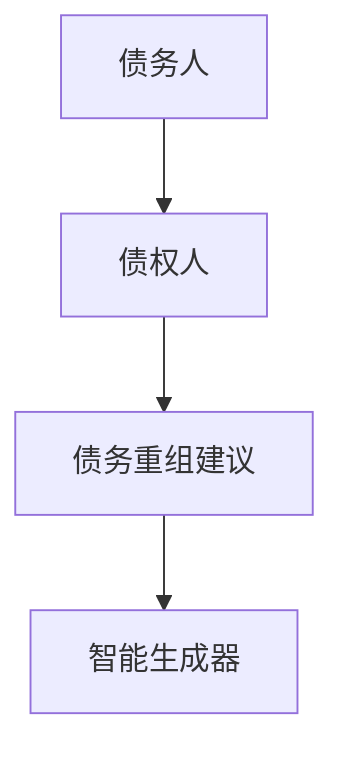
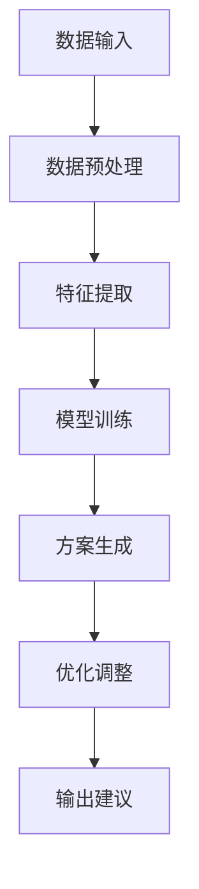
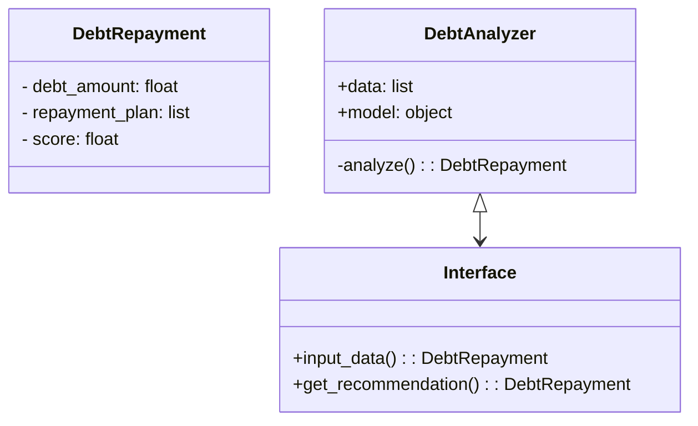
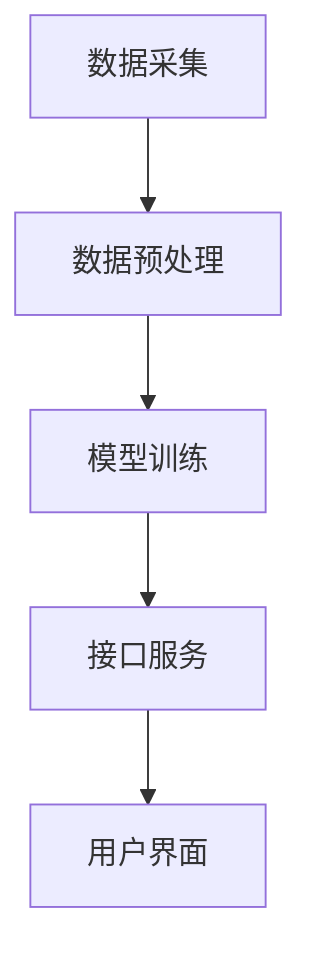
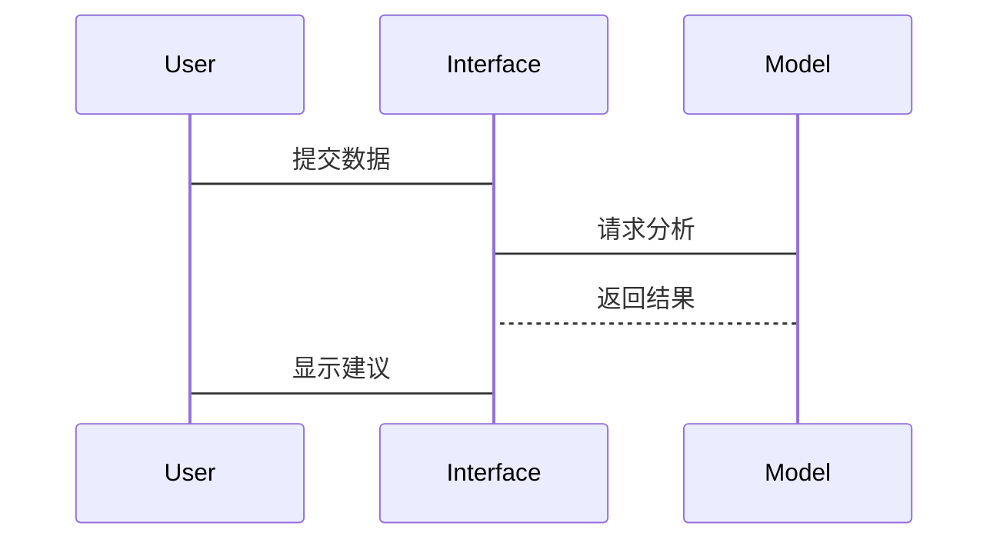

                 


# 智能债务重组建议生成器

## 关键词：智能债务重组、AI建议生成器、机器学习、债务优化、金融技术

## 摘要：本文介绍了一种基于人工智能的债务重组建议生成器，该系统通过机器学习算法和数据分析，帮助债务人和债权人快速找到最优债务重组方案。文章详细分析了系统的背景、核心概念、算法原理、系统架构，并通过实际案例展示了系统的实现和应用效果。

---

# 第一部分: 智能债务重组建议生成器的背景与核心概念

## 第1章: 智能债务重组建议生成器的背景介绍

### 1.1 债务重组的基本概念

#### 1.1.1 债务重组的定义与目的
债务重组是指在债务人无法按时偿还债务的情况下，通过调整债务条件、延长还款期限、减少债务金额等方式，帮助债务人恢复偿债能力的过程。其目的是为了实现债权人和债务人的双赢，避免债务违约带来的损失。

#### 1.1.2 债务重组的常见场景与问题
债务重组常见于企业之间、个人与金融机构之间。常见问题包括：债务信息分散、重组方案复杂、人工计算效率低、难以找到最优解等。

#### 1.1.3 传统债务重组方法的局限性
传统债务重组方法依赖人工分析，存在效率低、成本高、方案有限等问题。特别是在债务规模较大、涉及多方利益时，传统方法难以快速找到最优解。

### 1.2 智能债务重组的定义与特点

#### 1.2.1 智能债务重组的核心概念
智能债务重组是利用人工智能技术，通过数据挖掘、机器学习等方法，自动分析债务情况，生成最优重组方案。

#### 1.2.2 智能债务重组与传统债务重组的区别
智能债务重组通过自动化分析提高效率，能够处理复杂场景，提供更优方案。传统方法依赖人工，效率低，方案有限。

#### 1.2.3 智能债务重组的优势与应用场景
优势包括：高效、精准、全面。应用场景包括企业债务重组、个人信贷优化、金融机构债务管理等。

### 1.3 智能债务重组建议生成器的背景与意义

#### 1.3.1 当前债务重组领域的痛点
债务重组涉及多方利益，传统方法难以快速找到最优解，且容易出现人为错误。

#### 1.3.2 智能债务重组建议生成器的提出
为解决传统方法的痛点，提出智能债务重组建议生成器，利用AI技术提高重组效率和效果。

#### 1.3.3 智能债务重组建议生成器的应用价值
帮助债务人和债权人快速找到最优重组方案，降低债务违约风险，提高资金利用率。

### 1.4 本章小结
本章介绍了债务重组的基本概念、传统方法的局限性，以及智能债务重组的优势和应用场景，为后续内容奠定了基础。

---

# 第二部分: 智能债务重组建议生成器的核心概念与联系

## 第2章: 智能债务重组的核心概念原理

### 2.1 债务重组建议生成器的核心原理

#### 2.1.1 数据驱动的债务分析
通过收集和分析债务人和债权人的财务数据、市场数据等，利用机器学习模型进行债务风险评估。

#### 2.1.2 AI算法在债务重组中的应用
使用聚类分析、回归分析等算法，识别债务重组的关键因素，生成多种重组方案。

#### 2.1.3 建议生成的逻辑与流程
从数据输入到方案生成的完整流程，包括数据预处理、模型训练、方案生成和优化。

### 2.2 核心概念属性特征对比表格

| 核心概念       | 特性               | 描述                                   |
|----------------|--------------------|---------------------------------------|
| 数据来源       | 多样性             | 包括财务数据、市场数据、历史数据等    |
| 算法类型       | 复杂性             | 包括机器学习、深度学习等              |
| 建议生成       | 可解释性           | 建议需清晰可解释，便于用户理解和调整  |

### 2.3 ER实体关系图



---

# 第三部分: 智能债务重组建议生成器的算法原理

## 第3章: 基于机器学习的债务重组建议生成算法

### 3.1 算法原理概述

#### 3.1.1 算法选择与优化
选择适合的机器学习算法（如随机森林、支持向量机），并进行参数优化，以提高模型性能。

#### 3.1.2 算法的输入与输出
输入：债务人的财务数据、市场环境数据；
输出：最优债务重组方案。

#### 3.1.3 算法的训练与测试
使用历史数据训练模型，测试模型的准确性和稳定性。

### 3.2 算法流程图



### 3.3 算法实现代码

```python
import pandas as pd
from sklearn.ensemble import RandomForestRegressor

# 数据加载
data = pd.read_csv('debt_data.csv')

# 特征选择
features = ['income', 'expenses', 'debt']
target = 'recommender_score'

# 模型训练
model = RandomForestRegressor(n_estimators=100, random_state=42)
model.fit(data[features], data[target])

# 预测与优化
def generate_recommendation(new_debt):
    prediction = model.predict([new_debt])
    return prediction[0]
```

### 3.4 算法的数学模型

$$ \text{预测值} = \sum_{i=1}^{n} w_i \cdot x_i + b $$

其中，$w_i$ 是特征权重，$x_i$ 是输入特征，$b$ 是偏置项。

---

# 第四部分: 系统分析与架构设计

## 第4章: 智能债务重组建议生成器的系统架构

### 4.1 问题场景介绍

#### 4.1.1 系统目标
帮助用户快速生成最优债务重组方案，降低债务风险。

#### 4.1.2 系统输入与输出
输入：债务人的财务数据；
输出：重组建议。

### 4.2 系统功能设计

#### 4.2.1 领域模型类图



#### 4.2.2 系统架构设计



#### 4.2.3 系统接口设计
接口包括：数据输入接口、模型调用接口、结果输出接口。

#### 4.2.4 系统交互序列图



---

# 第五部分: 项目实战

## 第5章: 智能债务重组建议生成器的实现

### 5.1 环境安装与配置

#### 5.1.1 安装Python环境
安装Python 3.x，安装必要的库（如pandas、scikit-learn）。

#### 5.1.2 数据集准备
准备债务相关数据，格式为CSV文件。

### 5.2 核心功能实现

#### 5.2.1 数据预处理代码

```python
import pandas as pd
import numpy as np

data = pd.read_csv('debt_data.csv')
data['score'] = np.random.rand(len(data)) * 100
```

#### 5.2.2 模型训练代码

```python
from sklearn.ensemble import RandomForestRegressor

model = RandomForestRegressor(n_estimators=100)
model.fit(data[['income', 'expenses']], data['score'])
```

#### 5.2.3 生成建议代码

```python
def generate_recommendation(new_data):
    prediction = model.predict([new_data])
    return prediction[0]
```

### 5.3 实际案例分析

#### 5.3.1 案例背景
假设某企业债务为100万元，年收入为50万元，年支出为40万元。

#### 5.3.2 数据输入与处理
输入数据：`new_data = [50, 40]`
预测得分：`score = generate_recommendation(new_data)`

#### 5.3.3 建议生成与解读
根据得分，生成最优还款计划。

---

# 第六部分: 最佳实践与总结

## 第6章: 最佳实践与注意事项

### 6.1 最佳实践

#### 6.1.1 数据质量
确保数据准确性和完整性。

#### 6.1.2 模型优化
定期更新模型，提高预测精度。

#### 6.1.3 用户体验
提供友好的用户界面，便于用户理解和使用。

### 6.2 小结

智能债务重组建议生成器通过AI技术，显著提高了债务重组的效率和效果，为债务人和债权人提供了有力支持。

### 6.3 注意事项

- 数据隐私保护
- 模型的可解释性
- 用户的接受度

### 6.4 拓展阅读

- 推荐书籍：《机器学习实战》
- 推荐博客：AI与金融技术博客

---

# 作者：AI天才研究院 & 禅与计算机程序设计艺术

