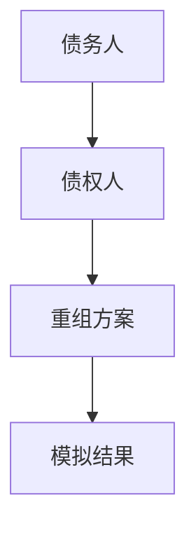
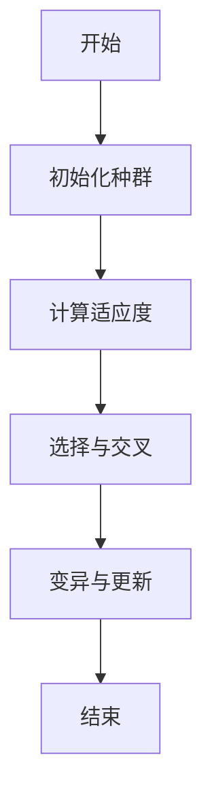
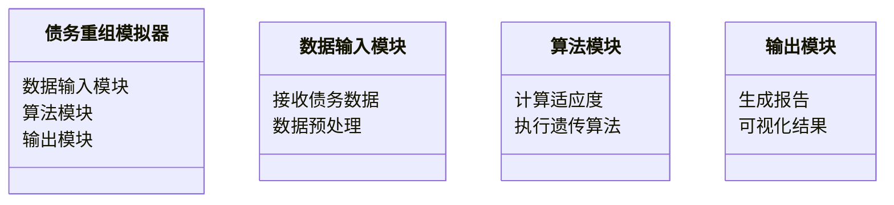
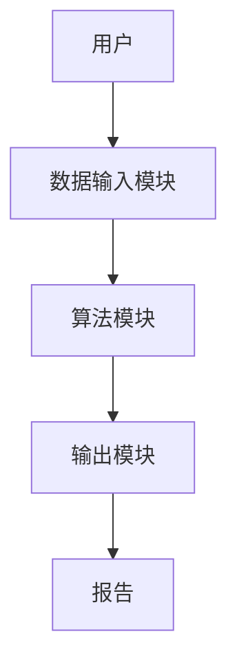
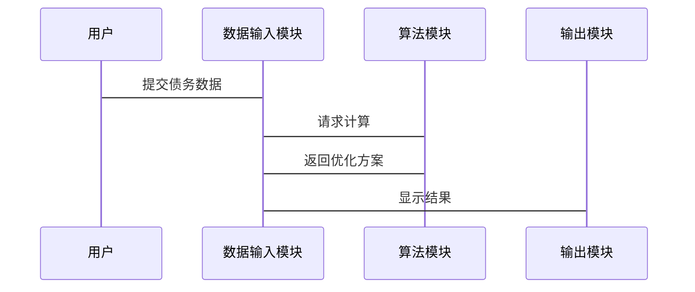

                 


# 智能债务重组方案效果模拟器

## 关键词：智能债务重组、模拟器、算法原理、系统架构、项目实战

## 摘要：智能债务重组方案效果模拟器是一种利用人工智能算法优化债务重组过程的工具，能够高效评估和优化重组方案。本文从背景介绍、核心概念、算法原理、系统架构、项目实战等多个方面详细探讨了智能债务重组模拟器的设计与实现，为读者提供全面的技术解读。

---

# 第1章: 背景介绍

## 1.1 债务重组的基本概念
### 1.1.1 什么是债务重组
债务重组是指通过调整债务条件和结构，使债务人能够更好地偿还债务的过程。常见的债务重组方式包括调整还款期限、降低利率、债转股等。

### 1.1.2 债务重组的常见方式
- 延长还款期限
- 减少债务本金
- 调整利息率
- 债转股

### 1.1.3 债务重组的必要性与挑战
- 债务重组的必要性：帮助债务人缓解短期资金压力，避免债务违约；保护债权人利益。
- 债务重组的挑战：涉及多方利益，复杂性高；传统方法效率低，难以应对复杂情况。

## 1.2 智能债务重组模拟器的提出
### 1.2.1 传统债务重组的局限性
- 传统方法依赖人工经验，效率低下。
- 无法全面考虑多种因素对重组效果的影响。
- 难以快速找到最优解。

### 1.2.2 智能模拟器的核心目标
- 提供高效、智能的债务重组方案评估工具。
- 最大化债务重组的效率和效果。

### 1.2.3 智能模拟器的应用场景
- 企业债务重组
- 个人债务重组
- 金融风险管理

## 1.3 本章小结
本章介绍了债务重组的基本概念和常见方式，分析了传统债务重组的局限性，并提出了智能债务重组模拟器的核心目标和应用场景。

---

# 第2章: 智能债务重组模拟器的核心概念

## 2.1 核心概念与定义
### 2.1.1 智能模拟器的定义
智能债务重组模拟器是一种基于人工智能算法的工具，用于评估和优化债务重组方案。

### 2.1.2 模拟器的核心模块
- 数据输入模块：接收债务相关信息。
- 算法模块：计算最优重组方案。
- 输出模块：展示模拟结果。

### 2.1.3 模拟器的输入与输出
- 输入：债务人的财务数据、债权人信息、市场环境数据。
- 输出：最优重组方案、方案对比分析。

## 2.2 核心概念之间的联系
### 2.2.1 模块间关系的对比表格
| 模块 | 输入 | 输出 |
|------|------|------|
| 数据输入 | 债务数据 | 数据预处理结果 |
| 算法模块 | 预处理数据 | 优化方案 |
| 输出模块 | 优化方案 | 可视化结果 |

### 2.2.2 ER实体关系图的 Mermaid 流程图


## 2.3 本章小结
本章详细介绍了智能债务重组模拟器的核心概念和模块之间的关系。

---

# 第3章: 智能债务重组模拟器的算法原理

## 3.1 算法概述
### 3.1.1 基于遗传算法的模拟器设计
- 遗传算法是一种模拟生物进化过程的优化算法，适用于寻找全局最优解。

### 3.1.2 算法的优化与改进
- 引入适应度函数：衡量重组方案的优劣。
- 优化交叉和变异操作：提高算法效率。

## 3.2 算法实现
### 3.2.1 算法流程的 Mermaid 流程图


### 3.2.2 Python 实现代码
```python
def genetic_algorithm(population, fitness_func, num_generations):
    for _ in range(num_generations):
        population = [select_and_crossover(individuals) for individuals in population]
        population = [mutate(individual) for individual in population]
    return population
```

## 3.3 数学模型
### 3.3.1 债务重组的数学模型
$$
\text{目标函数：} \quad \min \sum_{i=1}^{n} w_i x_i
$$
$$
\text{约束条件：} \quad \sum_{i=1}^{n} x_i \leq C
$$
其中，\( x_i \) 表示债务重组方案中的变量，\( w_i \) 是权重，\( C \) 是约束条件。

### 3.3.2 算法的数学推导
通过数学推导优化目标函数，确保算法的有效性。

## 3.4 本章小结
本章详细讲解了智能债务重组模拟器的算法原理，包括遗传算法的设计与实现。

---

# 第4章: 智能债务重组模拟器的系统分析与架构设计方案

## 4.1 系统功能设计
### 4.1.1 领域模型的 Mermaid 类图


## 4.2 系统架构设计
### 4.2.1 系统架构的 Mermaid 图


### 4.2.2 系统接口设计
- 用户界面：接收输入数据，显示结果。
- 数据接口：与外部数据源对接。

## 4.3 系统交互的 Mermaid 序列图


## 4.4 本章小结
本章详细描述了智能债务重组模拟器的系统架构和功能设计。

---

# 第5章: 项目实战

## 5.1 环境安装
- 安装 Python 和相关库（如 numpy、pandas、matplotlib）。

## 5.2 核心功能实现
### 5.2.1 数据输入与预处理
```python
import pandas as pd

def preprocess_data(data):
    # 数据清洗和预处理代码
    return processed_data
```

### 5.2.2 算法实现
```python
def genetic_algorithm(population, fitness_func, num_generations):
    for _ in range(num_generations):
        population = [select_and_crossover(individuals) for individuals in population]
        population = [mutate(individual) for individual in population]
    return population
```

### 5.2.3 结果输出与可视化
```python
import matplotlib.pyplot as plt

def visualize_results(results):
    plt.plot(results)
    plt.xlabel('Generation')
    plt.ylabel('Fitness')
    plt.show()
```

## 5.3 案例分析
- 案例背景：某企业债务重组。
- 模拟过程：输入数据，运行算法，输出结果。
- 结果分析：对比不同重组方案的效果。

## 5.4 本章小结
本章通过实际案例展示了智能债务重组模拟器的实现过程和应用效果。

---

# 第6章: 总结与展望

## 6.1 本章总结
智能债务重组模拟器通过人工智能算法优化了债务重组过程，提高了效率和效果。

## 6.2 未来展望
- 智能模拟器的进一步优化。
- 扩展应用到更多领域。

## 6.3 最佳实践 tips
- 数据输入要准确。
- 算法参数要合理设置。
- 结果分析要全面。

## 6.4 本章小结
总结了文章的主要内容，并展望了未来的发展方向。

---

# 附录

## 附录 A: 工具与库
- Python
- numpy
- pandas
- matplotlib

## 附录 B: 数据格式
- 债务数据表格示例

## 附录 C: 参考文献
- 相关论文和书籍列表

---

# 作者：AI天才研究院 & 禅与计算机程序设计艺术

---

以上是《智能债务重组方案效果模拟器》的技术博客文章的大纲和部分内容，希望对您有所帮助！

