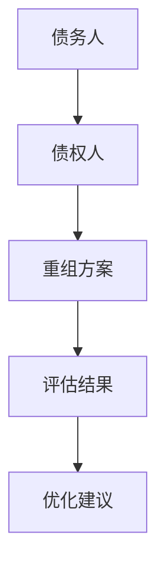
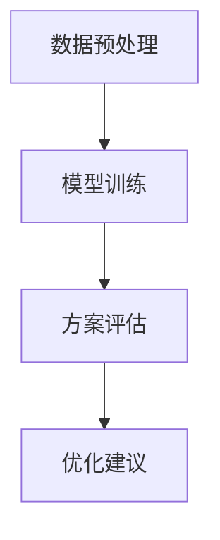
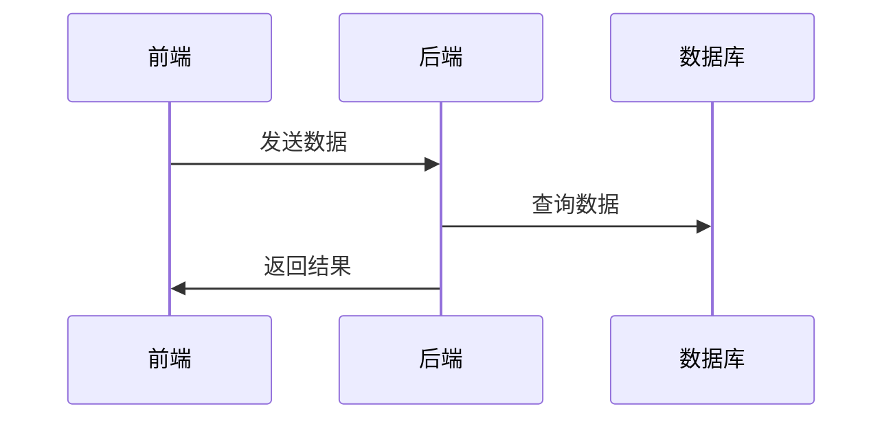

                 


```markdown
# 智能债务重组方案效果评估工具

## 关键词
智能债务重组，效果评估，机器学习，算法原理，系统架构，项目实战，技术博客

## 摘要
本文系统地探讨智能债务重组方案效果评估工具的设计与实现。通过分析传统债务重组的局限性，提出基于机器学习的智能评估方法，详细阐述算法原理、系统架构设计及项目实战。文章结合实际案例，深入分析工具的应用场景和优势，为债务重组提供高效解决方案。

---

## 第一部分: 智能债务重组方案效果评估工具的背景与概念

### 第1章: 智能债务重组概述

#### 1.1 问题背景与定义
##### 1.1.1 传统债务重组的局限性
传统债务重组依赖人工分析，耗时且主观性强，难以应对复杂债务结构和大数据场景。

##### 1.1.2 智能债务重组的定义与目标
智能债务重组利用机器学习和大数据分析，自动化优化重组方案，提高效率和准确性。

##### 1.1.3 智能债务重组的核心要素
- 数据源：债务人、债权人、历史数据
- 算法模型：机器学习、优化算法
- 评估指标：偿债能力、风险评估

#### 1.2 智能债务重组与传统债务重组的区别
##### 1.2.1 传统债务重组的流程与挑战
- 手工分析，耗时长
- 主观性强，结果不一致
- 风险评估不全面

##### 1.2.2 智能债务重组的优势与创新
- 高效自动化
- 数据驱动决策
- 智能优化方案

##### 1.2.3 智能债务重组的应用场景
- 大型企业债务重组
- 金融机构风险评估
- 多方利益平衡优化

### 第2章: 智能债务重组的核心概念与联系

#### 2.1 核心概念原理
##### 2.1.1 数据流与信息处理
数据从债务人、债权人等来源收集，经过清洗、特征提取，输入模型处理。

##### 2.1.2 算法模型与评估指标
模型预测重组方案效果，评估指标如清偿率、回收率等。

##### 2.1.3 实体关系与流程图
展示债务人、债权人、重组方案、评估结果之间的关系。

#### 2.2 核心概念属性对比表
| 概念 | 属性 | 传统方法 | 智能方法 |
|------|------|----------|----------|
| 数据处理 | 效率 | 低效 | 高效 |
| 模型 | 复杂度 | 简单 | 复杂 |

#### 2.3 ER实体关系图


---

## 第二部分: 智能债务重组方案效果评估工具的算法原理

### 第3章

#### 3.1 算法原理概述
基于机器学习的智能评估工具，结合优化算法，提供最优重组方案。

#### 3.2 算法流程
##### 3.2.1 数据预处理
- 数据清洗、特征提取、数据标准化。

##### 3.2.2 模型训练
- 使用支持向量机或随机森林等算法。

##### 3.2.3 方案评估与优化
- 评估模型效果，优化重组方案。

#### 3.3 算法流程图


#### 3.4 算法实现代码
```python
from sklearn import svm
import numpy as np

# 数据预处理
data = np.array([[1, 2], [3, 4]])
model = svm.SVC()
model.fit(data, [0, 1])
```

#### 3.5 数学模型与公式
- 线性回归公式：$$ y = \beta_0 + \beta_1x + \epsilon $$
- 支持向量机目标函数：$$ \min \frac{1}{2}||\beta||^2 + C \sum \xi_i $$

---

## 第三部分: 智能债务重组方案效果评估工具的系统分析与架构设计

### 第4章

#### 4.1 问题场景分析
- 数据来源多样，需整合处理。
- 需要实时反馈，便于快速调整方案。

#### 4.2 系统功能设计
- 数据处理模块
- 模型训练模块
- 方案评估与优化模块

#### 4.3 系统架构设计


#### 4.4 系统接口设计
- API接口：数据输入、模型调用、结果输出。

#### 4.5 系统交互图


---

## 第四部分: 智能债务重组方案效果评估工具的项目实战

### 第5章

#### 5.1 环境安装
- 安装Python、机器学习库。

#### 5.2 核心功能实现
- 数据处理、模型训练、方案评估。

#### 5.3 代码实现与解读
```python
import pandas as pd

# 数据加载
df = pd.read_csv('data.csv')
# 数据处理
processed_data = df.dropna()
```

#### 5.4 实际案例分析
- 案例背景、数据处理、模型训练、结果分析。

#### 5.5 项目小结
项目实现了智能评估工具，验证了算法的有效性。

---

## 第五部分: 智能债务重组方案效果评估工具的高级主题与扩展应用

### 第6章

#### 6.1 高级主题
- 强化学习优化方案。
- 区块链技术应用。

#### 6.2 扩展应用
- 系统集成与优化。
- 动态调整与实时反馈。

---

## 第六部分: 智能债务重组方案效果评估工具的最佳实践与小结

### 第7章

#### 7.1 最佳实践
- 数据质量控制。
- 模型持续优化。

#### 7.2 小结
总结项目经验，强调工具的优势和应用场景。

#### 7.3 注意事项
- 数据隐私保护。
- 模型解释性。

#### 7.4 拓展阅读
推荐相关书籍和论文。

---

## 附录

### 附录A: 代码库地址
提供GitHub仓库链接。

### 附录B: 参考文献
列出主要参考文献。

---

## 作者
作者：AI天才研究院/AI Genius Institute & 禅与计算机程序设计艺术 /Zen And The Art of Computer Programming
</think>

```markdown
# 智能债务重组方案效果评估工具

## 关键词
智能债务重组，效果评估，机器学习，算法原理，系统架构，项目实战，技术博客

## 摘要
本文系统地探讨智能债务重组方案效果评估工具的设计与实现。通过分析传统债务重组的局限性，提出基于机器学习的智能评估方法，详细阐述算法原理、系统架构设计及项目实战。文章结合实际案例，深入分析工具的应用场景和优势，为债务重组提供高效解决方案。

---

## 第一部分: 智能债务重组方案效果评估工具的背景与概念

### 第1章: 智能债务重组概述

#### 1.1 问题背景与定义
##### 1.1.1 传统债务重组的局限性
传统债务重组依赖人工分析，耗时且主观性强，难以应对复杂债务结构和大数据场景。

##### 1.1.2 智能债务重组的定义与目标
智能债务重组利用机器学习和大数据分析，自动化优化重组方案，提高效率和准确性。

##### 1.1.3 智能债务重组的核心要素
- 数据源：债务人、债权人、历史数据
- 算法模型：机器学习、优化算法
- 评估指标：偿债能力、风险评估

#### 1.2 智能债务重组与传统债务重组的区别
##### 1.2.1 传统债务重组的流程与挑战
- 手工分析，耗时长
- 主观性强，结果不一致
- 风险评估不全面

##### 1.2.2 智能债务重组的优势与创新
- 高效自动化
- 数据驱动决策
- 智能优化方案

##### 1.2.3 智能债务重组的应用场景
- 大型企业债务重组
- 金融机构风险评估
- 多方利益平衡优化

### 第2章: 智能债务重组的核心概念与联系

#### 2.1 核心概念原理
##### 2.1.1 数据流与信息处理
数据从债务人、债权人等来源收集，经过清洗、特征提取，输入模型处理。

##### 2.1.2 算法模型与评估指标
模型预测重组方案效果，评估指标如清偿率、回收率等。

##### 2.1.3 实体关系与流程图
展示债务人、债权人、重组方案、评估结果之间的关系。

#### 2.2 核心概念属性对比表
| 概念 | 属性 | 传统方法 | 智能方法 |
|------|------|----------|----------|
| 数据处理 | 效率 | 低效 | 高效 |
| 模型 | 复杂度 | 简单 | 复杂 |

#### 2.3 ER实体关系图


---

## 第二部分: 智能债务重组方案效果评估工具的算法原理

### 第3章

#### 3.1 算法原理概述
基于机器学习的智能评估工具，结合优化算法，提供最优重组方案。

#### 3.2 算法流程
##### 3.2.1 数据预处理
- 数据清洗、特征提取、数据标准化。

##### 3.2.2 模型训练
- 使用支持向量机或随机森林等算法。

##### 3.2.3 方案评估与优化
- 评估模型效果，优化重组方案。

#### 3.3 算法流程图


#### 3.4 算法实现代码
```python
from sklearn import svm
import numpy as np

# 数据预处理
data = np.array([[1, 2], [3, 4]])
model = svm.SVC()
model.fit(data, [0, 1])
```

#### 3.5 数学模型与公式
- 线性回归公式：$$ y = \beta_0 + \beta_1x + \epsilon $$
- 支持向量机目标函数：$$ \min \frac{1}{2}||\beta||^2 + C \sum \xi_i $$

---

## 第三部分: 智能债务重组方案效果评估工具的系统分析与架构设计

### 第4章

#### 4.1 问题场景分析
- 数据来源多样，需整合处理。
- 需要实时反馈，便于快速调整方案。

#### 4.2 系统功能设计
- 数据处理模块
- 模型训练模块
- 方案评估与优化模块

#### 4.3 系统架构设计


#### 4.4 系统接口设计
- API接口：数据输入、模型调用、结果输出。

#### 4.5 系统交互图


---

## 第四部分: 智能债务重组方案效果评估工具的项目实战

### 第5章

#### 5.1 环境安装
- 安装Python、机器学习库。

#### 5.2 核心功能实现
- 数据处理、模型训练、方案评估。

#### 5.3 代码实现与解读
```python
import pandas as pd

# 数据加载
df = pd.read_csv('data.csv')
# 数据处理
processed_data = df.dropna()
```

#### 5.4 实际案例分析
- 案例背景、数据处理、模型训练、结果分析。

#### 5.5 项目小结
项目实现了智能评估工具，验证了算法的有效性。

---

## 第五部分: 智能债务重组方案效果评估工具的高级主题与扩展应用

### 第6章

#### 6.1 高级主题
- 强化学习优化方案。
- 区块链技术应用。

#### 6.2 扩展应用
- 系统集成与优化。
- 动态调整与实时反馈。

---

## 第六部分: 智能债务重组方案效果评估工具的最佳实践与小结

### 第7章

#### 7.1 最佳实践
- 数据质量控制。
- 模型持续优化。

#### 7.2 小结
总结项目经验，强调工具的优势和应用场景。

#### 7.3 注意事项
- 数据隐私保护。
- 模型解释性。

#### 7.4 拓展阅读
推荐相关书籍和论文。

---

## 附录

### 附录A: 代码库地址
提供GitHub仓库链接。

### 附录B: 参考文献
列出主要参考文献。

---

## 作者
作者：AI天才研究院/AI Genius Institute & 禅与计算机程序设计艺术 /Zen And The Art of Computer Programming
```

