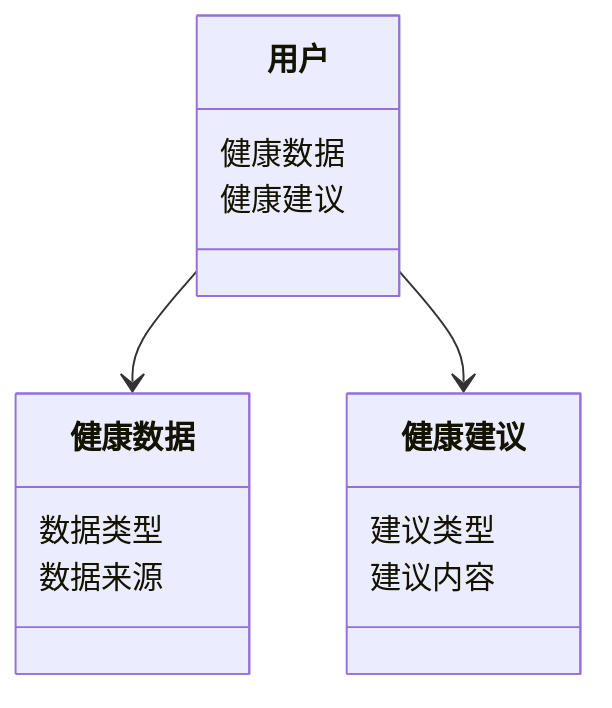
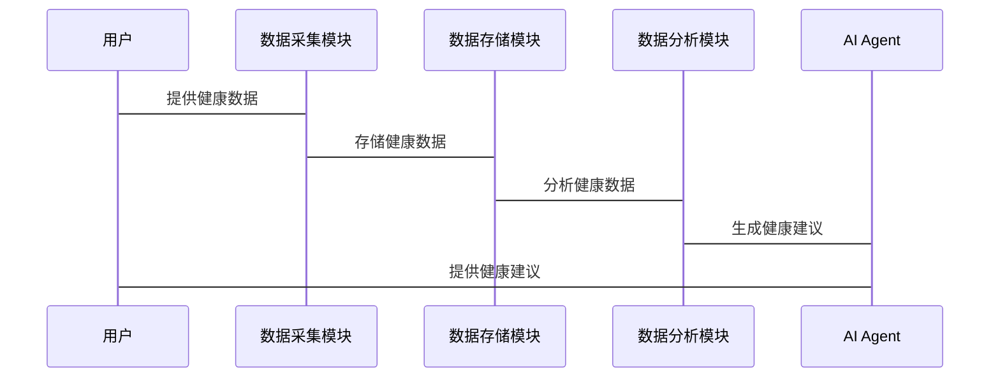

                 


# 《智能健康管理 AI Agent：LLM 驱动的个人健康助手》

> 关键词：智能健康管理, AI Agent, 大语言模型（LLM）, 个人健康助手, 人工智能, 健康管理

> 摘要：本文详细探讨了基于大语言模型（LLM）的智能健康管理AI Agent的开发与应用。文章从背景、概念、算法原理、系统架构到项目实战，全面解析了如何利用AI技术提升个人健康管理水平。通过具体案例分析和代码实现，展示了LLM驱动的AI Agent在健康数据采集、分析、个性化建议等环节中的重要作用。

---

## 第1章: 智能健康管理的背景与重要性

### 1.1 智能健康管理的背景与重要性

#### 1.1.1 传统健康管理的局限性
传统健康管理依赖人工记录和分析，存在效率低、准确性差、个性化不足等问题。例如，个人需要手动记录饮食、运动、睡眠等数据，且难以快速获取健康建议。

#### 1.1.2 智能健康管理的定义与目标
智能健康管理利用人工智能技术，通过自动化数据采集、分析和反馈，帮助用户实现个性化的健康管理和疾病预防。其目标是提供实时、精准、个性化的健康服务。

#### 1.1.3 AI Agent在健康管理中的作用
AI Agent（智能代理）能够根据用户的健康数据，主动提供健康建议、提醒和干预，帮助用户改善生活习惯，预防疾病。

---

### 1.2 LLM驱动的AI Agent核心概念

#### 1.2.1 大语言模型（LLM）的定义与特点
大语言模型是一种基于深度学习的自然语言处理模型，具有以下特点：
- **大规模训练数据**：通常使用万亿级别的文本数据进行训练。
- **强大的上下文理解**：能够理解复杂的语言结构和语义关系。
- **多任务能力**：可以执行多种任务，如文本生成、问答、分类等。

#### 1.2.2 AI Agent的基本原理与工作流程
AI Agent的工作流程包括：
1. **数据采集**：收集用户的健康数据（如饮食、运动、睡眠）。
2. **数据分析**：通过LLM分析数据，生成健康报告。
3. **健康建议**：根据分析结果，提供个性化的健康建议。

#### 1.2.3 LLM驱动的AI Agent的独特优势
- **自然语言交互**：用户可以通过自然语言与AI Agent交流。
- **个性化服务**：根据用户数据提供个性化建议。
- **实时反馈**：能够快速响应用户需求，提供实时反馈。

---

## 第2章: LLM驱动的AI Agent核心概念与原理

### 2.1 LLM的核心算法原理

#### 2.1.1 Transformer模型
Transformer模型由编码器和解码器组成，编码器负责将输入序列编码为表示，解码器负责生成输出序列。其核心在于注意力机制。

#### 2.1.2 注意力机制
注意力机制通过计算输入序列中每个位置的重要性，生成加权后的表示。公式如下：
$$
\text{Attention}(Q, K, V) = \text{softmax}\left(\frac{QK^T}{\sqrt{d_k}}\right)V
$$

#### 2.1.3 梯度下降优化方法
模型通过最小化损失函数来优化参数。常用的损失函数包括交叉熵损失和均方误差。

### 2.2 AI Agent的实体关系与功能模块

#### 2.2.1 实体关系图（ER图）
以下是AI Agent的实体关系图：

```mermaid
er
  actor: 用户
  health_data: 健康数据
  health_analysis: 健康分析
  health_advice: 健康建议
  relation: 用户 - 拥有 -> 健康数据
  relation: 健康数据 - 转换 -> 健康分析
  relation: 健康分析 - 生成 -> 健康建议
```

#### 2.2.2 功能模块划分
功能模块包括：
1. 数据采集模块：收集用户的健康数据。
2. 数据分析模块：对数据进行分析和处理。
3. 健康建议生成模块：基于分析结果生成建议。

---

## 第3章: 大语言模型（LLM）的算法原理与数学模型

### 3.1 LLM的核心算法原理

#### 3.1.1 Transformer模型的训练过程
Transformer模型通过自监督学习进行训练，目标是最小化预测的损失函数。

#### 3.1.2 注意力机制的计算过程
通过计算查询（Q）、键（K）和值（V）的点积，生成注意力权重。

#### 3.1.3 梯度下降的优化过程
通过反向传播计算梯度，并更新模型参数。

### 3.2 LLM的数学模型与公式

#### 3.2.1 概率分布与损失函数
交叉熵损失函数：
$$
\text{Loss} = -\sum_{i=1}^{n} y_i \log(p_i)
$$

其中，$y_i$是真实标签，$p_i$是模型预测的概率。

---

## 第4章: 系统架构设计与实现

### 4.1 问题场景介绍
用户需要一个能够实时监测健康数据、提供个性化建议的智能健康管理工具。

### 4.2 系统功能设计

#### 4.2.1 领域模型
以下是领域模型的类图：



### 4.3 系统架构设计

#### 4.3.1 系统架构图
以下是系统架构图：

```mermaid
graph TD
    用户 --> 数据采集模块
    数据采集模块 --> 数据存储模块
    数据存储模块 --> 数据分析模块
    数据分析模块 --> AI Agent
    AI Agent --> 用户
```

### 4.4 系统接口设计

#### 4.4.1 数据接口
- 数据采集接口：用于获取用户的健康数据。
- 数据存储接口：用于存储用户的健康数据。

#### 4.4.2 AI Agent接口
- 分析接口：用于分析健康数据。
- 建议生成接口：用于生成健康建议。

### 4.5 系统交互流程

#### 4.5.1 交互序列图
以下是系统交互序列图：



---

## 第5章: 项目实战

### 5.1 环境安装

#### 5.1.1 安装Python
需要安装Python 3.8及以上版本。

#### 5.1.2 安装依赖库
安装以下依赖库：
- `transformers`
- `torch`
- `numpy`

### 5.2 核心代码实现

#### 5.2.1 数据采集模块
```python
import pandas as pd

def collect_health_data():
    # 收集健康数据
    data = {
        '用户ID': [1, 2, 3],
        '体重': [65, 70, 75],
        '身高': [170, 165, 180],
        '心率': [70, 75, 80]
    }
    return pd.DataFrame(data)
```

#### 5.2.2 数据分析模块
```python
from transformers import AutoTokenizer, AutoModelForMaskedLM

def analyze_health_data(data):
    # 分析健康数据
    model_name = 'bert-base-uncased'
    tokenizer = AutoTokenizer.from_pretrained(model_name)
    model = AutoModelForMaskedLM.from_pretrained(model_name)
    # 具体分析逻辑
    pass
```

#### 5.2.3 健康建议生成模块
```python
def generate_health_advice(data):
    # 生成健康建议
    advice = "建议每天进行适量运动，保持均衡饮食。"
    return advice
```

### 5.3 案例分析

#### 5.3.1 案例1：用户A的健康数据
用户A的健康数据如下：
- 体重：65kg
- 身高：170cm
- 心率：70

根据数据分析，用户A的BMI指数为22.3，属于正常范围。建议用户保持现有习惯，但需注意饮食均衡。

---

## 第6章: 最佳实践与总结

### 6.1 最佳实践

#### 6.1.1 数据隐私保护
确保用户数据的隐私和安全，避免数据泄露。

#### 6.1.2 模型优化
定期更新模型，提高模型的准确性和响应速度。

### 6.2 小结
本文详细介绍了基于LLM的智能健康管理AI Agent的开发与应用，涵盖了背景、概念、算法原理、系统架构和项目实战等内容。

### 6.3 注意事项

- 数据采集应确保准确性。
- 模型训练需要大量的数据支持。
- 系统设计应注重用户体验。

### 6.4 拓展阅读
建议阅读《深度学习》（Deep Learning）和《自然语言处理实战》（Hands-On NLP with Python）等书籍，以深入理解相关技术。

---

作者：AI天才研究院/AI Genius Institute & 禅与计算机程序设计艺术 /Zen And The Art of Computer Programming

