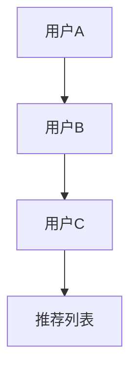
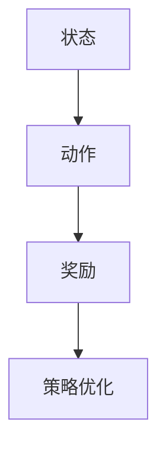
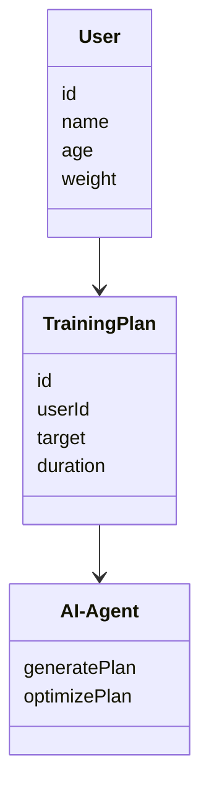
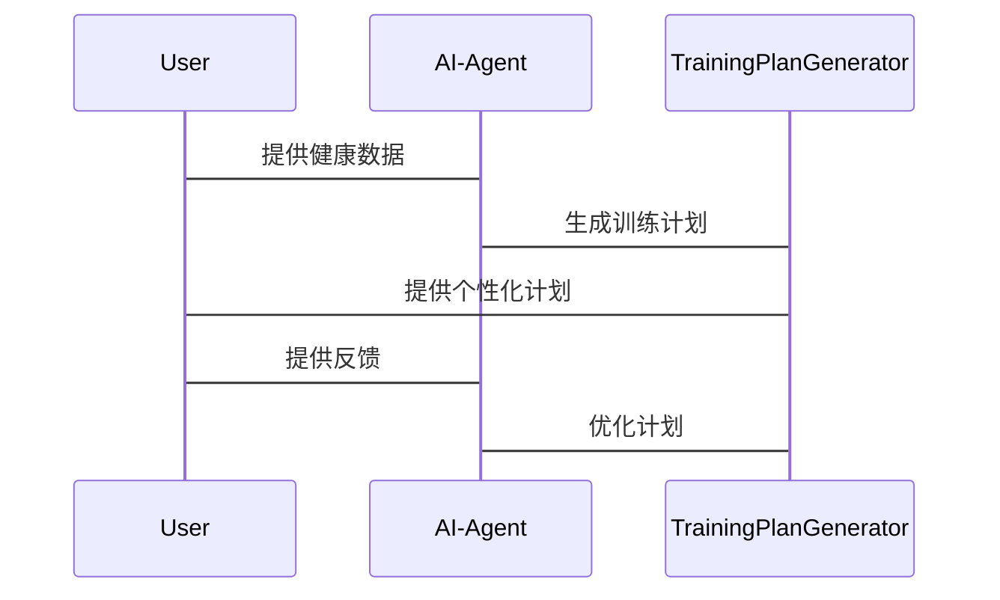

                 


# 智能健身器：AI Agent的个性化训练计划

## 关键词：AI Agent, 智能健身器, 个性化训练计划, 健身科技, 人工智能

## 摘要：本文深入探讨了AI Agent在个性化训练计划中的应用，结合实际案例和技术细节，详细阐述了AI Agent如何通过数据驱动的方式，为用户提供量身定制的健身方案。文章从理论到实践，系统性地分析了AI Agent在智能健身器中的角色、算法原理和系统架构，为读者提供了一套完整的解决方案。

---

# 第1章: AI Agent与智能健身器的背景介绍

## 1.1 AI Agent的基本概念

### 1.1.1 AI Agent的定义

AI Agent（人工智能代理）是指能够感知环境、执行任务并做出决策的智能实体。它可以是软件程序，也可以是硬件设备，其核心目标是通过自主学习和推理，为用户提供智能化的服务。

### 1.1.2 AI Agent的核心特征

- **自主性**：能够自主决策和行动。
- **反应性**：能够实时感知环境变化并做出响应。
- **学习能力**：通过数据和反馈不断优化自身行为。
- **交互性**：能够与用户或其他系统进行有效交互。

### 1.1.3 AI Agent在健身领域的应用潜力

AI Agent可以通过分析用户的运动数据、健康状况和健身目标，提供个性化的训练建议。例如，它可以实时调整训练计划，以适应用户的最新需求和身体状况。

---

## 1.2 智能健身器的发展趋势

### 1.2.1 健身行业的数字化转型

传统健身行业正在向数字化和智能化方向转型，用户对个性化和高效的健身解决方案的需求日益增长。

### 1.2.2 AI技术在健身领域的应用现状

目前，AI技术已经在健身领域得到广泛应用，例如智能手环、智能镜子和健身APP等。AI Agent的引入进一步提升了这些设备的智能化水平。

### 1.2.3 智能健身器的市场前景

随着人们对健康生活的追求不断增加，智能健身器市场有望在未来几年保持快速增长。

---

## 1.3 个性化训练计划的重要性

### 1.3.1 传统健身计划的局限性

传统健身计划往往是通用的，难以满足每个人的个性化需求。例如，同样的训练计划可能不适合不同体质或不同健身目标的人。

### 1.3.2 个性化训练计划的优势

个性化训练计划能够根据用户的具体情况量身定制，从而提高训练效果和安全性。

### 1.3.3 AI Agent在个性化训练中的作用

AI Agent可以通过分析用户的健康数据、运动习惯和目标，动态调整训练计划，确保用户能够高效达成健身目标。

---

## 1.4 本章小结

本章介绍了AI Agent的基本概念及其在健身领域的应用潜力，分析了个性化训练计划的重要性，并强调了AI Agent在实现个性化训练中的关键作用。

---

# 第2章: AI Agent与个性化训练计划的核心概念

## 2.1 AI Agent在智能健身器中的角色

### 2.1.1 AI Agent作为训练计划生成器

AI Agent可以根据用户输入的健康数据和健身目标，生成个性化的训练计划。

### 2.1.2 AI Agent作为用户行为分析器

AI Agent可以实时监测用户的运动数据，分析其行为模式，从而提供针对性的建议。

### 2.1.3 AI Agent作为训练效果优化器

AI Agent可以根据用户的训练反馈，动态调整训练计划，以优化训练效果。

---

## 2.2 个性化训练计划的构建要素

### 2.2.1 用户基本信息

- 身高、体重、年龄等基本信息。
- 健康状况（如是否有慢性疾病）。

### 2.2.2 用户健身目标

- 减脂、增肌、健康等不同目标。
- 健身周期（短期、长期等）。

### 2.2.3 用户运动习惯与偏好

- 喜欢的运动类型（如跑步、游泳等）。
- 偏好的训练时间（如早晨、晚上等）。

### 2.2.4 用户健康数据

- 心率、运动量、睡眠质量等实时数据。

---

## 2.3 AI Agent与个性化训练计划的关系

### 2.3.1 数据输入与处理

AI Agent需要收集和处理用户的健康数据和健身目标，作为生成训练计划的基础。

### 2.3.2 训练计划生成

通过算法分析，生成个性化的训练计划，并提供具体的训练动作和强度建议。

### 2.3.3 训练效果反馈与优化

根据用户的训练反馈和健康数据，不断优化训练计划，确保用户能够高效达成目标。

---

## 2.4 核心概念对比分析

### 2.4.1 AI Agent与传统健身教练的对比

- **AI Agent的优势**：24/7可用、数据驱动、个性化程度高。
- **传统健身教练的优势**：面对面指导、情感支持。

### 2.4.2 个性化训练计划与通用训练计划的对比

- **个性化训练计划**：适合个人需求、效果更好。
- **通用训练计划**：适用于广泛人群，但针对性差。

### 2.4.3 数据驱动与规则驱动的对比

- **数据驱动**：基于大量数据和机器学习模型，生成个性化建议。
- **规则驱动**：基于固定规则和经验，生成通用建议。

---

## 2.5 本章小结

本章详细阐述了AI Agent在智能健身器中的角色，分析了个性化训练计划的核心要素，并通过对比分析，突出了AI Agent的优势和潜力。

---

# 第3章: AI Agent的算法原理

## 3.1 推荐算法

### 3.1.1 协同过滤推荐算法

协同过滤是一种基于用户相似性推荐算法，常用在个性化推荐系统中。

#### 算法流程图



### 3.1.2 基于内容的推荐算法

基于内容的推荐算法通过分析训练计划的内容特征，为用户推荐相似的计划。

#### Python代码示例

```python
def collaborative_filtering(user_id, user_similarity_matrix):
    # 找到与当前用户相似性最高的用户
    similar_users = user_similarity_matrix[user_id]
    # 返回相似用户的平均评分
    return similar_users.mean()
```

---

## 3.2 自适应优化算法

### 3.2.1 基于强化学习的自适应优化

强化学习是一种通过试错机制优化决策的算法，适用于动态调整训练计划。

#### 算法流程图



### 3.2.2 基于遗传算法的优化

遗传算法是一种模拟自然选择的优化算法，适用于复杂问题的全局优化。

#### Python代码示例

```python
import numpy as np

def fitness(individual):
    # 计算适应度
    return np.sum(individual)

def evolve(population, fitness_func):
    # 选择、交叉、变异
    pass
```

---

## 3.3 算法原理小结

本章通过协同过滤和强化学习等算法，详细介绍了AI Agent在个性化训练计划中的实现原理，并通过代码示例加深了读者的理解。

---

# 第4章: 智能健身器的系统分析与架构设计

## 4.1 系统功能设计

### 4.1.1 领域模型



---

## 4.2 系统架构设计

### 4.2.1 分层架构


---

## 4.3 系统接口设计

### 4.3.1 用户接口

- 输入：用户基本信息、健身目标。
- 输出：个性化训练计划。

### 4.3.2 数据接口

- 输入：健康数据（如心率、运动量）。
- 输出：训练效果反馈。

---

## 4.4 系统交互设计

### 4.4.1 交互流程图



---

## 4.5 本章小结

本章通过系统分析和架构设计，展示了AI Agent在智能健身器中的具体实现方式，并通过类图和流程图帮助读者更好地理解系统结构。

---

# 第5章: 项目实战

## 5.1 环境安装

- 安装Python和相关库（如numpy、pandas、scikit-learn）。

## 5.2 系统核心实现

### 5.2.1 训练计划生成器

```python
def generate_plan(user_data):
    # 根据用户数据生成训练计划
    return plan
```

### 5.2.2 效果反馈与优化

```python
def optimize_plan(plan, feedback):
    # 根据反馈优化训练计划
    return optimized_plan
```

---

## 5.3 代码实现与解读

### 5.3.1 核心代码实现

```python
import numpy as np

def main():
    user_data = {"age": 25, "weight": 70, "target": "减脂"}
    plan = generate_plan(user_data)
    feedback = {"heart_rate": 120, "satisfaction": 80}
    optimized_plan = optimize_plan(plan, feedback)
    print(optimized_plan)

if __name__ == "__main__":
    main()
```

### 5.3.2 代码解读

- `generate_plan`：根据用户数据生成初始训练计划。
- `optimize_plan`：根据反馈优化训练计划。

---

## 5.4 实际案例分析

### 5.4.1 案例背景

用户A，25岁，体重70公斤，目标是减脂。

### 5.4.2 训练计划生成

初始计划：每天跑步30分钟，搭配力量训练。

### 5.4.3 反馈与优化

根据用户的反馈，优化计划为：增加间歇训练，减少力量训练时间。

---

## 5.5 本章小结

本章通过实际案例分析，展示了AI Agent在智能健身器中的具体应用，并通过代码实现帮助读者理解系统的运行逻辑。

---

# 第6章: 最佳实践与注意事项

## 6.1 最佳实践

### 6.1.1 数据隐私保护

确保用户的健康数据得到妥善保护，避免数据泄露。

### 6.1.2 算法调优

定期优化算法，确保训练计划的有效性和安全性。

---

## 6.2 注意事项

### 6.2.1 数据准确性

确保输入数据的准确性，以提高训练计划的科学性。

### 6.2.2 用户体验

注重用户体验，确保系统界面友好，操作简便。

---

## 6.3 拓展阅读

推荐阅读相关领域的书籍和论文，以进一步深入学习AI Agent和个性化训练计划的技术细节。

---

## 6.4 本章小结

本章总结了AI Agent在智能健身器中的最佳实践和注意事项，并为读者提供了拓展阅读的方向。

---

# 作者：AI天才研究院/AI Genius Institute & 禅与计算机程序设计艺术 /Zen And The Art of Computer Programming

