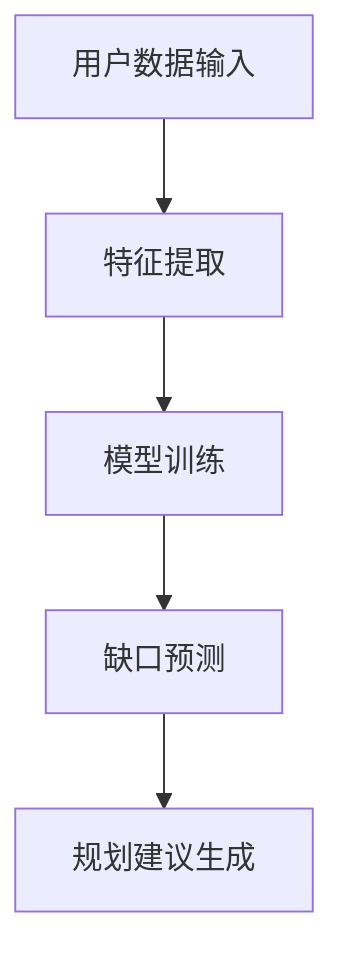
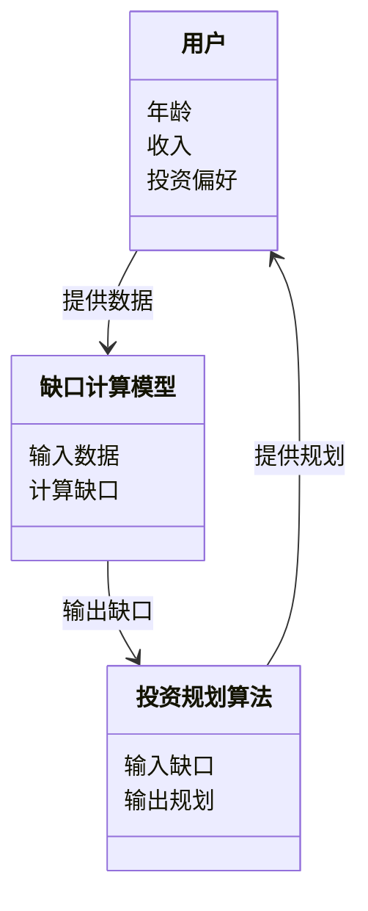

                 


# 智能养老金缺口分析与规划工具

## 关键词：智能养老金缺口分析，规划工具，人工智能，机器学习，退休规划

## 摘要：  
随着人口老龄化加剧和退休金体系的压力增大，如何有效分析养老金缺口并制定个性化规划方案成为亟待解决的重要问题。本文将结合人工智能和大数据技术，介绍一种智能养老金缺口分析与规划工具的设计与实现。通过机器学习算法和数据驱动的方法，该工具能够帮助用户准确评估当前养老金缺口，并提供最优的退休规划建议，确保退休生活的质量。本文将从背景分析、核心概念、算法原理、系统架构到项目实战等多方面进行深入探讨。

---

## 第一章：智能养老金缺口分析的背景与问题

### 1.1 养老金缺口问题的背景  
随着全球人口老龄化问题的加剧，养老金体系面临着前所未有的挑战。传统的养老金体系基于固定公式和简单模型，难以满足个性化需求。许多人在退休后因养老金不足而面临生活质量下降的风险。因此，如何通过智能化手段准确分析养老金缺口并制定个性化规划方案，成为当前亟待解决的问题。

#### 1.1.1 养老金缺口的定义  
养老金缺口是指退休后实际所需资金与实际可获得养老金之间的差额。这个缺口可能来源于多种因素，如工作年限、收入水平、通胀率、寿命预期等。

#### 1.1.2 养老金缺口问题的现状  
- 传统养老金计算方法过于简化，无法考虑个性化因素。  
- 缺乏实时数据和动态调整机制，导致规划结果偏差较大。  
- 用户对养老金缺口的认知不足，缺乏专业工具支持。  

#### 1.1.3 解决思路  
通过人工智能和大数据技术，构建一个智能化的养老金缺口分析工具，结合用户的个性化数据，提供精准的缺口分析和规划建议。

### 1.2 智能养老金缺口分析的核心要素  
#### 1.2.1 数据来源与特征  
- 数据来源：工资历史、当前收入、通胀率、寿命预期、投资偏好等。  
- 数据特征：时序性、动态性、关联性。  

#### 1.2.2 分析目标  
- 准确计算当前养老金缺口。  
- 评估退休后生活质量。  
- 提供可行的投资和储蓄建议。  

#### 1.2.3 边界与外延  
- 边界：仅考虑养老金缺口，不涉及其他退休收入来源。  
- 外延：与投资规划、健康管理等领域密切相关。  

### 1.3 本章小结  
本章从背景和问题出发，阐述了智能养老金缺口分析的必要性，并提出了核心要素和目标。

---

## 第二章：智能养老金缺口分析的核心概念与联系  

### 2.1 核心概念  
#### 2.1.1 用户画像  
用户画像是基于用户提供的数据构建的个性化模型，包括年龄、收入、职业、家庭状况等因素。  

#### 2.1.2 缺口计算模型  
缺口计算模型是基于机器学习算法构建的预测模型，用于估算用户退休后养老金的缺口。  

#### 2.1.3 投资规划算法  
投资规划算法是根据用户的缺口和风险偏好，推荐最优的投资组合以弥补缺口。  

### 2.2 核心概念的属性特征对比  
| 核心概念      | 属性特征               |  
|----------------|------------------------|  
| 用户画像       | 个性化、动态性          |  
| 缺口计算模型    | 数据驱动、精准性        |  
| 投资规划算法    | 风险敏感性、可调整性    |  

### 2.3 实体关系图  
```mermaid
erDiagram
    用户 --> 用户画像 : 提供数据
    用户 --> 缺口计算模型 : 输入数据
    缺口计算模型 --> 投资规划算法 : 输出缺口
    投资规划算法 --> 用户 : 提供规划建议
```

### 2.4 本章小结  
本章通过核心概念的分析和实体关系图，明确了智能养老金缺口分析工具的关键组成部分及其相互关系。

---

## 第三章：智能养老金缺口分析的算法原理  

### 3.1 算法选择与原理  
#### 3.1.1 线性回归模型  
线性回归模型用于预测养老金缺口，基于用户的基本数据（如年龄、收入）进行线性拟合。  

#### 3.1.2 随机森林模型  
随机森林模型用于处理非线性关系和特征重要性分析，能够更好地捕捉用户数据的复杂性。  

### 3.2 算法流程图  


### 3.3 数学模型与公式  
#### 3.3.1 线性回归模型  
$$ \text{缺口} = \beta_0 + \beta_1 \times \text{收入} + \beta_2 \times \text{年龄} + \epsilon $$  

#### 3.3.2 随机森林模型  
随机森林通过多棵决策树的集成模型，提高预测精度和鲁棒性。  

### 3.4 代码实现  
```python
import pandas as pd
from sklearn.ensemble import RandomForestRegressor

# 加载数据
data = pd.read_csv('pension.csv')

# 特征与目标
X = data[['收入', '年龄', '投资偏好']]
y = data['缺口']

# 模型训练
model = RandomForestRegressor(n_estimators=100)
model.fit(X, y)

# 预测
predicted = model.predict(X)
```

### 3.5 本章小结  
本章通过算法选择、流程图和数学模型，详细讲解了智能养老金缺口分析的实现原理。

---

## 第四章：系统架构与设计  

### 4.1 系统功能模块  
- 数据采集模块：收集用户数据。  
- 缺口计算模块：基于机器学习模型计算缺口。  
- 投资规划模块：推荐最优投资方案。  

### 4.2 领域模型图  


### 4.3 系统架构图  


### 4.4 本章小结  
本章通过系统架构设计，展示了智能养老金缺口分析工具的实现框架。

---

## 第五章：项目实战与案例分析  

### 5.1 项目环境安装  
- 安装Python和相关库（如pandas、scikit-learn）。  

### 5.2 核心功能实现  
```python
# 数据清洗
data = data.dropna()
data = pd.get_dummies(data)

# 模型优化
model = RandomForestRegressor(max_depth=10, random_state=42)
model.fit(X_train, y_train)
score = model.score(X_test, y_test)
print(f"模型得分：{score}")
```

### 5.3 案例分析  
假设一位45岁收入为50万元的用户，通过工具计算其养老金缺口为50万元，并推荐投资组合以实现目标。  

### 5.4 本章小结  
本章通过实际案例分析和代码实现，展示了智能养老金缺口分析工具的应用价值。

---

## 第六章：最佳实践与总结  

### 6.1 最佳实践  
- 数据质量是关键，需确保数据的完整性和准确性。  
- 定期更新模型以适应市场变化。  

### 6.2 注意事项  
- 避免模型过拟合，确保泛化能力。  
- 保护用户隐私，确保数据安全。  

### 6.3 拓展阅读  
- 《机器学习实战》  
- 《Python机器学习》  

### 6.4 本章小结  
本章总结了项目的实施经验，并提供了进一步学习的建议。

---

## 作者：AI天才研究院/AI Genius Institute & 禅与计算机程序设计艺术/Zen And The Art of Computer Programming  

---

通过本文的详细讲解，我们系统地探讨了智能养老金缺口分析与规划工具的设计与实现，结合理论与实践，为读者提供了一个全面的解决方案。

