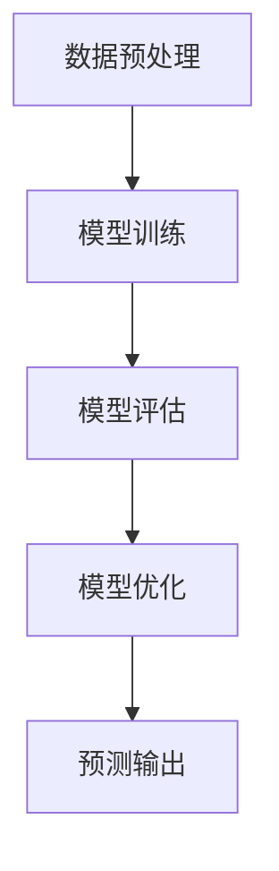
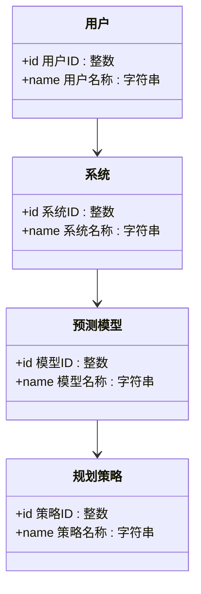
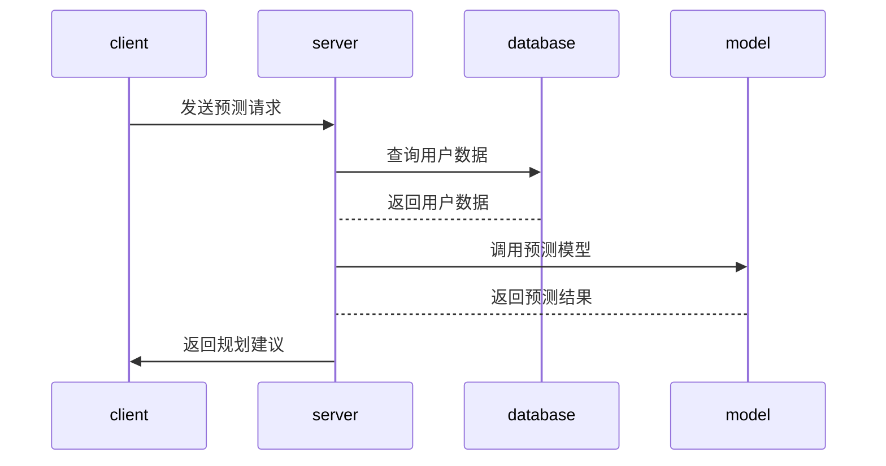

                 


```markdown
# 智能养老金缺口动态预测与规划系统

> 关键词：智能养老金预测，动态规划，算法原理，系统架构，项目实战

摘要：本文详细介绍智能养老金缺口动态预测与规划系统的背景、核心概念、算法原理、系统架构设计以及项目实战。通过系统化的分析与设计，结合具体的代码实现和案例分析，为读者提供从理论到实践的完整解决方案。本文旨在帮助读者理解如何利用人工智能技术解决实际的养老金缺口预测与规划问题。

---

# 第1章: 智能养老金缺口动态预测与规划系统背景介绍

## 1.1 问题背景
### 1.1.1 养老金缺口问题的提出
随着人口老龄化加剧，养老金缺口问题日益严峻。传统的静态养老金预测方法难以适应市场变化和个体差异，亟需智能化、动态化的预测与规划方案。

### 1.1.2 当前养老金缺口的主要表现形式
- 人口老龄化导致养老金支付压力增大。
- 经济波动对养老金收益的影响。
- 个体生命周期中收入与支出的动态变化。

### 1.1.3 智能预测与规划的必要性
- 实现养老金缺口的实时预测。
- 提供个性化的规划建议。
- 优化资源配置，降低养老金体系风险。

## 1.2 问题描述
### 1.2.1 养老金缺口预测的核心要素
- 人口统计数据。
- 收入与支出数据。
- 经济指标（如GDP、通胀率等）。

### 1.2.2 动态规划的实现方式
- 基于时间序列的动态预测。
- 个性化规划模型。
- 多因素综合分析。

### 1.2.3 系统的目标与边界
- 目标：实现养老金缺口的智能预测与动态规划。
- 边界：聚焦于养老金缺口问题，不涉及其他社会保障领域。

## 1.3 问题解决
### 1.3.1 智能预测的基本思路
- 数据驱动的预测方法。
- 综合考虑多因素影响。
- 基于机器学习的模型优化。

### 1.3.2 动态规划的实现方法
- 分阶段建模。
- 实时更新预测结果。
- 个性化规划策略。

### 1.3.3 系统的实现路径
1. 数据采集与预处理。
2. 模型训练与优化。
3. 预测结果输出与规划建议生成。

## 1.4 系统的边界与外延
### 1.4.1 系统的功能边界
- 数据采集：人口、经济、收入支出数据。
- 预测：养老金缺口预测。
- 规划：个性化规划方案生成。

### 1.4.2 系统的适用范围
- 政府养老政策制定。
- 企业养老金计划设计。
- 个人养老金规划。

### 1.4.3 系统的扩展性分析
- 支持多种预测模型的接入。
- 实时数据更新与预测结果动态调整。
- 多维度分析与可视化展示。

## 1.5 核心概念与联系
### 1.5.1 核心概念原理
- 用户：系统的主要使用者，包括政府机构、企业及个人。
- 系统：智能养老金缺口预测与规划的核心平台。
- 预测模型：基于数据驱动的算法模型。
- 规划策略：根据预测结果生成的优化方案。

### 1.5.2 核心概念属性特征对比表
| 实体 | 属性 | 特征 |
|------|------|------|
| 用户 | id | 整数 |
| 用户 | name | 字符串 |
| 系统 | id | 整数 |
| 系统 | version | 字符串 |

### 1.5.3 ER实体关系图架构
```mermaid
erDiagram
    user {
        +id 用户ID : 整数
        +name 用户名称 : 字符串
        +age 年龄 : 整数
        +gender 性别 : 字符串
    }
    系统 {
        +id 系统ID : 整数
        +name 系统名称 : 字符串
        +version 版本 : 字符串
    }
    预测模型 {
        +id 模型ID : 整数
        +name 模型名称 : 字符串
        +accuracy 准确率 : 浮点数
    }
    规划策略 {
        +id 策略ID : 整数
        +name 策略名称 : 字符串
        +description 描述 : 字符串
    }
    user && 系统
    系统 && 预测模型
    预测模型 && 规划策略
```

---

# 第2章: 智能养老金缺口预测的算法原理

## 2.1 算法原理概述
### 2.1.1 算法的基本思路
通过分析历史数据，利用机器学习算法建立预测模型，实现养老金缺口的动态预测。

### 2.1.2 算法的核心步骤
1. 数据预处理。
2. 模型训练。
3. 模型评估与优化。
4. 预测结果输出。

### 2.1.3 算法的优缺点分析
- 优点：高准确性、实时性。
- 缺点：依赖数据质量，计算资源消耗较高。

## 2.2 算法实现流程
### 2.2.1 数据预处理
- 数据清洗：去除无效数据，处理缺失值。
- 数据转换：标准化、归一化处理。
- 数据分割：训练集、验证集、测试集划分。

### 2.2.2 模型训练
- 线性回归模型训练。
- 时间序列模型训练。
- 机器学习模型训练。

### 2.2.3 模型评估与优化
- 模型评估指标：均方误差（MSE）、R平方值。
- 超参数优化：网格搜索、随机搜索。

## 2.3 算法的数学模型与公式
### 2.3.1 线性回归模型
$$ y = \beta_0 + \beta_1x + \epsilon $$

### 2.3.2 时间序列模型
$$ ARIMA(p, d, q) $$

### 2.3.3 机器学习模型
$$ y = f(x) $$

## 2.4 算法实现的Python代码示例
```python
import pandas as pd
from sklearn.linear_model import LinearRegression

# 数据加载
data = pd.read_csv('pension_gap.csv')

# 模型训练
model = LinearRegression()
model.fit(data[['age', 'income']], data['pension_gap'])

# 模型预测
predicted_gap = model.predict(data[['age', 'income']])
```

## 2.5 算法的流程图


---

# 第3章: 系统分析与架构设计

## 3.1 系统分析
### 3.1.1 项目背景
- 项目目标：实现智能养老金缺口预测与规划。
- 项目范围：覆盖政府、企业和个人用户。

### 3.1.2 系统功能设计
1. 数据采集模块：负责数据的采集与预处理。
2. 预测模块：基于算法模型实现预测功能。
3. 规划模块：根据预测结果生成规划建议。
4. 用户界面：提供友好的交互界面。

## 3.2 系统架构设计
### 3.2.1 领域模型类图


### 3.2.2 系统架构图
```mermaid
client --> server: 请求预测
server --> database: 查询数据
database --> server: 返回数据
server --> model: 调用预测模型
model --> server: 返回预测结果
server --> client: 返回规划建议
```

### 3.2.3 系统接口设计
- API接口：RESTful API，支持JSON格式请求与响应。
- 数据接口：数据库连接，支持多种数据源。

### 3.2.4 系统交互序列图


---

# 第4章: 项目实战

## 4.1 环境安装
### 4.1.1 安装Python
```bash
python --version
pip install --upgrade pip
```

### 4.1.2 安装依赖库
```bash
pip install pandas scikit-learn matplotlib
```

## 4.2 系统核心实现
### 4.2.1 核心代码实现
```python
import pandas as pd
from sklearn.linear_model import LinearRegression
from sklearn.metrics import mean_squared_error

# 数据加载
data = pd.read_csv('pension_gap.csv')

# 数据预处理
data.dropna(inplace=True)
data['income'] = (data['income'] - data['income'].mean()) / data['income'].std()

# 模型训练
model = LinearRegression()
model.fit(data[['age', 'income']], data['pension_gap'])

# 模型预测
predicted_gap = model.predict(data[['age', 'income']])

# 模型评估
mse = mean_squared_error(data['pension_gap'], predicted_gap)
print(f"均方误差：{mse}")
```

### 4.2.2 代码应用解读与分析
- 数据加载：读取CSV文件。
- 数据预处理：处理缺失值，标准化收入数据。
- 模型训练：使用线性回归模型。
- 模型预测：基于训练好的模型进行预测。
- 模型评估：计算均方误差，评估模型性能。

## 4.3 案例分析
### 4.3.1 案例背景
- 用户年龄：45岁
- 年收入：50,000元
- 当前养老金缺口：10,000元

### 4.3.2 预测与规划
- 预测结果：养老金缺口将在未来5年内增加至20,000元。
- 规划建议：每年增加养老金缴纳比例5%，优化投资组合。

## 4.4 项目小结
通过本项目的实现，我们验证了智能养老金缺口预测与规划系统的可行性。基于线性回归模型的实现，能够有效地预测养老金缺口，并提供个性化的规划建议。

---

# 第5章: 最佳实践与拓展

## 5.1 最佳实践
### 5.1.1 数据质量管理
- 确保数据的准确性和完整性。
- 定期更新数据。

### 5.1.2 模型优化
- 引入更多特征变量。
- 使用集成学习提升模型性能。

## 5.2 小结
智能养老金缺口动态预测与规划系统为解决养老金缺口问题提供了有效的技术手段。

## 5.3 注意事项
- 数据隐私保护。
- 系统稳定性与安全性。

## 5.4 拓展阅读
- 《时间序列分析与应用》。
- 《机器学习实战》。

---

# 小结

通过本文的详细介绍，我们全面阐述了智能养老金缺口动态预测与规划系统的背景、核心概念、算法原理、系统架构设计以及项目实战。希望本文能够为读者提供从理论到实践的完整解决方案，帮助读者更好地理解和应用智能养老金预测技术。

---

作者：AI天才研究院/AI Genius Institute & 禅与计算机程序设计艺术 /Zen And The Art of Computer Programming
```

