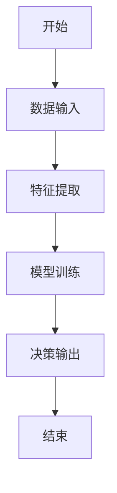
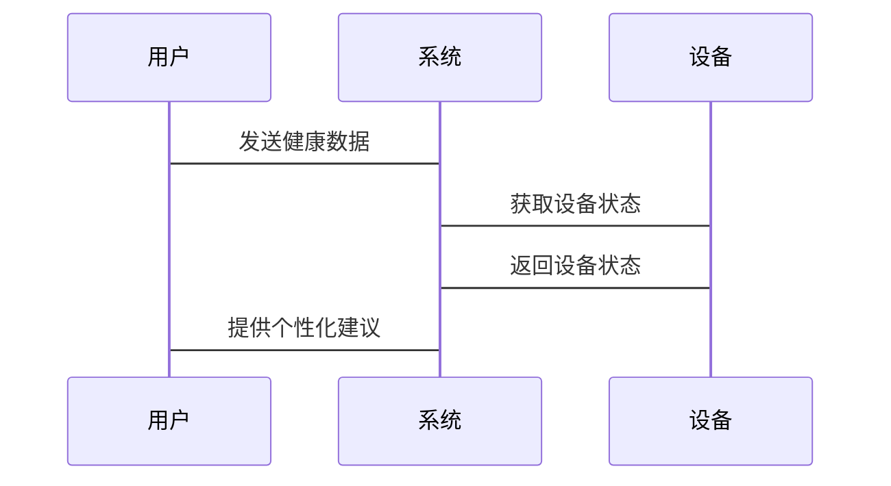

                 


# 智能养老：AI Agent辅助的居家照护系统

> 关键词：智能养老，AI Agent，居家照护，人工智能，系统架构，算法原理

> 摘要：随着全球老龄化加剧，智能养老成为社会关注的焦点。本文深入探讨AI Agent在居家照护系统中的应用，分析其算法原理、系统架构，并通过实际案例展示其在智能养老中的价值。文章从背景、核心概念、技术实现、系统设计到项目实战，全面解析AI Agent辅助的居家照护系统，为智能养老的未来发展提供理论支持和实践指导。

---

## 第一部分：智能养老的背景与挑战

### 第1章：智能养老的背景与问题背景

#### 1.1 智能养老的概念与现状
- **1.1.1 传统养老模式的局限性**
  - 传统居家养老依赖家人或护工，存在效率低、资源浪费问题。
  - 随着老龄化加剧，人力资源不足成为主要矛盾。
  - 现代家庭结构变化，年轻人工作压力大，难以提供持续照护。

- **1.1.2 智能养老的定义与特点**
  - 智能养老：通过AI、物联网等技术实现智能化、个性化的养老服务。
  - 特点：实时监测、智能决策、远程交互、个性化服务。

- **1.1.3 当前智能养老的发展趋势**
  - 技术驱动：AI、IoT、大数据等技术的融合。
  - 市场需求：老年人群体扩大，智能设备普及率提高。
  - 政策支持：政府出台多项政策推动智慧养老发展。

#### 1.2 AI Agent在养老领域的应用背景
- **1.2.1 AI Agent的基本概念**
  - AI Agent：具有自主决策能力的智能体，能够感知环境、执行任务。
  - 核心能力：学习、推理、规划、执行。

- **1.2.2 AI Agent在居家照护中的优势**
  - 24小时在线，实时响应。
  - 多任务处理，提高效率。
  - 数据驱动，精准决策。

- **1.2.3 养老领域对AI Agent的需求分析**
  - 需求场景：健康监测、生活辅助、紧急救助。
  - 需求特点：个性化、实时性、安全性。

#### 1.3 居家照护系统的核心问题
- **1.3.1 居家照护的主要挑战**
  - 老年人健康状况复杂，需求多样化。
  - 系统需要处理大量实时数据，对响应速度要求高。
  - 数据隐私保护和系统安全性问题。

- **1.3.2 AI Agent在居家照护中的关键任务**
  - 用户需求分析：识别老年人的具体需求。
  - 任务分配：合理分配资源和任务。
  - 实时监控：持续跟踪老年人的健康状况。

- **1.3.3 系统设计的目标与边界**
  - 目标：提供高效、安全、个性化的居家照护服务。
  - 边界：仅关注居家场景，不涉及机构养老。

#### 1.4 本章小结
- **1.4.1 智能养老的核心概念**
  - 智能养老通过技术手段提升养老服务效率和质量。
  - AI Agent是实现智能化照护的关键技术。

- **1.4.2 AI Agent在居家照护中的作用**
  - 提供实时、高效的辅助支持。
  - 解决传统照护中的资源不足问题。

- **1.4.3 系统设计的关键问题**
  - 系统需要处理复杂的需求和实时数据。
  - 数据隐私和系统安全性是设计重点。

---

## 第二部分：AI Agent与居家照护系统的核心概念

### 第2章：AI Agent的核心原理与实现

#### 2.1 AI Agent的基本原理
- **2.1.1 AI Agent的定义与分类**
  - 定义：AI Agent是具有感知和行动能力的智能体。
  - 分类：基于智能水平，分为简单反射型、基于模型的反应型、目标驱动型和实用驱动型。

- **2.1.2 AI Agent的核心组件**
  - 知识库：存储领域知识和用户数据。
  - 感知模块：采集环境信息。
  - 决策模块：基于知识库和感知信息做出决策。
  - 行动模块：执行决策任务。

- **2.1.3 AI Agent的工作流程**
  1. 感知环境：采集用户数据和环境信息。
  2. 理解需求：分析数据，识别用户需求。
  3. 制定计划：根据需求生成行动计划。
  4. 执行任务：调用资源或设备执行任务。
  5. 反馈优化：根据执行结果优化后续行为。

#### 2.2 居家照护系统的功能模块
- **2.2.1 用户需求分析模块**
  - 功能：识别老年人的健康状况和生活需求。
  - 实现：基于传感器数据和历史记录分析。

- **2.2.2 任务分配模块**
  - 功能：根据需求和资源分配任务。
  - 实现：使用优化算法分配任务优先级。

- **2.2.3 实时监控与反馈模块**
  - 功能：持续监测老年人的健康和环境数据。
  - 实现：通过物联网设备实时采集数据。

#### 2.3 AI Agent与居家照护系统的实体关系
```mermaid
er
    actor: 用户
    actor: 系统
    actor: 设备
    actor: 数据库
    actor: 第三方服务
    user --> 用户需求
    用户需求 --> AI Agent
    AI Agent --> 任务分配
    任务分配 --> 设备
    设备 --> 数据反馈
    数据反馈 --> 系统
    系统 --> 数据库
    数据库 --> 第三方服务
```

#### 2.4 本章小结
- **2.4.1 AI Agent的核心原理**
  - AI Agent通过感知、决策和行动实现智能服务。
  - 知识库和决策模块是核心组件。

- **2.4.2 居家照护系统的功能模块**
  - 系统分为需求分析、任务分配和实时监控三个模块。
  - 每个模块负责不同的功能，协同工作。

- **2.4.3 实体关系分析**
  - 用户需求驱动AI Agent行动。
  - 设备提供数据支持，系统整合数据并反馈优化。

---

## 第三部分：AI Agent的算法原理与数学模型

### 第3章：AI Agent的算法原理

#### 3.1 AI Agent的决策算法
- **3.1.1 基于概率的决策模型**
  - 方法：计算每个决策的概率，选择概率最高的选项。
  - 应用：适用于不确定性较高的场景。

- **3.1.2 基于强化学习的决策算法**
  - 方法：通过奖励机制优化决策策略。
  - 应用：适用于需要长期学习和优化的任务。

- **3.1.3 基于规则的决策系统**
  - 方法：根据预设规则生成决策。
  - 应用：适用于规则明确的场景。

#### 3.2 算法实现流程


#### 3.3 数学模型与公式
- **3.3.1 概率模型**
  $$ P(A|B) = \frac{P(B|A)P(A)}{P(B)} $$
  - 解释：计算事件A在事件B发生的条件概率。

- **3.3.2 强化学习模型**
  $$ Q(s,a) = r + \gamma \max_{a'} Q(s',a') $$
  - 解释：Q-learning算法中的更新公式，优化Q值。

#### 3.4 算法实现示例
- **3.4.1 Python代码示例**
  ```python
  import numpy as np
  from sklearn import tree

  # 数据准备
  features = np.array([[40, 1], [50, 0], [60, 1], [70, 0]])
  labels = np.array([0, 1, 2, 3])

  # 训练决策树模型
  clf = tree.DecisionTreeClassifier()
  clf = clf.fit(features, labels)

  # 预测新数据
  new_data = np.array([[65, 1]])
  prediction = clf.predict(new_data)
  print("预测结果:", prediction)
  ```

- **3.4.2 代码解读**
  - 使用决策树模型训练数据。
  - 根据输入数据预测分类结果。
  - 输出预测结果。

---

## 第四部分：系统分析与架构设计

### 第4章：系统分析与架构设计方案

#### 4.1 问题场景介绍
- 居家照护系统需要处理老年人的健康监测、生活辅助和紧急救助。
- 系统需要与智能设备、数据库和第三方服务协同工作。

#### 4.2 项目介绍
- 项目目标：设计一个基于AI Agent的居家照护系统。
- 项目范围：聚焦于居家场景，支持多种智能设备和数据源。

#### 4.3 系统功能设计
- **4.3.1 领域模型**
  ```mermaid
  classDiagram
    class 用户 {
      姓名
      身份证号
      健康状况
      联系方式
    }
    class 设备 {
      类型
      状态
      连接方式
    }
    class 任务 {
      ID
      类型
      状态
      时间
    }
    用户 --> 设备: 使用
    用户 --> 任务: 下达
    设备 --> 任务: 执行
  ```

- **4.3.2 系统架构**
  ```mermaid
  rectangle 系统边界 {
    用户接口
    AI Agent
    设备管理模块
    数据库
    第三方服务
  }
  ```

#### 4.4 系统接口设计
- **API接口**
  - `/api/users`: 用户信息接口。
  - `/api/devices`: 设备状态接口。
  - `/api/tasks`: 任务管理接口。

#### 4.5 系统交互流程


---

## 第五部分：项目实战

### 第5章：项目实战

#### 5.1 环境安装
- 安装Python和相关库：
  ```bash
  pip install numpy scikit-learn mermaid
  ```

#### 5.2 系统核心实现
- **5.2.1 AI Agent实现**
  ```python
  class AIAssistant:
      def __init__(self, knowledge_base):
          self.knowledge_base = knowledge_base

      def analyze_request(self, request):
          # 分析请求，返回处理结果
          pass

      def execute_task(self, task):
          # 执行任务
          pass
  ```

- **5.2.2 数据处理模块**
  ```python
  import pandas as pd

  def process_data(dataframe):
      # 数据清洗和处理
      return dataframe
  ```

#### 5.3 代码应用解读与分析
- **AI Agent实现解读**
  - 初始化时加载知识库。
  - 分析请求时根据知识库生成决策。
  - 执行任务时调用相关资源。

- **数据处理模块解读**
  - 读取数据后进行清洗和预处理。
  - 返回处理后的数据供其他模块使用。

#### 5.4 实际案例分析
- **案例分析**
  - 病例：老年人血压异常。
  - 系统反应：AI Agent分析数据后，通知医生并建议调整药物。
  - 输出结果：任务分配给医生，设备记录数据。

#### 5.5 项目小结
- **代码实现的关键点**
  - 设计模块化的代码结构。
  - 确保数据安全和隐私保护。
  - 实现高效的交互流程。

---

## 第六部分：总结与展望

### 第6章：总结与展望

#### 6.1 最佳实践 tips
- 系统设计需考虑数据隐私和安全性。
- AI Agent的决策模型需结合实际场景进行优化。
- 系统应具备良好的扩展性和可维护性。

#### 6.2 小结
- 本文全面介绍了AI Agent辅助的居家照护系统。
- 从背景、技术原理到系统设计和实战，详细阐述了系统的实现过程。
- 为智能养老的发展提供了理论支持和实践指导。

#### 6.3 注意事项
- 数据隐私保护是系统设计的重点。
- 系统需具备良好的容错和恢复机制。
- 在实际应用中，需考虑老年人的使用习惯和接受度。

#### 6.4 拓展阅读
- 推荐阅读《人工智能：一种现代方法》。
- 关注智能养老领域的最新研究成果。

---

## 作者：AI天才研究院/AI Genius Institute & 禅与计算机程序设计艺术 /Zen And The Art of Computer Programming

---

这篇博客文章从背景、技术原理到系统设计和实战，全面解析了AI Agent辅助的居家照护系统。通过详细的章节划分和内容展开，帮助读者深入了解智能养老的核心概念和技术实现。希望本文能为智能养老的未来发展提供有价值的参考和启发。

