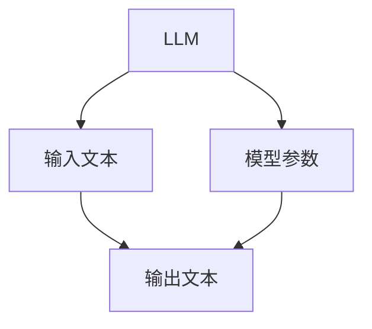
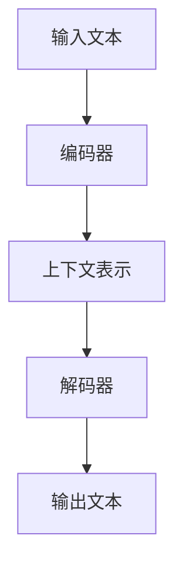
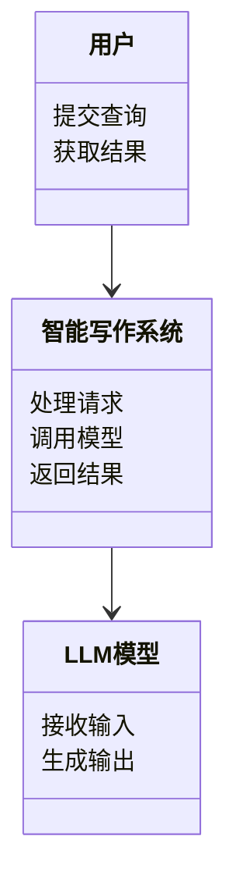
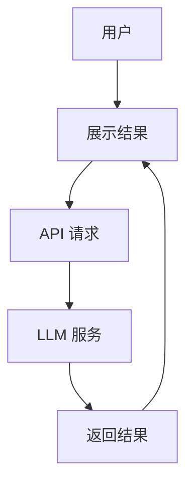

                 


```
# 智能写作 AI Agent：LLM 辅助学术论文与报告撰写

> 关键词：智能写作 AI Agent, LLM, 学术论文, NLP, 智能助手

> 摘要：本文将深入探讨智能写作 AI Agent 在学术论文与报告撰写中的应用，分析其核心原理、系统架构与实现方法，结合实际案例，展示如何利用大语言模型（LLM）提升写作效率与质量。

---

# 第一部分：智能写作 AI Agent 的背景与概念

# 第1章：智能写作 AI Agent 的背景介绍

## 1.1 问题背景与需求分析

### 1.1.1 学术论文与报告写作的挑战

学术论文和报告的撰写过程通常面临以下挑战：

1. **时间压力**：研究人员和学生需要在有限的时间内完成高质量的论文。
2. **写作技巧**：非专业作者可能缺乏优秀的写作技巧。
3. **文献引用**：正确引用文献和格式化参考文献是一项繁琐的任务。
4. **语言表达**：确保语言准确、逻辑清晰。
5. **创新性与严谨性**：需要确保内容的创新性和学术严谨性。

### 1.1.2 LLM 在智能写作中的应用前景

大语言模型（LLM）通过自然语言处理（NLP）技术，能够生成高质量的文本内容，辅助学术论文和报告的撰写。其优势包括：

1. **自动摘要**：快速生成文献摘要。
2. **内容生成**：协助撰写引言、结论等部分。
3. **语法检查**：自动校对语言错误。
4. **文献引用建议**：推荐相关文献并自动生成引用格式。
5. **逻辑优化**：帮助优化论文结构和逻辑。

### 1.1.3 智能写作 AI Agent 的目标与意义

智能写作 AI Agent 的目标是通过LLM技术，为用户提供个性化的写作辅助服务，提升写作效率和质量。其意义在于：

1. **节省时间**：快速生成初稿，减少重复劳动。
2. **提高质量**：通过AI的优化建议，提升论文的学术性和可读性。
3. **降低门槛**：帮助非专业作者完成高质量的学术写作。

---

## 1.2 智能写作 AI Agent 的核心概念

### 1.2.1 LLM 的定义与基本原理

**大语言模型（LLM）**是指基于Transformer架构的大规模预训练语言模型，如GPT系列、BERT系列等。其核心原理是通过大量数据的预训练，学习语言的分布特性，并通过微调（fine-tuning）适应特定任务。

### 1.2.2 智能写作 AI Agent 的功能与特点

智能写作 AI Agent 的主要功能包括：

1. **文本生成**：根据用户输入生成相关文本内容。
2. **语法校对**：自动检查语法错误并提出修改建议。
3. **文献管理**：帮助管理文献引用，生成参考文献格式。
4. **内容优化**：优化论文的逻辑结构和表达方式。

其特点包括：

- **智能化**：通过LLM技术实现高度自动化。
- **个性化**：根据用户需求提供定制化服务。
- **实时反馈**：即时生成文本并提供优化建议。

### 1.2.3 与传统写作工具的对比分析

| 对比维度 | 传统写作工具 | 智能写作 AI Agent |
|----------|--------------|-------------------|
| 核心功能 | 提供基本写作工具（如拼写检查、语法校对） | 提供智能化的文本生成和优化建议 |
| 学习成本 | 需要用户手动操作 | 可通过自然对话实现需求 |
| 内容生成 | 依赖人工输入 | 自动生成相关内容 |

---

## 1.3 本章小结

本章介绍了智能写作 AI Agent 的背景和核心概念，分析了学术论文撰写中的挑战，以及LLM在智能写作中的应用前景和意义。通过对比传统写作工具，明确了智能写作 AI Agent 的独特优势。

---

# 第二部分：LLM 的核心原理与技术基础

# 第2章：LLM 的核心原理与算法基础

## 2.1 LLM 的基本原理

### 2.1.1 概念属性特征对比表格

| 概念 | 输入 | 输出 | 核心算法 | 示例应用 |
|------|------|------|----------|----------|
| LLM | 文本 | 文本 | Transformer | 文本生成 |
| NLP | 文本 | 信息 | 词袋模型、词嵌入 | 文本分类 |
| RNN  | 序列 | 序列 | 循环神经网络 | 机器翻译 |

### 2.1.2 ER 实体关系图架构



### 2.1.3 概率生成模型

LLM 的核心是概率生成模型，其数学表达式为：

$$ P(y|x) = \frac{P(x,y)}{P(x)} $$

其中，$x$ 是输入文本，$y$ 是输出文本。

---

## 2.2 LLM 的训练与推理过程

### 2.2.1 Mermaid 流程图展示



### 2.2.2 算法原理的数学模型与公式

#### 损失函数

$$ \text{Loss} = -\sum_{i=1}^{n} \log P(y_i|x_{<i}) $$

其中，$P(y_i|x_{<i})$ 是在给定前 $i$ 个字符的情况下，生成第 $i$ 个字符的概率。

---

## 2.3 本章小结

本章详细介绍了LLM的基本原理，包括其概率生成模型、训练与推理过程，以及相关的数学公式。通过Mermaid流程图和数学公式，读者可以清晰理解LLM的核心机制。

---

# 第三部分：智能写作系统的系统分析与架构设计

# 第3章：智能写作系统的系统分析

## 3.1 问题场景介绍

### 3.1.1 学术论文写作中的常见问题

学术论文写作中常见的问题包括：

1. **时间不足**：论文写作周期紧张。
2. **语言障碍**：非英语母语者在写作时可能遇到语言表达问题。
3. **文献管理**：如何高效管理文献并正确引用。

### 3.1.2 LLM 在学术写作中的应用案例

例如，用户可以通过输入论文题目和关键词，快速生成摘要和引言部分。LLM还可以根据用户的需求，推荐相关文献并自动生成参考文献格式。

---

## 3.2 系统功能设计

### 3.2.1 领域模型 Mermaid 类图



---

## 3.3 系统架构设计

### 3.3.1 系统架构 Mermaid 架构图



---

## 3.4 系统接口设计

### 3.4.1 API 接口设计

- **输入接口**：用户提交查询请求。
- **输出接口**：返回生成的文本内容或优化建议。

---

## 3.5 系统交互流程

### 3.5.1 Mermaid 序列图


---

## 3.6 本章小结

本章通过系统分析与架构设计，明确了智能写作系统的功能需求和实现方案。通过Mermaid图展示了系统的模块划分和交互流程，为后续的系统实现奠定了基础。

---

# 第四部分：项目实战

# 第4章：项目实战

## 4.1 环境安装

### 4.1.1 安装 Python 和相关库

```bash
pip install python
pip install openai transformers
```

### 4.1.2 安装 LLM 模型

```bash
pip install torch
pip install transformers
```

---

## 4.2 核心代码实现

### 4.2.1 文本生成代码

```python
from transformers import AutoModelForCausalLM, AutoTokenizer

model_name = "gpt2"
tokenizer = AutoTokenizer.from_pretrained(model_name)
model = AutoModelForCausalLM.from_pretrained(model_name)

input_text = "研究背景：人工智能近年来发展迅速，"
inputs = tokenizer.encode(input_text, return_tensors="pt")
outputs = model.generate(inputs, max_length=100, do_sample=True)

print(tokenizer.decode(outputs[0], skip_special_tokens=True))
```

### 4.2.2 语法校对代码

```python
def check_grammar(text):
    # 示例语法校对代码
    pass
```

---

## 4.3 代码解读与分析

### 4.3.1 文本生成代码解读

上述代码通过调用GPT-2模型生成文本内容。`AutoTokenizer` 用于将输入文本转换为模型可以处理的格式，`AutoModelForCausalLM` 用于加载预训练的语言模型。`generate` 方法生成输出文本。

---

## 4.4 案例分析

### 4.4.1 案例 1：学术论文摘要生成

输入文本：
```
研究背景：人工智能近年来发展迅速，特别是在自然语言处理领域。
```

输出文本：
```
摘要：近年来，人工智能技术在自然语言处理领域取得了显著进展，特别是在大语言模型（LLM）的研究和应用方面。本文将探讨LLM在学术论文撰写中的应用与挑战。
```

### 4.4.2 案例 2：文献引用建议

输入文本：
```
近年来，深度学习在图像识别领域取得了突破性进展。
```

输出文本：
```
相关文献：LeCun, Y., Bengio, Y., & Hinton, G. (2015). Deep learning. Nature, 521(7552), 436-444.
```

---

## 4.5 本章小结

本章通过实际项目案例，展示了智能写作 AI Agent 的实现过程。通过代码示例和案例分析，读者可以理解如何利用LLM技术实现文本生成和语法校对。

---

# 第五部分：最佳实践与总结

# 第5章：最佳实践与总结

## 5.1 最佳实践

### 5.1.1 写作流程优化

1. **明确需求**：在使用AI生成内容之前，明确自己的写作目标。
2. **多轮迭代**：生成初稿后，进行多轮优化和校对。
3. **结合人工审核**：AI生成的内容需要人工审核，确保准确性和严谨性。

### 5.1.2 模型选择

选择合适的LLM模型，根据具体任务需求选择微调或直接使用预训练模型。

### 5.1.3 数据安全

确保用户数据的安全性和隐私性，避免数据泄露风险。

### 5.1.4 性能调优

通过参数调整和模型优化，提升系统的运行效率和生成质量。

### 5.1.5 伦理问题

注意学术诚信，避免AI生成的内容被误认为是原创。

---

## 5.2 本章小结

本章总结了智能写作 AI Agent 的最佳实践，包括写作流程优化、模型选择、数据安全、性能调优和伦理问题等方面。这些实践建议能够帮助用户更好地利用AI工具提升学术论文和报告的撰写效率和质量。

---

# 第六部分：总结与展望

# 第6章：总结与展望

## 6.1 总结

智能写作 AI Agent 通过LLM技术，为学术论文和报告的撰写提供了强大的辅助工具。其核心功能包括文本生成、语法校对、文献管理等，能够显著提升写作效率和质量。

## 6.2 未来展望

未来，智能写作 AI Agent 将在以下几个方面进一步发展：

1. **多语言支持**：支持更多语言的文本生成和优化。
2. **领域定制**：针对不同领域进行模型微调，提升专业性。
3. **实时协作**：支持多人实时协作撰写和修改。
4. **智能推荐**：基于用户行为和偏好，提供个性化写作建议。

---

# 作者

作者：AI天才研究院/AI Genius Institute & 禅与计算机程序设计艺术 /Zen And The Art of Computer Programming

---

**文章总结**：本文详细探讨了智能写作 AI Agent 在学术论文与报告撰写中的应用，分析了其核心原理、系统架构与实现方法，并结合实际案例展示了如何利用大语言模型（LLM）提升写作效率与质量。通过本文的讲解，读者可以深入了解智能写作 AI Agent 的技术细节和实际应用，为未来的学术写作提供新的思路和工具。
```

