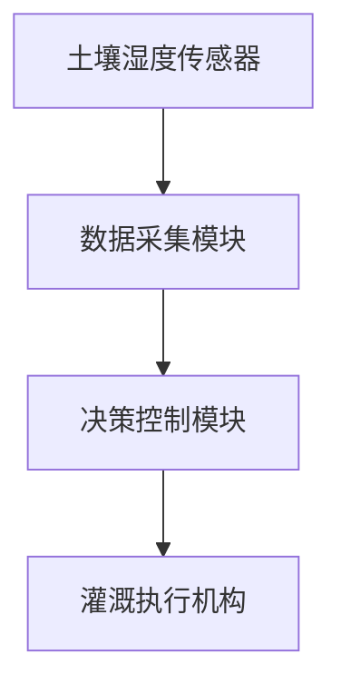
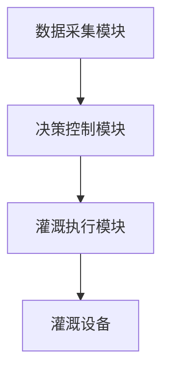

                 


# 智能农业：AI Agent控制的精准灌溉系统

> 关键词：智能农业，AI Agent，精准灌溉，机器学习，物联网，农业自动化

> 摘要：本文深入探讨了AI Agent在智能农业中的应用，特别是在精准灌溉系统中的实现。通过分析AI Agent的核心原理、算法设计、系统架构以及实际案例，本文展示了如何利用人工智能技术优化农业灌溉，实现资源高效利用和农业生产智能化。

---

## 第一部分: 智能农业与AI Agent控制的精准灌溉系统概述

### 第1章: 智能农业的背景与概念

#### 1.1 智能农业的背景

智能农业是指利用现代信息技术（如物联网、大数据、人工智能等）对农业生产过程进行智能化管理的一种新型农业模式。随着全球人口增长、资源短缺和环境问题的加剧，传统农业模式已无法满足高效、可持续发展的需求。智能农业通过智能化技术的应用，能够实现农业资源的优化配置、生产过程的精准控制以及农产品质量的提升。

#### 1.2 AI Agent在农业中的应用

AI Agent（人工智能代理）是一种能够感知环境、自主决策并执行任务的智能实体。在农业领域，AI Agent可以应用于作物监测、病虫害防治、气象预测、资源管理等多个方面。其中，精准灌溉系统是AI Agent在农业中最典型的应用之一。

#### 1.3 精准灌溉系统的定义与目标

精准灌溉是指根据土壤湿度、气象条件、作物需求等因素，智能化地控制灌溉量和灌溉时间，以实现水资源的高效利用和作物生长的最佳状态。精准灌溉的核心目标是减少水资源浪费、提高作物产量和质量，同时降低生产成本。

---

### 第2章: AI Agent的基本原理

#### 2.1 AI Agent的感知与决策机制

AI Agent通过多种传感器（如土壤湿度传感器、气象传感器等）获取环境数据，结合历史数据和模型预测，生成灌溉决策。感知模块负责数据采集，决策模块基于感知数据和预设目标生成最优灌溉策略，执行模块则根据决策结果控制灌溉设备。

#### 2.2 AI Agent的类型与特点

- **基于规则的AI Agent**：通过预设的规则和条件进行决策，适用于简单的场景。
- **基于机器学习的AI Agent**：通过训练数据学习灌溉规律，适用于复杂场景。
- **基于深度学习的AI Agent**：利用深度神经网络进行复杂决策，适用于高度动态和非线性的场景。

#### 2.3 精准灌溉系统的实体关系图



---

## 第二部分: 精准灌溉系统的算法与数学模型

### 第3章: 精准灌溉系统的算法原理

#### 3.1 数据采集与处理算法

精准灌溉系统的核心在于数据的采集与处理。传感器数据包括土壤湿度、气象数据（温度、湿度、光照等）和作物生长状态。数据采集模块将这些数据传输到决策控制模块，经过清洗、融合和特征提取后，生成决策输入。

#### 3.2 决策模型的数学表达

决策模型是精准灌溉系统的核心部分，通常基于机器学习或深度学习算法。以随机森林为例，决策模型可以表示为：

$$
f(x) = \text{随机森林}(x)
$$

其中，$x$ 是输入特征向量，$f(x)$ 是输出的灌溉决策。

#### 3.3 灌溉控制算法

灌溉控制算法根据决策模型的结果，结合当前环境状态，生成具体的灌溉策略。例如，当土壤湿度低于预设阈值时，系统启动灌溉，灌溉量和时间由模型预测得出。

---

### 第4章: 系统架构设计与实现

#### 4.1 系统功能设计

精准灌溉系统主要包括以下几个功能模块：

- **数据采集模块**：负责采集土壤湿度、气象数据等。
- **决策控制模块**：基于数据生成灌溉策略。
- **灌溉执行模块**：根据决策结果控制灌溉设备。

#### 4.2 系统架构图



---

## 第三部分: 项目实战与优化

### 第5章: 环境安装与核心代码实现

#### 5.1 环境安装

为了实现精准灌溉系统，需要安装以下环境：

- Python 3.8+
- TensorFlow 2.0+
- Pandas
- Scikit-learn
-传感器硬件（如DHT11温湿度传感器）

#### 5.2 核心代码实现

以下是决策控制模块的核心代码示例：

```python
import numpy as np
from sklearn.ensemble import RandomForestRegressor

# 假设X为输入特征，y为标签（灌溉量）
model = RandomForestRegressor(n_estimators=100, random_state=42)
model.fit(X, y)

# 预测灌溉量
predicted_water = model.predict(new_X)
```

---

### 第6章: 实际案例分析与优化

#### 6.1 实际案例分析

以某农场的土壤湿度数据为例，假设土壤湿度传感器每隔1小时采集一次数据。通过模型预测，当土壤湿度低于40%时，系统启动灌溉，灌溉量为预测值。

#### 6.2 系统优化

为了进一步优化系统性能，可以引入实时气象数据和作物生长阶段信息，提高决策的准确性。此外，可以通过强化学习算法优化灌溉策略，进一步减少水资源浪费。

---

## 总结与展望

智能农业是未来农业发展的必然趋势，AI Agent控制的精准灌溉系统是其中的重要组成部分。通过本文的分析，我们可以看到，精准灌溉系统不仅可以提高水资源利用效率，还能显著提升作物产量和质量。未来，随着人工智能技术的不断发展，精准灌溉系统将更加智能化和个性化，为农业可持续发展提供强有力的支持。

---

**作者：AI天才研究院/AI Genius Institute & 禅与计算机程序设计艺术 /Zen And The Art of Computer Programming**

