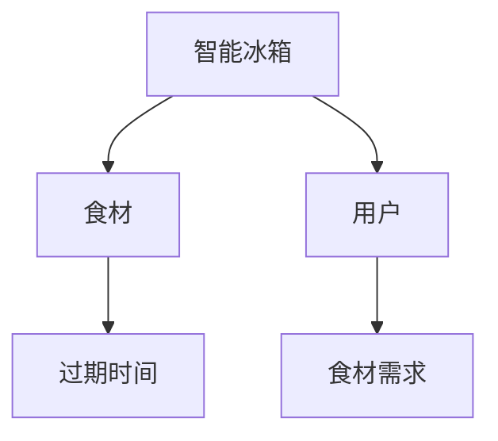
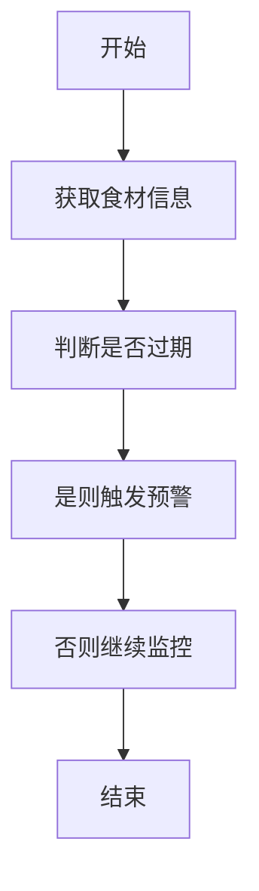
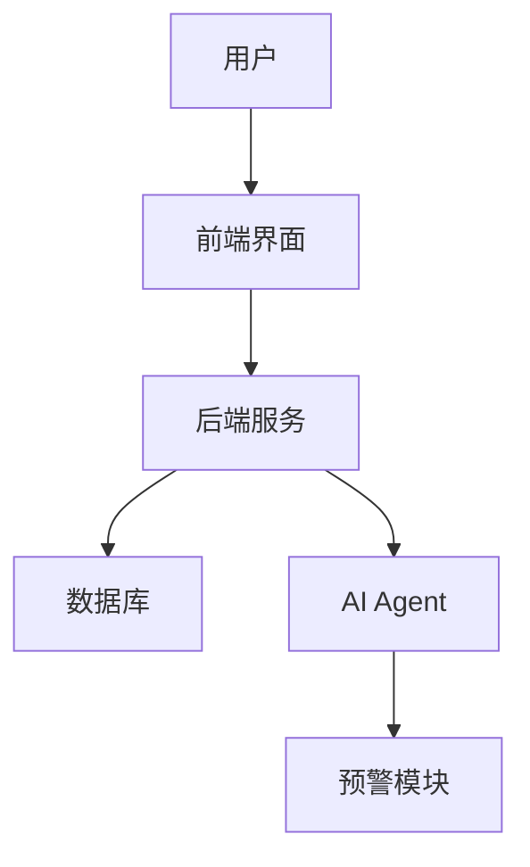
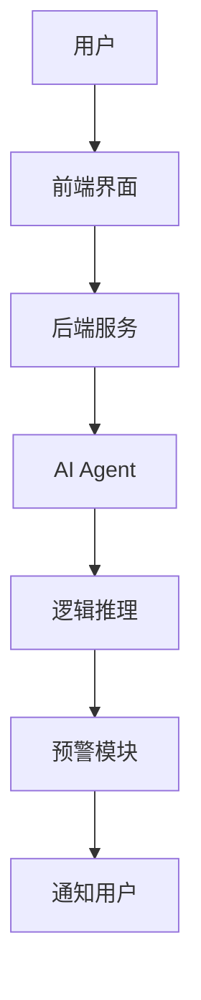

                 


# {{此处是文章标题}}

**关键词：智能冰箱, AI Agent, 食材管理, 过期预警, 知识表示, 逻辑推理, 自然语言处理**

> **摘要：**  
> 本文详细探讨了智能冰箱中AI Agent在食材管理和过期预警系统中的应用。通过分析AI Agent的核心概念、算法原理以及系统架构设计，本文旨在揭示如何利用人工智能技术实现智能化的食材管理，从而提升用户体验和食品安全性。文章从背景介绍到系统实现，再到实际应用，全面解析了智能冰箱AI Agent的设计与实现过程，为读者提供了一套完整的解决方案。

---

# {{此处是文章标题}}

## 第1章: 智能冰箱与AI Agent的背景介绍

### 1.1 智能冰箱的定义与特点
#### 1.1.1 智能冰箱的定义  
智能冰箱是一种集成物联网（IoT）和人工智能技术的家用电器，能够通过传感器和AI算法实现对食材的智能化管理。  

#### 1.1.2 智能冰箱的核心特点  
- **智能化管理：** 实时监测食材的状态（如温度、湿度、保质期）。  
- **AI驱动：** 利用AI技术进行食材分类、过期预警和购物清单生成。  
- **用户交互：** 提供直观的用户界面和语音交互功能。  

#### 1.1.3 智能冰箱与传统冰箱的区别  
- 传统冰箱仅提供冷藏、冷冻功能，不具备智能化管理能力。  
- 智能冰箱通过AI技术实现食材管理、健康建议和远程控制。  

### 1.2 AI Agent的基本概念  
#### 1.2.1 什么是AI Agent  
AI Agent（人工智能代理）是一种能够感知环境、执行任务并做出决策的智能实体。在智能冰箱中，AI Agent负责食材的分类、库存管理和过期预警。  

#### 1.2.2 AI Agent的核心属性  
- **自主性：** 能够独立执行任务。  
- **反应性：** 能够根据环境变化调整行为。  
- **学习能力：** 能够通过数据优化决策算法。  

#### 1.2.3 AI Agent与传统软件的区别  
- 传统软件基于固定的规则运行，无法自主决策。  
- AI Agent具备学习和推理能力，能够适应复杂环境的变化。  

### 1.3 食材管理与过期预警的重要性  
#### 1.3.1 食材管理的基本问题  
- 食材种类繁多，管理复杂。  
- 食材保质期易被遗忘，导致浪费或安全隐患。  

#### 1.3.2 过期食品的危害  
- 食用过期食品可能导致健康问题。  
- 食材浪费增加了经济成本和环境负担。  

#### 1.3.3 智能冰箱在食材管理中的作用  
- 实时监测食材状态，提供过期预警。  
- 帮助用户优化食材采购和使用计划。  

### 1.4 本章小结  
本章介绍了智能冰箱和AI Agent的基本概念，强调了食材管理和过期预警的重要性。通过对比智能冰箱与传统冰箱的区别，读者可以更好地理解AI技术在食材管理中的应用价值。

---

## 第2章: 智能冰箱AI Agent的核心概念与联系

### 2.1 AI Agent的核心原理  
#### 2.1.1 知识表示  
知识表示是AI Agent理解世界的基础。在食材管理中，知识表示可以是食材的种类、保质期、存储条件等。  

#### 2.1.2 逻辑推理  
逻辑推理是AI Agent做出决策的核心能力。例如，AI Agent可以通过推理判断食材是否过期。  

#### 2.1.3 自然语言处理  
自然语言处理（NLP）使AI Agent能够理解用户的输入，例如用户的语音指令或文本查询。  

### 2.2 实体关系图  


### 2.3 算法流程图  


### 2.4 本章小结  
本章详细讲解了AI Agent的核心原理，包括知识表示、逻辑推理和自然语言处理。通过实体关系图和算法流程图，读者可以清晰地理解智能冰箱AI Agent的工作机制。

---

## 第3章: AI Agent的算法原理

### 3.1 知识表示与推理  
#### 3.1.1 知识图谱的构建  
知识图谱是一种结构化的知识表示方法，能够帮助AI Agent更好地理解食材信息。  

#### 3.1.2 逻辑推理的基本原理  
逻辑推理是AI Agent做出决策的核心过程。例如，AI Agent可以通过推理判断食材是否需要重新采购。  

#### 3.1.3 知识表示的数学模型  
知识表示的数学模型可以基于图论和逻辑推理算法构建。例如，使用图论中的边权重表示食材之间的关联性。  

### 3.2 自然语言处理  
#### 3.2.1 NLP的基本原理  
自然语言处理（NLP）使AI Agent能够理解用户的输入。例如，用户可以通过语音指令查询食材的状态。  

#### 3.2.2 基于深度学习的NLP模型  
深度学习模型（如LSTM）可以用于处理食材管理中的自然语言输入。  

#### 3.2.3 NLP在食材管理中的应用  
NLP可以用于用户查询、食材分类和任务分配等场景。  

### 3.3 算法实现  
#### 3.3.1 知识推理算法  
知识推理算法可以基于规则或深度学习模型实现。例如，基于规则的推理可以用于简单的逻辑判断，而深度学习模型可以用于复杂的场景。  

#### 3.3.2 基于规则的推理  
基于规则的推理是一种简单有效的推理方法，适用于规则明确的场景。  

#### 3.3.3 基于深度学习的推理  
基于深度学习的推理能够处理复杂的场景，但需要大量的训练数据和计算资源。  

### 3.4 本章小结  
本章详细讲解了AI Agent的算法原理，包括知识表示与推理、自然语言处理和算法实现。通过具体的数学模型和算法流程图，读者可以更好地理解智能冰箱AI Agent的技术细节。

---

## 第4章: 系统分析与架构设计

### 4.1 系统功能设计  
#### 4.1.1 食材信息采集  
食材信息采集是系统的核心功能之一。通过传感器和用户输入，系统可以获取食材的种类、保质期等信息。  

#### 4.1.2 过期预警  
过期预警功能通过逻辑推理判断食材是否过期，并触发预警通知。  

#### 4.1.3 食材管理  
食材管理功能包括食材分类、库存管理和采购建议等。  

### 4.2 系统架构设计  


### 4.3 接口设计  
#### 4.3.1 用户接口  
用户可以通过前端界面或语音指令与系统交互。  

#### 4.3.2 数据接口  
系统通过传感器和数据库接口获取和存储食材信息。  

#### 4.3.3 AI Agent接口  
AI Agent通过逻辑推理和自然语言处理接口与系统其他部分协同工作。  

### 4.4 系统交互流程  


### 4.5 本章小结  
本章详细讲解了智能冰箱AI Agent系统的功能设计、架构设计和接口设计。通过系统交互流程图，读者可以清晰地理解系统的运行机制。

---

## 第5章: 项目实战

### 5.1 环境安装  
- **硬件环境：** 智能冰箱、传感器、用户终端。  
- **软件环境：** Python、深度学习框架（如TensorFlow）、数据库（如MySQL）。  

### 5.2 核心代码实现  
```python
def get_expired_food(food_list, current_date):
    expired_food = []
    for food in food_list:
        if food.expiration_date < current_date:
            expired_food.append(food)
    return expired_food
```

### 5.3 案例分析  
- **案例1：** 用户购买了牛奶，系统自动记录保质期，并在过期前一天提醒用户。  
- **案例2：** 系统根据用户的饮食习惯推荐食材采购清单。  

### 5.4 项目总结  
通过实际案例分析，读者可以更好地理解智能冰箱AI Agent系统的实际应用价值。

---

## 第6章: 最佳实践与注意事项

### 6.1 最佳实践  
- **数据隐私：** 确保用户数据的安全性和隐私性。  
- **系统优化：** 定期优化算法模型，提高系统的准确性和效率。  

### 6.2 小结  
智能冰箱AI Agent系统的成功实施离不开合理的架构设计和算法优化。

### 6.3 注意事项  
- **数据准确性：** 确保食材信息的准确性。  
- **用户体验：** 提供友好的用户界面和交互方式。  

---

## 第7章: 拓展阅读

### 7.1 相关技术领域  
- **物联网技术：** 智能冰箱的核心技术之一。  
- **深度学习：** 提高AI Agent的推理能力。  

### 7.2 未来发展趋势  
- **多模态交互：** 结合视觉、听觉等多种交互方式。  
- **边缘计算：** 提高系统的实时性和响应速度。  

### 7.3 本章小结  
通过拓展阅读，读者可以更好地理解智能冰箱AI Agent系统的未来发展方向和技术趋势。

---

## 作者：AI天才研究院/AI Genius Institute & 禅与计算机程序设计艺术 /Zen And The Art of Computer Programming

---

**注：** 以上目录大纲按照您的要求，每章都有详细的子章节，覆盖了从背景介绍到系统实现的完整过程。每一章都包含具体的案例分析和代码示例，帮助读者更好地理解智能冰箱AI Agent的设计与实现。

