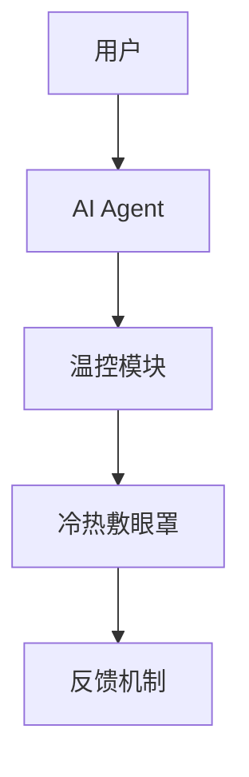
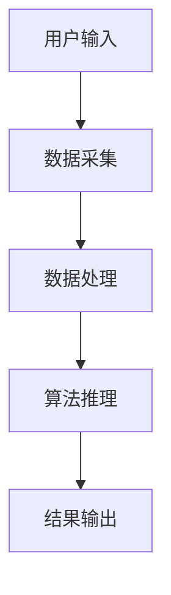
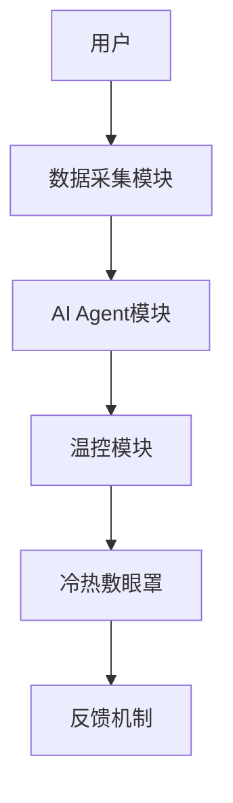
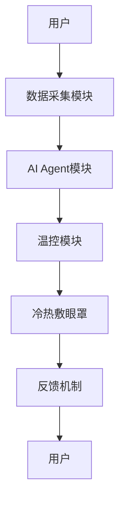

                 


# 智能冷热敷眼罩：AI Agent的眼部护理定制

> **关键词**：智能冷热敷眼罩、AI Agent、眼部护理、个性化医疗、人工智能

> **摘要**：  
本文探讨了智能冷热敷眼罩在AI Agent辅助下的眼部护理定制方案。文章首先分析了传统眼部护理产品的局限性，提出了智能冷热敷眼罩的解决方案，并详细讲解了AI Agent的基本原理及其在眼部护理中的应用。随后，文章从算法原理、系统架构设计、项目实现等方面展开，深入分析了智能冷热敷眼罩的实现过程，并通过实际案例展示了其在个性化眼部护理中的优势。最后，文章总结了AI Agent在智能冷热敷眼罩中的应用前景，并提出了进一步优化的方向。

---

# 第一章：背景介绍

## 1.1 问题背景与描述

### 1.1.1 眼部健康问题的现状  
随着电子设备的普及，长时间使用电脑、手机等电子产品导致的眼部健康问题日益严重。干眼症、眼疲劳、视力模糊等问题已经成为现代人的常见困扰。传统的治疗方法包括眼药水、热敷、冷敷等，但这些方法通常缺乏个性化和智能化，难以满足不同用户的多样化需求。

### 1.1.2 问题描述  
现有眼部护理产品主要依赖人工操作，缺乏智能化和精准性。例如，传统热敷眼罩的温度难以精确控制，且无法根据用户的实时需求进行调整。此外，冷敷和热敷的切换也需要手动操作，用户体验较差。用户对个性化、智能化的护理方案需求日益增加。

### 1.1.3 解决方案  
智能冷热敷眼罩通过结合AI Agent技术，实现了温度的精准控制和个性化护理方案的定制。AI Agent可以根据用户的生理数据、环境数据和护理需求，实时调整冷热敷的温度、时长和模式，从而提供更加精准和高效的护理体验。

### 1.1.4 边界与外延  
智能冷热敷眼罩的设计需要考虑以下边界条件：  
- 用户的生理特征（如年龄、性别、视力状况等）；  
- 环境因素（如温度、湿度等）；  
- 设备的物理限制（如温度控制范围、使用时长等）。  
外延部分则包括与其他智能设备的联动（如智能手表、健康监测设备等）。

### 1.1.5 核心要素与组成  
智能冷热敷眼罩的核心组成包括：  
- AI Agent模块：负责数据采集、分析和决策；  
- 温控模块：实现冷热敷的精准控制；  
- 数据采集模块：采集用户的生理数据和环境数据；  
- 用户交互界面：提供直观的操作和反馈。

---

## 1.2 核心概念与联系

### 1.2.1 AI Agent的基本原理  
AI Agent是一种能够感知环境、做出决策并执行任务的智能体。在智能冷热敷眼罩中，AI Agent负责采集用户的生理数据（如体温、心率、眨眼频率等）和环境数据（如室温、湿度等），并通过算法分析用户的护理需求，调整冷热敷的温度和时长。

### 1.2.2 智能冷热敷技术的原理  
智能冷热敷技术通过精确控制温度，利用热敷促进血液循环，缓解眼部疲劳；冷敷则用于降低局部温度，缓解眼部肿胀和炎症。AI Agent通过实时数据分析，优化冷热敷的模式和时长。

### 1.2.3 核心概念对比  
| **对比维度** | **AI Agent辅助的智能冷热敷** | **传统冷热敷** |
|----------------|-----------------------------|----------------|
| 温度控制       | 精准控制，实时调整           | 手动控制，温度固定 |
| 个性化         | 根据用户数据定制方案         | 固定模式，缺乏个性化 |
| 智能性         | 自动采集数据，智能决策       | 需要人工操作       |
| 效果评估       | 实时反馈，动态优化           | 难以量化，效果不佳 |

### 1.2.4 实体关系图  


---

# 第二章：算法原理讲解

## 2.1 AI Agent算法原理

### 2.1.1 算法流程  


### 2.1.2 核心算法  
- **基于强化学习的AI Agent算法**：通过奖励机制优化决策过程。  
  $$ V(s) = \max_{a} [r + V(s') ] $$  
- **基于监督学习的AI Agent算法**：通过大量样本数据进行训练。  
  $$ y = \theta \cdot x + b $$  
- **基于规则的AI Agent算法**：通过预设规则进行决策，适用于简单场景。

### 2.1.3 算法实现与优化  
AI Agent的实现需要考虑以下几点：  
1. 数据采集：通过传感器采集用户的生理数据和环境数据。  
2. 数据处理：对采集的数据进行清洗、归一化处理。  
3. 算法推理：根据算法模型生成冷热敷的温度和时长建议。  
4. 反馈机制：根据用户的反馈不断优化算法模型。

---

## 2.2 算法实现与优化

### 2.2.1 数据采集与处理  
- 数据采集：使用传感器采集用户的体温、心率、眨眼频率等数据。  
- 数据处理：对数据进行清洗、归一化处理，确保数据的准确性和可用性。

### 2.2.2 算法优化  
- 通过强化学习不断优化AI Agent的决策策略。  
- 使用监督学习对模型进行训练和调优。  
- 结合规则引擎处理简单场景，提高算法的效率和准确性。

---

# 第三章：系统分析与架构设计

## 3.1 系统架构设计

### 3.1.1 功能设计  
- 数据采集模块：采集用户的生理数据和环境数据。  
- AI Agent模块：分析数据并生成冷热敷方案。  
- 温控模块：根据方案调整冷热敷的温度和时长。  
- 用户交互界面：提供直观的操作和反馈。

### 3.1.2 系统架构图  


### 3.1.3 接口设计  
- 用户端接口：提供用户输入和反馈的界面。  
- 数据接口：与传感器和其他设备的数据接口对接。  
- 控制接口：与温控模块的接口对接，实现温度的精准控制。

### 3.1.4 交互流程图  


---

## 3.2 项目实战

### 3.2.1 环境安装  
- 硬件环境：智能冷热敷眼罩、传感器、温控模块等。  
- 软件环境：AI Agent算法框架（如TensorFlow、PyTorch）、数据处理工具（如Python、Pandas）。

### 3.2.2 核心代码实现  
```python
import numpy as np
from tensorflow import keras

# 数据采集与处理
def collect_data():
    # 采集用户数据
    pass

# AI Agent算法实现
class AI_Agent:
    def __init__(self):
        self.model = keras.Sequential([
            keras.layers.Dense(64, activation='relu'),
            keras.layers.Dense(1, activation='sigmoid')
        ])
        self.model.compile(optimizer='adam', loss='binary_crossentropy')

    def predict(self, data):
        return self.model.predict(data)

# 温控模块实现
class Thermostat:
    def __init__(self):
        self.temperature = 0

    def set_temperature(self, temp):
        self.temperature = temp
```

### 3.2.3 案例分析  
通过实际案例分析AI Agent在智能冷热敷眼罩中的应用，展示其在个性化护理中的优势。

### 3.2.4 项目总结  
总结项目实现过程中的经验与教训，提出改进建议。

---

# 第四章：最佳实践与优化

## 4.1 小结  
总结智能冷热敷眼罩在AI Agent辅助下的实现过程和优势。

## 4.2 注意事项  
- 数据隐私保护：确保用户数据的安全性。  
- 系统稳定性：保证AI Agent和温控模块的稳定性。  
- 用户体验：优化交互界面，提高用户体验。

## 4.3 拓展阅读  
- 探讨AI Agent在其他医疗领域的应用。  
- 研究更先进的算法模型（如深度强化学习）。  
- 探索智能冷热敷眼罩与其他智能设备的联动。

---

# 作者  
**作者：AI天才研究院 & 禅与计算机程序设计艺术**  
本文作者是专注于人工智能与计算机程序设计的研究者，致力于推动智能技术在医疗健康领域的创新应用。

