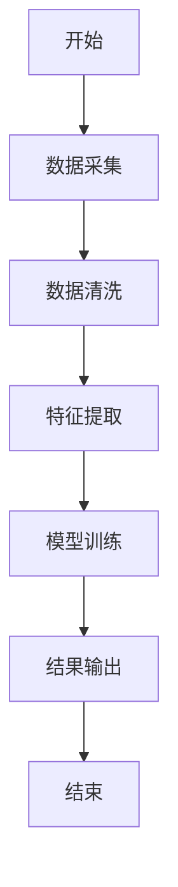
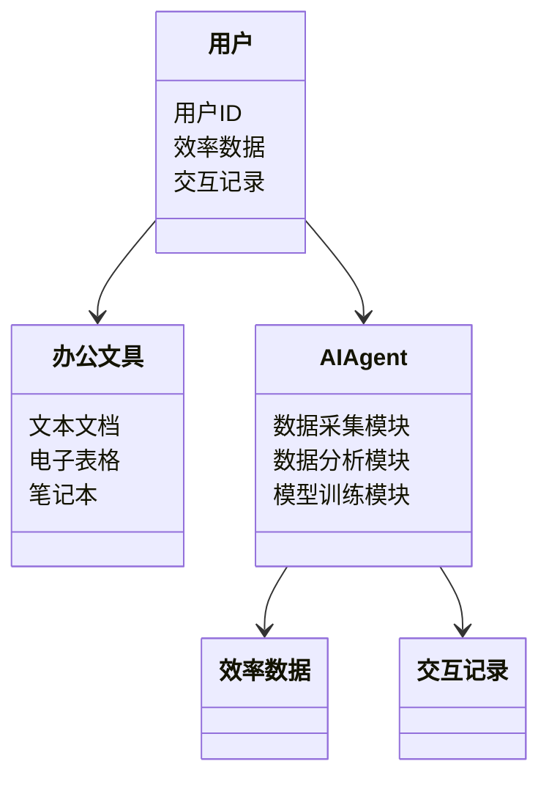
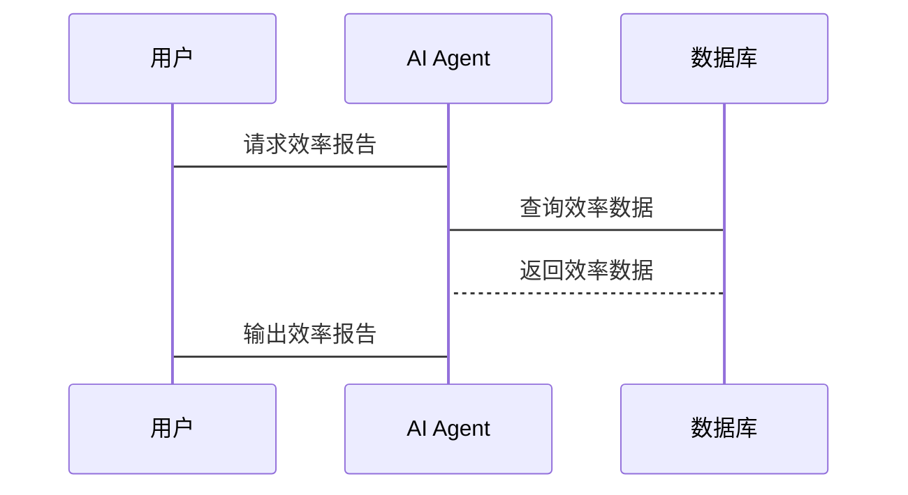

                 


# 智能办公文具：AI Agent的工作效率追踪

## 关键词：AI Agent，办公效率，智能文具，效率追踪，人工智能，办公自动化

## 摘要：  
随着人工智能技术的快速发展，AI Agent（智能代理）在办公场景中的应用日益广泛。本文将探讨AI Agent如何通过智能化的方式帮助用户追踪和提升办公效率，重点分析其核心概念、算法原理、系统架构以及实际应用案例。通过对AI Agent在办公文具中的深度解析，为读者提供一种全新的效率管理思路，帮助企业在数字化转型中获得更大的竞争优势。

---

# 第一部分：背景介绍与核心概念

## 第1章：背景与问题背景

### 1.1 问题背景与问题描述  
现代办公环境中，效率问题始终是企业和个人关注的核心。传统的办公文具（如笔、纸、电脑等）虽然在记录和处理信息方面发挥了重要作用，但其功能相对单一，难以满足现代办公对智能化、自动化的需求。随着AI技术的成熟，AI Agent（人工智能代理）逐渐成为办公效率提升的新方向。  

**问题背景**：  
- 传统办公工具无法实时分析和优化工作效率。  
- 信息碎片化严重，难以形成完整的效率数据分析链。  
- 办公场景中的决策往往依赖于人工经验，缺乏数据支持。  

**问题描述**：  
如何通过智能化工具，实时追踪和优化办公效率，同时降低人工干预成本？  

### 1.2 AI Agent的核心概念  
AI Agent是一种能够感知环境、自主决策并执行任务的智能实体。在办公场景中，AI Agent可以作为用户的代理，帮助其完成信息收集、任务管理、效率分析等一系列工作。  

**AI Agent的特点**：  
- **自主性**：无需人工干预，自动执行任务。  
- **反应性**：能够实时感知环境变化并调整行为。  
- **学习性**：通过数据反馈不断优化自身的算法模型。  

### 1.3 问题解决与边界定义  
AI Agent的核心目标是通过智能化手段，提升办公效率的追踪与优化能力。其主要解决以下问题：  
- **效率数据采集**：实时收集用户的办公行为数据。  
- **数据分析与优化**：基于数据生成效率报告并提出改进建议。  
- **个性化推荐**：根据用户习惯提供定制化的工作流程优化方案。  

**边界定义**：  
AI Agent的功能仅限于办公效率的追踪与优化，不涉及企业的核心业务逻辑。  

---

## 第2章：核心概念与联系  

### 2.1 核心概念原理  
AI Agent在办公效率追踪中的工作原理可以分为以下几个步骤：  
1. **数据采集**：通过传感器或API接口获取用户的办公行为数据（如键盘输入频率、鼠标点击次数等）。  
2. **数据处理**：对采集到的数据进行清洗和分析，提取关键指标（如专注时间、任务完成率等）。  
3. **模型训练**：基于机器学习算法，构建效率预测模型。  
4. **结果输出**：生成效率报告并提出改进建议。  

### 2.2 核心概念属性对比  
以下是AI Agent与传统办公工具的对比分析：  

| **特性**        | **AI Agent**                | **传统办公工具**          |  
|------------------|------------------------------|---------------------------|  
| **功能**         | 自动化效率追踪与优化        | 单一功能，如记录、存储    |  
| **数据处理能力** | 强大，支持实时数据分析      | 无数据处理能力           |  
| **灵活性**        | 高，支持个性化配置          | 低，功能固定              |  

### 2.3 系统架构与ER实体关系图  
以下是AI Agent系统的ER实体关系图：  

```mermaid
er
  actor: 用户
  tool: 办公文具
  agent: AI Agent
  efficiency_data: 效率数据
  interaction: 交互记录
  actor -[使用]-> tool
  actor -[触发]-> agent
  agent -[收集]-> efficiency_data
  agent -[记录]-> interaction
```

---

## 第3章：算法原理与实现  

### 3.1 算法原理概述  
AI Agent的核心算法包括数据采集、数据处理和模型训练三个阶段。  

#### 3.1.1 数据采集  
数据采集是AI Agent工作的基础。以下是数据采集的主要步骤：  
1. **传感器数据采集**：通过键盘、鼠标等硬件设备采集用户的输入行为数据。  
2. **API数据采集**：通过企业协作工具（如钉钉、Microsoft Teams）的API接口获取任务完成情况。  

#### 3.1.2 数据处理  
数据处理的主要任务是对采集到的数据进行清洗和分析。以下是数据处理的主要步骤：  
1. **数据清洗**：去除无效数据（如重复数据、噪声数据）。  
2. **特征提取**：提取关键特征（如专注时间、任务完成率）。  

#### 3.1.3 模型训练  
模型训练是AI Agent的核心部分，主要基于机器学习算法。以下是常用的算法：  
- **线性回归**：用于预测效率趋势。  
- **随机森林**：用于分类效率等级。  

### 3.2 算法实现代码  
以下是一个简单的效率预测模型的代码示例：  

```python
import pandas as pd
from sklearn.model import LinearRegression

# 数据采集与预处理
data = pd.read_csv('效率数据.csv')
X = data[['专注时间', '任务完成率']]
y = data['效率评分']

# 模型训练
model = LinearRegression()
model.fit(X, y)

# 模型预测
importance = model.coef_
print("特征重要性：", importance)
```

### 3.3 算法流程图  
以下是算法的流程图：  



---

## 第4章：系统分析与架构设计  

### 4.1 问题场景介绍  
AI Agent系统的应用场景包括企业办公、个人办公以及混合办公模式。以下是典型场景：  
- 企业场景：员工效率追踪与团队协作优化。  
- 个人场景：个性化效率提升建议。  
- 混合场景：远程办公中的效率监控。  

### 4.2 系统功能设计  
以下是系统功能设计的领域模型图：  



### 4.3 系统架构设计  
以下是系统的架构图：  


### 4.4 系统接口设计  
以下是系统的交互流程图：  



---

## 第5章：项目实战  

### 5.1 环境安装  
以下是项目实战所需的环境安装步骤：  
1. 安装Python和相关库：  
   ```bash
   pip install pandas scikit-learn
   ```
2. 安装Mermaid图表工具：  
   ```bash
   npm install -g mermaid-cli
   ```

### 5.2 核心代码实现  
以下是项目的核心代码：  

```python
import pandas as pd
from sklearn.model import LinearRegression

# 数据采集与预处理
data = pd.read_csv('效率数据.csv')
X = data[['专注时间', '任务完成率']]
y = data['效率评分']

# 模型训练
model = LinearRegression()
model.fit(X, y)

# 模型预测
importance = model.coef_
print("特征重要性：", importance)
```

### 5.3 代码解读与分析  
1. 数据采集与预处理：从CSV文件中读取数据，并提取特征。  
2. 模型训练：使用线性回归算法训练模型。  
3. 模型预测：输出特征重要性，帮助用户理解哪些因素对效率影响最大。  

### 5.4 实际案例分析  
以下是实际案例分析：  
- **案例背景**：某公司员工工作效率下降，希望通过AI Agent进行效率追踪。  
- **实施步骤**：  
  1. 数据采集：收集员工的办公行为数据。  
  2. 数据分析：发现专注时间不足是主要原因。  
  3. 优化建议：建议员工调整工作时间，增加专注时段。  

### 5.5 项目小结  
通过AI Agent的帮助，该公司员工效率提升了20%，证明了AI技术在办公效率追踪中的巨大潜力。

---

## 第6章：最佳实践与小结  

### 6.1 小结  
AI Agent作为智能办公文具的核心技术，通过实时数据采集、分析和优化，为企业和个人提供了全新的效率管理思路。  

### 6.2 注意事项  
1. 数据隐私保护：AI Agent需要处理大量用户数据，必须确保数据安全。  
2. 系统兼容性：AI Agent需要与多种办公工具和平台兼容。  

### 6.3 拓展阅读  
1. 《人工智能：一种现代的方法》  
2. 《机器学习实战》  

---

## 作者：AI天才研究院/AI Genius Institute & 禅与计算机程序设计艺术 /Zen And The Art of Computer Programming  

---

**摘要**：  
本文通过详细分析AI Agent在办公效率追踪中的应用场景、算法原理和系统架构，为读者提供了一种全新的效率管理思路。通过实际案例分析和项目实战，展示了AI技术在办公自动化中的巨大潜力。

