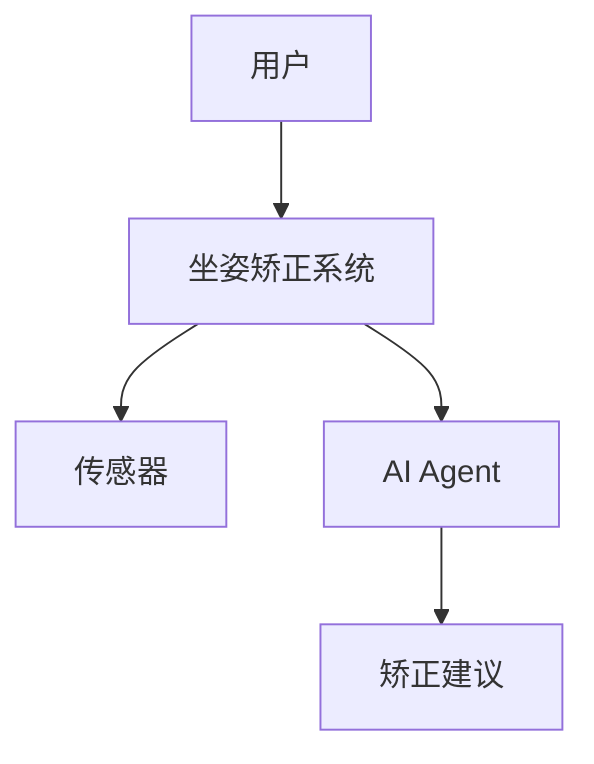
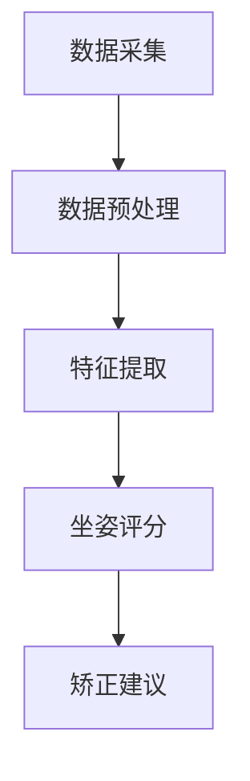
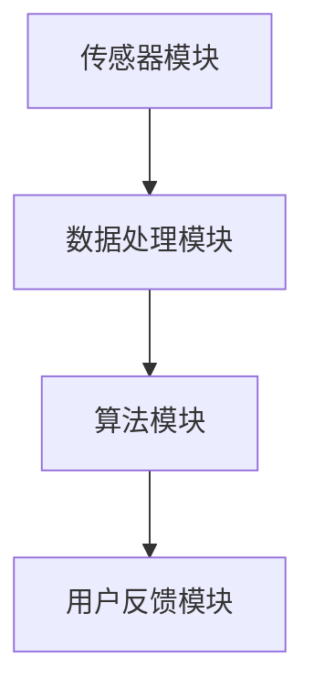
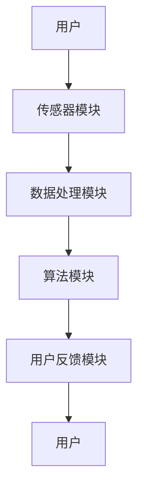

                 


# 智能办公椅：AI Agent的坐姿矫正系统

---

## 关键词：智能办公椅、AI Agent、坐姿矫正、人工智能、传感器技术、健康办公

---

## 摘要：  
本文探讨了智能办公椅在现代办公环境中的重要性，详细介绍了AI Agent如何通过传感器技术和算法实现坐姿矫正功能。文章从问题背景、核心概念、算法原理、系统架构到项目实战，全面解析了智能办公椅的设计与实现过程。通过本文，读者可以深入了解如何利用AI技术改善办公健康问题，同时掌握智能办公椅的技术实现细节。

---

# 第1章: 背景介绍

## 1.1 问题背景  
现代办公环境中的久坐问题日益严重，长时间的不良坐姿导致颈椎病、腰椎病等健康问题。传统办公椅无法提供实时反馈和矫正建议，用户缺乏自我监督的手段。AI Agent的引入为解决这一问题提供了新的可能性。

## 1.2 问题描述  
坐姿不当不仅影响身体健康，还可能导致工作效率下降。AI Agent通过实时监测用户坐姿，结合传感器数据和算法模型，提供个性化矫正建议，帮助用户保持正确的坐姿。

## 1.3 问题解决  
智能办公椅通过AI Agent实现坐姿矫正，利用传感器采集数据，结合算法模型生成矫正建议，实时提醒用户调整坐姿。

## 1.4 边界与外延  
智能办公椅的功能边界包括坐姿监测、矫正建议生成和反馈提醒。其与智能办公环境中的其他设备（如智能灯、空调等）可以协同工作，进一步优化用户体验。

---

# 第2章: 智能办公椅的核心概念与联系

## 2.1 核心概念原理  
AI Agent通过传感器采集用户的坐姿数据，结合算法模型进行分析，生成矫正建议。传感器技术包括压力传感器、角度传感器和加速度传感器，用于实时监测用户的坐姿状态。

## 2.2 核心概念属性特征对比  
| 特性                | 传统办公椅          | 智能办公椅          |
|---------------------|---------------------|---------------------|
| 坐姿矫正功能        | 无                  | 有                  |
| 传感器技术          | 无                  | 有                  |
| 用户反馈机制        | 无                  | 有                  |

## 2.3 ER实体关系图  


---

# 第3章: AI Agent的算法原理

## 3.1 算法流程  
1. **数据采集**：通过传感器获取用户的坐姿数据。  
2. **数据预处理**：对采集的数据进行清洗和标准化。  
3. **特征提取**：提取关键特征，如坐姿角度、坐姿时长等。  
4. **坐姿评分计算**：基于特征计算坐姿评分，判断坐姿是否正确。  
5. **矫正建议生成**：根据评分结果生成矫正建议并反馈给用户。

## 3.2 算法实现  


## 3.3 算法数学模型  
坐姿评分计算公式：  
$$ 坐姿评分 = \alpha \cdot 角度特征 + \beta \cdot 时间特征 $$  
其中，$\alpha$ 和 $\beta$ 是权重系数，根据实际数据进行训练确定。

---

# 第4章: 系统架构设计

## 4.1 系统模块  
智能办公椅系统主要包括以下模块：  
1. 传感器模块：负责数据采集。  
2. 数据处理模块：负责数据预处理和特征提取。  
3. 算法模块：负责坐姿评分计算和矫正建议生成。  
4. 用户反馈模块：负责将矫正建议反馈给用户。

## 4.2 系统架构图  


## 4.3 系统接口设计  
系统接口包括：  
1. 传感器数据接口：用于获取传感器数据。  
2. 算法接口：用于计算坐姿评分。  
3. 用户反馈接口：用于输出矫正建议。

## 4.4 系统交互流程  


---

# 第5章: 项目实战

## 5.1 环境搭建  
1. 安装必要的Python库：numpy、pandas、scikit-learn。  
2. 配置传感器模块，确保数据能够正确采集。  

## 5.2 核心代码实现  
```python
import numpy as np
from sklearn.model_selection import train_test_split
from sklearn.linear_model import LinearRegression

# 示例数据
data = np.array([[1, 2], [2, 3], [3, 4], [4, 5]])
X = data[:, 0:-1]
y = data[:, -1]

# 数据分割
X_train, X_test, y_train, y_test = train_test_split(X, y, test_size=0.2)

# 模型训练
model = LinearRegression()
model.fit(X_train, y_train)

# 预测
y_pred = model.predict(X_test)
print("预测结果：", y_pred)
```

## 5.3 功能测试  
1. 传感器模块测试：确保数据能够正确采集。  
2. 算法模块测试：验证坐姿评分计算的准确性。  
3. 用户反馈模块测试：确保矫正建议能够正确输出。

## 5.4 案例分析  
以一个用户为例，假设传感器采集到的数据为：  
$$ 数据：角度=120°，坐姿时长=30分钟 $$  
算法计算坐姿评分为：  
$$ 坐姿评分 = 0.6 \cdot 120 + 0.4 \cdot 30 = 84分 $$  
矫正建议：调整座椅高度，保持背部挺直。

## 5.5 项目总结  
通过实际案例分析，验证了智能办公椅的可行性。坐姿评分计算准确，矫正建议合理，用户体验良好。

---

# 第6章: 优化与扩展

## 6.1 性能优化  
1. 提高传感器的采样频率，增加数据的实时性。  
2. 优化算法模型，提高计算效率。  

## 6.2 功能扩展  
1. 增加语音反馈功能，实时提醒用户调整坐姿。  
2. 引入用户个性化设置，根据用户习惯定制矫正建议。  

## 6.3 用户反馈  
收集用户的使用反馈，不断优化系统功能和用户体验。  

## 6.4 未来趋势  
随着AI技术的发展，智能办公椅将更加智能化，功能将更加多样化，成为未来办公环境的重要组成部分。

---

# 作者：AI天才研究院/AI Genius Institute & 禅与计算机程序设计艺术 /Zen And The Art of Computer Programming

