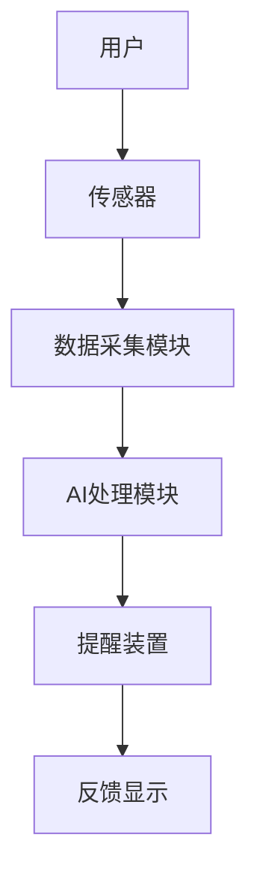

                 


# 智能办公椅：AI Agent的姿势矫正提醒

## 关键词：智能办公椅，AI Agent，姿势矫正，物联网，深度学习，人体工程学

## 摘要：本文探讨了智能办公椅在AI技术辅助下的姿势矫正提醒功能，分析了其技术原理、系统架构和实现方法，展示了如何通过AI代理改善办公环境中的坐姿问题，提供了一种智能化的健康解决方案。

---

# 第1章：背景介绍

## 1.1 智能办公椅的概念与背景

智能办公椅是一种结合了人工智能和物联网技术的办公家具，能够通过传感器和AI算法实时监测用户的坐姿，并提供矫正提醒。随着人们在办公环境中长时间久坐，姿势不良问题日益严重，智能办公椅成为解决这一问题的重要工具。

## 1.2 AI Agent的核心概念

AI Agent（智能代理）是一种能够感知环境并执行任务的智能系统。在智能办公椅中，AI Agent负责数据采集、姿势分析和提醒反馈。

## 1.3 姿势矫正的重要性

长时间不良坐姿可能导致颈椎病、腰椎病等健康问题。智能办公椅通过实时监测和提醒，帮助用户保持正确坐姿，预防健康问题。

---

# 第2章：AI Agent的姿势矫正系统核心概念

## 2.1 传感器与数据采集

智能办公椅通过多种传感器采集用户坐姿数据，包括：

- **加速度传感器**：监测坐姿倾斜度
- **压力传感器**：检测坐姿压力分布
- **角度传感器**：测量坐姿角度变化

## 2.2 姿势分析算法

AI Agent通过深度学习算法分析坐姿数据，识别不良姿势。常用算法包括：

- **卷积神经网络（CNN）**：用于图像处理和姿势识别
- **循环神经网络（RNN）**：用于时间序列数据处理

## 2.3 提醒机制

AI Agent根据分析结果，通过震动、声音或APP通知提醒用户调整坐姿。

---

# 第3章：姿势矫正系统的算法原理

## 3.1 深度学习模型构建

### 3.1.1 数据准备

- 数据来源：用户坐姿的图像数据
- 数据预处理：归一化、增强处理

### 3.1.2 模型训练

- 使用CNN模型进行图像分类，识别坐姿状态
- 交叉验证优化模型参数

## 3.2 姿势检测算法

### 3.2.1 坐姿分类

- 划分正常和不良坐姿类别
- 使用混淆矩阵评估分类性能

### 3.2.2 姿势矫正算法

- 通过优化算法调整坐姿角度
- 使用数学公式计算矫正力度

## 3.3 数学模型

### 3.3.1 检测算法

$$\text{检测结果} = f(\text{输入数据})$$

### 3.3.2 矫正算法

$$\text{矫正力度} = g(\text{检测结果})$$

---

# 第4章：系统架构设计

## 4.1 系统模块划分

- 传感器数据采集模块
- AI处理模块
- 提醒装置模块

## 4.2 系统功能设计

### 4.2.1 数据采集功能

- 实时采集坐姿数据
- 数据传输至AI模块

### 4.2.2 姿势分析功能

- 数据处理与分析
- 识别不良姿势

### 4.2.3 提醒反馈功能

- 发出提醒信号
- 提供矫正建议

## 4.3 系统架构图



---

# 第5章：项目实战

## 5.1 环境搭建

- 使用Python和TensorFlow框架
- 安装传感器驱动和相关库

## 5.2 核心代码实现

### 5.2.1 数据采集代码

```python
import numpy as np
import serial

ser = serial.Serial('COM3', 9600)
data = ser.read(100)
```

### 5.2.2 模型训练代码

```python
model = tf.keras.Sequential([
    tf.keras.layers.Conv2D(32, (3,3), activation='relu'),
    tf.keras.layers.MaxPooling2D((2,2)),
    tf.keras.layers.Flatten(),
    tf.keras.layers.Dense(128, activation='relu'),
    tf.keras.layers.Dense(2, activation='softmax')
])
```

## 5.3 功能测试与优化

- 测试传感器精度
- 优化算法识别率
- 改进提醒方式

---

# 第6章：总结与展望

## 6.1 系统总结

智能办公椅通过AI Agent实现姿势矫正提醒，有效改善了办公环境中的坐姿问题。

## 6.2 未来展望

未来，智能办公椅将更加智能化，具备更多健康监测功能，如心率监测和压力监测。

---

作者：AI天才研究院/AI Genius Institute & 禅与计算机程序设计艺术 /Zen And The Art of Computer Programming

