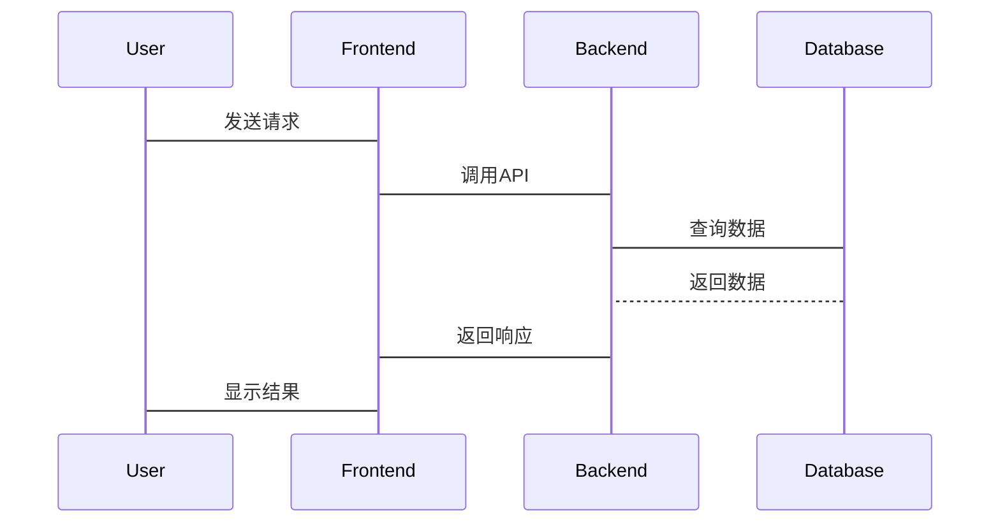

                 


# 智能办公：AI Agent提升工作效率

> 关键词：智能办公，AI Agent，大语言模型，自然语言处理，数字化转型

> 摘要：本文深入探讨了AI Agent在智能办公中的应用，分析了其核心概念、算法原理和系统架构，通过实际案例展示了如何利用AI Agent提升工作效率，并提供了最佳实践建议。

---

## 第1章 AI Agent与智能办公概述

### 1.1 AI Agent的基本概念

#### 1.1.1 什么是AI Agent
AI Agent（人工智能代理）是一种智能体，能够感知环境并采取行动以实现目标。它通过接收输入、处理信息、生成输出或执行操作来提供服务。AI Agent可以是软件程序或硬件设备，具备学习、推理和自适应能力。

#### 1.1.2 AI Agent的核心特点
- **自主性**：能够自主决策和行动。
- **反应性**：能够实时感知环境并做出反应。
- **学习能力**：能够通过数据和经验改进性能。
- **可扩展性**：适用于多种应用场景。

#### 1.1.3 AI Agent与传统办公工具的区别
AI Agent不仅仅是工具，它具备智能性和适应性，能够主动理解和处理复杂任务，提供更高效的解决方案。

### 1.2 AI Agent在智能办公中的作用

#### 1.2.1 提升工作效率的潜力
AI Agent能够自动化处理邮件、安排日程、管理任务，显著减少人工操作时间。

#### 1.2.2 AI Agent在办公场景中的应用案例
- **智能邮件助手**：自动分类、总结邮件内容。
- **日程管理**：智能安排会议和提醒。
- **任务分配**：根据团队成员能力分配任务。

#### 1.2.3 AI Agent对企业数字化转型的意义
AI Agent推动企业从传统办公向智能化办公转变，提升整体效率和竞争力。

### 1.3 智能办公的背景与趋势

#### 1.3.1 数字化办公的现状
企业正在广泛采用数字化工具，但效率提升有限，AI Agent的引入将推动办公智能化。

#### 1.3.2 AI技术在办公领域的应用趋势
AI技术的应用日益广泛，AI Agent成为办公自动化的核心工具。

#### 1.3.3 企业对AI Agent的需求分析
企业希望通过AI Agent实现办公流程的智能化和自动化，降低运营成本，提升效率。

---

## 第2章 AI Agent的核心技术

### 2.1 大语言模型在AI Agent中的应用

#### 2.1.1 大语言模型的基本原理
大语言模型通过大量数据训练，能够理解和生成人类语言。模型结构包括编码器和解码器，用于理解和生成文本。

#### 2.1.2 大语言模型在自然语言处理中的优势
- **上下文理解**：能够处理长上下文，理解语境。
- **多任务处理**：适用于多种NLP任务，如分类、生成。

#### 2.1.3 大语言模型与AI Agent的结合
AI Agent利用大语言模型进行自然语言理解，实现用户意图识别和任务执行。

### 2.2 AI Agent的体系结构

#### 2.2.1 AI Agent的组成模块
- **感知模块**：接收输入并解析用户需求。
- **决策模块**：根据需求生成行动计划。
- **执行模块**：执行任务并返回结果。

#### 2.2.2 各模块的功能与交互
感知模块通过NLP技术理解用户输入，决策模块基于理解和知识库生成计划，执行模块调用API或工具完成任务。

#### 2.2.3 体系结构的优缺点分析
优点：模块化设计便于扩展；缺点：模块间通信可能增加复杂性。

### 2.3 AI Agent的分类与应用场景

#### 2.3.1 基于规则的AI Agent
根据预设规则执行任务，适用于简单场景。

#### 2.3.2 基于模型的AI Agent
基于机器学习模型进行推理和决策，适用于复杂场景。

#### 2.3.3 基于大语言模型的AI Agent
结合大语言模型的自然语言处理能力，提供更智能的服务。

---

## 第3章 AI Agent的算法原理

### 3.1 大语言模型的训练过程

#### 3.1.1 数据预处理
- **清洗数据**：去除噪声，标准化格式。
- **分词处理**：将文本分割为词或短语。

#### 3.1.2 模型训练
使用大规模数据训练，采用自监督学习，生成模型参数。

#### 3.1.3 模型微调
在特定任务上进行微调，提升模型在目标领域的性能。

### 3.2 基于大语言模型的生成算法

#### 3.2.1 解码过程
- **贪心搜索**：逐词生成最可能的词。
- **采样方法**：随机采样生成多样化结果。

#### 3.2.2 注意力机制
通过注意力机制捕捉文本中的关键信息，生成更准确的输出。

---

## 第4章 AI Agent的系统分析与架构设计

### 4.1 问题场景介绍

#### 4.1.1 办公场景问题
- **信息过载**：大量邮件和通知难以处理。
- **任务分配**：难以根据员工能力分配任务。

### 4.2 项目介绍

#### 4.2.1 项目目标
开发一个智能办公助手，帮助用户自动化处理邮件、安排日程、分配任务。

### 4.3 系统功能设计

#### 4.3.1 领域模型设计
- **用户模块**：管理用户信息。
- **任务模块**：管理任务和日程。

#### 4.3.2 系统架构设计
- **前端**：用户界面，接收输入。
- **后端**：处理逻辑，调用AI模型。
- **数据库**：存储用户和任务数据。

### 4.4 系统接口设计

#### 4.4.1 API接口
- `/api/users`：管理用户。
- `/api/tasks`：管理任务。

### 4.5 系统交互设计

#### 4.5.1 序列图


---

## 第5章 AI Agent的项目实战

### 5.1 环境安装

#### 5.1.1 安装Python
```bash
python --version
pip install --upgrade pip
```

#### 5.1.2 安装依赖库
```bash
pip install transformers
pip install torch
```

### 5.2 系统核心实现

#### 5.2.1 模型加载
```python
from transformers import AutoTokenizer, AutoModelForCausalLM
tokenizer = AutoTokenizer.from_pretrained('gpt2')
model = AutoModelForCausalLM.from_pretrained('gpt2')
```

#### 5.2.2 生成文本
```python
def generate_text(prompt, max_length=50):
    inputs = tokenizer.encode(prompt, return_tensors='pt')
    outputs = model.generate(inputs, max_length=max_length)
    return tokenizer.decode(outputs[0], skip_special_tokens=True)
```

### 5.3 实际案例分析

#### 5.3.1 案例：智能会议助手
开发一个AI Agent，帮助用户安排会议和发送提醒。

---

## 第6章 最佳实践

### 6.1 注意事项
- **数据隐私**：确保用户数据的安全和隐私。
- **模型优化**：根据具体任务优化模型性能。

### 6.2 小结
通过合理设计和优化，AI Agent能够显著提升办公效率。

### 6.3 拓展阅读
推荐阅读《大语言模型原理与应用》和《AI在办公自动化中的创新应用》。

---

## 作者信息

作者：AI天才研究院/AI Genius Institute & 禅与计算机程序设计艺术 /Zen And The Art of Computer Programming

