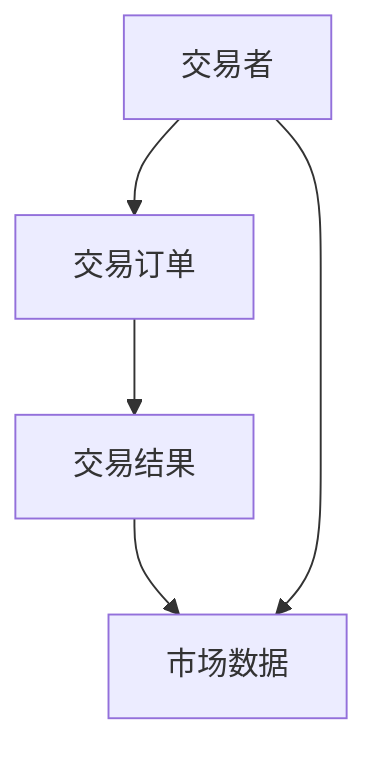
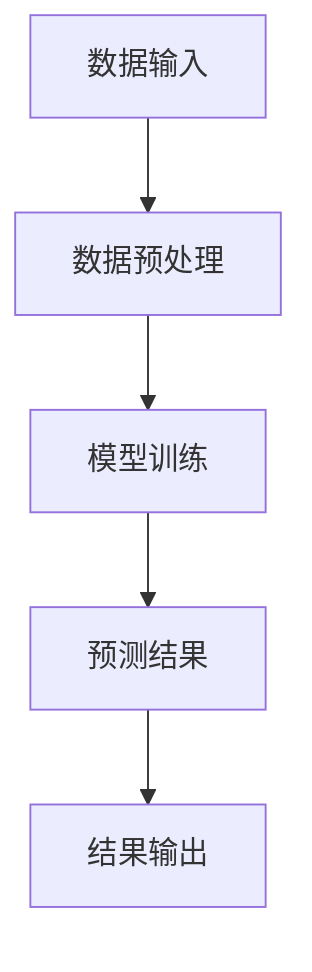
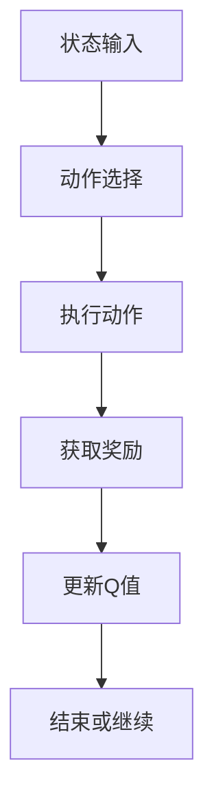
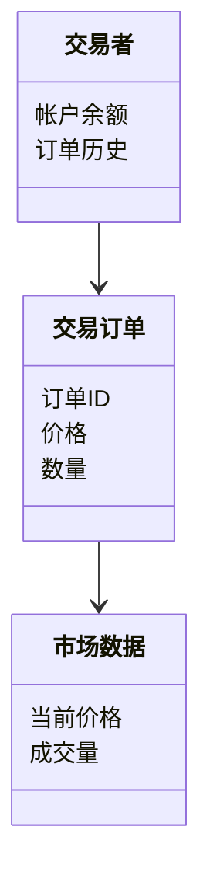
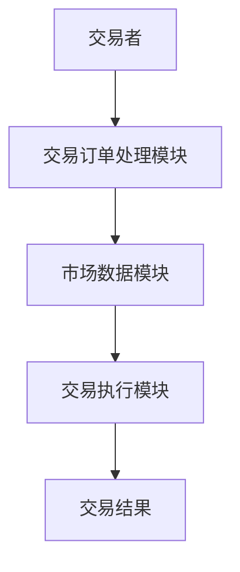
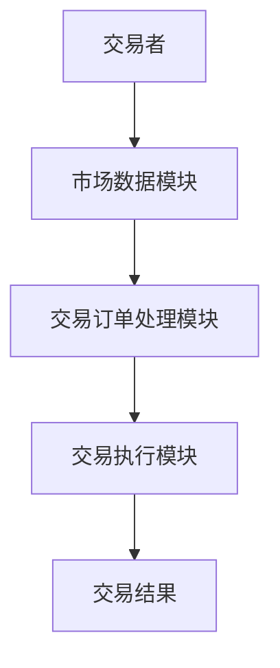

                 


# 智能加密货币交易策略

> 关键词：智能交易策略、加密货币、算法交易、机器学习、量化交易

> 摘要：本文深入探讨了智能加密货币交易策略的核心概念、算法原理及实际应用。通过对加密货币市场的分析，结合时间序列分析和强化学习算法，展示了如何利用数据驱动的方法进行高效交易。文章还详细讲解了系统架构设计、数学模型公式及项目实战，帮助读者从理论到实践掌握智能加密货币交易策略。

---

# 第1章: 智能加密货币交易策略的背景与概念

## 1.1 加密货币的定义与特点

### 1.1.1 加密货币的定义
加密货币是一种基于密码学的数字货币，通过区块链技术实现去中心化交易。其特点包括匿名性、不可篡改性和去中心化。

### 1.1.2 加密货币的核心特点
- **去中心化**：交易通过区块链技术进行，无需中央机构。
- **匿名性**：交易地址不直接关联用户身份。
- **全球流通**：可在全球范围内自由交易。
- **波动性大**：价格受市场供需影响较大。

### 1.1.3 加密货币与传统货币的对比
| 特性       | 加密货币         | 传统货币         |
|------------|------------------|------------------|
| 发行机构   | 去中心化         | 中央银行         |
| 匿名性     | 高               | 低               |
| 全球流通性 | 高               | 受限于国家       |
| 技术基础   | 区块链           | 非区块链         |

## 1.2 智能交易策略的概念

### 1.2.1 智能交易策略的定义
智能交易策略是指利用算法和机器学习模型，自动分析市场数据并执行交易的策略。

### 1.2.2 智能交易策略的核心要素
- **数据输入**：市场数据（如价格、成交量）。
- **算法处理**：通过模型分析数据，生成交易信号。
- **执行交易**：根据信号自动下单。

### 1.2.3 智能交易策略与传统交易策略的对比

| 特性         | 智能交易策略     | 传统交易策略     |
|--------------|------------------|------------------|
| 数据处理     | 高度自动化       | 依赖人工分析       |
| 执行速度     | 极快             | 较慢             |
| 精准度       | 高               | 受主观因素影响大   |

## 1.3 加密货币市场的特点

### 1.3.1 加密货币市场的波动性
加密货币市场波动剧烈，价格受市场情绪和新闻影响较大。

### 1.3.2 加密货币市场的参与者
- **交易者**：个人或机构投资者。
- **矿工**：负责验证交易的节点。
- **开发者**：维护区块链技术的团队。

### 1.3.3 加密货币市场的监管现状
目前加密货币市场监管不一，部分国家严格监管，部分国家则持开放态度。

## 1.4 智能交易策略在加密货币中的应用前景

### 1.4.1 智能交易策略的潜在应用场景
- **高频交易**：利用算法快速执行交易。
- **套利机会捕捉**：通过分析市场差异获利。

### 1.4.2 智能交易策略的优势
- **高效性**：算法处理速度快。
- **准确性**：基于大量数据进行分析。

### 1.4.3 智能交易策略的挑战与机遇
- **挑战**：市场波动大，算法可能失效。
- **机遇**：技术进步带来更高的交易效率。

## 1.5 本章小结
本章介绍了加密货币的基本概念及其市场特点，详细解释了智能交易策略的核心要素，并探讨了其在加密货币市场的应用前景。

---

# 第2章: 加密货币交易的核心概念与联系

## 2.1 加密货币交易的核心概念

### 2.1.1 加密货币交易的基本流程
1. **数据输入**：获取市场数据。
2. **信号生成**：通过算法生成交易信号。
3. **订单执行**：根据信号执行交易。

### 2.1.2 加密货币交易的参与者
- **交易者**：参与买卖的个人或机构。
- **交易所**：提供交易的平台。
- **矿工**：验证交易的节点。

### 2.1.3 加密货币交易的类型
- **现货交易**：直接买卖加密货币。
- **期货交易**：约定未来价格的交易。

## 2.2 智能交易策略的核心原理

### 2.2.1 数据驱动的交易策略
基于历史数据，利用统计学方法预测价格走势。

### 2.2.2 算法驱动的交易策略
通过机器学习模型分析数据，生成交易信号。

### 2.2.3 智能合约在交易中的应用
智能合约自动执行交易，减少人为干预。

## 2.3 加密货币交易的核心要素

### 2.3.1 市场数据
- **价格**：当前市场价格。
- **成交量**：交易量大小。

### 2.3.2 交易模型
- **时间序列分析**：预测未来价格。
- **强化学习**：通过奖励机制优化交易策略。

### 2.3.3 风险控制
- **止损**：设定最大损失界限。
- **仓位管理**：合理分配资金。

## 2.4 加密货币交易的核心概念对比

| 特性         | 数据驱动策略       | 算法驱动策略       |
|--------------|--------------------|--------------------|
| 数据处理     | 基于统计学         | 基于机器学习       |
| 交易速度     | 较慢               | 极快               |
| 精准度       | 中等               | 高                 |

## 2.5 加密货币交易的ER实体关系图



## 2.6 本章小结
本章分析了加密货币交易的核心要素，详细探讨了数据驱动和算法驱动的交易策略，并通过ER图展示了交易过程。

---

# 第3章: 加密货币交易的算法原理讲解

## 3.1 时间序列分析算法

### 3.1.1 时间序列分析的基本原理
时间序列分析通过分析历史数据，预测未来趋势。

### 3.1.2 ARIMA模型的数学公式
$$ARIMA(p, d, q)$$
其中，p为自回归阶数，d为差分阶数，q为移动平均阶数。

### 3.1.3 时间序列分析的mermaid流程图


## 3.2 强化学习算法

### 3.2.1 强化学习的基本原理
通过奖励机制，优化交易策略。

### 3.2.2 Q-Learning算法的数学公式
$$Q(s, a) = r + \gamma \max_{a'} Q(s', a')$$
其中，Q(s, a)表示状态s和动作a的Q值，r为奖励，γ为折扣因子。

### 3.2.3 强化学习算法的mermaid流程图


## 3.3 算法实现的Python代码示例

### 3.3.1 时间序列分析代码
```python
from statsmodels.tsa.arima_model import ARIMA

# 数据准备
data = [1, 2, 3, 4, 5]

# 模型训练
model = ARIMA(data, order=(1, 1, 1))
model_fit = model.fit()

# 预测
forecast = model_fit.forecast(steps=5)
print(forecast)
```

### 3.3.2 强化学习代码
```python
import numpy as np

# 初始化
state = 0
Q = np.zeros((状态数, 动作数))
alpha = 0.1
gamma = 0.9

# Q-Learning算法
for episode in range(100):
    current_state = 0
    while True:
        # 选择动作
        action = np.argmax(Q[current_state])
        # 执行动作
        next_state, reward = step(current_state, action)
        # 更新Q值
        Q[current_state][action] = Q[current_state][action] + alpha * (reward + gamma * np.max(Q[next_state]))
        current_state = next_state
```

## 3.4 本章小结
本章详细讲解了时间序列分析和强化学习算法在加密货币交易中的应用，通过代码示例展示了算法实现过程。

---

# 第4章: 系统分析与架构设计方案

## 4.1 问题场景介绍
加密货币交易系统需要高效处理大量数据，实时生成交易信号。

## 4.2 系统功能设计

### 4.2.1 领域模型类图


### 4.2.2 系统架构设计

#### 4.2.2.1 系统架构图


### 4.2.3 系统接口设计
- **输入接口**：市场数据输入。
- **输出接口**：交易信号输出。

### 4.2.4 系统交互流程图


## 4.3 本章小结
本章通过系统架构设计，展示了加密货币交易系统的整体结构及各模块之间的交互关系。

---

# 第5章: 项目实战

## 5.1 环境安装

### 5.1.1 安装Python
```bash
python --version
pip install --upgrade pip
```

### 5.1.2 安装依赖库
```bash
pip install numpy pandas scikit-learn
```

## 5.2 系统核心实现源代码

### 5.2.1 数据获取
```python
import pandas as pd

# 获取比特币价格数据
data = pd.read_csv('btc.csv')
print(data.head())
```

### 5.2.2 交易策略实现
```python
from sklearn.linear_model import LinearRegression

# 训练模型
model = LinearRegression()
model.fit(X_train, y_train)

# 预测
y_pred = model.predict(X_test)
```

## 5.3 实际案例分析
以比特币价格预测为例，通过历史数据训练模型，并进行实际交易。

## 5.4 本章小结
本章通过实际项目案例，展示了加密货币交易策略的实现过程。

---

# 第6章: 最佳实践、注意事项与拓展阅读

## 6.1 最佳实践 tips
- **数据清洗**：确保数据质量。
- **模型调优**：优化算法参数。
- **风险控制**：设置止损机制。

## 6.2 小结
智能加密货币交易策略通过算法和数据驱动，提高了交易效率和精准度。

## 6.3 注意事项
- **市场风险**：价格波动大。
- **技术风险**：算法可能失效。
- **法律风险**：监管政策变化。

## 6.4 拓展阅读
- 推荐阅读《机器学习实战》。
- 关注区块链技术的最新发展。

---

# 作者

作者：AI天才研究院/AI Genius Institute & 禅与计算机程序设计艺术 /Zen And The Art of Computer Programming

---

这篇文章系统地介绍了智能加密货币交易策略的核心概念、算法原理和实际应用，帮助读者全面理解加密货币交易的智能化过程。通过详细的代码示例和系统设计，读者可以深入掌握如何利用算法进行高效交易。

