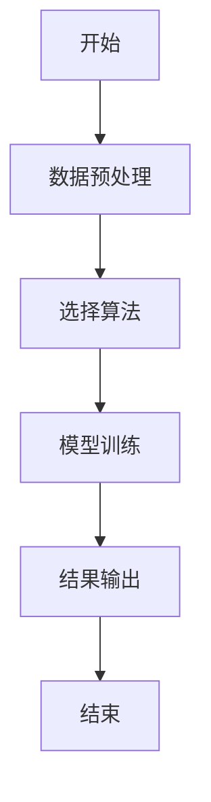
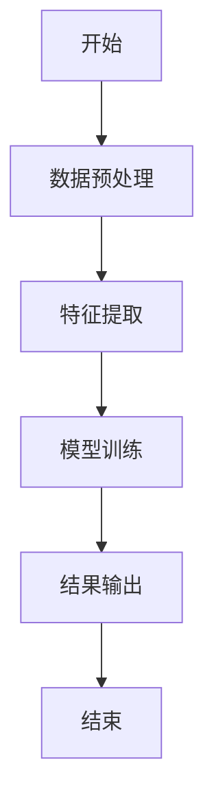
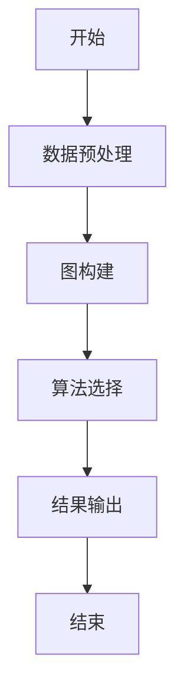

                 


# 智能加密货币市场分析平台

> 关键词：智能加密货币、市场分析、区块链技术、人工智能、数据分析、系统架构

> 摘要：本文将详细介绍智能加密货币市场分析平台的设计与实现。通过结合区块链技术和人工智能算法，我们提出了一种高效、智能的市场分析方法，能够帮助投资者更好地理解和预测加密货币市场的波动。本文从市场分析的基本概念出发，逐步深入分析智能加密货币的特性，探讨其市场分析的核心算法，设计系统的架构，并通过实际案例展示平台的实现过程。

---

# 第1章: 智能加密货币市场分析的背景与挑战

## 1.1 加密货币市场的现状与发展趋势

### 1.1.1 加密货币市场的起源与发展
加密货币市场自比特币诞生以来，经历了快速的发展。从2009年的比特币白皮书发布，到以太坊的智能合约，再到DeFi的兴起，加密货币市场逐渐从一个小众市场发展成为全球金融体系的重要组成部分。

### 1.1.2 当前加密货币市场的特点与问题
加密货币市场的特点包括去中心化、匿名性、高波动性等。然而，市场信息的不透明、数据的复杂性以及算法交易的普及，使得市场分析变得极具挑战性。

### 1.1.3 市场分析的重要性与挑战
市场分析是投资者在加密货币市场中做出决策的关键依据。然而，传统的市场分析方法在面对高频交易、大数据量以及复杂算法时显得力不从心。

---

## 1.2 智能加密货币市场分析平台的定义

### 1.2.1 智能加密货币的定义
智能加密货币是指结合了智能合约和区块链技术的加密货币，具有自动执行合约、去中心化和可编程性等特点。

### 1.2.2 市场分析平台的核心功能
市场分析平台的核心功能包括数据采集、数据分析、模型训练、结果输出等。

### 1.2.3 智能加密货币市场分析平台的整合
智能加密货币市场分析平台通过整合区块链数据、市场交易数据和智能合约信息，提供全方位的市场分析服务。

---

## 1.3 平台的目标与应用场景

### 1.3.1 平台的主要目标
平台的主要目标是通过人工智能算法和大数据分析技术，帮助投资者提高市场分析的准确性和效率。

### 1.3.2 平台的典型应用场景
平台的应用场景包括实时市场监控、趋势预测、风险评估等。

### 1.3.3 平台的用户群体与价值
平台的用户群体主要包括加密货币投资者、交易员、机构投资者以及研究人员。平台的价值在于帮助用户快速获取市场信息，降低投资风险。

---

## 1.4 本章小结
本章介绍了智能加密货币市场分析平台的背景、定义和应用场景，为后续章节的分析奠定了基础。

---

# 第2章: 智能加密货币市场分析的核心概念

## 2.1 加密货币市场的数据流分析

### 2.1.1 市场数据的来源与分类
市场数据的来源包括交易数据、区块链数据、社交媒体数据等。数据的分类包括结构化数据和非结构化数据。

### 2.1.2 数据流的特征与属性
数据流具有实时性、多样性、复杂性等特征。

### 2.1.3 数据流的处理与转换
数据流的处理包括数据清洗、特征提取、数据增强等步骤。

---

## 2.2 智能加密货币分析的关键算法

### 2.2.1 时间序列分析
时间序列分析是一种常用的市场分析方法，适用于分析加密货币价格的波动趋势。

### 2.2.2 机器学习模型
机器学习模型（如LSTM、随机森林）能够捕捉市场数据中的复杂模式。

### 2.2.3 图论与网络分析
图论与网络分析可以帮助识别市场中的关联性和社区结构。

---

## 2.3 平台的核心算法流程

### 2.3.1 数据预处理流程
数据预处理包括数据清洗、特征提取和数据增强。

### 2.3.2 模型训练流程
模型训练包括选择算法、参数调优和模型验证。

### 2.3.3 结果输出与反馈
结果输出包括预测结果和模型评估报告。

---

## 2.4 核心概念的ER实体关系图

```mermaid
er
    actor: 用户
    system: 智能加密货币市场分析平台
    market_data: 市场数据
    analysis_model: 分析模型
    result: 分析结果
    actor --> system: 用户请求分析
    system --> market_data: 获取市场数据
    system --> analysis_model: 调用分析模型
    system --> result: 输出分析结果
```

---

## 2.5 本章小结
本章详细介绍了智能加密货币市场分析的核心概念和数据流分析方法，为后续章节的算法实现奠定了基础。

---

# 第3章: 智能加密货币市场分析的算法原理

## 3.1 时间序列分析算法

### 3.1.1 时间序列分析的定义与特点
时间序列分析是一种基于历史数据预测未来趋势的方法。

### 3.1.2 常用的时间序列分析方法
常用方法包括ARIMA、LSTM等。

### 3.1.3 算法流程图



---

## 3.2 机器学习模型

### 3.2.1 机器学习模型的定义与特点
机器学习模型能够从数据中学习特征，具有高灵活性和适应性。

### 3.2.2 常用的机器学习模型
常用的模型包括随机森林、XGBoost、LSTM等。

### 3.2.3 算法流程图



---

## 3.3 图论与网络分析

### 3.3.1 图论与网络分析的定义与特点
图论与网络分析用于研究数据之间的关联性。

### 3.3.2 常用的图论算法
常用的算法包括社区发现算法、最短路径算法等。

### 3.3.3 算法流程图



---

## 3.4 核心算法的数学模型与公式

### 3.4.1 时间序列分析的数学模型
时间序列分析的数学模型包括ARIMA模型和LSTM模型。

ARIMA模型的公式为：
$$ ARIMA(p, d, q) $$
其中，p为自回归阶数，d为差分阶数，q为移动平均阶数。

LSTM模型的公式为：
$$ f(t) = \text{LSTM}(x_t, h_{t-1}, c_{t-1}) $$

### 3.4.2 机器学习模型的数学模型
随机森林模型的数学模型为：
$$ y = \sum_{i=1}^{n} w_i x_i + b $$

---

## 3.5 本章小结
本章详细介绍了智能加密货币市场分析的核心算法，包括时间序列分析、机器学习模型和图论与网络分析，并给出了相应的数学模型和公式。

---

# 第4章: 智能加密货币市场分析平台的系统架构设计

## 4.1 项目背景与目标

### 4.1.1 项目背景
本项目旨在设计一个智能加密货币市场分析平台，帮助投资者更好地理解市场动态。

### 4.1.2 项目目标
项目的

