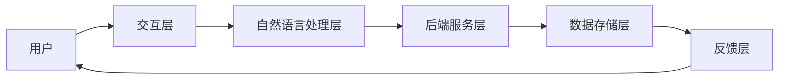

                 


# 智能助手的架构设计

## 关键词：智能助手、自然语言处理、系统架构、语音识别、交互设计

## 摘要：智能助手是一种基于人工智能技术的交互工具，通过自然语言处理和语音识别等技术实现与用户的智能对话。本文详细分析智能助手的架构设计，包括核心概念、技术实现、系统架构和项目实战，帮助读者全面理解智能助手的设计与实现过程。

## 目录大纲：

1. **智能助手的背景与概念**
2. **智能助手的核心概念与架构模型**
3. **智能助手的技术实现**
4. **智能助手的系统架构设计**
5. **智能助手的项目实战**
6. **智能助手的最佳实践与小结**

---

## 第1章：智能助手的背景与概念

### 1.1 智能助手的定义与特点

智能助手是一种基于人工智能技术的交互工具，能够通过自然语言处理（NLP）和语音识别等技术，理解用户的意图并提供相应的服务。其核心特点包括：

- **智能化**：能够理解并处理自然语言，提供智能响应。
- **实时性**：快速响应用户请求，提供即时服务。
- **多平台支持**：可以在多种设备上运行，如手机、电脑、智能音箱等。
- **可扩展性**：支持多种功能模块的扩展和集成。

### 1.2 从传统助手到智能助手的演变

#### 1.2.1 传统助手的功能与局限
传统助手主要依赖规则引擎，能够执行简单的命令，但缺乏智能理解和学习能力。例如，传统助手只能处理预定义的命令，无法理解和处理复杂的自然语言请求。

#### 1.2.2 智能助手的创新与突破
智能助手通过引入机器学习和深度学习技术，能够理解上下文和用户意图，提供更智能的服务。例如，智能助手可以通过上下文理解用户的隐含需求，并提供相关的建议和服务。

#### 1.2.3 智能助手与人类交互的未来趋势
随着技术的进步，智能助手将更加智能化和人性化，能够理解和处理更复杂的语言和情感，提供更贴近人类需求的服务。

### 1.3 智能助手在企业中的应用前景

#### 1.3.1 企业级智能助手的潜力
企业级智能助手可以在客户服务、内部管理、信息检索等领域发挥重要作用，提高企业的效率和竞争力。

#### 1.3.2 企业采用智能助手的优势
企业可以通过智能助手实现自动化服务，降低人力成本，提高客户满意度。

#### 1.3.3 智能助手应用的挑战与机遇
智能助手的应用需要克服技术、数据和隐私等方面的挑战，同时也带来了巨大的市场机遇。

---

## 第2章：智能助手的核心概念与架构模型

### 2.1 智能助手的核心要素

#### 2.1.1 交互界面
交互界面是用户与智能助手之间的桥梁，包括文本输入、语音输入和图形界面等多种形式。

#### 2.1.2 自然语言处理
自然语言处理是智能助手的核心技术，用于理解用户的语言输入并生成相应的输出。

#### 2.1.3 后端服务
后端服务负责处理用户的请求，调用相关API，获取数据并返回结果。

### 2.2 智能助手的架构模型

#### 2.2.1 分层架构
分层架构将智能助手划分为交互层、处理层和数据层，每一层负责不同的功能模块。

#### 2.2.2 微服务架构
微服务架构将智能助手的功能模块化，每个模块独立运行，便于扩展和维护。

#### 2.2.3 混合架构
混合架构结合了分层架构和微服务架构的优势，适用于复杂的智能助手系统。

### 2.3 实体关系图


---

## 第3章：智能助手的技术实现

### 3.1 自然语言处理技术

#### 3.1.1 分词与实体识别

- **分词算法**：将用户输入的文本分割成词语或短语，常用算法包括正向最大匹配法和逆向最大匹配法。
- **实体识别**：识别文本中的命名实体，如人名、地名和组织名。

#### 3.1.2 语言模型

- **词袋模型**：将文本表示为词语的集合，忽略词语顺序。
- **词嵌入模型**：通过训练生成词语的向量表示，如Word2Vec。
- **神经网络语言模型**：使用深度学习模型，如LSTM，生成连续的词向量表示。

### 3.2 语音识别与合成

#### 3.2.1 语音识别技术

- **声学模型**：通过机器学习模型，将语音信号转换为文本。
- **语言模型**：用于消除语音识别中的歧义，提高识别准确率。
- **解码算法**：将声学模型和语言模型结合，生成最终的识别结果。

#### 3.2.2 语音合成技术

- **文本到语音的转换**：将文本转换为语音，常用的算法包括MBROLA和Neural TTS。
- **语音合成的实现**：通过训练生成语音的波形，实现自然的语音合成。

---

## 第4章：智能助手的系统架构设计

### 4.1 系统模块划分

- **交互模块**：负责接收用户的输入，解析用户的意图。
- **自然语言处理模块**：处理用户的语言输入，生成相应的输出。
- **后端服务模块**：调用相关API，获取数据并返回结果。
- **数据存储模块**：存储用户数据和系统配置，支持系统的运行。

### 4.2 系统架构图


### 4.3 系统接口设计

- **用户请求接口**：接收用户的输入请求，解析用户的意图。
- **后端服务接口**：调用相关的API，获取数据并返回结果。
- **反馈接口**：将处理结果反馈给用户，支持用户的交互。

### 4.4 系统交互流程图



---

## 第5章：智能助手的项目实战

### 5.1 项目介绍

- **项目名称**：智能客服助手
- **项目目标**：实现一个智能客服助手，能够处理用户的咨询请求，提供相应的服务。

### 5.2 系统设计

- **需求分析**：用户可以通过文本或语音输入咨询请求，系统通过自然语言处理技术，理解用户的意图，调用相关API，获取数据并返回结果。
- **系统功能设计**：包括用户请求处理、自然语言处理、后端服务调用和结果反馈。

### 5.3 核心代码实现

#### 5.3.1 环境配置

- **Python版本**：3.8以上
- **依赖库**：numpy、pandas、scikit-learn、tensorflow

#### 5.3.2 自然语言处理代码

```python
import numpy as np
from sklearn.feature_extraction.text import TfidfVectorizer
from sklearn.naive_bayes import MultinomialNB

# 数据预处理
text = "What is the weather today?"
vectorizer = TfidfVectorizer()
X = vectorizer.fit_transform([text])

# 模型训练
model = MultinomialNB()
model.fit(X, [0])

# 模型预测
new_text = "天气怎么样？"
X_new = vectorizer.transform([new_text])
predicted = model.predict(X_new)
print(predicted)
```

#### 5.3.3 语音识别代码

```python
import speech_recognition as sr

# 初始化识别器
r = sr.Recognizer()

# 加载音频文件
audio_file = sr.AudioFile("test.wav")
with audio_file as source:
    audio = r.record(source)

# 转换为文本
text = r.recognize_google(audio)
print(text)
```

### 5.4 项目小结

通过本项目，我们实现了一个智能客服助手，能够处理用户的咨询请求，提供相应的服务。系统采用了自然语言处理技术和语音识别技术，实现了智能化的用户交互。

---

## 第6章：智能助手的最佳实践与小结

### 6.1 最佳实践

- **模块化设计**：将系统划分为多个功能模块，便于扩展和维护。
- **数据安全**：确保用户数据的安全性，防止数据泄露。
- **性能优化**：通过优化算法和架构设计，提高系统的响应速度和处理能力。

### 6.2 小结

智能助手的架构设计是一个复杂而重要的任务，需要综合考虑自然语言处理、语音识别、系统架构等多个方面的内容。通过模块化设计和合理的架构选择，可以实现高效、智能的用户交互。

### 6.3 注意事项

- **数据隐私**：在设计智能助手时，必须注意用户数据的隐私保护。
- **系统稳定性**：确保系统的稳定运行，避免因故障导致服务中断。
- **用户体验**：优化用户体验，提高用户的满意度和使用体验。

### 6.4 拓展阅读

- **《自然语言处理实战》**：深入讲解自然语言处理技术的实现与应用。
- **《人工智能系统设计》**：探讨人工智能系统的架构设计和优化方法。

---

## 作者：AI天才研究院/AI Genius Institute & 禅与计算机程序设计艺术 /Zen And The Art of Computer Programming

---

通过以上内容，我们详细分析了智能助手的架构设计，包括核心概念、技术实现、系统架构和项目实战。希望读者能够通过本文，全面理解智能助手的设计与实现过程，并能够在实际应用中灵活运用这些知识。

