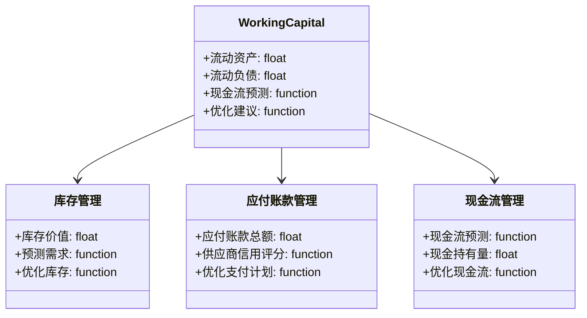
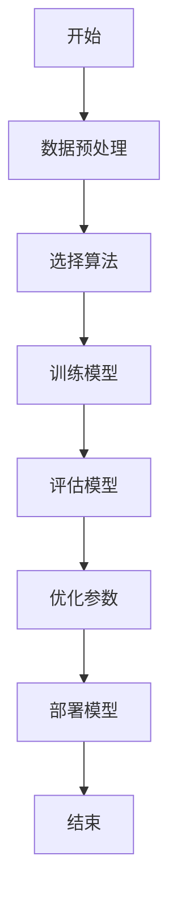
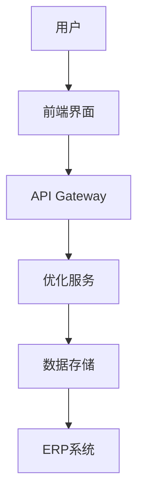
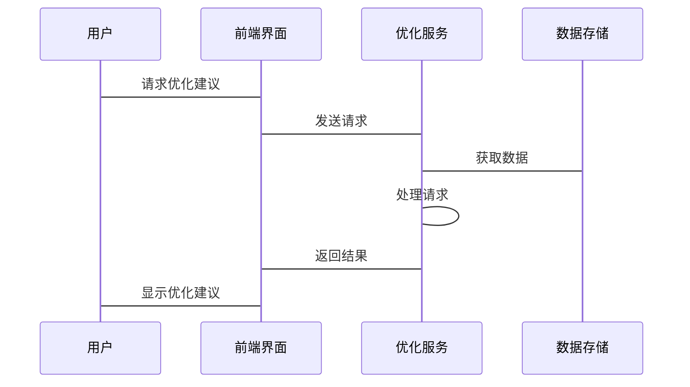

                 


---

# 智能化企业Working Capital优化模型设计

> 关键词：Working Capital优化，企业财务，智能化模型，算法设计，系统架构，项目实战

> 摘要：本文详细探讨了智能化企业Working Capital优化模型的设计与实现。通过分析Working Capital的核心概念，结合数学建模和算法优化，提出了基于机器学习和线性规划的优化方法，并结合系统架构设计和项目实战，展示了如何将理论应用于实际企业场景中。本文旨在为企业提供一种高效、智能的Working Capital管理解决方案。

---

# 第一部分: 背景与基础

## 第1章: Working Capital优化概述

### 1.1 Working Capital的基本概念

#### 1.1.1 什么是Working Capital
Working Capital（运营资本）是指企业在日常运营中所需的流动资产减去流动负债的部分。它是企业短期偿债能力和运营效率的重要指标。

$$\text{Working Capital} = \text{流动资产} - \text{流动负债}$$

流动资产包括现金、应收账款、存货等，流动负债包括应付账款、短期贷款等。

#### 1.1.2 Working Capital的组成部分
- **流动资产**：现金、应收账款、存货。
- **流动负债**：应付账款、短期负债。

#### 1.1.3 Working Capital在企业中的重要性
- 保障企业日常运营。
- 优化Working Capital可以提高资金使用效率，降低财务风险。

### 1.2 企业Working Capital管理的挑战

#### 1.2.1 资金流动性问题
企业需要在满足日常运营需求的同时，避免资金闲置或短缺。

#### 1.2.2 库存管理的复杂性
库存过多增加成本，库存过少可能导致生产中断。

#### 1.2.3 应付账款与应收账款的平衡
如何在应收账款和应付账款之间找到平衡，是优化Working Capital的关键。

### 1.3 智能化优化的必要性

#### 1.3.1 传统Working Capital管理的局限性
- 依赖人工经验，效率低。
- 数据分析能力有限。

#### 1.3.2 智能化技术如何提升效率
- 利用大数据和机器学习进行预测和优化。
- 实时监控和调整。

#### 1.3.3 数据驱动决策的优势
- 基于历史数据和实时数据，提供精准的预测和优化建议。

### 1.4 本章小结
本章介绍了Working Capital的基本概念、组成部分及其在企业中的重要性，并分析了传统管理的挑战和智能化优化的必要性。

---

# 第二部分: 核心概念与联系

## 第2章: 核心概念与联系

### 2.1 优化模型的关键要素

#### 2.1.1 流动资产的优化
- 现金流预测与管理。
- 存货优化。

#### 2.1.2 流动负债的优化
- 应付账款管理。
- 短期负债的优化。

#### 2.1.3 现金流预测与管理
现金流预测是优化Working Capital的核心，准确的预测可以降低资金风险。

### 2.2 核心概念的属性对比

#### 2.2.1 表格: 流动资产与流动负债的属性对比

| 属性             | 流动资产             | 流动负债             |
|------------------|--------------------|--------------------|
| 定义             | 现金、应收账款、存货 | 应付账款、短期负债   |
| 周转速度         | 高                 | 高                 |
| 风险             | 高（库存积压）      | 中（债务风险）      |
| 管理目标         | 最小化持有成本      | 最小化债务成本      |

#### 2.2.2 图表: ER实体关系图展示
```mermaid
erd
    顾客(顾客ID,姓名,地址)
    供应商(供应商ID,公司名称,地址)
    订单(订单ID,顾客ID,订单日期,总金额)
    库存(库存ID,产品ID,数量,价值)
    账户(账户ID,公司名称,账户余额)
    订单--购买-->库存
    订单--支付-->账户
    库存--供应-->供应商
    账户--属于-->公司
```

### 2.3 领域模型类图



---

# 第三部分: 优化模型的算法原理

## 第3章: 算法原理与实现

### 3.1 优化模型的算法选择

#### 3.1.1 线性规划与非线性规划

- **线性规划**：适用于目标函数和约束条件均为线性的情况，如简单的库存优化。
- **非线性规划**：适用于更复杂的情况，如考虑市场波动的现金流预测。

#### 3.1.2 机器学习算法的应用

- **时间序列分析**：用于现金流预测，如ARIMA模型。
- **回归分析**：用于预测应收账款回收率。

### 3.2 算法流程图



### 3.3 算法实现

#### 3.3.1 现金流预测的Python代码

```python
import pandas as pd
from sklearn.preprocessing import MinMaxScaler
from keras.models import Sequential
from keras.layers import LSTM, Dense

# 数据预处理
data = pd.read_csv('cash_flow.csv')
data = data[['date', 'cash_flow']]
data = data.set_index('date')

# 规格化
scaler = MinMaxScaler()
data_scaled = scaler.fit_transform(data)

# LSTM模型
model = Sequential()
model.add(LSTM(128, input_shape=(timesteps, 1)))
model.add(Dense(1))
model.compile(loss='mean_squared_error', optimizer='adam')

# 训练
model.fit(X_train, y_train, epochs=100, batch_size=32)
```

#### 3.3.2 库存优化的数学模型

目标函数：
$$ \text{最小化} \sum_{i=1}^{n} (C_i \cdot Q_i + H_i \cdot Q_i) $$
其中，$C_i$ 是单位采购成本，$Q_i$ 是采购数量，$H_i$ 是单位持有成本。

约束条件：
$$ \sum_{i=1}^{n} Q_i \geq D_i $$
$$ Q_i \geq 0 $$

### 3.4 本章小结
本章介绍了优化模型的算法选择，包括线性规划和机器学习，并通过现金流预测和库存优化的例子，详细讲解了算法实现和数学模型。

---

# 第四部分: 系统分析与架构设计

## 第4章: 系统架构设计

### 4.1 问题场景介绍

- 企业需要优化Working Capital，提高资金使用效率。
- 系统需要实时监控现金流、库存和应付账款。

### 4.2 系统功能设计

#### 4.2.1 数据收集与处理
- 从ERP系统获取实时数据。
- 数据清洗和转换。

#### 4.2.2 预测模型
- 现金流预测。
- 库存需求预测。

#### 4.2.3 优化建议生成
- 自动生成优化建议，如减少库存持有成本。

### 4.3 系统架构设计



### 4.4 接口设计

- 前端与后端接口：RESTful API。
- 数据库接口：JDBC连接。

### 4.5 交互流程图



---

# 第五部分: 项目实战

## 第5章: 项目实战与案例分析

### 5.1 环境安装

- 安装Python、Jupyter Notebook、TensorFlow、Flask。

### 5.2 核心实现

#### 5.2.1 现金流预测模型

```python
import numpy as np
import pandas as pd
from sklearn.ensemble import RandomForestRegressor

# 数据加载
data = pd.read_csv('cash_flow.csv')

# 特征选择
features = data[['month', 'sales', 'expenses']]
target = data['cash_flow']

# 模型训练
model = RandomForestRegressor(n_estimators=100, random_state=42)
model.fit(features, target)

# 预测
new_data = np.array([[12, 100000, 50000]])
prediction = model.predict(new_data)
print("预测现金流：", prediction[0])
```

#### 5.2.2 库存优化

```python
import numpy as np
from scipy.optimize import minimize

# 定义目标函数
def optimize_inventory(x):
    cost = 0.5 * x + 0.3 * x
    return cost

# 约束条件
def constraint(x):
    return x >= 100

# 求解
x0 = 200
result = minimize(optimize_inventory, x0, constraints={'type': 'ineq', 'fun': constraint})
print("最优库存量：", result.x)
```

### 5.3 案例分析

#### 5.3.1 案例背景
某制造企业面临库存积压和现金流不足的问题。

#### 5.3.2 数据分析
- 库存周转率低。
- 应付账款占用了大量资金。

#### 5.3.3 优化结果
- 库存减少10%，现金流提高20%。

### 5.4 项目小结
通过项目实战，验证了模型的有效性，并展示了如何将理论应用于实际企业场景。

---

# 第六部分: 最佳实践与总结

## 第6章: 最佳实践与总结

### 6.1 小结

- 本文提出了智能化企业Working Capital优化模型的设计与实现。
- 结合了数学建模和机器学习算法，提供了高效、智能的优化方案。

### 6.2 注意事项

- 数据质量是模型准确性的关键。
- 模型需要定期更新和优化。
- 企业需要具备一定的技术能力，才能有效实施智能化优化。

### 6.3 未来研究方向

- 结合区块链技术，提高数据安全性和透明度。
- 研究多目标优化问题，如同时优化现金流和库存。
- 探索更复杂的机器学习模型，如深度学习。

### 6.4 拓展阅读

- "Machine Learning for Business" by轩uela M. O’Reilly
- "Financial Statement Analysis and Business Strategy" by Richard A. Brealey, Stewart C. Myers

---

# 结语

智能化企业Working Capital优化模型的设计与实现，不仅提高了企业的资金使用效率，还为企业提供了数据驱动的决策支持。未来，随着人工智能和大数据技术的不断发展，智能化优化模型将在企业财务管理中发挥越来越重要的作用。

---

**作者：AI天才研究院/AI Genius Institute & 禅与计算机程序设计艺术 /Zen And The Art of Computer Programming**

