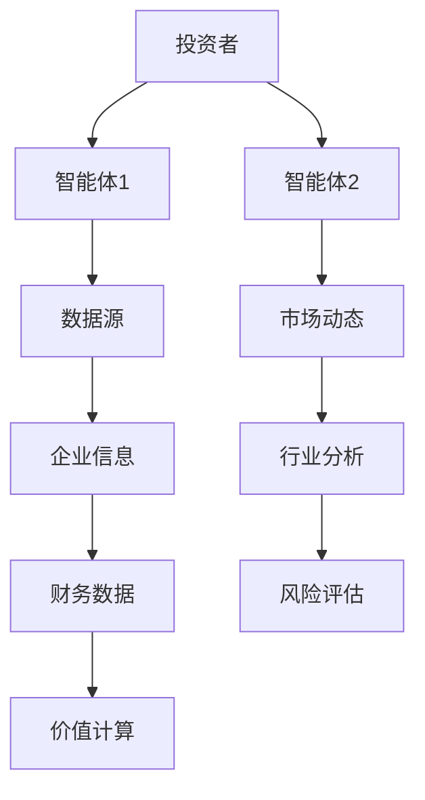
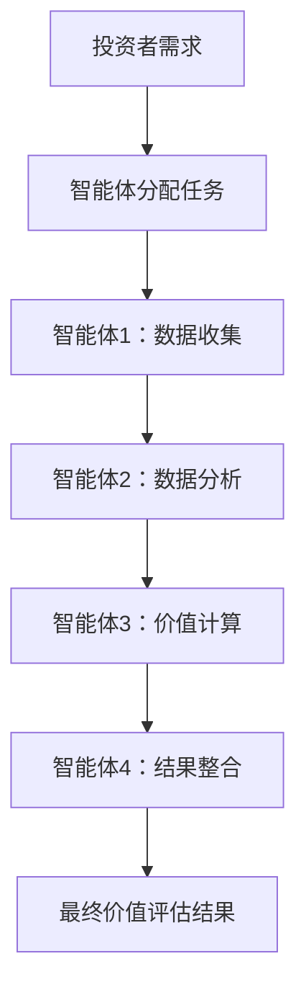
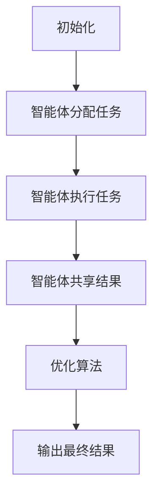

                 


# 智能化企业价值计算：多智能体AI在价值投资中的新方法

## 关键词：多智能体AI、企业价值计算、价值投资、智能化计算、金融数据分析、人工智能算法

## 摘要：  
随着人工智能技术的快速发展，多智能体AI在金融领域的应用逐渐成为热点。本文探讨了多智能体AI在企业价值计算中的新方法，分析了其核心概念、算法原理及实际应用场景。通过构建多智能体协作系统，结合数学模型与实际案例，本文详细阐述了如何利用多智能体AI提升企业价值评估的准确性和效率，为投资者提供更可靠的决策支持。  

---

# 第一部分: 背景介绍

## 第1章: 智能化企业价值计算的背景与挑战

### 1.1 企业价值计算的传统方法与局限性  
#### 1.1.1 传统企业价值计算的核心概念  
企业价值计算是通过对企业的财务状况、市场地位、管理能力等多方面因素的综合分析，得出企业内在价值的过程。传统方法包括DCF模型（现金流贴现法）、EV/EBITDA倍数法等。  

#### 1.1.2 传统方法的局限性与不足  
1. 依赖人工判断，主观性强，难以量化。  
2. 数据更新不及时，无法捕捉市场动态变化。  
3. 难以处理复杂多变的市场环境，特别是在金融市场的不确定性下，传统模型的假设条件往往难以满足。  

#### 1.1.3 企业价值计算的未来发展方向  
随着人工智能技术的进步，企业价值计算将更加依赖数据驱动的方法，尤其是多智能体AI的应用，能够实现多维度、实时化、自动化的价值评估。  

### 1.2 多智能体AI的兴起与应用前景  
#### 1.2.1 多智能体AI的定义与特点  
多智能体AI是指由多个具有独立决策能力的智能体组成的系统，能够通过协作完成复杂任务。其特点包括：分布式计算、自主性、反应性、协作性等。  

#### 1.2.2 多智能体AI在金融领域的应用现状  
1. 量化交易：通过多智能体协作优化投资组合。  
2. 风险管理：利用多智能体实时监控市场风险。  
3. 数据挖掘：通过多智能体协同分析海量金融数据。  

#### 1.2.3 多智能体AI在企业价值计算中的潜力  
多智能体AI能够从多个维度、多层次对企业进行分析，结合实时数据和市场动态，提供更精准的企业价值评估结果。  

## 第2章: 多智能体AI与价值投资的结合  

### 2.1 多智能体AI的核心概念与原理  
#### 2.1.1 多智能体系统的定义与组成  
多智能体系统由多个智能体组成，每个智能体都有自己的目标、知识和行为规则，能够通过交互协作完成复杂的任务。  

#### 2.1.2 多智能体AI在价值投资中的应用模式  
1. 分散式计算：每个智能体负责不同的数据源或分析维度。  
2. 协作式推理：智能体之间共享信息，共同完成价值评估。  
3. 动态调整：根据市场变化实时优化评估结果。  

#### 2.1.3 多智能体AI的优势与挑战  
优势：  
1. 分布式计算能力强，能够处理海量数据。  
2. 多维度分析，提升评估的全面性。  
3. 实时响应，适应市场动态变化。  

挑战：  
1. 智能体之间的协作需要高效的通信机制。  
2. 系统复杂性高，维护和优化难度大。  
3. 数据隐私和安全问题。  

### 2.2 价值投资的核心理论与方法  
#### 2.2.1 价值投资的基本原理  
价值投资强调以低于内在价值的价格买入优质资产，通过长期持有实现收益。其核心在于准确评估企业的内在价值。  

#### 2.2.2 传统价值投资的分析框架  
1. 财务指标分析：如ROE、毛利率等。  
2. 行业分析：企业所在行业的竞争格局、发展趋势。  
3. 管理层分析：企业管理层的背景、能力和决策水平。  

#### 2.2.3 价值投资与多智能体AI的结合点  
1. 数据驱动：利用多智能体AI进行数据挖掘和分析，提升评估的准确性。  
2. 实时监控：通过多智能体实时跟踪市场动态，及时调整评估结果。  
3. 风险控制：多智能体协作能够更好地识别和规避投资风险。  

---

# 第二部分: 核心概念与联系

## 第3章: 多智能体AI与企业价值计算的核心要素  

### 3.1 多智能体AI的实体关系图  


### 3.2 价值计算的数学模型与公式  
企业价值计算的数学模型可以表示为：  
$$ V = \sum_{t=1}^{n} \frac{CF_t}{(1 + r)^t} $$  
其中，$V$ 是企业价值，$CF_t$ 是第 $t$ 年的现金流，$r$ 是折现率，$n$ 是计算期。  

通过多智能体AI的协作，可以动态调整 $CF_t$ 和 $r$，从而实时优化 $V$ 的计算结果。  

## 第4章: 多智能体协作与价值评估的关联性分析  

### 4.1 多智能体协作的机制与流程  


### 4.2 多智能体协作对价值评估的影响  
1. 提升评估的全面性：多智能体协作能够从多个维度进行分析，避免单一视角的局限性。  
2. 增强实时性：通过多智能体实时协作，能够快速响应市场变化。  
3. 优化决策：多智能体协作能够提供更准确的评估结果，为投资决策提供支持。  

---

# 第三部分: 算法原理讲解

## 第5章: 多智能体AI的算法原理  

### 5.1 多智能体协作算法的实现流程  


### 5.2 价值评估的数学模型与公式  
企业价值计算的优化模型可以表示为：  
$$ \min_{x} \sum_{i=1}^{m} (y_i - f(x))^2 $$  
其中，$x$ 是优化变量，$y_i$ 是目标值，$f(x)$ 是价值评估函数。  

通过多智能体协作，可以动态调整 $x$，优化 $f(x)$，从而得到更准确的价值评估结果。  

## 第6章: 算法实现与代码分析  

### 6.1 环境安装与配置  
1. 安装Python和必要的库（如numpy、pandas、scikit-learn）。  
2. 配置多智能体协作环境，如使用Docker容器化部署。  

### 6.2 核心算法实现  
```python
import numpy as np

def value_assessment(data):
    # 数据预处理
    processed_data = data preprocessing
    # 多智能体协作计算
    agents = initialize_agents(processed_data)
    results = []
    for agent in agents:
        result = agent.compute_value()
        results.append(result)
    # 结果整合
    final_value = aggregate_results(results)
    return final_value

# 示例代码：智能体的计算过程
class Agent:
    def __init__(self, data):
        self.data = data
    def compute_value(self):
        # 计算价值的过程
        return value
```

### 6.3 代码应用解读与分析  
1. 数据预处理：对原始数据进行清洗和特征提取。  
2. 智能体初始化：根据数据分配智能体任务。  
3. 计算价值：每个智能体独立计算价值，然后汇总结果。  
4. 结果整合：将所有智能体的计算结果整合，得到最终的企业价值评估结果。  

---

# 第四部分: 系统分析与架构设计

## 第7章: 系统功能设计  

### 7.1 问题场景介绍  
在金融投资领域，投资者需要实时了解企业的内在价值，以便做出投资决策。传统的价值评估方法依赖人工判断，难以满足实时性和准确性要求。  

### 7.2 系统功能设计  
```mermaid
classDiagram
    class 投资者 {
        +需求：投资目标
        +操作：提交任务
    }
    class 智能体 {
        +数据源：市场数据、企业数据
        +算法：价值评估算法
        +行为：计算价值、共享结果
    }
    class 系统 {
        +功能：任务分配、数据处理、结果整合
    }
    投资者 --> 系统：提交任务
    系统 --> 智能体：分配任务
    智能体 --> 系统：返回结果
    系统 --> 投资者：输出评估结果
```

## 第8章: 系统架构设计  

### 8.1 系统架构图  


### 8.2 系统接口设计  
1. 客户端接口：提交任务、接收结果。  
2. 智能体接口：接收任务、返回结果。  
3. 数据库接口：存储和查询数据。  

---

# 第五部分: 项目实战

## 第9章: 项目实战分析  

### 9.1 实际案例分析  
以某科技公司为例，利用多智能体AI进行价值评估。  

1. 数据收集：收集该公司的财务数据、市场数据等。  
2. 系统运行：通过多智能体协作计算企业价值。  
3. 结果分析：对比传统方法和多智能体AI方法的评估结果。  

### 9.2 详细讲解剖析  
1. 数据预处理：清洗数据，提取关键特征。  
2. 智能体协作：分配任务，计算价值。  
3. 结果整合：汇总计算结果，输出最终价值评估报告。  

## 第10章: 总结与展望  

### 10.1 项目总结  
通过多智能体AI进行企业价值计算，能够显著提高评估的准确性和效率，为投资者提供更可靠的决策支持。  

### 10.2 未来展望  
1. 研究多智能体协作的优化算法，进一步提升计算效率。  
2. 探索多智能体AI在其他金融领域的应用，如风险管理、量化交易等。  
3. 加强数据隐私保护，确保系统的安全性。  

---

# 第六部分: 最佳实践与注意事项

## 第11章: 最佳实践 tips  

### 11.1 实践中的注意事项  
1. 数据质量：确保数据的准确性和完整性。  
2. 系统性能：优化算法和架构设计，提升计算效率。  
3. 风险控制：制定合理的风险管理策略，降低投资风险。  

### 11.2 提高系统性能的建议  
1. 使用分布式计算技术，提升数据处理能力。  
2. 定期更新模型参数，适应市场变化。  
3. 加强智能体之间的协作，提高计算效率。  

## 第12章: 小结  

多智能体AI在企业价值计算中的应用，不仅提升了评估的准确性，还实现了实时化和自动化，为价值投资提供了新的思路和方法。未来，随着技术的进一步发展，多智能体AI将在金融领域发挥更大的作用。  

---

# 作者：AI天才研究院/AI Genius Institute & 禅与计算机程序设计艺术 /Zen And The Art of Computer Programming

